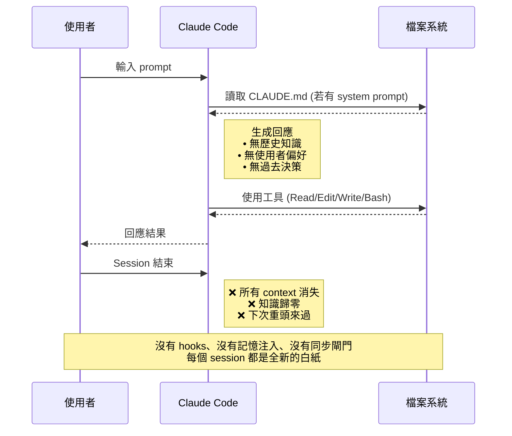
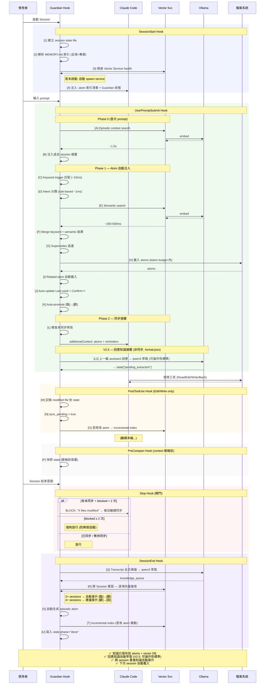
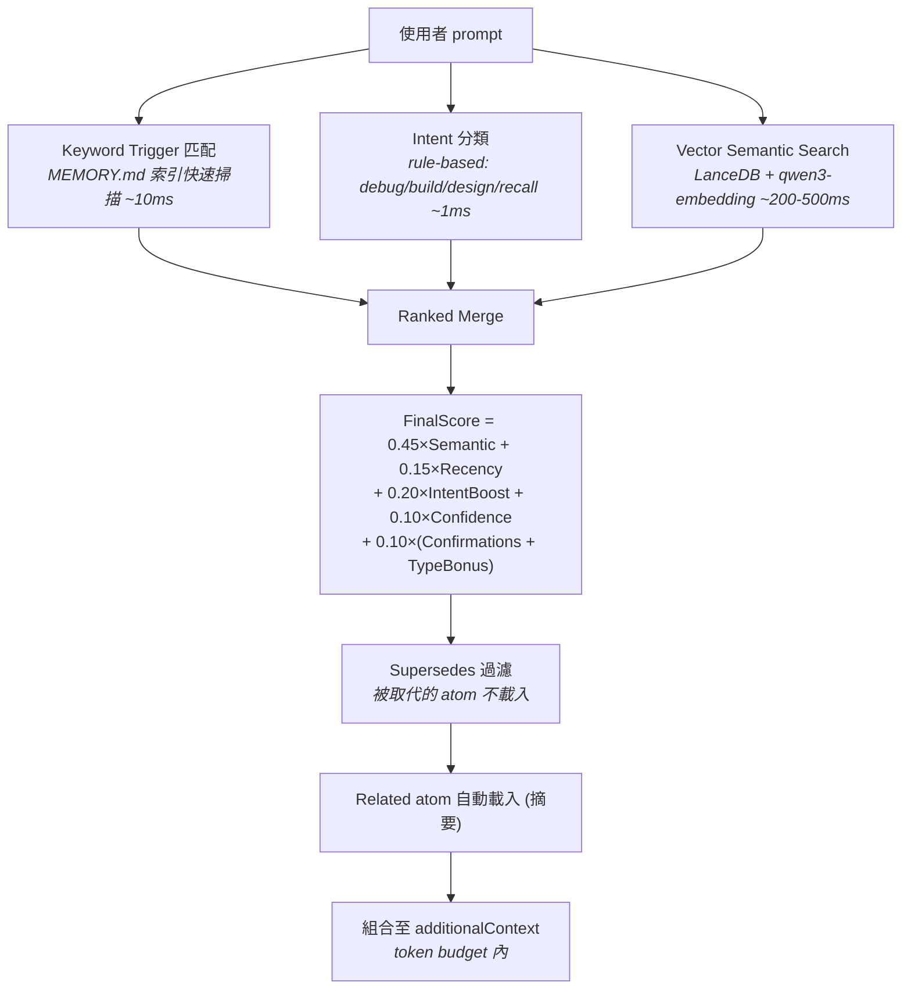
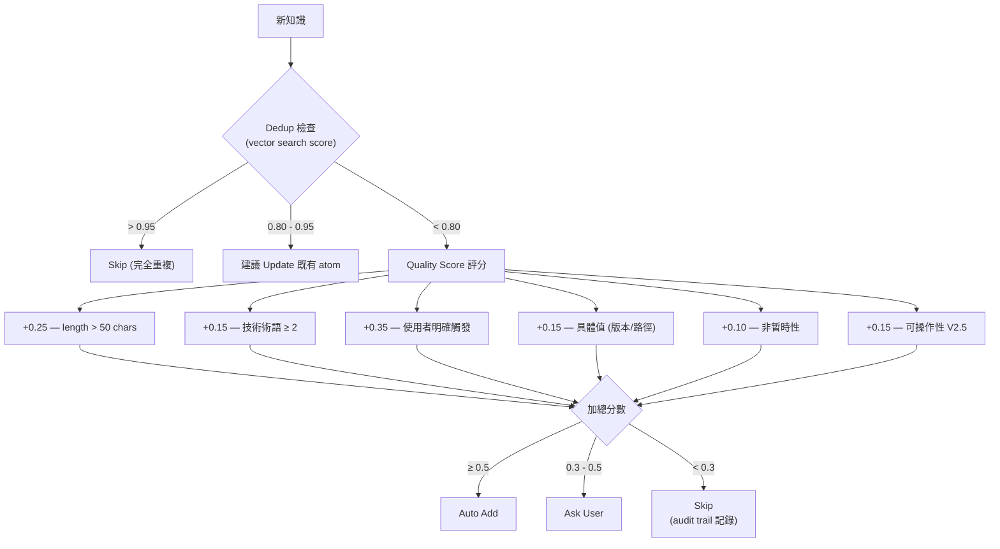
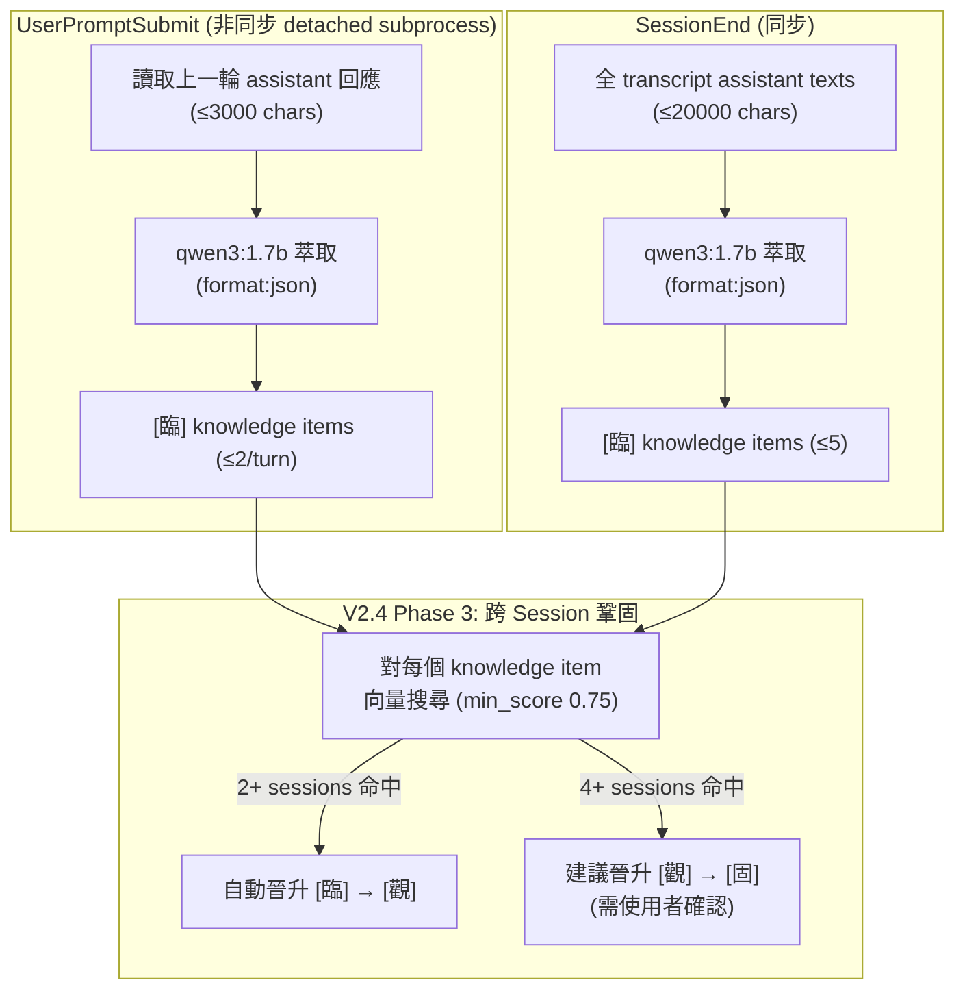

# 原子記憶系統 Atomic Memory V2.5

> **Claude Code 跨 Session 知識管理引擎**
> Hybrid RECALL | Dual LLM | Workflow Guardian | Write Quality Gate

Claude Code 每次 session 都是白紙一張——上次的決策、踩過的坑、使用者偏好，全部歸零。
原子記憶系統為 Claude Code 補上 **長期記憶層**，透過 hooks 自動注入歷史知識，讓 AI 不再反覆犯同樣的錯。

---

## 設計哲學

LLM 的 context window 是**工作記憶**（working memory），但缺少**長期記憶**（long-term memory）。
原子記憶系統補上這塊拼圖，核心原則：

| # | 原則 | 說明 |
|---|------|------|
| 1 | **精確度 > Token 節省** | 寧可多注入確保正確，不因省 token 而遺漏關鍵知識 |
| 2 | **漸進式信任** | 三層分類 `[臨]`→`[觀]`→`[固]`，知識需多次驗證才晉升為永久 |
| 3 | **最小侵入** | 全部透過 Claude Code hooks 運作，主程式零修改 |
| 4 | **雙 LLM 分工** | 雲端（Claude）做決策，本地（Ollama）做語意處理 |
| 5 | **可審計** | 所有操作記錄 JSONL audit trail，知識不刪除只歸檔 |

---

## 系統架構

```
~/.claude/
├── CLAUDE.md                         ← 系統指令 (每 session 自動載入)
├── settings.json                     ← Hook 註冊 (6 events)
│
├── hooks/
│   └── workflow-guardian.py          ← 統一 Hook 入口 (~1900 行)
│
├── memory/                           ← 全域記憶層
│   ├── MEMORY.md                    ← Atom 索引 (≤30 行)
│   ├── preferences.md               ← [固] 使用者偏好
│   ├── decisions.md                 ← [固] 全域決策
│   ├── excel-tools.md               ← [固] Excel 讀取配方
│   ├── SPEC_*.md                    ← 系統規格 (參考用)
│   ├── episodic/                    ← 自動生成 session 摘要 (TTL 24d)
│   ├── _distant/                    ← 遙遠記憶區 (已淘汰 atoms)
│   └── _vectordb/                   ← LanceDB 向量索引
│
├── tools/
│   ├── memory-audit.py              ← 健檢工具
│   ├── memory-write-gate.py         ← 寫入品質閘門
│   ├── memory-conflict-detector.py  ← 衝突偵測
│   ├── rag-engine.py               ← RAG CLI 入口
│   ├── read-excel.py               ← Excel 讀取工具
│   └── memory-vector-service/       ← HTTP Vector 搜尋服務
│       ├── service.py               ← HTTP daemon @ :3849
│       ├── indexer.py               ← 段落級索引器 (LanceDB)
│       ├── searcher.py              ← 語意搜尋 + ranked search
│       ├── reranker.py              ← LLM re-ranking
│       └── config.py                ← 設定管理
│
├── workflow/
│   ├── config.json                  ← 統一設定檔
│   └── state-{session-id}.json      ← Session 狀態追蹤 (ephemeral)
│
├── projects/{slug}/memory/          ← 專案記憶層 (每專案獨立)
│
└── commands/                         ← Slash commands (/skills)
    └── init-project.md              ← /init-project 專案初始化

背景服務：
  [Vector Service]  HTTP :3849   ← LanceDB + Ollama embedding
  [Dashboard MCP]   HTTP :3848   ← Workflow Guardian 狀態儀表板
  [Ollama]          HTTP :11434  ← qwen3-embedding + qwen3:1.7b
```

---

## Token 消耗與延遲對比

### Vanilla Claude Code vs + Atomic Memory V2.5

| 指標 | Vanilla Claude Code | + Atomic Memory V2.5 |
|------|--------------------|-----------------------|
| **Session 啟動延遲** | ~0ms | +200-800ms (Guardian init + Vector Service check) |
| **每次 Prompt 額外延遲** | ~0ms | +300-600ms (keyword ~10ms + vector ~200-500ms + intent ~1ms) |
| **首次 Prompt 額外延遲** | ~0ms | +500-1500ms (含 episodic context search) |
| **PostToolUse 延遲** | ~0ms | +50-200ms (state write + incremental index，僅 Edit/Write) |
| **CLAUDE.md Token** | 0 | ~2,500-3,500 tokens (系統指令，每 session 固定) |
| **MEMORY.md Token** | 0 | ~50-80 tokens (索引表 ≤30 行，每 session 固定) |
| **Atom 注入 Token** | 0 | ~200-1,500 tokens/次 (按需，命中才載入) |
| **典型 Session 總 Overhead** | 0 | **~3,000-5,000 tokens (~1.5-2.5% of 200K context)** |

### 效益對比

| 指標 | Vanilla Claude Code | + Atomic Memory V2.5 |
|------|--------------------|-----------------------|
| **跨 Session 知識保留率** | 0% (每次白紙) | ~85-95% (取決於 atom 覆蓋率) |
| **重複解釋次數** | 每次都要 | 首次記錄後趨近 0 |
| **已知陷阱踩坑率** | 100% (無記憶) | 記錄後 ~0% (pitfall atom 自動注入) |
| **決策一致性** | 無法保證 | 自動載入歷史決策 |
| **磁碟空間** | ~0 | ~5-20 MB (atoms + LanceDB + state) |
| **背景 RAM** | 0 | ~100-200 MB (LanceDB + Ollama model) |

### Token Budget 自動調節

```
短 prompt (<50 chars)   → 1,500 token budget (輕量模式)
中 prompt (<200 chars)  → 3,000 token budget
長 prompt (≥200 chars)  → 5,000 token budget (深度模式)
```

---

## 流程圖

### 原版 Claude Code 操作流程



### Claude Code + 原子記憶 V2.5 完整流程



---

## 核心子系統

### 三層決策記憶分類

| 符號 | 名稱 | 定義 | 引用行為 | 晉升條件 |
|------|------|------|---------|---------|
| `[固]` | 固定記憶 | 跨多次對談確認，長期有效 | 直接引用 | Confirmations ≥4 或使用者明確永久化 |
| `[觀]` | 觀察記憶 | 已決策但可能演化 | 簡短確認 | Confirmations ≥2 |
| `[臨]` | 臨時記憶 | 單次決策 | 明確確認 | — |

淘汰閾值：`[臨]` >30天 → `[觀]` >60天 → `[固]` >90天 → 移入 `_distant/`（遙遠記憶，不刪除）

### Hybrid RECALL 記憶檢索

每次使用者送出 prompt，系統在 hook 階段自動執行：



降級策略：Ollama 不可用 → 純 keyword | Vector Service 掛 → keyword + fallback | 全部掛 → 僅 MEMORY.md

### Write Gate 寫入品質閘門（V2.5 強化）

新知識寫入前自動評估（V2.5 加入可操作性檢查 + CJK 支援）：



### 其他子系統

| 子系統 | 說明 |
|--------|------|
| **Workflow Guardian** | Stop 閘門——有未同步修改時阻止結束，最多 2 次，第 3 次強制放行 |
| **Episodic Memory** | Session 結束自動生成摘要 atom (TTL 24d)，下次透過 vector search 找回 |
| **Response Capture (V2.4→V2.5)** | 逐輪+SessionEnd 本地 LLM 萃取（V2.5: 可操作性標準 + 6 類型 + 150 chars + JSON 格式強制） |
| **Cross-Session (V2.4)** | SessionEnd 向量比對 knowledge_queue，2+ sessions 自動晉升，4+ sessions 建議晉升 |
| **Conflict Detection** | 新知識寫入時語意掃描既有 atoms，偵測矛盾 (AGREE/CONTRADICT/EXTEND) |
| **Decay & Archival** | 超期 atom 自動移入 `_distant/{year}_{month}/`，不刪除，可 `--restore` 拉回 |
| **Audit Trail** | `_vectordb/audit.log` (JSONL) 記錄所有 add/delete/conflict/decay 操作 |

---

## 大型專案使用法

### 1. 專案初始化：`/init-project`

新專案首次使用時，執行 `/init-project` slash command，自動建立 `_AIDocs/` 知識庫骨架：

```
_AIDocs/
  _INDEX.md            ← 文件索引 + 一句話摘要
  _CHANGELOG.md        ← 變更記錄 (最近 ~8 筆)
  Architecture.md      ← 架構分析
  Project_File_Tree.md ← 目錄結構摘要
```

這是一次性投資（通常 1-2 個 session），之後所有 session 直接引用文件而非重新掃描原始碼。

### 2. 專案層記憶

每個專案在 `~/.claude/projects/{slug}/memory/` 有獨立的 atom 空間：

- **架構決策**：framework 選型、資料夾慣例、命名規範
- **已知陷阱**：踩過的坑、環境特殊設定、相容性問題
- **Coding convention**：專案特有的程式風格、禁止事項

全域層只放跨專案共通知識（使用者偏好、通用工具決策）。

### 3. Vector DB 語意搜尋

當 atom 數量超過 10-20 個，純 keyword trigger 命中率下降。Vector 搜尋補充層：

- **段落級索引**：每個 `- ` bullet point 為一個 chunk（而非整個檔案）
- **增量索引**：比對 file_hash，僅重新索引有變動的 atom
- **Metadata 攜帶**：atom_name, confidence, layer, tags — 支援 ranked search 精確加權
- **多來源整合**：透過 `config.json` 的 `additional_atom_dirs` 整合外部工具的 atoms

### 4. Episodic Memory 跨 Session 延續

每個 session 結束時自動生成 episodic atom（不列入 MEMORY.md 索引），包含：

- 本次 session 做了什麼
- 修改了哪些檔案
- 關聯的 semantic atoms

下次 session 首次 prompt 時，系統透過 vector search 找到相關的 episodic atoms，注入「上次做了什麼」的上下文。

V2.4 增加「跨 Session 觀察」段落——episodic atom 會記錄哪些知識在多個 session 重複出現及其晉升狀態。

### 5. 回應知識捕獲（V2.4→V2.5 強化）

Claude 的分析回應也是知識來源。由本地 LLM 自動萃取（V2.5 強化品質控制）：

**V2.5 萃取改進**：
- 可操作性標準（actionable + specific + reusable），排除通用常識
- 6 種知識類型（+decision, +preference）
- content 上限 80→150 chars
- Ollama API 加 `format: "json"`，減少解析失敗



### 6. Token 管理策略

大型專案可能有 20+ atoms，但不會全部載入：

- **Trigger 匹配**：只有關鍵字命中的 atom 才載入
- **Ranked Search**：語意搜尋結果按 FinalScore 排序，取 top-K
- **Token Budget**：自動依 prompt 長度調節（1,500-5,000 tokens）
- **Supersedes**：被取代的舊 atom 自動過濾
- **MEMORY.md ≤30 行 / Atom ≤200 行**：硬限制防止膨脹

---

## 版本歷史

| 版本 | 日期 | 核心變更 |
|------|------|---------|
| V1.0 | 2026-03-02 | 三層分類 `[固]/[觀]/[臨]` + 資料夾結構 + memory-audit 健檢 |
| V2.0 | 2026-03-03 | **Hybrid RECALL**：keyword + vector search + LLM re-ranking |
| V2.1 Sprint 1 | 2026-03-04 | Schema 擴展、Write Gate、自動淘汰、Confirmations 遞增 |
| V2.1 Sprint 2 | 2026-03-04 | Intent classifier、ranked search、衝突偵測、刪除傳播 |
| V2.1 Sprint 3 | 2026-03-04 | Type decay、Supersedes loading、日誌壓縮、audit trail |
| V2.4 | 2026-03-05 | **回應知識捕獲 + 跨 Session 鞏固**：逐輪+SessionEnd 本地 LLM 萃取、兩層分類（Scope×Type）、向量比對自動晉升 [臨]→[觀] |
| **V2.5** | **2026-03-06** | **寫入品質強化**：萃取 prompt 加入可操作性標準 + negative examples、知識類型 4→6（+decision/preference）、content 上限 80→150 chars、Ollama format:json 強制、Write Gate 可操作性評分（+0.15）含 CJK patterns、dedup 前綴 40→60 chars |

---

## 雙 LLM 架構

| 角色 | 引擎 | 職責 | 延遲 |
|------|------|------|------|
| **雲端 LLM** | Claude Code | 記憶演進決策：何時寫入、分類判斷、晉升/淘汰、衝突裁決 | — |
| **本地 LLM** | Ollama qwen3 | 語意處理：embedding 生成、query rewrite、re-ranking、intent 分類、回應知識萃取 | ~200-500ms |

本地 LLM 在 hook 階段（UserPromptSubmit + SessionEnd）自動執行，Claude Code 無感。

---

## License

Personal project by holyl. Not licensed for redistribution.
