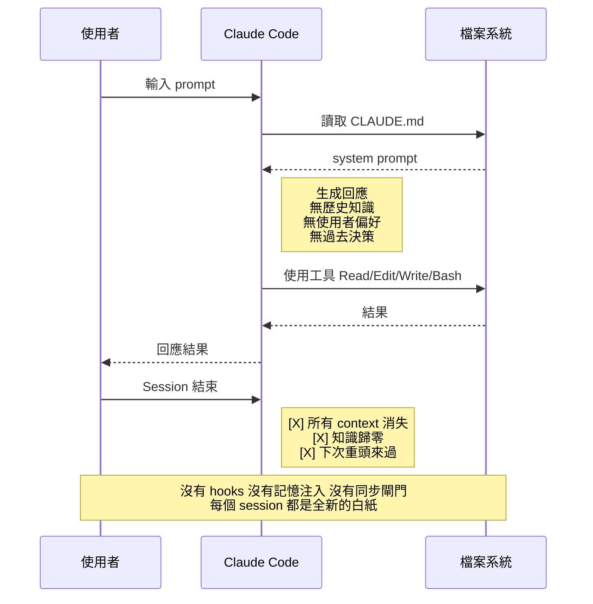
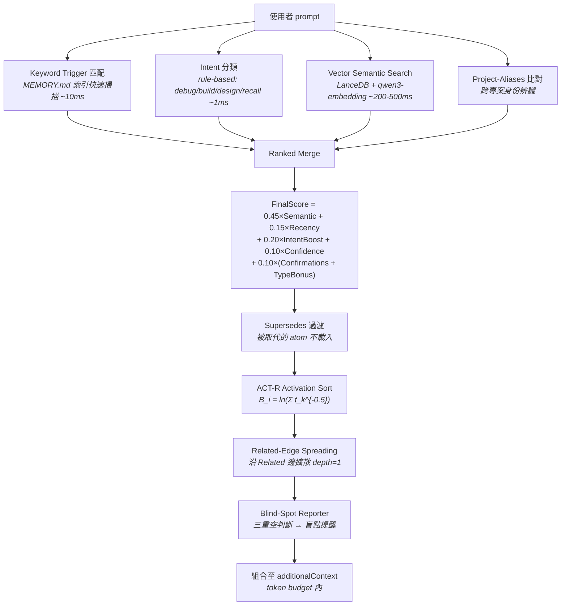
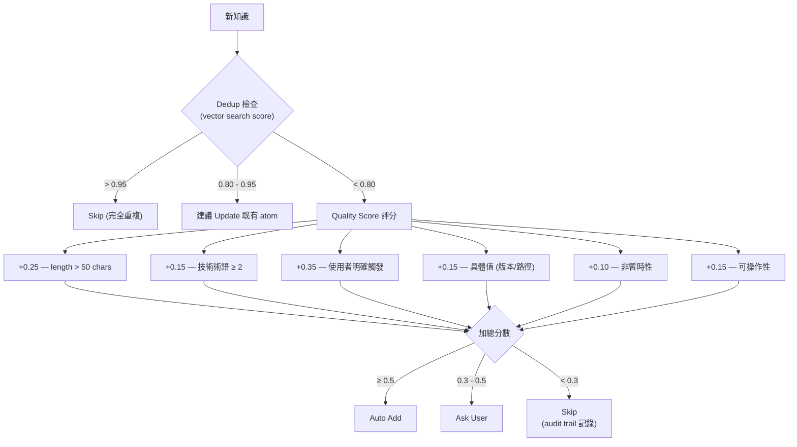
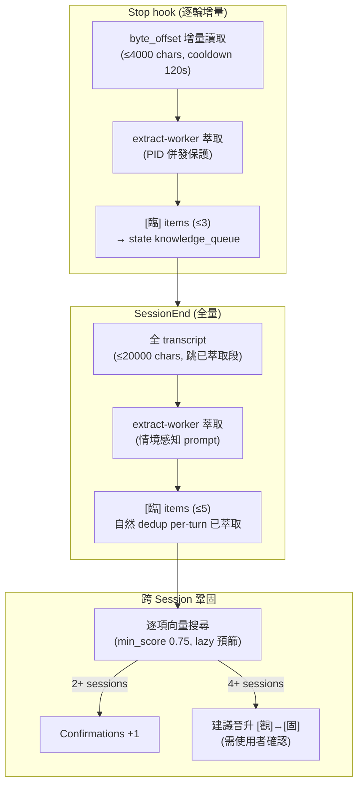

# 原子記憶系統 Atomic Memory V2.18

> **Claude Code 跨 Session 知識管理引擎**
> Hybrid RECALL | Dual LLM | Workflow Guardian | Write Quality Gate | Wisdom Engine | Fix Escalation | Failures 自動化 | Token Diet | ACT-R Activation | Read Tracking | Rules 模組化 | 自我迭代自動化 | 覆轍偵測

Claude Code 每次 session 都是白紙一張——上次的決策、踩過的坑、使用者偏好，全部歸零。
原子記憶系統為 Claude Code 補上 **長期記憶層**，透過 hooks 自動注入歷史知識，讓 AI 不再反覆犯同樣的錯。

---

## 設計哲學

LLM 的 context window 是**工作記憶**（working memory），但缺少**長期記憶**（long-term memory）。
原子記憶系統補上這塊拼圖，核心原則：

| # | 原則 | 說明 |
|---|------|------|
| 1 | **精確度 > Token 節省** | 寧可多注入確保正確，不因省 token 而遺漏關鍵知識 |
| 2 | **漸進式信任** | 三層分類 `[臨]`→`[觀]`→`[固]`，知識需多次驗證才晉升為永久 |
| 3 | **最小侵入** | 全部透過 Claude Code hooks 運作，主程式零修改 |
| 4 | **雙 LLM 分工** | 雲端（Claude）做決策，本地（Ollama）做語意處理 |
| 5 | **可審計** | 所有操作記錄 JSONL audit trail，知識不刪除只歸檔 |

---

## 初步建議使用方式

安裝完成後，依以下順序確認系統正常運作：

### 1. 重新載入 VS Code

按 `Ctrl+Shift+P`，輸入 `Developer: Reload Window` 執行，讓 hooks 和設定生效。

### 2. 驗證安裝

開一個新的 Claude Code session，輸入以下 prompt 讓 AI 自檢：

```
請確認原子記憶系統是否正確安裝：檢查 hooks 是否生效、Vector Service 是否可用、Ollama 模型是否就緒。
```

系統應回報 Guardian Active、各子系統狀態。

### 3. 專案初始化

在你的**專案資料夾**中開啟 VS Code，首次使用時執行：

```
/init-project
```

這會建立 `_AIDocs/` 知識庫骨架（架構分析 + 目錄樹 + 索引），讓 AI 記住專案結構。

### 4. 匯入專案知識

對於想讓 AI 深度記憶的程式碼或文件目錄，執行：

```
/read-project <目標資料夾>
```

例如 `/read-project src/core`，AI 會掃描該目錄並將知識摘要寫入 `_AIDocs/`。

---

## 自製 Skills（Slash Commands）

| 指令 | 用途 | 使用時機 |
|------|------|---------|
| `/init-project` | 為專案建立 `_AIDocs/` 知識庫骨架（架構分析 + 目錄樹 + 索引） | 首次在專案中開啟 Claude Code 時自動觸發 |
| `/read-project` | 深度掃描專案檔案，擷取知識摘要寫入 `_AIDocs/` | 需要全面理解大型專案時手動呼叫 |
| `/resume` | 自動生成續接 prompt，透過 MCP 開新 VS Code 視窗並貼上 | Session 快結束或 context 壓縮後，需延續工作 |
| `/consciousness-stream` | 識流工作流——多階段確認的嚴謹決策流程 | 高風險跨系統任務（可建議使用，不強制） |
| `/harvest` | 網頁收割——Playwright 瀏覽器自動收割網頁為 Markdown/CSV/PDF | 需要擷取 Google Docs/Sheets/GitLab/GitHub/通用網頁內容 |
| `/svn-update` | SVN 工作目錄更新（TortoiseSVN / CLI fallback） | SVN 專案修改程式碼前（每 session 一次） |
| `/unity-yaml` | Unity YAML 資產操作（parse / generate / modify / template） | 需要讀寫 .prefab / .asset / .unity 檔案時 |
| `/upgrade` | 原子記憶環境升級——比對來源資料夾與 `~/.claude` 差異，產生升級計畫 | 系統版本升級時 |
| `/fix-escalation` | 精確修正升級——同一問題修正第 2 次起強制啟動 6 Agent 會議（蒐集→辯論→決策→驗證） | 自動觸發（Guardian 偵測 retry≥2）或手動呼叫 |
| `/continue` | 讀取 `_staging/next-phase.md` 續接暫存的分階段任務 | 多 session 分階段執行大型計畫時 |
| `/atom-debug` | 原子記憶注入/萃取 debug log 開關（寫入 `Logs/atom-debug.log`） | 需要診斷記憶注入或萃取行為時 |

### 系統架構

```
~/.claude/
├── CLAUDE.md                         ← 系統指令 (每 session 自動載入)
├── IDENTITY.md                       ← AI 身份與行為準則 (@import 載入，團隊共用)
├── USER.md                           ← 操作者個人資料 (@import 載入，每人一份)
├── settings.json                     ← Hook 註冊 (6 events)
│
├── rules/                            ← 模組化規則 (Claude Code 自動載入)
│   ├── aidocs.md                    ← _AIDocs 知識庫維護
│   ├── memory-system.md             ← 原子記憶系統規則
│   ├── sync-workflow.md             ← 工作結束同步 + Guardian 閘門
│   └── session-management.md        ← 對話管理 + 續航 + 識流
│
├── hooks/
│   ├── workflow-guardian.py          ← 統一 Hook 入口 (~1150 行, 模組化至 wg_*.py ~2700 行)
│   ├── extract-worker.py            ← LLM 萃取子程序 (~750 行，detached)
│   ├── wisdom_engine.py             ← Wisdom Engine (~200 行)
│   └── user-init.sh                 ← 多人 USER.md 初始化
│
├── memory/                           ← 全域記憶層 (18 atoms)
│   ├── MEMORY.md                    ← Atom 索引 (trigger 表)
│   ├── preferences.md               ← [固] 使用者偏好
│   ├── decisions.md                 ← [固] 全域決策
│   ├── decisions-architecture.md    ← [固] 架構技術細節
│   ├── toolchain.md                 ← [固] 工具鏈知識
│   ├── toolchain-ollama.md          ← [固] Ollama 雙 Backend
│   ├── workflow-rules.md            ← [固] 版本控制工作流
│   ├── workflow-icld.md             ← [固] 增量式閉環開發
│   ├── excel-tools.md               ← [固] Excel 讀取配方
│   ├── failures/                    ← [固] 失敗模式 (4 子 atoms)
│   ├── unity/                       ← Unity YAML 領域知識
│   ├── _reference/                  ← 參考文件 (SPEC, 歷史)
│   ├── wisdom/                      ← Wisdom Engine 資料
│   ├── _staging/                    ← 暫存區 (續接 prompt)
│   ├── episodic/                    ← 自動生成 session 摘要 (TTL 24d)
│   ├── _distant/                    ← 遙遠記憶區 (已淘汰)
│   └── _vectordb/                   ← LanceDB 向量索引
│
├── tools/
│   ├── ollama_client.py             ← Dual-Backend Ollama Client
│   ├── memory-audit.py              ← 健檢工具
│   ├── memory-write-gate.py         ← 寫入品質閘門
│   ├── memory-conflict-detector.py  ← 衝突偵測
│   ├── atom-health-check.py         ← Atom 參照完整性驗證
│   ├── cleanup-old-files.py         ← 舊檔清理
│   ├── rag-engine.py               ← RAG CLI 入口
│   ├── read-excel.py               ← Excel 讀取工具
│   ├── unity-yaml-tool.py           ← Unity YAML 操作工具
│   ├── gdoc-harvester/              ← 網頁收割 (Playwright)
│   └── memory-vector-service/       ← HTTP Vector 搜尋服務
│       ├── service.py               ← HTTP daemon @ :3849
│       ├── indexer.py               ← 段落級索引器 (LanceDB)
│       ├── searcher.py              ← 語意搜尋 + ranked search
│       ├── reranker.py              ← LLM re-ranking
│       └── config.py                ← 設定管理
│
├── workflow/
│   ├── config.json                  ← 統一設定檔
│   └── state-{session-id}.json      ← Session 狀態追蹤 (ephemeral)
│
├── projects/{slug}/memory/          ← 專案記憶層 (每專案獨立)
│
└── commands/                         ← Slash commands (/skills, 11 個)
    ├── init-project.md              ← /init-project
    ├── read-project.md              ← /read-project
    ├── resume.md                    ← /resume
    ├── continue.md                  ← /continue
    ├── consciousness-stream.md      ← /consciousness-stream
    ├── harvest.md                   ← /harvest
    ├── svn-update.md                ← /svn-update
    ├── unity-yaml.md                ← /unity-yaml
    ├── fix-escalation.md            ← /fix-escalation
    ├── upgrade.md                   ← /upgrade
    └── atom-debug.md                ← /atom-debug

背景服務：
  [Vector Service]  HTTP :3849   ← LanceDB + Ollama embedding
  [Dashboard MCP]   HTTP :3848   ← Workflow Guardian 狀態儀表板
  [Ollama]          Dual-Backend ← primary (遠端) + fallback (本地 :11434)
```

---

## Token 消耗與延遲對比

### Vanilla Claude Code vs + Atomic Memory V2.18

| 指標 | Vanilla Claude Code | + Atomic Memory V2.18 |
|------|--------------------|-----------------------|
| **Session 啟動延遲** | ~0ms | +200-800ms (Guardian init + Vector Service check) |
| **每次 Prompt 額外延遲** | ~0ms | +200-500ms (keyword ~10ms + vector ~200-500ms + intent ~1ms) |
| **首次 Prompt 額外延遲** | ~0ms | +500-1500ms (含 episodic context search) |
| **PostToolUse 延遲** | ~0ms | +50-200ms (state write + incremental index，Edit/Write/Read/Bash) |
| **CLAUDE.md Token** | 0 | ~1,500-2,500 tokens (CLAUDE.md + @imports + rules/，CJK 偏重) |
| **MEMORY.md Token** | 0 | ~200-350 tokens (索引表 + 高頻事實，CJK 偏重) |
| **Atom 注入 Token** | 0 | ~200-1,500 tokens/次 (按需，Section-Level 注入大 atom 省 70-90%) |
| **典型 Session 總 Overhead** | 0 | **~2,000-5,500 tokens (~1-2.75% of 200K context)** |

### 效益對比

| 指標 | Vanilla Claude Code | + Atomic Memory V2.18 |
|------|--------------------|-----------------------|
| **跨 Session 知識保留率** | 0% (每次白紙) | ~85-95% (取決於 atom 覆蓋率) |
| **重複解釋次數** | 每次都要 | 首次記錄後趨近 0 |
| **已知陷阱踩坑率** | 100% (無記憶) | 記錄後 ~0% (pitfall atom 自動注入) |
| **決策一致性** | 無法保證 | 自動載入歷史決策 |
| **磁碟空間** | ~0 | ~5-20 MB (atoms + LanceDB + state) |
| **背景 RAM** | 0 | ~100-200 MB (LanceDB + Ollama model) |

### Token Budget 自動調節

```
短 prompt (<50 chars)   → 1,500 token budget (輕量模式)
中 prompt (<200 chars)  → 3,000 token budget
長 prompt (≥200 chars)  → 5,000 token budget (深度模式)
```

---

## 流程圖

### 原版 Claude Code 操作流程



### Claude Code + 原子記憶 V2.18 完整流程

```mermaid
sequenceDiagram
    participant U as 使用者
    participant G as Guardian Hook
    participant C as Claude Code
    participant V as Vector Svc
    participant O as Ollama
    participant F as 檔案系統

    U->>G: 啟動 Session

    rect rgba(100,150,255,0.1)
        note over G,F: SessionStart Hook
        G->>G: [1] 建立 session state file
        G->>G: [2] 解析 MEMORY.md 索引
        G->>V: [3] 檢查 Vector Service health
        V-->>G: status
        note right of G: 若未啟動則自動 spawn service
        G->>C: [4] 注入 atom 索引清單 + Guardian 狀態
    end

    U->>G: 輸入 prompt

    rect rgba(100,200,100,0.1)
        note over G,F: UserPromptSubmit Hook
        note over G,V: Phase 0 首次 prompt
        G->>V: [A] Episodic context search
        V->>O: embed
        O-->>V: vector
        V-->>G: results ~1.5s
        G->>G: [B] 注入過去 session 摘要

        note over G,V: Phase 1 Atom 自動注入
        G->>G: [C] Keyword trigger 匹配 ~10ms
        G->>G: [D] Intent 分類 rule-based ~1ms
        G->>V: [E] Semantic search
        V->>O: embed
        O-->>V: vector
        V-->>G: results ~200-500ms
        G->>G: [F] Project-Aliases 比對
        G->>G: [G] Merge keyword + semantic 結果
        G->>G: [H] Supersedes 過濾
        G->>G: [I] ACT-R Activation Sort
        G->>F: [J] 載入 atoms (Section-Level 注入) token budget 內
        F-->>G: atoms (大 atom 僅注入匹配 sections)
        G->>G: [K] Related-Edge Spreading
        G->>G: [L] Blind-Spot Reporter
        G->>G: [M] Auto-update Last-used + Confirm++
        G->>G: [N] Auto-promote 臨 to 觀

        note over G,V: Fix Escalation Protocol
        G->>G: [N2] retry_count≥2 → 注入 FixEscalation 信號

        note over G,V: Phase 2 同步提醒
        G->>G: [O] 檢查未同步修改

        G->>C: additionalContext atoms + reminders

        note over G,O: Failures 自動偵測
        G->>G: [P] 失敗關鍵字匹配 (strong ×1 / weak ×3)
        opt 命中
            G->>O: spawn extract-worker (mode=failure)
            O-->>G: 三維路由 → failure atom
        end
    end

    C->>F: 使用工具 Read/Edit/Write/Bash
    F-->>C: 結果

    rect rgba(255,200,100,0.1)
        note over G,F: PostToolUse Hook Edit/Write/Read/Bash
        G->>G: [Q] Edit/Write: 記錄 modified file + sync_pending
        G->>G: [Q2] Read: 記錄 accessed file (去重)
        G->>G: [Q3] Bash: 捕獲 git/svn 版控查詢
        G->>V: [S] 若修改 atom 則 incremental index
    end

    note over C: 繼續多輪...

    rect rgba(200,200,200,0.1)
        note over G,F: PreCompact Hook context 壓縮前
        G->>G: [T] 快照 state 壓縮前保護
    end

    U->>G: Session 結束意圖

    rect rgba(255,150,150,0.1)
        note over G,F: Stop Hook 閘門 + 逐輪萃取
        G->>O: [S2] 逐輪增量萃取 (byte_offset, cooldown 120s)
        O-->>G: knowledge items → state queue
        alt 有未同步且 blocked 未滿 2 次
            G--xC: BLOCK 要求繼續同步
        else blocked 已達 2 次
            note right of G: 強制放行 防無限迴圈
        else 已同步或無待同步
            note right of G: 放行
        end
    end

    rect rgba(150,100,255,0.1)
        note over G,F: SessionEnd Hook
        G->>O: [U] Transcript 全文掃描 qwen3 萃取
        O-->>G: knowledge_queue
        G->>V: [V] 跨 Session 鞏固 逐項向量搜尋
        V-->>G: matches
        note right of G: 2+ sessions 自動晉升<br>4+ sessions 建議晉升
        G->>G: [W] 自動生成 episodic atom
        G->>V: [X] incremental index
        G->>G: [Y] Wisdom reflect 統計更新
        G->>G: [Z] 寫入 state phase done
    end

    note over U,F: 知識已保存到 atoms + vector DB<br>回應知識自動萃取<br>跨 session 重複知識自動晉升<br>ACT-R 時間加權排序<br>下次 session 自動載入
```



---

## 核心子系統

### 三層決策記憶分類

| 符號 | 名稱 | 定義 | 引用行為 | 晉升條件 |
|------|------|------|---------|---------|
| `[固]` | 固定記憶 | 跨多次對談確認，長期有效 | 直接引用 | Confirmations ≥4 或使用者明確永久化 |
| `[觀]` | 觀察記憶 | 已決策但可能演化 | 簡短確認 | Confirmations ≥2 |
| `[臨]` | 臨時記憶 | 單次決策 | 明確確認 | — |

淘汰閾值：`[臨]` >30天 → `[觀]` >60天 → `[固]` >90天 → 移入 `_distant/`（遙遠記憶，不刪除）

### Hybrid RECALL 記憶檢索

每次使用者送出 prompt，系統在 hook 階段自動執行：



降級策略：Ollama 不可用 → 純 keyword | Vector Service 掛 → keyword + fallback | 全部掛 → 僅 MEMORY.md

### Write Gate 寫入品質閘門

新知識寫入前自動評估（含可操作性檢查 + CJK 支援）：



### 其他子系統

| 子系統 | 切入點 | 說明 |
|--------|--------|------|
| **Dual-Backend Ollama** | `tools/ollama_client.py` + `config.json:ollama_backends` | 多 backend 自動切換：primary (遠端 GPU) → fallback (本地)。三階段退避 + 靜態停用旗標 |
| **Workflow Guardian** | `hooks/workflow-guardian.py` + `config.json:stop_gate_*` | Stop 閘門——有未同步修改時阻止結束，最多 2 次，第 3 次強制放行 |
| **Episodic Memory** | `guardian:handle_session_end()` + `config.json:episodic` | Session 結束自動生成摘要 atom (TTL 24d)，下次透過 vector search 找回 |
| **Response Capture** | `hooks/extract-worker.py` + `config.json:response_capture` | SessionEnd 全量 + Stop hook 逐輪增量萃取（byte_offset + cooldown 120s），6 類型 + 150 chars |
| **Cross-Session** | `guardian:handle_session_end()` + `config.json:cross_session` | 向量比對 knowledge_queue，2+ sessions Confirm++，4+ 建議晉升。lazy search 預篩 |
| **Self-Iteration** | `rules/session-management.md` | 3 條核心原則（品質函數 + 證據門檻 + 震盪偵測）+ 定期檢閱 |
| **Wisdom Engine** | `hooks/wisdom_engine.py` + `memory/wisdom/` | 情境分類器（2 硬規則）+ 反思引擎（3 指標 + Bayesian 校準） |
| **Hybrid RECALL** | `guardian:handle_user_prompt()` | Project-Aliases + Related-Edge Spreading + ACT-R Activation + Blind-Spot Reporter + **Section-Level 注入** |
| **Read Tracking** | `guardian:handle_post_tool_use()` | PostToolUse 攔截 Read/Bash，記錄閱讀檔案+版控查詢，寫入 episodic 閱讀軌跡 |
| **Staging Area** | `commands/resume.md` + `commands/continue.md` | `projects/{slug}/memory/_staging/` 專案層暫存區，續接 prompt 用完即清 |
| **Fix Escalation** | `commands/fix-escalation.md` + `guardian:_check_fix_escalation()` | retry≥2 → 6 Agent 精確修正會議。連續 3 次未解決強制暫停 |
| **Failures 自動化** | `guardian:_check_failure_patterns()` + `config.json:failure_extraction` | 偵測失敗關鍵字 → detached extract-worker → 三維路由寫入 failure atom |
| **Token Diet** | `guardian:_strip_atom_for_injection()` | 注入前 strip 9 種 metadata；SessionEnd 跳已萃取段；lazy search 預篩；Section-Level 注入（大 atom 省 70-90%）。省 ~3000 tok/session |
| **Write Gate** | `tools/memory-write-gate.py` + `config.json:write_gate` | 6 規則品質評分 + dedup 0.80 + CJK 支援。閾值：≥0.5 auto / 0.3-0.5 ask / <0.3 skip |
| **Conflict Detection** | `tools/memory-conflict-detector.py` | 語意掃描既有 atoms，偵測矛盾 (AGREE/CONTRADICT/EXTEND) |
| **Decay & Archival** | `tools/memory-audit.py --enforce` | 超期 atom 移入 `_distant/{year}_{month}/`，可 `--restore` 拉回 |
| **Audit Trail** | `_vectordb/audit.log` | JSONL 記錄所有 add/delete/conflict/decay 操作 |

---

## 團隊協作：USER.md / IDENTITY.md 分離

`CLAUDE.md` 開頭透過 `@import` 語法載入三個檔案：

```
@IDENTITY.md       ← AI 角色定義（團隊共用）
@USER.md            ← 操作者個人資料（每人一份）
@memory/MEMORY.md   ← 記憶索引（自動載入）
```

**多人團隊使用法**：共用 `CLAUDE.md` + `IDENTITY.md`，每人維護自己的 `USER.md`。
新人 onboard 只需寫一份 `USER.md`（帳號、技術背景、溝通偏好），即可共享整套工作流規則。

---

## 大型專案使用法

### 1. 專案層記憶

每個專案在 `~/.claude/projects/{slug}/memory/` 有獨立的 atom 空間：

- **架構決策**：framework 選型、資料夾慣例、命名規範
- **已知陷阱**：踩過的坑、環境特殊設定、相容性問題
- **Coding convention**：專案特有的程式風格、禁止事項

全域層只放跨專案共通知識（使用者偏好、通用工具決策）。

### 2. Vector DB 語意搜尋

當 atom 數量超過 10-20 個，純 keyword trigger 命中率下降。Vector 搜尋補充層：

- **段落級索引**：每個 `- ` bullet point 為一個 chunk（而非整個檔案）
- **增量索引**：比對 file_hash，僅重新索引有變動的 atom
- **Metadata 攜帶**：atom_name, confidence, layer, tags — 支援 ranked search 精確加權
- **多來源整合**：透過 `config.json` 的 `additional_atom_dirs` 整合外部工具的 atoms

### 3. Episodic Memory 跨 Session 延續

每個 session 結束時自動生成 episodic atom（不列入 MEMORY.md 索引），包含：

- 本次 session 做了什麼
- 修改了哪些檔案
- **閱讀了哪些檔案**（Read Tracking，去重，壓縮摘要格式）
- **版控查詢紀錄**（git/svn log/blame/show/diff，最多 10 筆）
- 關聯的 semantic atoms

下次 session 首次 prompt 時，系統透過 vector search 找到相關的 episodic atoms，注入「上次做了什麼」的上下文。

跨 Session 觀察段落——episodic atom 會記錄哪些知識在多個 session 重複出現及其晉升狀態。

### 4. 回應知識捕獲

Claude 的分析回應也是知識來源。由本地 LLM 自動萃取：

- SessionEnd 全量掃描 + Stop hook 逐輪增量萃取（byte_offset + cooldown 120s）
- 可操作性標準（actionable + specific + reusable），排除通用常識
- 6 種知識類型，content 上限 150 chars
- 情境感知萃取（依 session intent 調整 prompt）



### 5. Token 管理策略

大型專案可能有 20+ atoms，但不會全部載入：

- **Trigger 匹配**：只有關鍵字命中的 atom 才載入
- **Ranked Search**：語意搜尋結果按 FinalScore 排序，取 top-K
- **Token Budget**：自動依 prompt 長度調節（1,500-5,000 tokens）
- **Supersedes**：被取代的舊 atom 自動過濾
- **MEMORY.md ≤30 行 / Atom ≤200 行**：硬限制防止膨脹

---

## 版本歷史

| 版本 | 日期 | 白話說明 | 核心變更 |
|------|------|---------|---------|
| V1.0 | 2026-03-02 | 記憶有了三級可信度，能自動健檢格式 | 三層分類 `[固]/[觀]/[臨]` + 資料夾結構 + memory-audit 健檢 |
| V2.0 | 2026-03-03 | 搜記憶不再只靠關鍵字，加上語意理解 | **Hybrid RECALL**：keyword + vector search + LLM re-ranking |
| V2.1 Sprint 1 | 2026-03-04 | 寫入前先檢查品質，垃圾記憶擋在門外 | Schema 擴展、Write Gate、自動淘汰、Confirmations 遞增 |
| V2.1 Sprint 2 | 2026-03-04 | 能判斷你在問什麼類型的問題，搜得更準 | Intent classifier、ranked search、衝突偵測、刪除傳播 |
| V2.1 Sprint 3 | 2026-03-04 | 舊記憶自動衰退，不會無限堆積 | Type decay、Supersedes loading、日誌壓縮、audit trail |
| V2.4 | 2026-03-05 | AI 回答中的有用知識會被自動抓出來存起來，跨 session 反覆出現的還會自動升級 | **回應知識捕獲 + 跨 Session 鞏固**：逐輪+SessionEnd 本地 LLM 萃取、兩層分類（Scope×Type）、向量比對自動晉升 [臨]→[觀] |
| V2.5 | 2026-03-06 | 萃取出來的知識更實用，不再存一堆廢話 | **寫入品質強化**：萃取 prompt 加入可操作性標準 + negative examples、知識類型 4→6（+decision/preference）、content 上限 80→150 chars、Ollama format:json 強制、Write Gate 可操作性評分（+0.15）含 CJK patterns、dedup 前綴 40→60 chars |
| V2.6 | 2026-03-10 | 記憶系統會自我檢討，定期清理過時規則 | **自我迭代**：8 條核心規則 + 定期檢閱 + 分類演進 |
| V2.7 | 2026-03-10 | 追蹤 AI 輸出品質，抓出過度工程和反覆修改 | **品質回饋**：output quality check + iteration metrics + oscillation detection + maturity phase |
| V2.8 | 2026-03-11 | 大改動前先想清楚再動手，避免衝動寫 code | **Wisdom Engine**：因果圖（BFS depth=2）+ 情境分類器（加權評分）+ 反思引擎（滑動窗口統計） |
| V2.9 | 2026-03-11 | 找記憶更聰明：會沿著關聯找到相關知識，常用的排前面，找不到會提醒 | **記憶檢索強化**：Project-Aliases（跨專案身份辨識）+ Related-Edge Spreading（多跳檢索 depth=1）+ ACT-R Activation Scoring（時間加權排序）+ Blind-Spot Reporter（盲點報告） |
| V2.10 | 2026-03-11 | 記住每次 session 讀了哪些檔、查了哪些版控，純看 code 也會留紀錄 | **Session 全軌跡追蹤**：Read Tracking（閱讀檔案去重記錄）+ VCS Query Capture（git/svn 版控查詢捕獲）+ 閱讀軌跡 section（episodic atom）+ 純閱讀 session episodic 生成 + `_staging/` 暫存區管理 |
| **V2.11** | **2026-03-13** | 大瘦身：砍掉冗餘機制、模組化拆檔、加入 Ollama 雙機備援 | **精簡+品質+模組化+Dual-Backend**：僅 SessionEnd 萃取（移除逐輪 extract-worker）+ 簡化鞏固 + 自我迭代精簡為 3 條 + Wisdom（硬規則+反思校準）+ Context Budget（3000t）+ 衝突偵測 + Atom 健康度 + `rules/` 模組化 + `/harvest` `/upgrade` skills + Dual-Backend Ollama（三階段退避+Long DIE 使用者確認+靜態停用旗標） |
| V2.12 | 2026-03-17 | 同一個 bug 修第二次就自動召開 6 Agent 會議精確修正；對話中途也能萃取知識 | **精確修正+逐輪萃取**：Fix Escalation Protocol（6 Agent 會議制）+ Stop hook 逐輪增量萃取（byte_offset + cooldown + PID guard）+ `/atom-debug` skill + 注入精準化（IDE 標籤過濾+keyword boundary） |
| V2.13 | 2026-03-19 | 踩坑自動記錄：偵測到失敗就萃取教訓，按類型存到對應的失敗記憶 | **Failures 自動化系統**：UserPromptSubmit 偵測失敗關鍵字（strong ×1 / weak ×3）→ detached extract-worker 萃取失敗模式 → 三維路由（失敗類型 × 專案 × 領域tags）自動寫入對應 failure atom |
| V2.14 | 2026-03-19 | 省 token：注入記憶前先瘦身，萃取時跳過已處理段，每 session 省 ~1550 tokens | **Token Diet**：注入前 strip 9 種 metadata + 行動/演化日誌。SessionEnd 從 byte_offset 跳已萃取段。cross-session lazy search（word_overlap ≥ 0.30 預篩）。省 ~1550 tok/session |
| V2.15 | 2026-03-19 | 整理內務：拆分過大的 atom、統一版本號、修 bug | **定義版本**：atom 精準拆分（toolchain-ollama + workflow-icld）+ 設定檔精修（去重/瘦身）+ vector service timeout 修正 + failures 拆分子 atoms + 全文件版本號統一 + CHANGELOG 補完 |
| V2.16 | 2026-03-22 | 過時記憶自動降級：用衰減公式算活躍度，太久沒用的標記封存，夠格的自動晉升 | **自我迭代自動化**：SessionEnd 衰減分數掃描（half_life=30d）+ [臨]→[觀] 自動晉升（Confirmations ≥ 20）+ Archive candidates 輸出 + 震盪狀態跨 Session 持久化（oscillation_state.json） |
| **V2.17** | **2026-03-22** | 跨 session 抓重複犯錯：同個坑踩兩次以上，下次開 session 就會收到警告 | **覆轍偵測**：寄生式設計（附著 episodic atom，零新檔案/參數）+ SessionEnd 寫入覆轍信號（same_file_3x / retry_escalation）+ SessionStart 跨 session 掃描 → `[Guardian:覆轍]` 警告注入 + AIDocs 內容閘門（PostToolUse 偵測暫時性檔名） |
| **V2.18** | **2026-03-24** | 精準注入：搜到哪一段就只灌那一段，不再整檔塞進去；規則文件大瘦身 | **精準注入 + 全面體檢**：Section-Level 注入管線（ranked_search_sections → _extract_sections，大 atom 省 70-90%）+ Trigger 精準化（9 atom 收窄誤觸發）+ claudeMd 規則精簡 30% + decisions-architecture 拆分至 _reference/ + SessionStart 輸出摘要化 + ProjectMemory strip index table。合計省 ~1500-3100 tok/session |

---

## 雙 LLM 架構 + Dual-Backend

| 角色 | 引擎 | 職責 | 延遲 |
|------|------|------|------|
| **雲端 LLM** | Claude Code | 記憶演進決策：何時寫入、分類判斷、晉升/淘汰、衝突裁決 | — |
| **本地 LLM** | Ollama (Dual-Backend) | 語意處理：embedding 生成、query rewrite、re-ranking、intent 分類、回應知識萃取 | ~200-500ms |

本地 LLM 在 hook 階段（UserPromptSubmit + SessionEnd）自動執行，Claude Code 無感。

### Dual-Backend Ollama

Ollama 呼叫支援多 backend 自動切換，在 `workflow/config.json` 的 `ollama_backends` 區塊設定：

| Backend | 用途 | 設定範例 |
|---------|------|---------|
| **primary** (遠端) | GPU 加速推論（如 RTX 3090），優先使用 | `priority: 1`，需設定 `auth` + 密碼檔 |
| **fallback** (本地) | 本地 CPU/GPU 推論，遠端不可用時自動切換 | `priority: 2`，無需認證 |

#### 三階段退避機制

當 primary backend 連線失敗時，自動退避：

```
正常 → [連續 2 次失敗] → 短DIE (60s 冷卻，用 fallback)
     → [10 分鐘內 2 次短DIE] → 長DIE (等到下一個 6h 時段: 00/06/12/18 點)
```

- **長DIE 使用者確認**：觸發時 SessionStart hook 詢問使用者「停用」或「保持」
  - 回覆含「停用」→ 在 config.json 設 `enabled: false`（靜態停用旗標），永久跳過該 backend
  - 回覆含「保持」→ 維持現狀，時段到期自動恢復
- **靜態停用旗標**：`ollama_backends.<name>.enabled: false`，完全跳過該 backend，不做 health check
- **認證**：支援 LDAP bearer token，帳號自動取 `os.getlogin()`，密碼存於 `~/.claude/workflow/.rdchat_password`（gitignored）

---

## License

This project is licensed under the [GNU General Public License v3.0](LICENSE).
