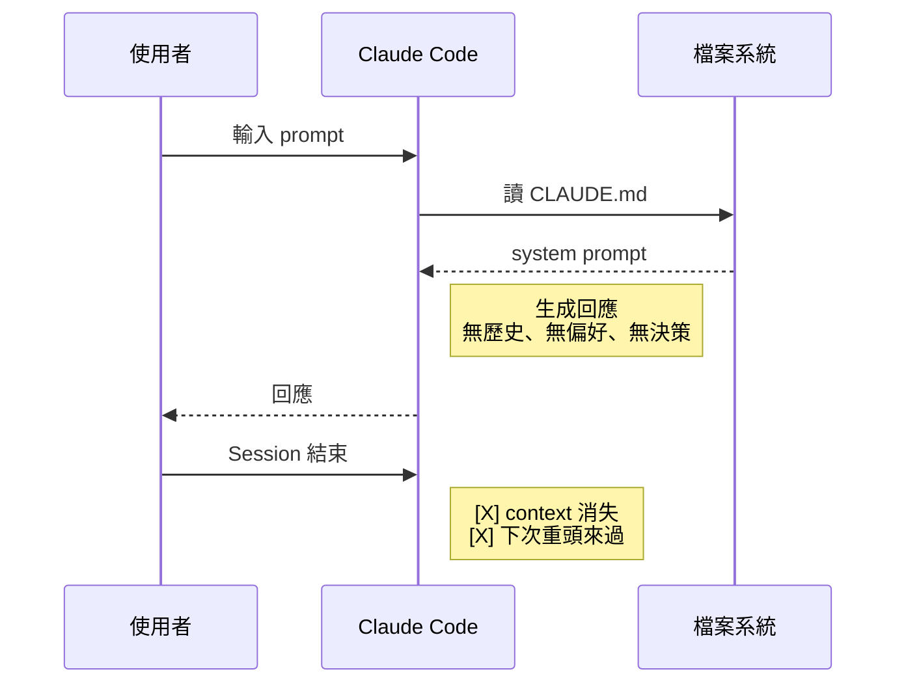
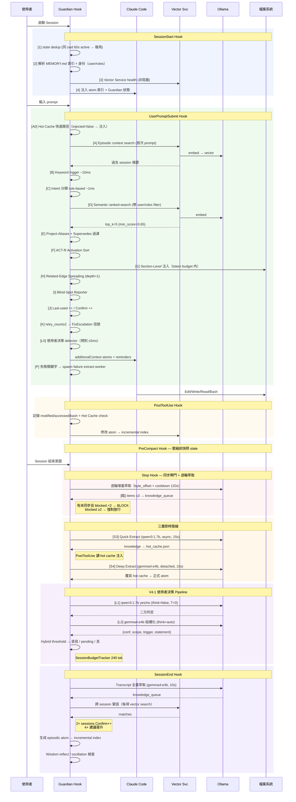
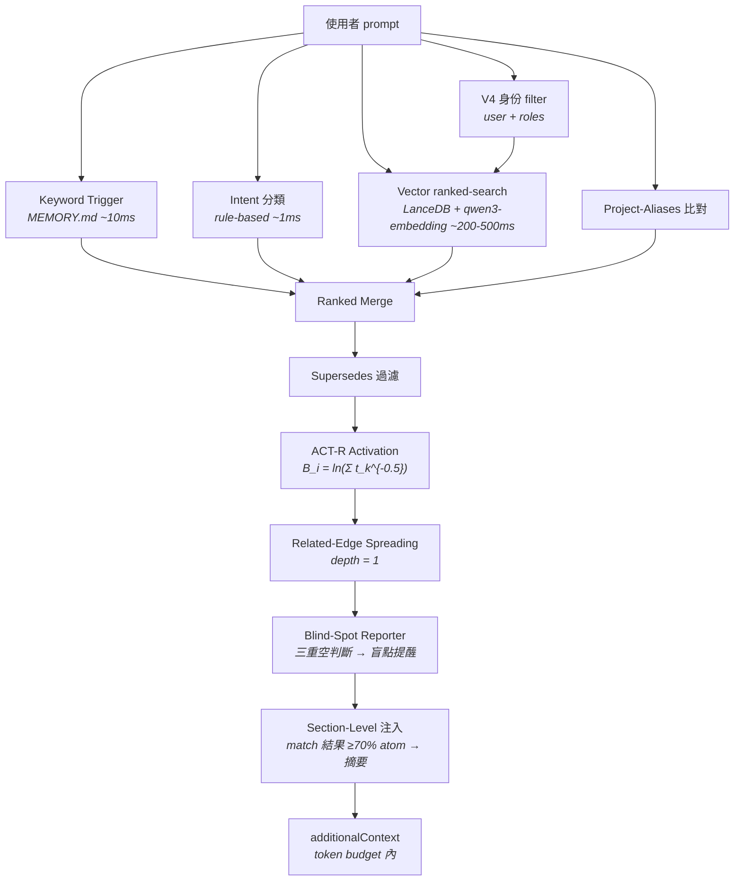
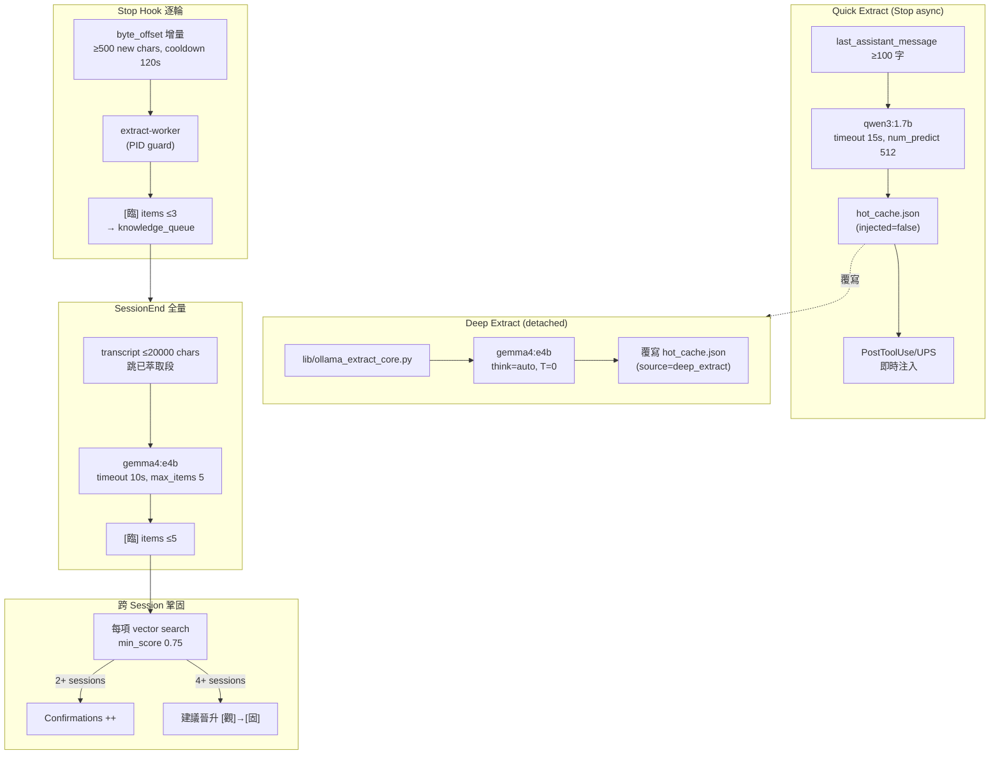

# Atomic Memory V4.1 — 技術深度文件

> 這份文件對應系統**當前代碼實況**（2026-04-16）。範例、數字、公式皆從 [hooks/](hooks/)、[tools/](tools/)、[lib/](lib/)、[workflow/config.json](workflow/config.json) 實讀取得。讀者若在代碼中看到與本文件不符的值，以代碼為準並回報修正。

深度順序：**淺 → 深**。越進階的機制往後排，依需求檢索即可。

---

## 1. 設計哲學

LLM 的 context window 是**工作記憶**，缺的是**長期記憶**。原子記憶系統補上這塊拼圖：

| # | 原則 | 實際展現 |
|---|------|---------|
| 1 | **精確度 > Token 節省** | 寧多注入確保正確，不因省 token 漏關鍵知識 |
| 2 | **漸進式信任** | 三層分類 `[臨]`→`[觀]`→`[固]`，多次驗證才晉升 |
| 3 | **最小侵入** | 全透過 Claude Code hooks 運作，主程式零修改 |
| 4 | **雙 LLM 分工** | Claude 做決策；Ollama（遠端 gemma4:e4b / 本地 qwen3:1.7b）做語意處理 |
| 5 | **可審計** | JSONL audit trail 全程記錄，知識不刪除只歸檔 |

---

## 2. 系統架構目錄樹（2026-04-16 現況）

```
~/.claude/
├── CLAUDE.md / IDENTITY.md / USER.md              ← 啟動三件套
├── settings.json                                   ← 7 hook events
├── mcp-servers.template.json                        ← MCP server 清單（Install-forAI 用）
├── README.md / TECH.md / Install-forAI.md          ← 使用者文件
│
├── rules/                                           ← 模組化規則
│   └── core.md                                      ← 合併單檔（知識庫+記憶+同步+對話）
│
├── hooks/                                           ← 15 個 Python 模組
│   ├── workflow-guardian.py                         ← Hook dispatcher
│   ├── wg_paths.py / wg_core.py                     ← 路徑與 state IO
│   ├── wg_atoms.py                                  ← ACT-R + trigger + section 注入
│   ├── wg_intent.py                                 ← 意圖分類 + 向量呼叫
│   ├── wg_extraction.py                             ← 萃取分派
│   ├── wg_episodic.py                               ← Episodic 生成 + 衝突
│   ├── wg_iteration.py                              ← 衰減 + 覆轍
│   ├── wg_hot_cache.py                              ← V3 Hot Cache
│   ├── wg_docdrift.py                               ← V3.3 文件漂移偵測
│   ├── wg_roles.py                                  ← V4 角色白名單（雙向認證）
│   ├── wg_user_extract.py                           ← V4.1 L0 使用者決策 detector
│   ├── wg_session_evaluator.py                      ← V4.1 Session 5 維評分
│   ├── user-extract-worker.py                       ← V4.1 L1/L2 萃取 worker
│   ├── extract-worker.py                            ← 深度萃取 worker (detached)
│   ├── quick-extract.py                             ← Stop async 快篩
│   └── wisdom_engine.py
│
├── lib/
│   └── ollama_extract_core.py                       ← V4.1 共享萃取核心 + SessionBudgetTracker
│
├── tools/                                           ← 30+ Python 工具
│   ├── ollama_client.py                             ← Dual-Backend
│   ├── memory-audit.py / memory-write-gate.py
│   ├── memory-conflict-detector.py                  ← 三時段衝突（write/pull/startup）
│   ├── memory-peek.py / memory-undo.py              ← V4.1 UX 工具
│   ├── memory-session-score.py                      ← V4.1 評分檢視
│   ├── conflict-review.py / init-roles.py           ← V4 管理職
│   ├── rag-engine.py / read-excel.py / unity-yaml-tool.py
│   ├── gdoc-harvester/                              ← 網頁收割
│   ├── memory-vector-service/                       ← HTTP Vector @ :3849
│   └── workflow-guardian-mcp/                       ← Dashboard MCP @ :3848
│
├── memory/                                          ← 全域記憶層
│   ├── MEMORY.md / _ATOM_INDEX.md                   ← 索引 + trigger 表
│   ├── preferences.md / decisions*.md / workflow-*.md / toolchain*.md
│   ├── feedback-*.md                                ← 行為校正
│   ├── failures/                                    ← 踩坑子 atoms
│   ├── personal/{user}/                             ← V4 個人層（holylight 已建）
│   ├── shared/ / role/                              ← V4 分層（代碼就緒，目錄待 /init-roles 建立）
│   ├── wisdom/ / episodic/ / _staging/
│   ├── _distant/ / _reference/                      ← 封存與參考
│   ├── _vectordb/                                   ← LanceDB 索引 + audit.log
│   └── _promotion_audit.jsonl                       ← 晉升審計
│
├── commands/                                        ← 24 個 /skill
│   ├── init-project / init-roles / read-project
│   ├── resume / continue / handoff
│   ├── memory-peek / memory-undo / memory-session-score   ← V4.1
│   ├── memory-review / memory-health / conflict-review
│   ├── consciousness-stream / harvest / svn-update / unity-yaml
│   ├── upgrade / atom-debug / extract / generate-episodic
│   ├── fix-escalation / conflict / vector
│
├── workflow/
│   ├── config.json                                  ← 統一設定
│   ├── hot_cache.json                               ← V3 快篩知識
│   ├── vector_ready.flag                            ← 非阻塞啟動旗標
│   ├── mcp-version-cache.json                       ← MCP template 版本
│   └── state-{session-id}.json                      ← Session ephemeral state
│
├── _AIDocs/                                         ← 知識庫
│   ├── _INDEX.md / _CHANGELOG.md / Architecture.md
│   ├── SPEC_ATOM_V4.md / V4.1-design-roundtable.md
│   ├── ClaudeCodeInternals/ / Tools/ / Failures/ / DevHistory/
│
└── {project_root}/.claude/                          ← 專案自治層（每專案獨立）
    ├── memory/MEMORY.md / atoms / failures / episodic / _staging
    └── hooks/project_hooks.py                       ← delegate
```

背景服務：
- **Vector Service** `http://127.0.0.1:3849`（LanceDB + Ollama embedding）
- **Dashboard MCP** `http://127.0.0.1:3848`（Workflow Guardian 狀態）
- **Ollama** 三 backend：rdchat-direct / rdchat / local

---

## 3. V4 scope 分層（實裝狀態）

V4 把知識空間從單層拓展為四層：

| 層 | 可見性 | 用途 | 物理目錄 |
|----|--------|------|---------|
| `global` | 跨專案、跨人 | 使用者個人偏好、通用工具決策 | `~/.claude/memory/*.md` |
| `shared` | 同專案全員 | 專案共識、架構決策、踩坑記錄 | `{project}/.claude/memory/shared/` |
| `role:{name}` | 同職務者 | 職務專有規範（programmer / art / planner 預設） | `{project}/.claude/memory/role/{name}/` |
| `personal:{user}` | 只自己 | 個人 scratch、未公開的假設 | `{project}/.claude/memory/personal/{user}/` |

### 雙向認證（管理職）

防止使用者自封管理職：
1. **personal 自我宣告**：`memory/personal/{user}/role.md` 寫自己的角色
2. **shared 白名單**：`memory/shared/_roles.md` 由現任管理職維護的全員角色對照表
3. `hooks/wg_roles.py` 的 `is_management()` 檢查兩者**都**認可才通過

### 三時段衝突偵測

| 時段 | 觸發 | 工具 |
|------|------|------|
| Write-time | atom_write MCP 呼叫 | [tools/memory-conflict-detector.py](tools/memory-conflict-detector.py)（write-check mode）：向量 ≥0.60 送 LLM → CONTRADICT 進 pending |
| Pull-time | git pull 後 | `hooks/post-git-pull.sh --mode=pull-audit`：變動 atom → classify → 衝突標記 |
| Startup-drift | SessionStart | [hooks/workflow-guardian.py](hooks/workflow-guardian.py) 的 `_ensure_state` self-heal：merged state 孤兒復活避免 pending 寫入死水 |

### 敏感原子 auto-pending

`Audience: architecture` / `decision` 的原子寫入 `shared/` 時**不直接生效**，進 `shared/_pending_review/` 等管理職裁決（approve / reject）。[tools/conflict-review.py](tools/conflict-review.py) + `/conflict-review` skill 為裁決入口。

### 當前啟用狀態

> 代碼已完整實裝，但**多職務目錄**（`shared/` / `role/` / `_roles.md`）目前**未建立**，單人（holylight）環境下僅 `memory/personal/holylight/role.md` 作用。多職務啟用需執行 `/init-roles`（本次 GA 後續步驟）。

---

## 4. V4.1 使用者決策萃取 Pipeline

V4.1 補上「使用者在對話中說出的決定 → atom 自動寫入」這一環。三層流水線：

```
使用者 prompt
      │
      ▼
[L0] 規則 detector — wg_user_extract.py  (≤5ms)
     信號詞 + 句法 pattern，score ≥0.4 → append pending_user_extract[]
      │
  （Stop hook 觸發）
      │
      ▼
[L1] 二元過濾 — qwen3:1.7b  (think=false, T=0, num_predict=30)
     yes/no，排除混合句與情緒承諾
      │
      ▼
[L2] 結構化萃取 — gemma4:e4b  (think=auto, num_predict=200)
     輸出 {conf, scope, trigger, statement}
      │
      ▼
[Hybrid Threshold Router]
     conf ≥ 0.92  → atom 直寫
     0.70 ≤ conf < 0.92 → personal/auto/{user}/_pending.candidates.md
     conf < 0.70 → 丟棄（audit 記錄）
```

### SessionBudgetTracker（240 tok/session）

來源 [lib/ollama_extract_core.py](lib/ollama_extract_core.py)、[workflow/config.json](workflow/config.json) `userExtraction.tokenBudget=240`：

- `_estimate_tokens()` CJK-aware（中文 ~1.5 tok/char、ASCII ~0.25 tok/word）
- **>220 tok** → 切 L1-only，不再跑 L2 deep extract
- **>240 tok** → break，本 session 不再萃取
- 只計 **user-delta** token（靜態 few-shot 不計）

### Session merge self-heal

[hooks/workflow-guardian.py](hooks/workflow-guardian.py) 的 `_ensure_state`：SessionStart 時若偵測到 `phase=merged` 的孤兒 state，復活為 `working` 避免 pending_user_extract 被鎖死。V4.1 GA 後 bug 修補。

---

## 5. 版本歷史

| 版本 | 日期 | 白話 | 核心變更 |
|------|------|------|---------|
| V1.0 | 2026-03-02 | 三層可信度 + 格式健檢 | `[固]/[觀]/[臨]` 分類 + memory-audit |
| V2.0 | 2026-03-03 | 語意搜尋上線 | Hybrid RECALL（keyword + vector + rerank）|
| V2.1 | 2026-03-04 | 品質閘門擋垃圾 | Write Gate + intent classifier + 衝突偵測 + decay |
| V2.4 | 2026-03-05 | AI 回答自動存 + 跨 session 升級 | 回應萃取 + 向量鞏固 + 兩層分類 |
| V2.5 | 2026-03-06 | 萃取更實用 | 可操作性 + 6 類型 + JSON 強制 + CJK patterns |
| V2.6 | 2026-03-10 | 系統自我檢討 | 8 條核心規則 + 定期檢閱 |
| V2.7 | 2026-03-10 | 品質回饋迴路 | iteration metrics + oscillation detection |
| V2.8 | 2026-03-11 | 大改動前想清楚 | Wisdom Engine（因果圖 + 情境分類 + 反思） |
| V2.9 | 2026-03-11 | 記憶檢索升級 | Project-Aliases + Related-Edge + ACT-R + Blind-Spot |
| V2.10 | 2026-03-11 | 純閱讀也留紀錄 | Read Tracking + VCS Query + episodic 閱讀軌跡 |
| V2.11 | 2026-03-13 | 大瘦身 + Dual-Backend | 模組化 rules/ + 三階段退避 Ollama |
| V2.12 | 2026-03-17 | 6 Agent 修錯會議 + 逐輪萃取 | Fix Escalation + Stop 逐輪增量 |
| V2.13 | 2026-03-19 | 踩坑自動路由 | Failures 自動化（三維路由） |
| V2.14 | 2026-03-19 | 注入前先瘦身 | Token Diet（metadata strip + lazy search） |
| V2.15 | 2026-03-19 | 拆檔 + 修 bug | atom 拆分 + vector timeout fix |
| V2.16 | 2026-03-22 | 自動晉升 + 衰減 | half_life=30d + [臨]→[觀] ≥20 Confirmations |
| V2.17 | 2026-03-22 | 覆轍偵測 | SessionStart 跨 session 警告 + AIDocs 內容閘門 |
| V2.18 | 2026-03-24 | 精準注入大瘦身 | Section-Level 注入（大 atom 省 70-90%） |
| V2.20 | 2026-03-27 | 路徑集中化 | `wg_paths.py` 唯一真相 + ACT-R bug fix |
| V2.21 | 2026-03-27 | 專案自治層 | `{project}/.claude/memory/` + Project Registry + migrate-v221 |
| V3.0 | 2026-04-02 | 知識同 turn 可用 | 三層即時管線 + SessionStart 去重 + vector 非阻塞 |
| V3.2 | 2026-04-02 | rules 四合一 | rules/core.md + MEMORY.md index-only |
| V3.3 | 2026-04-08 | 改碼提醒更新文件 | `wg_docdrift.py` + Hybrid 映射 |
| V3.4 | 2026-04-09 | 萃取引擎換 Gemma 4 | rdchat gemma4:e4b + A/B 驗證（2.8-14s vs 原 42-52s） |
| **V4.0** | **2026-04-15** | 多職務團隊知識分層隔開、敏感決策送管理職簽核 | 四層 scope 設計 + `_roles.md` 雙向認證 + 角色 filter + 三時段衝突偵測 + pending review queue。代碼完整實裝，多職務目錄待 `/init-roles` 建立。 |
| **V4.1 GA** | **2026-04-16** | 使用者說的決定系統聽得懂、自動寫成記憶 | L0→L1→L2 使用者決策萃取 Pipeline + 240 tok budget/session + `/memory-peek` `/memory-undo` `/memory-session-score` + `_ensure_state` session merge self-heal |

---

## 6. Token 消耗與延遲

### Token Budget（[hooks/wg_atoms.py](hooks/wg_atoms.py) L229-237）

| prompt 長度 | budget | 模式 |
|-------------|--------|------|
| <50 字 | 1,500 tokens | 輕量 |
| 50–200 字 | 3,000 tokens | 轉場 |
| ≥200 字 | 5,000 tokens | 深度 |

### Vanilla Claude Code vs V4.1

| 指標 | Vanilla | V4.1 |
|------|---------|------|
| Session 啟動延遲 | ~0 ms | +50-200 ms（去重 + 非阻塞 vector） |
| 每次 prompt 額外延遲 | ~0 ms | +200-500 ms（含向量搜尋） |
| 首次 prompt 額外延遲 | ~0 ms | +500-1,500 ms（episodic context search） |
| PostToolUse 延遲 | ~0 ms | +50-250 ms（含 hot cache read） |
| CLAUDE.md token | 0 | ~1,500-2,500（含 @import IDENTITY/USER/MEMORY） |
| 典型 session overhead | 0 | ~2,000-5,500 tok |
| 跨 session 知識保留率 | 0% | 取決於 atom 覆蓋率（觀察性估計） |
| 磁碟空間 | 0 | ~5-20 MB（atoms + LanceDB + state） |
| 背景 RAM | 0 | ~100-200 MB（LanceDB + Ollama 常駐模型） |

> 舊版的 V2.21/V3.1 細分對比已失時效，上表只列 Vanilla 與當前 V4.1 兩欄。跨 session 保留率、踩坑率是定性陳述，無精確量測。

---

## 7. 運行流程圖

### 7.1 Vanilla Claude Code（對照組）



### 7.2 Atomic Memory V4.1 完整流程



---

## 8. Hybrid RECALL 記憶檢索

每次使用者送出 prompt，hook 階段自動執行：



### 關鍵常數（[hooks/wg_atoms.py](hooks/wg_atoms.py) + [config.json](workflow/config.json)）

- **ACT-R 衰減** `d = 0.5`；無 access log → 回傳 `-10.0`（冷啟動）
- **Vector top_k** = 5、**min_score** = 0.65（ranked-sections 先試 0.50）
- **Related-edge max_depth** = 1
- **Section-level 觸發**：match 結果涵蓋 ≥70% atom 內容時降級為摘要

> 舊文件提過的「FinalScore = 0.45×Semantic + 0.15×Recency + 0.20×IntentBoost + ...」加權公式**代碼中沒有顯式實作**。實際排序為 vector score → ACT-R activation → related edge spreading 的階段式組合。

### 降級策略

| 情境 | 行為 |
|------|------|
| Ollama 不可用 | 純 keyword trigger |
| Vector Service 掛 | keyword + fallback（sentence-transformers BAAI/bge-m3）|
| 全部掛 | 僅讀 MEMORY.md |

---

## 9. Write Gate 寫入品質閘門

來源 [tools/memory-write-gate.py](tools/memory-write-gate.py) L36-43 + [workflow/config.json](workflow/config.json) L73-78。

### 6 條規則

| 規則 | 權重 | 條件 |
|------|------|------|
| `length_20` | +0.15 | content ≥ 20 chars |
| `length_50` | +0.10 | content ≥ 50 chars（可疊 length_20，最多 +0.25） |
| `tech_terms` | +0.15 | ≥ 2 項技術術語（API / Git / vector / schema...，含 CJK「架構 / 設定」） |
| `explicit_user` | +0.35 | 使用者明確觸發（「記住」「這是固定規則」）|
| `concrete_value` | +0.15 | 含版本、路徑、config 值（如 `v4.1` / `~/.claude/...`）|
| `non_transient` | +0.10 | 不含 timeout/retry/暫時 等瞬時語意 |
| `actionable` | +0.15 | 行動式（「需要 X」「如果 Y 就 Z」+ CJK 方向箭頭）|

### 決策門檻

| 總分 | 行為 |
|------|------|
| ≥ 0.5 | Auto Add |
| 0.3 - 0.5 | Ask User |
| < 0.3 | Skip（audit trail 記錄） |

### Dedup

| 向量相似度 | 行為 |
|-----------|------|
| > 0.95 | 跳過（完全重複）|
| 0.80 - 0.95 | 建議 Update 既有 atom |
| < 0.80 | 進入 quality 評分 |

### V4 新增

「陷阱 / 坑 / pitfall」關鍵詞命中 → 自動 [觀] 快速路徑（繞過低分 skip，失敗模式優先保留）。

---

## 10. 回應知識捕獲 + 三層即時管線

V3 起改為**三層併流**：快篩 → Hot Cache → 深度覆寫。



### 知識類型（[lib/ollama_extract_core.py](lib/ollama_extract_core.py) `VALID_TYPES`）

`factual` / `procedural` / `architectural` / `pitfall` / `decision` — 五類（V2.5 加了 `preference` 後又在 V3 時合併回 `decision`，以代碼為準）。content 上限 150 chars。

### 配置（[config.json](workflow/config.json) `response_capture` + `hot_cache`）

- Quick extract timeout: **15 s**（`hot_cache.quick_extract_timeout`）
- Deep extract (SessionEnd) timeout: **10 s**（`session_end_timeout_seconds`）
- Per-turn 最小新增 chars: **500**、max_items: **3**、cooldown: **120 s**
- Failure extraction 冷卻: **180 s**、max_items: **2**
- Cross-session: `promote_threshold=2`、`suggest_threshold=4`、`min_score=0.75`

---

## 11. Dual-Backend Ollama

[tools/ollama_client.py](tools/ollama_client.py) + [config.json](workflow/config.json) `ollama_backends`：

| Backend | priority | LLM | Embedding | 說明 |
|---------|----------|-----|-----------|------|
| `rdchat-direct` | 1 | gemma4:e4b | qwen3-embedding:latest | 遠端 GPU（RTX 3090）直連 |
| `rdchat` | 2 | gemma4:e4b | qwen3-embedding:latest | LDAP bearer 認證 proxy |
| `local` | 3 | qwen3:1.7b | qwen3-embedding | 本地 CPU/GPU（無認證） |

### 三階段退避

```
正常 → [連續 2 次失敗] → Short DIE (60s，用 fallback)
     → [10 分鐘內 2 次 Short DIE] → Long DIE (等到下個 6h 邊界: 0/6/12/18)
```

- **Short DIE**: `SHORT_DIE_COOLDOWN = 60`
- **Long DIE window**: `LONG_DIE_WINDOW = 600`（10 分鐘）
- **時間段邊界**: `[0, 6, 12, 18]`
- **靜態停用**：`ollama_backends.<name>.enabled=false`，永久跳過不做 health check
- **長 DIE 使用者確認**：SessionStart 詢問「停用 / 保持」，回答「停用」設 `enabled:false`

### 認證

rdchat backend 用 LDAP bearer token，帳號自動取 `os.getlogin()`，密碼存 `~/.claude/workflow/.rdchat_password`（gitignored）。

---

## 12. 核心子系統總表

| 子系統 | 切入點 | 說明 |
|--------|--------|------|
| Workflow Guardian | [hooks/workflow-guardian.py](hooks/workflow-guardian.py) | Stop 閘門 — 有未同步修改阻止結束，最多 2 次，第 3 次強制放行 |
| SessionStart Dedup | 同上 `handle_session_start` | 同 cwd 60s active → 複用 state；resume 合併、startup skip vector；分層孤兒清理（10m/30m/24h） |
| Hybrid RECALL | [hooks/wg_atoms.py](hooks/wg_atoms.py) + [hooks/wg_intent.py](hooks/wg_intent.py) | Project-Aliases + Related-Edge + ACT-R + Blind-Spot + Section-Level 注入 |
| Hot Cache | [hooks/wg_hot_cache.py](hooks/wg_hot_cache.py) + `workflow/hot_cache.json` | quick-extract 寫 → PostToolUse/UPS 注入 → deep extract 覆寫 |
| Response Capture | [hooks/extract-worker.py](hooks/extract-worker.py) + [hooks/quick-extract.py](hooks/quick-extract.py) | SessionEnd 全量 + Stop 逐輪（byte_offset + cooldown）|
| Read Tracking | PostToolUse 攔截 Read/Bash | 閱讀檔案去重 + 版控查詢捕獲 → episodic |
| Episodic Memory | [hooks/wg_episodic.py](hooks/wg_episodic.py) | Session 結束生成摘要（TTL 24d），下次 vector search 找回 |
| Cross-Session | 同上 `handle_session_end` | 2+ sessions Confirm++、4+ 建議晉升，lazy search 預篩 |
| Self-Iteration | [hooks/wg_iteration.py](hooks/wg_iteration.py) | 3 條核心（品質函數 + 證據門檻 + 震盪偵測）+ 自動晉升 [臨]→[觀] ≥20 |
| Wisdom Engine | [hooks/wisdom_engine.py](hooks/wisdom_engine.py) + `memory/wisdom/` | 情境分類（硬規則）+ 反思（3 指標 Bayesian 校準）|
| Fix Escalation | [commands/fix-escalation.md](commands/fix-escalation.md) + Guardian `_check_fix_escalation` | retry≥2 → 6 Agent 精確修正會議；連 3 次未解決強制暫停 |
| Failures 自動化 | Guardian `_check_failure_patterns` + `response_capture.failure_extraction` | 失敗關鍵字 → detached worker → 三維路由 |
| Token Diet | Guardian `_strip_atom_for_injection` | 注入前 strip 9 種 metadata + Section-Level（大 atom 省 70-90%）|
| Write Gate | [tools/memory-write-gate.py](tools/memory-write-gate.py) | 6 規則 + dedup 0.8 + CJK patterns；陷阱關鍵詞快速路徑 |
| Decay & Archival | [tools/memory-audit.py](tools/memory-audit.py) `--enforce` | 超期 atom 移 `_distant/{year}_{month}/`，`--restore` 拉回 |
| Audit Trail | `_vectordb/audit.log` + `_promotion_audit.jsonl` | JSONL 記錄 add/delete/conflict/decay/promotion |
| DocDrift Detection | [hooks/wg_docdrift.py](hooks/wg_docdrift.py) + `config.json.docdrift` | src Edit/Write 偵測對應 `_AIDocs/` 需更新，Hybrid 映射（config + keyword） |
| Staging Area | `memory/_staging/` | 續接 prompt、暫存草稿（gitignored）|
| **V4 Scope Layering** | [hooks/wg_paths.py](hooks/wg_paths.py) | 四層目錄發現（`discover_v4_sublayers` / `discover_memory_layers`） |
| **V4 Role Whitelist** | [hooks/wg_roles.py](hooks/wg_roles.py) | 雙向認證（personal role.md + shared `_roles.md`）、`is_management` |
| **V4 Pending Review** | [tools/memory-conflict-detector.py](tools/memory-conflict-detector.py) + `/conflict-review` | 敏感類（architecture/decision）自動進 `shared/_pending_review/`，管理職裁決 |
| **V4 Conflict Write-Gate** | 同上（write-check mode） | 向量 ≥0.60 送 LLM → CONTRADICT 進 pending；EXTEND/sim≥0.85 reroute |
| **V4 Conflict Pull-Audit** | `hooks/post-git-pull.sh --mode=pull-audit` | Pull 後變動 atom 分類 → 衝突標記 |
| **V4 Conflict Startup-Drift** | Guardian SessionStart `_ensure_state` self-heal | merged state 孤兒復活 |
| **V4.1 Decision Detector (L0)** | [hooks/wg_user_extract.py](hooks/wg_user_extract.py) | 信號詞 + 句法 ≤5ms；score ≥0.4 → `pending_user_extract[]` |
| **V4.1 Decision Filter (L1)** | [hooks/user-extract-worker.py](hooks/user-extract-worker.py) | qwen3:1.7b yes/no（think=false, T=0, num_predict=30）|
| **V4.1 Decision Extractor (L2)** | 同上 | gemma4:e4b `{conf, scope, trigger, statement}`（think=auto, num_predict=200）|
| **V4.1 Hybrid Threshold Router** | [hooks/user-extract-worker.py](hooks/user-extract-worker.py) + [lib/ollama_extract_core.py](lib/ollama_extract_core.py) | ≥0.92 直寫 / 0.70-0.92 pending / <0.70 丟 |
| **V4.1 Session Budget** | [lib/ollama_extract_core.py](lib/ollama_extract_core.py) `SessionBudgetTracker` | ≤240 tok/session；>220 L1-only、>240 break（CJK-aware）|
| **V4.1 Session Score** | [hooks/wg_session_evaluator.py](hooks/wg_session_evaluator.py) + `/memory-session-score` | 5 維（density / precision_proxy / novelty / cost_efficiency / trust） → `reflection_metrics.json` |
| **V4.1 Memory Undo** | [tools/memory-undo.py](tools/memory-undo.py) + `/memory-undo` | 撤銷自動萃取 atom + reason 分類 `_rejected/` + trust 維度更新 |

---

## 13. 團隊協作：USER.md / IDENTITY.md 分離

[CLAUDE.md](CLAUDE.md) 透過 `@import` 載入：

```
@IDENTITY.md       ← AI 角色定義（團隊共用）
@USER.md           ← 操作者個人資料（每人一份）
@memory/MEMORY.md  ← 記憶索引（自動）
```

**多人 onboard**：共用 `CLAUDE.md` + `IDENTITY.md`，每人一份 `USER.md`。`USER.md` 內宣告 `CLAUDE_USER` 環境變數可在同機切換帳號測試。

---

## 14. 大型專案使用法

### 14.1 專案自治層

每個專案在 `{project}/.claude/memory/` 有獨立的 atom 空間：
- **架構決策**：framework 選型、資料夾慣例、命名規範
- **已知陷阱**：踩過的坑、環境特殊設定、相容性
- **Coding convention**：專案特有的程式風格、禁止事項

全域層 `~/.claude/memory/` 只放跨專案共通知識（使用者偏好、通用工具決策）。

### 14.2 V4 多職務分層（啟用條件）

專案 `.claude/memory/` 建立 `shared/` + `role/{name}/` + `personal/{user}/` 後，JIT 注入自動按角色 filter。

> 多職務目錄**需手動執行** `/init-roles` 建立。未啟用時視同單層 `shared`，所有人看到相同知識。

### 14.3 Vector DB 語意搜尋

- **段落級索引**：每個 `- ` bullet 為一 chunk
- **增量索引**：比對 file_hash，僅重新索引有變動的 atom
- **Metadata 攜帶**：atom_name / confidence / layer / tags → ranked search 加權
- **多來源整合**：`config.json` 的 `additional_atom_dirs` 整合外部工具的 atoms

### 14.4 Episodic Memory 跨 Session 延續

每個 session 結束自動生成 episodic atom（不列 MEMORY.md），含：
- 本 session 做了什麼、改了哪些檔
- **閱讀軌跡**（Read Tracking 去重）
- **版控查詢**（git/svn log/blame/show/diff ≤10 筆）
- 關聯 semantic atoms
- **覆轍信號**（same_file_3x / retry_escalation）

下次首次 prompt 用 vector search 找回並注入。

### 14.5 Token 管理策略

- **Trigger 匹配**：只有命中才載入
- **Ranked Search**：按 vector score 排序 top_k=5
- **Token Budget**：自動依 prompt 長度調節（1,500-5,000）
- **Supersedes**：被取代的舊 atom 自動過濾
- **硬限制**：MEMORY.md ≤30 行、atom ≤200 行

---

## 15. 深度參考

技術細節深入閱讀：
- [_AIDocs/SPEC_ATOM_V4.md](_AIDocs/SPEC_ATOM_V4.md) — V4 scope 與管理職雙向認證正式規格
- [_AIDocs/V4.1-design-roundtable.md](_AIDocs/V4.1-design-roundtable.md) — V4.1 使用者決策萃取設計圓桌紀錄
- [_AIDocs/DevHistory/v41-journey.md](_AIDocs/DevHistory/v41-journey.md) — V4.1 開發歷程與 GA 後 bug 修補
- [_AIDocs/Architecture.md](_AIDocs/Architecture.md) — 系統架構總覽
- [_AIDocs/DevHistory/ab-test-gemma4.md](_AIDocs/DevHistory/ab-test-gemma4.md) — V3.4 萃取引擎 A/B 測試報告

---

## License

GNU General Public License v3.0 — 見 [LICENSE](LICENSE)
