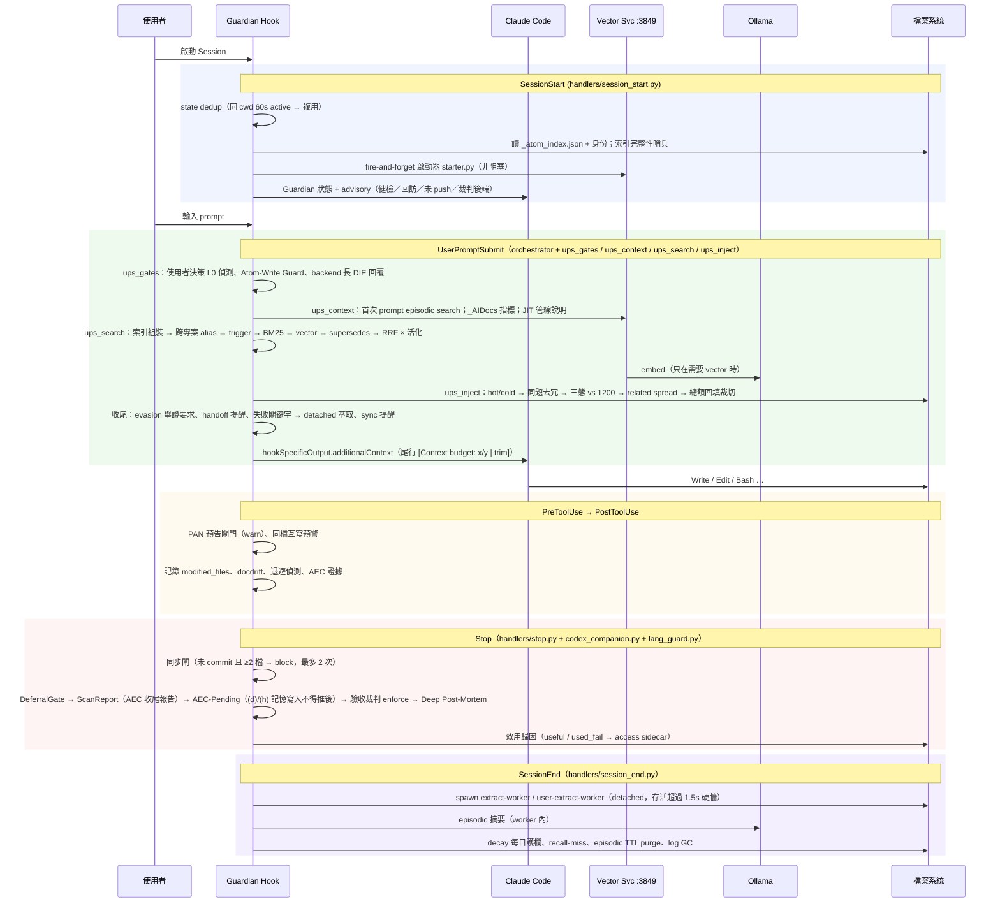

# 原子記憶系統 — 技術深度文件

> 本文件對應系統**當前代碼實況**；與代碼不符以代碼為準並回報修正。版本標識見 `version.json`。
> 讀者定位：**人讀為主**（想弄懂這套東西怎麼跑、為什麼這樣設計），**Claude Code 讀來建立自我認知為輔**。
> 章節按「現況」邏輯排：理念 → 差異 → 一個回合 → 資料層 → 檢索注入 → 寫入積累 → 守門收尾 → 可觀測 → 服務 → 目錄 → 成本 → 設定 → 協作 → 版本歷史 → 深度參考。
> 閱讀鐵則：每個機制在它所屬章節講完要點；要深入只指到**單一**檔案或**單一** DevHistory 檔，不做「A 見 B、B 見 C」。

---

## 1. 設計理念

### 1.1 使用者最高原則

LLM 的 context window 是**工作記憶**，天生沒有**長期記憶**。這套系統要做到的是：

| 原則 | 白話 | 落地在哪 |
|------|------|---------|
| 全積累 | 值得記的知識一顆都不漏，且不刪只歸檔 | atom 卡片 + `_distant/` 封存 + JSONL 審計 |
| 分門別類 | 每顆知識有明確範疇，分不出就不准寫 | Lv1 閉合清單 `memory/_meta/taxonomy.json` + 寫入閘 `domain` 必填 |
| 高精準零浪費 | 只注入這一句真正需要的知識，不塞、不重複、不截成廢紙 | trigger/BM25/vector 三路 RRF + 預算三閘 + 同題去冗 |
| 跨 session | 上個 session 學到的，下個 session 自動帶著 | 每 prompt hook 注入 + episodic 摘要 + 回訪機制 |
| 自動分層 | 用過有效就升、久沒用就淡出，人不用手動整理 | [臨]→[觀]→[固] 效用 Wilson 晉升 + ACT-R 活化衰減 |
| 分使用者 | 我的偏好是我的，專案共識是專案的 | 四層 scope（global / shared / role / personal） |

### 1.2 六原則

| # | 原則 | 實際展現 |
|---|------|---------|
| 1 | **精確度 > Token 節省** | 寧多注入確保正確；預算閘裁切時「回填」而非整塊丟 |
| 2 | **漸進式信任** | `[臨]`→`[觀]`→`[固]`，靠效用統計晉升，不靠人工拍腦袋 |
| 3 | **最小侵入** | 全走 Claude Code hooks（9 事件）+ MCP tool，主程式零修改 |
| 4 | **雙 LLM 分工** | Claude 做決策；本地 Ollama（gemma4:e4b / qwen3:1.7b）做萃取、分類、embedding |
| 5 | **可審計** | JSONL audit trail 全程記錄；知識只歸檔不刪 |
| 6 | **對齊原生** | 採 skills / MCP / hooks / auto-memory 原生機制，自製只做原生做不到的部分 |

### 1.3 治理鐵律（`rules/core.md`）

- **Native-first**：原生機制優先；自製只做「結構化 · 可稽核 · 跨 session 高價值」的事。過度工程的正解是誠實化＋修剪，不是推倒重來。
- **可觀測性鐵律**：所有 fail-open「不阻斷但要告知」——降級／靜默失敗必浮出訊號（stderr / advisory / 收尾報告 / statusline），不得無聲吞掉。反例是向量服務曾靜默死 27 天沒人知道。

---

## 2. 與 Claude Code 原生／與業界的差異

### 2.1 與 Claude Code 原生記憶

| 面向 | Claude Code 原生 | 原子記憶系統 | 差異的意義 |
|------|------|------|------|
| 真源 | `projects/<slug>/memory/MEMORY.md` + 自由 md，模型自己決定寫什麼 | Markdown atom 卡片 + `memory/_atom_index.json` 機器索引；每顆有 Trigger / Confidence / Scope | 有索引才能程式化檢索；有欄位才能程式化晉升 |
| 跨專案 | **無**——記憶綁 project slug | `memory/<範疇>/` 全專案注入；他專案只在提到其別名時帶入 MEMORY.md 目錄（上限 20 專案） | 個人偏好、通用踩坑不必每個專案重學；專案層知識不外洩 |
| 載入方式 | 啟動只載 MEMORY.md 前 200 行／25KB，其餘靠模型按需 Read | 每個 prompt 由 hook 主動挑選注入 | 「有存無用」是業界通病；主動注入直接對治 |
| 檢索 | 無 | trigger → BM25 → vector → RRF 融合 × 活化 | 模型不必自己想起要去讀哪個檔 |
| 品質分級 | 無 | [臨]/[觀]/[固] + Wilson 效用晉升 | 未驗證的猜測不會和已驗證的事實平起平坐 |
| 回饋迴路 | 無 | access sidecar、rescue-log、recall-miss、效果報表、回訪 | 知道「哪顆記憶真的被用到」 |
| 接點 | — | `tools/native-memory-bridge.py` 把核心 atom 索引鏡像成 `projects/<slug>/memory/atom-index-bridge.md`（只有指標） | 原生路徑也找得到 atom，且不違反 200 行硬牆 |
| Hook 硬牆 | UserPromptSubmit 30s；SessionEnd 全部 hook 共 1.5s | UPS 實設 8s；SessionEnd 萃取改 detached worker | 1.5s 跑不完 LLM 萃取，只能 spawn 獨立子程序 |

原生規格查證版：`_AIDocs/ClaudeCodeInternals/cc-native-memory-hooks-mcp.md`。

### 2.2 與業界主流（Zep / Mem0 / Mastra / claude-mem 等）

| 面向 | 業界主流 | 原子記憶系統 | 評語 |
|------|------|------|------|
| 檢索 | hybrid BM25+vector+RRF 為共識；cross-encoder rerank 再進一步 | 同款三路 RRF；無 rerank | 方向一致；rerank 是可補強項 |
| 新鮮度 | 決定性規則（timestamp）勝 LLM 判斷（82% vs 18%） | `supersedes` 規則式過濾；衝突裁決先看證據等級再看 recency | 符合 |
| 注入 | 每 prompt ≤6 條、SessionStart ~1,200 tok；單一干擾項即傷精度 | per-turn 硬頂 1200 tok、同題去冗、總額分級 | 符合 |
| 積累 | 原文勝萃取物；入場閘以內容型別先驗最有效 | 顯式策展 `atom_write` 為主，自動萃取為輔；atom 尚無 provenance 指標 | 弱點：萃取物指不回原文 |
| 信任 | 多數產品無分級 | 三級 + Wilson | 領先 |
| 回饋 | 多數只有「存了多少」 | 有「用了多少」（rescue-log / useful / used_fail） | 領先 |
| 部署 | 多數雲端 API | 全本地：Ollama + LanceDB | 無 OAuth／連線故障類問題 |
| prompt cache | Mastra 固定前綴達 SOTA | 每輪注入段變動不進 cache，但前綴仍命中 | 影響限於注入段本身 |

業界調查全文：`_AIDocs/Research/agent-memory-industry-survey.md`；三方比對與優缺點判讀：`_AIDocs/DevHistory/memory-system-review-2026-08.md`。

---

## 3. 一個回合發生什麼

### 3.1 settings.json 九事件

指令型式一律 `<pythonw.exe 絕對路徑> -c "import runpy...run_path(~/.claude/hooks/xxx.py)"`；安裝後必跑 `python tools/fix-hook-python.py --write` 把直譯器路徑改成本機。

| 事件 | matcher | 掛的 hook（timeout 秒） | 職責 |
|------|---------|------|------|
| SessionStart | — | `user-init.sh`(5) → `workflow-guardian.py`(8) → `ensure-mcp.py`(5) → `codex_companion.py`(5) | 還原 USER/IDENTITY、state 建立、索引完整性哨兵、vector 啟動器、advisory（健檢／回訪／未 push／裁判後端） |
| UserPromptSubmit | — | guardian(8)、codex(3) | **記憶注入主路徑**（§5）+ 各種 guard 提醒 |
| PreToolUse | `WebFetch` | `webfetch-guard.sh`(20) | 抓網頁前置護欄 |
| PreToolUse | `Write\|Edit\|NotebookEdit\|Bash\|PowerShell\|Agent\|Task` | guardian(5) | PAN 預告閘門、跨 session 同檔互寫預警、git commit 隱私硬閘、git commit 口令閘、subagent 記憶注入 |
| PostToolUse | `Edit\|Write\|NotebookEdit\|Bash\|Agent\|Task\|mcp__workflow-guardian__anti_evasion_report` | guardian(5) | 記錄改檔、docdrift、退避偵測、AEC 證據蒐集、late-collision |
| PostToolUse | `Edit\|Write\|Bash\|ExitPlanMode\|EnterPlanMode` | codex(3) | Codex Companion 審計觸發 |
| PostToolUse | `Write\|Edit\|MultiEdit` | `version_guard.py`(5) | live 檔版本脈絡殘留 warn |
| PostToolUse | `Write\|Edit\|NotebookEdit\|ExitPlanMode` | `acceptance_spec.py`(5) | 驗收規格工件分級啟動 |
| PreCompact / PostCompact / PostToolBatch | — | guardian(5) | 壓縮前存 handoff stub；壓縮後重注入 atom；批次後 token 預警 |
| Stop | — | guardian(10)、codex(150)、`lang_guard.py`(5) | 同步閘、DeferralGate、ScanReport、效用歸因、驗收裁判 enforce、英文漂移 |
| SessionEnd | — | guardian(30)、codex(5) | spawn 萃取 worker、episodic 生成、decay、recall-miss、log GC |

### 3.2 序列圖


```mermaid
sequenceDiagram
    participant U as 使用者
    participant G as Guardian Hook
    participant C as Claude Code
    participant V as Vector Svc :3849
    participant O as Ollama
    participant F as 檔案系統

    U->>G: 啟動 Session
    rect rgba(100,150,255,0.1)
        note over G,F: SessionStart (handlers/session_start.py)
        G->>G: state dedup（同 cwd 60s active → 複用）
        G->>F: 讀 _atom_index.json + 身份；索引完整性哨兵
        G->>V: fire-and-forget 啟動器 starter.py（非阻塞）
        G->>C: Guardian 狀態 + advisory（健檢／回訪／未 push／裁判後端）
    end

    U->>G: 輸入 prompt
    rect rgba(100,200,100,0.1)
        note over G,F: UserPromptSubmit（orchestrator + ups_gates / ups_context / ups_search / ups_inject）
        G->>G: ups_gates：使用者決策 L0 偵測、Atom-Write Guard、backend 長 DIE 回覆
        G->>V: ups_context：首次 prompt episodic search；_AIDocs 指標；JIT 管線說明
        G->>G: ups_search：索引組裝 → 跨專案 alias → trigger → BM25 → vector → supersedes → RRF × 活化
        V->>O: embed（只在需要 vector 時）
        G->>F: ups_inject：hot/cold → 同題去冗 → 三態 vs 1200 → related spread → 總額回填裁切
        G->>G: 收尾：evasion 舉證要求、handoff 提醒、失敗關鍵字 → detached 萃取、sync 提醒
        G->>C: hookSpecificOutput.additionalContext（尾行 [Context budget: x/y | trim]）
    end

    C->>F: Write / Edit / Bash …
    rect rgba(255,200,100,0.1)
        note over G,F: PreToolUse → PostToolUse
        G->>G: PAN 預告閘門（warn）、同檔互寫預警
        G->>G: 記錄 modified_files、docdrift、退避偵測、AEC 證據
    end

    rect rgba(255,150,150,0.1)
        note over G,F: Stop（handlers/stop.py + codex_companion.py + lang_guard.py）
        G->>G: 同步閘（未 commit 且 ≥2 檔 → block，最多 2 次）
        G->>G: DeferralGate → ScanReport（AEC 收尾報告）→ AEC-Pending（(d)/(h) 記憶寫入不得推後）→ 驗收裁判 enforce → Deep Post-Mortem
        G->>F: 效用歸因（useful / used_fail → access sidecar）
    end

    rect rgba(150,100,255,0.1)
        note over G,F: SessionEnd（handlers/session_end.py）
        G->>F: spawn extract-worker / user-extract-worker（detached，存活超過 1.5s 硬牆）
        G->>O: episodic 摘要（worker 內）
        G->>F: decay 每日護欄、recall-miss、episodic TTL purge、log GC
    end
```

---

## 4. 記憶資料層

### 4.1 atom 卡片格式

一顆 atom = 一個 `.md` 檔，檔名即 slug（`lib/atom_spec.py slugify`）。頭部是 metadata 條列，正文是 `## 知識` / `## 行動`（可有 `## 印象`）。

| 欄位 | 必填 | 值 | 用途 |
|------|------|-----|------|
| `Scope` | 是 | `global` / `shared` / `role:{name}` / `personal:{user}` | 可見範圍（§4.4） |
| `Confidence` | 是 | `[固]` / `[觀]` / `[臨]` | 信任等級；注入時 [固]/[觀] 優先保留 |
| `Trigger` | 是 | 逗號分隔關鍵字 | 檢索主路（§5.1）；ASCII 整詞邊界、CJK 子字串 |
| `Related` | 否 | 其他 atom 名 | related spread（depth 1）與 broken_refs 健檢 |
| `Supersedes` | 否 | 被取代的 atom 名 | 規則式過濾舊版，不交 LLM 判 |
| `Depends` | 否 | `path:<路徑>` 或自由文字 | **壞滅緣**：path 型可機器驗存在性，指向消失 → 標 stale |
| `Evidence` | 否 | `實證` / `引述` / `推測` | 衝突裁決權重 3/2/1（未標 0） |
| `Expires-at` / `Tags` / `Quality` | 否 | — | 輔助 |
| access sidecar | 自動 | `<atom>.access.json` | read_hits（純曝光）、useful/used_fail（α/β）、Wilson 下界、decay、last_decay_date |

**為什麼 Depends 與 Evidence 都是 optional**：向後相容鐵則——既有 atom 缺欄靜默通過。**為什麼 access 是 sidecar 不是 frontmatter**：計數每回合都在變，寫回 atom 本體會讓 git diff 全是噪音、也會和人手編輯互撞。

### 4.2 分類階層（core realm）

- 核心 atom 只住 `memory/<Lv1>/[<Lv2>/]`，根下**不容平鋪**（`sync-memory-index --check` 直接 exit 1）。
- Lv1 是**閉合清單**（`memory/_meta/taxonomy.json` `core` 節）：版控 / 工作流 / 思考與決策 / 驗證與實證 / dotnet / OS-Windows / 文字與格式 / 設計通則 / 行為契約 / CC與原子記憶契約；別名（如 `vcs/git`）自動 snap 回正名。
- 失敗家族 `memory/Failures/<主題>/`：feedback-* 與失敗模式 atom；主題沿用同一套 Lv1 名。
- 每層有自動生成的 `_INDEX.md`；`memory/MEMORY.md` 只列 Lv1 目錄。

**為什麼 MEMORY.md 只列 Lv1 目錄**：它經 `CLAUDE.md @memory/MEMORY.md` 每 session always-load，行數上限 40（`atom_spec.INDEX_MAX_LINES`；專案層 150 `PROJECT_INDEX_MAX_LINES`——專案層不生成各範疇 _INDEX.md，逐顆列表住在 MEMORY.md 本身）。列到 atom 明細，always-load 會隨 atom 數線性膨脹（百顆 atom ≈ 數千 tok 每輪白付）；列到 Lv1 只有 19 行、約 300 tok，且 atom 再多也不長胖——真正的檢索靠 trigger/BM25，不靠模型讀目錄。

**為什麼分不出範疇就拒寫**：沒有「其他／未分類」桶。一旦有 Else，所有懶得分的東西都會掉進去，範疇就形同虛設；拒寫逼寫手當下決定它屬於哪裡。

### 4.3 realm：core vs local

| | core | local |
|--|------|-------|
| 物理位置 | `memory/<範疇>/`、`memory/Failures/<主題>/` | `_AIDocs/_atoms/<domain 多段路徑>/`（MemDev / Tools / OS / Vision） |
| 注入範圍 | 全專案 | **只在 cwd ∈ ~/.claude** 時注入（`wg_core._is_under_claude_dir`） |
| Scope 欄 | global | 仍是 global（realm 由索引 path 前綴推導，不存欄位） |
| 該放什麼 | 任何專案的 AI 都用得到（使用面） | 只在 ~/.claude 有用：記憶系統開發、本機特定 |
| 索引 | 同一份 `_atom_index.json` | 同一份 |
| 目錄 | `memory/MEMORY.md` | `memory/_local_catalog.md` |
| 分類器 | — | `lib/atom_locations.classify_realm`（決定性詞庫；LLM fallback 預設關） |

判定三問：別的專案會碰到嗎？→ core。只有在改記憶系統本身時才用到？→ local。分不出？→ 先 `dry_run`。

### 4.4 四層 scope

| 層 | 可見性 | 用途 | 物理目錄 |
|----|--------|------|---------|
| `global` | 跨專案、跨人 | 個人偏好、通用工具決策 | `~/.claude/memory/<範疇>/`（+ local realm） |
| `shared` | 同專案全員 | 專案共識、架構決策、踩坑 | `{project}/.claude/memory/shared/<Lv1>/`；feedback-* 落 `failures/<主題>/` |
| `role:{name}` | 同職務者 | 職務專有規範 | `{project}/.claude/memory/roles/<role>/` |
| `personal:{user}` | 只自己 | 個人 scratch、未公開假設 | `{project}/.claude/memory/personal/<user>/` |
| `personal:{user}`（跨專案） | 只自己，但每個專案都看得到 | 本人跨專案偏好 | `~/.claude/memory/personal/<user>/`（gitignore；`atom_write(scope=personal, cross_project=true)` 或從 ~/.claude 寫入即落此） |

**personal 與 shared 的分界**：內容是「針對專案的規則」（專名／此專案／上傳／發布／必須／禁止…）就落 shared，`Author:` 記提出者（自動萃取亦同）；有異議找 Author，管理職可覆寫。personal 只留真正的個人偏好。

**讀取端候選池**（SessionStart 建一次、UPS 的 trigger / BM25 / vector / related / AtomAudit 共用）：global + 本人跨專案 personal + 本專案 shared（含 failures）+ 本人 roles + 本人 personal。他專案任何層都不進池；他人 personal / role 不進池。scope 由索引 path 推導（`personal/<u>/`、`roles/<r>/`），不信 index 的 scope 欄。向量路帶同一套 layers 白名單，管理職不豁免。

當前部署為單人，實際只用到 global / personal；shared / roles 為保留能力（§13）。

### 4.5 索引：JSON 單一真相

- `memory/_atom_index.json` 是唯一機器源（API：`lib/atom_index_json.py` load/save/upsert/delete/validate）；`_ATOM_INDEX.md` 是自動生成 mirror，只給 fallback parser。
- 每筆：`name` / `path` / `triggers` / `scope`（+ realm 由 path 推導）。
- 多機合併：索引三檔（`MEMORY.md`／`_ATOM_INDEX.md`／`_atom_index.json`）是「一列一 atom」的集合，兩機各自新增後 git 逐行三方必衝突 → 三層防線：全 repo LF、`tools/merge-atom-index.py` 當 git merge driver 做語意三方（PreToolUse 在合併類 git 指令前自動 `--install`）、git 仍停住時 `--resolve` 在 `rebase --continue` 等指令前自動套在三檔 stage 上；SVN 工作副本同一支 `--resolve` 在 `svn commit / resolve` 前自動解（拿 svn 留下的 `.mine`／`.r舊`／`.r新` 當三方輸入，`svn resolve --accept working`；`svn update` 本身不自動）。
  細節（stage 方向矩陣、CLI 契約、失敗模式 SOP、不在保證範圍）→ `_AIDocs/MultiMachineMemorySync.md`。
- 行尾政策：整個 `~/.claude` repo 一律 LF——`.gitattributes`（`* text=auto eol=lf` + 各文字副檔名明釘 `text eol=lf`）與 `.editorconfig`（`end_of_line = lf`）進版控，不需任何機器安裝；工具層所有寫檔走 `lib.atom_io.write_text_lf()`／`normalize_lf()` 或 `newline="\n"`，只吐 LF、不沿用原檔行尾；守衛 = `hooks/verify/verify_lf_writes.py`（AST 掃無 newline 控制的寫檔即 fail，`# lf-exempt: <原因>` 標三個合法例外）+ `python tools/normalize-eol.py --root --check`（index 與工作樹殘留 CRLF 即 exit 1）。專案記憶樹由 `sync-memory-index.py` 專案模式 `--write` 後自動轉 LF＋VCS 屬性（git `.gitattributes` 區塊／svn `svn:eol-style=LF`；`normalize-eol.auto_project_eol`），不靠人貼 prompt。
- 寫入 funnel：`lib/atom_io.py write_atom` → upsert index → `tools/sync-memory-index.py --write` 重生各層 `_INDEX.md` + `MEMORY.md` + `_local_catalog.md` → 尾端自動重產原生橋接檔 + `tools/sync_doc_counts.py` 同步文件計數 marker。
- 現況計數：<!-- atom-breakdown -->173 atoms：core 77 + feedback 23 + 失敗模式 2 + local 71〔Tools9/MemDev57/OS2/CC與原子記憶契約1/Vision1/工作流1〕<!-- /atom-breakdown -->（marker 自動同步，勿手改）。

### 4.6 專案層

- `{project}/.claude/memory/`：`shared/<Lv1>/`、`failures/<主題>/`、`personal/<user>/`、`roles/<role>/`、`episodic/`、`_staging/`；專案 `MEMORY.md` 只 upsert `<!-- atom-catalog -->` 區塊，區塊外逐 byte 不動。
- 專案層判定**單一來源** `wg_core.discover_all_project_memory_dirs`（`memory/project-registry.json` 優先）；memory-audit / conflict-detector / 向量索引都問它，不自掃 `projects/*/memory`——那是 CC 原生 auto-memory 目錄，不是記憶層。
- 專案自訂 Lv1：`shared/_taxonomy.json`（唯一擴充入口）。

### 4.7 原生記憶橋接

`tools/native-memory-bridge.py` 把核心 atom 索引鏡像成 `projects/<slug>/memory/atom-index-bridge.md`（CC 原生 auto-memory 目錄；每行「名稱 → Read 路徑 + trigger」，**只有指標無知識本體**）；原生 `MEMORY.md` 只放一行指向它。slug 規則對拍 harness（每個非英數字元各轉一個 `-`）。橋接目錄不得被 atom 掃描誤納（`verify_native_bridge.py` 守門）。

---

## 5. 檢索與注入（每 prompt）

主檔：`hooks/handlers/ups_search.py`（找）、`hooks/handlers/ups_inject.py`（裝）、`hooks/wg_atoms.py`（演算法）、`hooks/wg_core.py`（預算常數）。

### 5.1 管線逐段

| # | 段 | 做什麼 | 關鍵條件／常數 |
|---|-----|--------|------|
| 1 | 索引組裝 | 候選池＝SessionStart 建好的 global 索引 + 當前專案索引，已依 scope 可見性收窄（personal 只本人、role 只持有者；scope 由 path 推導，不信 index 欄）；local realm 只在 ~/.claude 才納入 | 六條檢索路共用此池，不各自過濾 |
| 2 | 跨專案 alias | prompt 命中其他已登記專案的別名 → 只帶入該專案 MEMORY.md 目錄（去表格列、去 personal/roles 行）；**他專案 atom 不進候選池** | 上限 20 專案；`workflow/cross-project-index-cache.json` 只快取 alias |
| 3 | trigger | 逐 atom 比 Trigger 欄：ASCII 整詞邊界、CJK 子字串 | ~10ms |
| 4 | BM25 | **只在 trigger 命中 ≤2 時**跑，補 trigger 沒寫到的措辭 | `bm25_min_score` 7.0、top 3；k1=1.2、b=0.75；ASCII word + CJK char-bigram |
| 5 | vector | 兩種情況才打 :3849：(a) trigger+BM25 全空 → 全域 fallback；(b) 有專案層 atom 且 trigger 命中 <3 → 只補專案層；一律帶 `layers` 白名單（候選池同一套可見性），池外名字合併時直接丟 | top_k 5、min_score 0.65、timeout 3500ms |
| 6 | supersedes | 規則式剔除被 `Supersedes` 指到的舊 atom | `handlers/_shared.py _SUPERSEDES_RE` |
| 7 | RRF 融合 | 三路各自排名 → `Σ 1/(60+rank)` | `RRF_K_DEFAULT` 60；`fusion:"legacy"` 可回退 |
| 8 | 活化調節 | `final = rrf × exp(0.25 × activation_rank)`；再減分心懲罰 | ACT-R `ln(Σ t^-d)`；`RRF_ACTIVATION_GAIN` 0.25 |
| 9 | hot/cold | trigger 命中恆 hot；其餘看 access 近期性；cold → 一行摘要 | `hot_recent_threshold` 3 |
| 10 | 同題去冗 | 與本 turn 已全文注入者 trigger **精確**重疊 ≥3 → 只送節錄 | `injection.redundancy_gate.min_shared_triggers` 3 |
| 11 | per-turn 三態 | 累計 vs 硬頂：ok（全文）／fallback（節錄）／skip（一行指標） | `wg_core.TURN_BUDGET_LIMIT` 1200 |
| 12 | related spread | 沿 `Related` 走 1 層；relevance gate 只留最小高訊號集 | `max_related` 6、`skip_demoted` |
| 13 | Section-Level | 長 atom（內容 >`SECTION_INJECT_THRESHOLD` 200 tok）且 vector 回傳章節提示 → 只注入命中章節 | `wg_atoms._extract_sections` |
| 14 | 總額裁切 | 整包 additionalContext vs 總額；超支由 activation 高→低**回填**，犧牲者留 ≤3 行指標 | `compute_token_budget`：<15 tok→1000、<80→2000、其餘 3000；`truncated_pointer_max` 3 |
| 15 | 輸出 | `hookSpecificOutput.additionalContext`，尾行 `[Context budget: x/y \| trim: …]`；每回合追加 `Logs/injection-turns.jsonl` | — |

主路徑 ~16ms（BM25 in-memory）；vector round-trip 另加 200–500ms，只在第 5 段條件成立時付。

### 5.2 深度解說：每個設計的意義

**為什麼全域層用 BM25 不用向量**：全域索引共 <!-- atom-total -->173<!-- /atom-total --> 顆（含 local realm），向量檢索是殺雞用牛刀——每次 prompt 多一次 embedding round-trip（200–500ms）與一個常駐服務依賴，換來的語意召回在這個規模下用 trigger + BM25 就夠。BM25 純 Python stdlib、~80 行手刻、無外部依賴，向量服務掛了全域檢索照常。專案層 atom 可上百且措辭多樣，才值得付向量的成本。

**為什麼 BM25 只在 trigger ≤2 命中時跑**：trigger 是人寫的高精度訊號；命中已 ≥3 代表 keyword 訊號充足，再加 BM25 只會引進「字面相似但主題無關」的噪音（context-rot 研究：單一干擾項即傷精度）。`min_score` 7.0 是回歸集調出來的——3.5 時負例誤注入 21.4%，7.0 歸零、R@3 只掉 1.5pt。

**為什麼 RRF 而不是序列 fallback**：舊做法「trigger 有就不跑 BM25、BM25 有就不跑 vector」讓後段路永遠沒機會補前段漏掉的；三路都出排名再融合，一顆 atom 在兩路都靠前就自然浮上來。RRF 只看名次不看分數，三路分數量綱不同也不用正規化。實測 Recall@1 34→53.6%、MRR 0.584→0.709。

**為什麼活化是乘性調節而不是排序主軸**：相關性為主、記憶強度為輔。`exp(0.25×rank)` 在 ±2 級活化只造成 ×0.61…×1.65 的調整，能讓常用 atom 在相關性打平時勝出，但不能讓一顆不相關的熱門 atom 擠掉相關的冷門 atom。

**為什麼 activation 負值不等於負相關**：`ln(Σ t^-d)` 是對數，久沒用的 atom 自然落到負值，那只是「久沒用」，不是「這顆有害」。曾有誤判把負值當黑名單。無 access 紀錄的新 atom 回**中性 0.0**——舊行為給 −10 讓新 atom 永遠墊底、截斷先死，等於新知識永遠沒機會被驗證。

**為什麼 decay 指數要個別化**：`d = clamp(0.5 − 0.3 × wilson_lb, 0.3, 0.5)`——實證有用的 atom（Wilson 下界高）衰減慢，沒證據的維持 0.5。這是 FSRS「stability」思想：記憶強度該由「用了有沒有效」決定，不是單純看時間。

**為什麼 per-turn 硬頂 1200**：atom 全文中位數 ~360 tok。硬頂曾是 500，結果每輪只裝得下 1 顆全文、其餘全被降成標題——近 14 天 87 顆命中只有 19 顆全文（22%），總額 2800 只用了 1070，記憶注入實質失效。1200 ≈ 3 顆全文，是「精確度 > token 節省」的具體數字。

**為什麼裁切要回填**：舊裁切邏輯超支時只留 3 顆指標、其餘整塊丟，省得比估算多——預算 359/1000 卻丟了 5 顆。改成由 activation 高到低回填（塞得下全文→全文，否則指標，再否則丟），實測 998/1000、1786/1800 用滿。截到只剩標題等於零效用。

**為什麼總額分級看 token 不看字元**：中文 37 字（≈33 tok）是一句實質問句，卻被字元數分級壓到 1000；英文 76 字（19 tok）反而拿 2000。`_estimate_tokens` CJK-aware（中文 ~1.5 tok/字），全管線同一口徑。

**為什麼同題去冗**：一句「git 收尾」曾同時命中 3 顆同題 atom 全文（~1,000 tok 講同一件事）。trigger 精確重疊 ≥3 的 atom 對，全庫 8,515 對只有 4 對、且皆真同題——門檻是校準過的；子字串重疊不採計（泛 trigger 噪音）。被判冗餘者不是丟，是降成「表頭 + 知識前兩句」並標 `same-topic → 代表者`。

**為什麼 fallback 是節錄不是標題**：降級版保留知識段前 2 條（[固]/[觀] 優先、每條 160 字），最肥 atom 537→349 tok。只剩標題的降級版，模型看了也不會去 Read。

### 5.3 關鍵常數總表

| 常數 | 值 | 位置 |
|------|-----|------|
| `TURN_BUDGET_LIMIT` | 1200 | `hooks/wg_core.py` |
| `TOKEN_BUDGET_TIERS` | ((15,1000),(80,2000))，其餘 3000 | `hooks/wg_core.py` |
| `BM25_MIN_SCORE_DEFAULT` / `bm25_top_k` | 7.0 / 3 | `hooks/wg_atoms.py` / config |
| BM25 k1 / b | 1.2 / 0.75 | `hooks/wg_atoms.py` |
| `RRF_K_DEFAULT` / `RRF_ACTIVATION_GAIN` | 60 / 0.25 | `hooks/wg_atoms.py` |
| ACT-R d | clamp(0.5 − γ·wilson_lb, 0.3, 0.5)，γ=`stability_gamma` 0.3 | `wg_atoms.compute_activation` / config `usefulness` |
| 分心懲罰 | `distraction_weight` 0.5 × log10(read_hits+1) × (1−lb)；核心策展 atom 豁免 | `wg_atoms.compute_injection_rank` |
| vector top_k / min_score / timeout | 5 / 0.65 / 3500ms | config `vector_search` |
| `min_shared_triggers` | 3 | config `injection.redundancy_gate` |
| `max_related` | 6 | config `injection.related_gate` |
| `truncated_pointer_max` | 3 | config `injection` |
| `SECTION_INJECT_THRESHOLD` | 200 tok | `hooks/wg_atoms.py` |
| 跨專案 alias | 只帶 MEMORY.md 目錄、上限 20 專案 | `hooks/handlers/ups_search.py` |

### 5.4 各檢索路並排比較

| 路 | 訊號 | 精度 | 召回 | 成本 | 觸發條件 |
|----|------|------|------|------|---------|
| trigger | 人寫關鍵字 | 高 | 低（措辭不同就漏） | ~10ms | 恆跑 |
| BM25 | 詞頻統計 | 中 | 中 | ~5ms | trigger 命中 ≤2 |
| vector | 語意 embedding | 中（min_score 0.65 過濾） | 高 | 200–500ms + 服務依賴 | 全空 fallback 或專案層補充 |

### 5.5 降級策略

| 情境 | 檢索行為 | 訊號 |
|------|---------|------|
| Ollama 不在 | 全域 trigger+BM25 照常；向量服務改 `sentence-transformers` BAAI/bge-m3 本地 embedder；萃取類跳過 | audit/log；`tools/ollama_client.py` 三階段退避 |
| Vector Service 掛 | trigger+BM25 照常；專案層只剩 trigger/BM25；UPS re-kick 自癒（flag 缺失 → spawn starter，cooldown 120s，≤300ms 短等） | statusline `vec✗`、`Logs/vector-service.log`、SessionStart advisory |
| lancedb 裝不起來（無 AVX2） | 同上 | 同上 |
| 索引檔壞／空 | log + 顯著 advisory，不自動重建 | SessionStart |
| UPS 被 timeout 砍 | 下輪偵測哨兵殘留 → 告警 | `workflow/ups-sentinel/` |
| 全部掛 | 只剩 always-load 的 MEMORY.md 目錄 | statusline `WG:?` |

### 5.6 回歸評估集

`tools/memory-eval/`：每顆 atom 由本地 LLM 離線生成「應命中 prompt」＋負例，共 223 條（`queries.jsonl`）；`run.py` 量 Recall@1/@3、MRR、誤注入率並比 `baseline.json`。任何 RRF / BM25 / embedding 參數改動先跑它——調參從盲調變秒級 A/B。現行基線：Recall@1 53.6%、MRR 0.709、負例誤注入 0%。

### 5.7 其他注入來源（同一 additionalContext）

- **episodic**：首次 prompt 打 `/search/episodic` 找回上個 session 摘要（TTL 24d，不列目錄）。
- **_AIDocs 指標**：prompt 命中 `_AIDocs/_INDEX.md` 關鍵字 → 注入文件路徑。
- **JIT 管線說明**：偵測到在改記憶系統本身 → 注入 `memory/_reference/internal-pipeline.md`（≤250 tok）。
- **subagent 記憶**：PreToolUse `Agent|Task` 時把相關 atom 緊湊版塞進子 agent prompt（`[WG:SubagentMemory]`）。
- **guard 訊息**：上輪退避舉證要求、handoff 六區塊提醒、sync 關鍵字提醒、HUD 刪除決策後驗。

---

## 6. 寫入與積累

### 6.1 顯式寫入：`atom_write`（MCP）

寫入 funnel 單一入口 `lib/atom_io.py write_atom`；MCP `atom_write` 經 `atom_io_cli` 走同一條。閘門依序：

| 閘 | 規則 | 為什麼 |
|----|------|--------|
| domain 必填 | `mode=create` 對 global／feedback-*／shared 一律給 `<Lv1>[/<Lv2>]`；缺或未知 Lv1 → 拒並列全部 Lv1；`allow_new_category` 才准開新類；`dry_run` 預覽落點 | 沒有未分類桶（§4.2） |
| realm 閘 | `lib/realm_gate.py`：scope=global 時掃 title/triggers/knowledge/actions，命中從 cwd 專案 root 機械化推導的專名（頂層資料夾、Workspace_Map 成員、repo-paths 代號、專案絕對路徑、「此專案」字面）→ 拒並附 `scope=shared, project_cwd` 修正；`skip_gate` 跳不過 | 專案專屬內容落 global 會汙染所有專案 |
| cwd-scope | 專案 cwd 禁寫 global；~/.claude 子樹禁寫 shared/roles/personal | 防跨層誤寫 |
| 落點裁決 | `atom_io.locate_atom` 回完整路由（target_dir / index_dir / scope_label / slug / routed_to_failures\|pending\|local / realm / domain） | 見下 |
| write gate | `tools/memory-write-gate.py` 品質評分 + 去重 | 見 6.2 |
| 敏感 pending | `Audience: architecture/decision` 寫 shared → 進 `shared/_pending_review/`，不直接生效 | 架構決策需管理職裁決 |
| 索引同步 | upsert JSON → sync-memory-index → 向量增量 → 橋接檔重產 | 單一真相 |

**為什麼 atom 落點只在 py 一份**：曾經 js（MCP server）與 py 各自算路由，js 90 行鏡像了 py 的規則，兩邊漂移就出現「MCP 寫到 A、hook 讀 B」。現在 js 對 create/append/replace/promote/edit_meta 一律 `spawnAtomCli("locate")` 取回路由照用，`realm.js` 只剩 `getCurrentUser` / `dedupLayersFor`；守門測試 `verify_locate_single_authority.py` 確保 js 不再長出鏡像。改 js 需重啟 MCP。

`knowledge` 陣列 block-aware：元素以 `|`（表格）或三反引號（code fence）開頭者整段原樣輸出，不加 bullet。

### 6.2 write gate 評分與去重

| 規則 | 權重 | 條件 |
|------|------|------|
| `length_20` / `length_50` | +0.15 / +0.10 | 長度 ≥20 / ≥50 字（可疊） |
| `tech_terms` | +0.15 | ≥2 項技術術語（含 CJK「架構／設定」） |
| `explicit_user` | +0.35 | 使用者明確要求（「記住」「固定規則」） |
| `concrete_value` | +0.15 | 含版本、路徑、config 值 |
| `non_transient` | +0.10 | 不含 timeout/retry/暫時 等瞬時語意 |
| `actionable` | +0.15 | 行動式句型 |

總分 ≥0.5 自動寫；0.3–0.5 問使用者；<0.3 skip（audit 記錄）。「陷阱／坑／pitfall」命中 → 直接 [觀]（失敗模式優先保留）。

去重：向量相似度 ≥`dedup_score` 0.8 → 拒並附相似 atom（>0.95 標 duplicate、0.80–0.95 標 similar，皆建議 append 到既有 atom）；**限層**比對——global 只比 `global`+`extra:local-atoms`，shared/roles/personal 再加**當前專案自己**的層，不跨專案比。為什麼限層：曾被別專案某人的 personal atom 以 0.807 擋下，既不能 append 過去也不該被它擋。

### 6.3 自動萃取：在跑 vs 已停產

| 管線 | 狀態 | 觸發 | 執行者 | 結果 |
|------|------|------|--------|------|
| 失敗關鍵字萃取 | **在跑** | UPS 偵測 strong/weak 失敗詞（cooldown 180s、max 2 items） | `wg_extraction._check_failure_patterns` → detached worker | `Failures/<主題>/`，永不拒寫（`failure_type_fallback`） |
| SessionEnd 全量萃取 | **在跑** | SessionEnd | `hooks/run-hidden.py` spawn `extract-worker.py`（gemma4:e4b；transcript ≤20000 chars、max 5 items、[臨]） | atom 草稿經分類器落地 |
| episodic 摘要 | **在跑** | SessionEnd（≥1 改檔、≥120s） | worker 內 `wg_episodic` | `memory/episodic/`，TTL 24d |
| 使用者決策萃取 | **在跑** | UPS L0 規則偵測 score ≥0.4 → SessionEnd spawn | `user-extract-worker.py`：L1 qwen3 yes/no → L2 gemma4 結構化；budget 240 tok/session（>220 切 L1-only） | conf ≥0.92 直寫／0.70–0.92 `_pending.candidates.md`／<0.70 丟 |
| per-turn 逐輪萃取 | 已停產 | — | `response_capture.per_turn.enabled=false` | — |
| SessionEnd 草稿 flush | 已停產 | — | `session_end_flush.enabled=false` | — |
| quick-extract 快篩 | 已除役 | — | 腳本已刪 | — |
| 跨 session Confirmations | 已除役 | — | 資料源停產 | — |

停產原因與回滾見 §14.2。

**為什麼萃取走 detached worker**：CC 官方 SessionEnd 全部 hook 共 1.5 秒硬牆，settings.json 設 30 秒也無效；本地 LLM 萃取要 ~60 秒。`run-hidden.py` 以獨立子程序 spawn worker，存活超過 hook 生命週期，hook 本身秒回。

**為什麼萃取物只落 [臨]**：機器萃取沒有人驗證，不能和人寫的 [固] 平起平坐；要升要靠效用證據（6.4）。

### 6.4 晉升／降級／decay

| 動作 | 條件 | 常數 |
|------|------|------|
| 效用歸因 | Stop 時把「本輪有幫助／反而誤導」記進被注入 atom 的 sidecar（lexical overlap ≥0.18 或稀有 token ≥2；embedding tiebreak） | `hooks/handlers/stop.py _attribute_usefulness` |
| 自動晉升 [臨]→[觀] | Wilson 下界 ≥0.6 且 n ≥3 | `wilson_z` 1.28、`promote_lb` 0.6、`min_n` 3 |
| 降級候選 | Wilson 下界 ≤0.35 且 n ≥5 | `demote_lb` 0.35、`demote_min_n` 5 |
| decay | λ=0.97，**每日至多一次**（`last_decay_date`） | `decay_lambda` |
| 晉升審計 | `memory/_promotion_audit.jsonl`；晉升後自動 commit+push | `auto_commit_promotions` |
| 封存 | 只有一套 selective forget（score = 0.5·recency + 0.5·usage < `archive_score_threshold`，核心保護清單除外）：SessionEnd 自我迭代預設 dry-run 只寫 `_staging/forget-candidates.md`；`tools/memory-audit.py --enforce` 呼叫同一機制實際隔離到「原範疇資料夾」下的 `_distant/`（可逆，`--restore` 回原範疇） | `self_iteration.forget`, `self_iteration.archive_score_threshold` |

**為什麼晉升只走 Wilson 軌**：舊有兩條路——Confirmations（跨 session 重複萃取到就 +1）和效用統計。Confirmations 的資料源（per-turn 萃取）停產後全庫 confirmation_events=0，留著只是假的第二條路；效用軌看的是「注入後真的有幫助」，證據品質高得多。z 從 1.96 改 1.28 是因為舊值下 3 連勝 lb 只有 0.516 過不了 0.6，`min_n=3` 形同虛設；降級 n≥5 比晉升嚴，因為誤殺真實高效 atom 成本高。decay 每日護欄：舊行為每 SessionEnd 衰減一次，多 session 日子日衰 ~0.74、α/β 追不上。ReadHits 退為純曝光計數，不助晉升——被注入不等於有用。

### 6.5 壞滅緣、證據等級、衝突裁決

- **Depends** path 型：`tools/atom-health-check.py check_stale_deps` 驗指向存在性，消失 → 標 stale。decay 是時間函數，這是真值函數。
- **Evidence** 權重：實證 3 > 引述 2 > 推測 1 > 未標 0。
- **衝突裁決**（`tools/memory-conflict-detector.py`）：write-time 向量 ≥0.60 送 LLM 判 CONTRADICT → pending；裁決優先序 **證據等級 → recency**，取代純「新勝舊」；**fast-refute**：新側實證、舊側 [固]/[觀] → 置頂裁決，不等 Wilson 統計窗。
- 三時段：write-time（atom_write）、pull-time（`hooks/post-git-pull.sh --mode=pull-audit`）、startup-drift（dispatcher `_ensure_state` self-heal）。

---

## 7. 守門與收尾

### 7.1 Stop 閘序

`hooks/handlers/stop.py handle_stop`，依序（前者優先；共用 `stop_gate_max_blocks` 2，第 3 次強制放行並誠實揭露）：

| 閘 | 條件 | 動作 |
|----|------|------|
| 同步閘（SyncReminder） | 有未 commit 修改且 ≥`min_files_to_block` 2；或已 commit 但 repo 領先 upstream 未 push | block，訊息瘦身不列檔案清單；上GIT＝commit+push 一氣，local commit 不算同步；git/svn clean 且 push 後自動標 `sync_completed`（`sync_reminder.unpushed` 可關） |
| DeferralGate | 主任務已完工（完成宣告 ∨ 本 turn 已 commit）且 context 用量 ≤0.75（讀 transcript 真實 usage），收尾把帶受詞的可做之事推給「下個 session／獨立議題／非我造成」 | 擋回三選一：做掉／一句話不能做的理由／使用者明示延後；使用者命令式延後語為逃生門 |
| ScanReport | 宣告完成且動 core 檔或多檔 | 要求以 MCP `anti_evasion_report` 提交九欄收尾檢核 (a)–(i) |
| AEC-Pending | 本回合 emit 的報告 (d) 有「尚未寫／見下一動」或 (h)「下一動＝寫 atom」 | 每 turn 擋一次：先 atom_write 再重新 emit（記憶寫入不得留給下一回合） |
| 驗收裁判 enforce | 獨立 hook `codex_companion.py`（150s）：fail 且 severity ≥high | block 附逐條證據；裁判逾時 → uncertain 放行 |
| Deep Post-Mortem | effort AND real_failure | one-shot，**獨立預算**不與上列共用（防餓死）；done 旗標檔案側 marker 7 天自清 |
| 迴歸提示 | 本 session 有驗收 fail/high 真命中 | piggyback 建議補測試／落 atom，每 session 一次 |

### 7.2 反退避（Anti-Evasion）

| 部件 | 位置 | 做什麼 |
|------|------|--------|
| 禁語清單 | `memory/_meta/forbidden-phrases.json`（single source；IDENTITY.md 與 `wg_evasion.py` 都讀它） | 六類：scope-evasion / time-deferral / precedent-drift / capability-evasion / scope-impact-dismiss / deferral-attribution |
| 偵測 | PostToolUse `wg_evasion.detect_evasion`；引號「」『』與反引號 span 先換等長空白（引用 hook 判定原文不誤觸） | 命中 → `evasion_flag`，下輪 UPS 注入舉證要求 (a)/(b) |
| 收尾報告 | MCP `anti_evasion_report` 九欄 (a)–(i)：a 缺失修補 / b 逃避通報 / c Token警示 / d 記憶收錄帳 / e 未告知決策＋假設 / f 靜默狀態改變 / g 版控收尾 / h 收尾判定 / i 衍生暫存清單；severity 仍只看 a/b，其餘資訊性；Node chip 純內容判定 | Python one-writer cross-check：hook 實測退避而模型自評「無」→ 升 real-evasion 並把證據寫進 (b) |
| HUD | `http://127.0.0.1:3848/aec/hud` | 顯示報告、殘檔帳本、刪除決策 |
| 殘檔帳本 | `workflow/aec-tempfiles/<sid>.jsonl`（`handlers/aec_ledger.py`） | 以檔案系統為權威；受保護路徑（memory/_AIDocs/_INDEX/_CHANGELOG/CLAUDE/…/vcs tracked）拒收 |
| 刪除後驗 | 下輪 UPS `exists()` 實查 | 沒刪 → 重注入一次／告警結案 |
| 遙測 | `Logs/guard-evasion.jsonl`、`workflow/outcome_stats.jsonl`（unknown 比率連續 3 session >0.7 → advisory） | 誤攔率可量測；完成語 regex 失配不會靜默拖垮晉升軌 |

### 7.3 PAN 動手前預告閘門

`hooks/handlers/pre_tool_use.py _check_pre_action_notice`：每回合**首次**動手工具（Write/Edit/NotebookEdit/非唯讀 Bash/PowerShell）前，本 turn 可見文字須含「執行目標」+「預估」+實質內容。唯讀分類器 `pan_is_readonly_bash`（白名單前綴；heredoc、非 null 重導、複合段未命中一律視為動手）。mode **永久 warn**（deny 已否決：VSCode 下 text block 落盤延遲 + subagent 無 transcript，漏偵率 14–33% 遠超 5% 門檻；證據 `_AIDocs/DevHistory/pan-deny-judgement-2026-08-06.md`）。通過寫 `workflow/pan-pass/{sid}-t{turn}.flag`；compaction continuation 整回合豁免；`exempt_path_substrings`（plans / _staging / scratchpad / workflow）；log `Logs/guard-pre-action-notice.jsonl`。

### 7.4 驗收裁判：AI 審查 AI 產出（四段閉環）

先給裁判**案卷**（任務專屬驗收標準）再談能力——通用直覺審必然低精度。

| 段 | 切入點 | 機制 |
|----|--------|------|
| ① 規格工件 | `hooks/acceptance_spec.py`（PostToolUse） | ExitPlanMode → 從 plan 落 `<專案根>/.claude/verify/acceptance-<slug>.md`（必須發生／禁止發生／驗證指令）；無 plan 但改 ≥3 檔 → 一次性建議。advisory-only |
| ② 影子裁判 | `tools/codex-companion/acceptance.py` | Stop 完成宣稱觸發：任務↔規格**四分流**（bound 才審；ambiguous / other_session / none → uncertain 不發）→ 案卷（需求原話 + 清單 + diff 頭尾採樣 + 測試輸出，截斷必 in-band 標記）→ verdict pass/fail/uncertain → `workflow/acceptance-audit.jsonl` |
| ③ enforce | `codex_companion.py` Stop | fail ∧ high 才 block；配額分桶 acceptance 上限 8／保底 6 |
| ④ 迴歸提示 | `stop.py _acceptance_regression_hint` | 見 7.1 |

**裁判後端鏈**（`tools/codex-companion/judge_backend.py`）：codex（跨廠、**有** block 權）→ headless `claude -p --model sonnet`（同廠不同模型、預設**只有** advisory 權，`fallback.allow_block` 才升硬閘）→ 皆無退 heuristics-only 並 SessionStart 揭露一次。授權類失敗（未登入/401/429）當輪切備援並落 `workflow/companion-backend.json` 抑制，`reprobe_hours` 24 內不重試。備援子 session 帶 `CLAUDE_COMPANION_JUDGE=1`，自家 hook 見之早退（防裁判觸發裁判）。**殺閘寫死在程式**（`promotion_stats()`）：fail ≥10 筆且 precision <50% → 收掉。

### 7.5 其他守門

| 機制 | 位置 | 要點 |
|------|------|------|
| lang_guard | `hooks/lang_guard.py`（Stop） | 終版訊息英文佔比 >0.5（≥40 語言字元）→ systemMessage 繁中提醒；stateless；`Logs/guard-lang.jsonl` |
| version_guard | `hooks/version_guard.py`（PostToolUse） | live 檔埋版本／日期／階段敘事 → warn-only |
| 跨 session 衝突預警 | `hooks/wg_coordination.py` | PreToolUse 同檔互寫 warn（entry 級 session_id 歸屬、mtime <30min、同檔 10min 抑制）；Bash `git add -A`/`reset --hard`/`clean -f` 同 cwd 預警（引號解包、dry-run 排除）；PostToolUse 60s late-collision。純檔案不依賴 daemon；first-write race 無法消除（advisory 非鎖）；`Logs/session-coordination/<sid>.jsonl`；4 週零命中 → 提降級 |
| Codex Companion | `hooks/codex_companion.py` + `tools/codex-companion/` | in-process state + spawn `audit.py` 短命子程序；Silent Advisory / Score Gate（7）/ Dedup / 每 session 上限 30；審計類（`assessor.py`）：plan_review（ExitPlanMode 計畫審）/ turn_audit（回合完成證據）/ architecture_review（預設關）/ handoff_review（交接文件第二意見）/ acceptance_review（驗收裁判，§7.4） |
| Wisdom Engine | `hooks/wisdom_engine.py` + `memory/wisdom/` | 情境分類 → approach 注入；3 指標 Bayesian 校準反思 |
| Fix Escalation | `skills/fix-escalation/` + wisdom_engine | 同錯誤重複失敗（`track_retry` gate on `failing_tests`，error-based）→ 6 Agent 精確修正會議 |
| DocDrift | `hooks/wg_docdrift.py` | src Edit/Write → 對應 `_AIDocs/` 需更新提醒（`docdrift.path_mappings`） |
| Auto-Handoff | `hooks/wg_handoff.py` | PreCompact 存 stub、PostToolBatch token 預警（0.85）、SessionEnd fallback；`_staging/next-phase-auto.md` |
| webfetch-guard | `hooks/webfetch-guard.sh` | WebFetch 前置護欄 |

---

## 8. 可觀測與自我維護

原則：給人看的資訊放**常駐可見面**（零 token），不放 chat 注入。

| 機制 | 位置 | 做什麼 | 訊號出口 |
|------|------|--------|---------|
| statusline | `tools/statusline.py`（settings `statusLine`，refreshInterval 10） | 讀 `workflow/state-<sid>.json`、`vector_ready.flag`、`aec-report/` → 一行：模型 · ctx% · 改N 讀M · vec✓/✗ · AEC:sev | state 壞 → 紅字 `WG:?`；兜底任何錯誤仍印一行 |
| 週健檢 | `tools/health-weekly.py`（Task Scheduler `Claude-Memory-WeeklyHealth` 週一 09:00） | memory-audit / atom-health-check / index --check / skill-index / vector / 管線鮮度（14 天有 session 但無 promotion/episodic → 紅；SessionEnd 掃描無事件時落 `heartbeat` 一筆／日，避免「無事件」被當「停擺」）/ 效果報表 | `workflow/health-reports/`（輪替 12）+ `health-last-run.json`；SessionStart 死人開關：缺檔／逾 10 天／red>0 → advisory |
| 效果報表 | `tools/memory-effect-report.py` | access sidecar + rescue-log → top 有用／高曝光零使用（token 稅）／零曝光死重；週趨勢含「有注入回合／全文/回合／熱 atom 全文率」 | `/memory health`、週健檢黃燈 |
| 救援日誌 | `hooks/wg_rescue.py` | 注入 atom 時抽高特異 token（路徑／inline-code／ALL_CAPS／snake_case），後續 tool_input 命中 → 記「記憶真的被用上」 | `Logs/rescue-log.jsonl` |
| 失念偵測 | `hooks/wg_recall_miss.py`（SessionEnd） | 本 session 有失敗證據、庫中有 atom 可防（trigger ≥2 非泛用詞命中）卻未注入 | `Logs/recall-miss.jsonl`；14 天 ≥3 次 → 週健檢黃 |
| 回訪機制 | `tools/followup-check.py` + `workflow/followups.json` | 「改了東西、一週後看數據」程式化：到期日、檢查名、通過線、**零記憶交接**；SessionStart 到期自動跑，INSUFFICIENT 只說明、FAIL 每日一次附交接、PASS 自動結案 | SessionStart advisory；CLI `--list/--run/--done/--add` |
| 注入回合日誌 | `hooks/handlers/ups_inject.py` | 每回合 ok/fallback/skip/cold/redundant 計數與 token | `Logs/injection-turns.jsonl` |
| atom-debug | `Logs/atom-debug-*.log` | 檢索過程、盲點（無命中）、錯誤 | config `atom_debug` |
| guard JSONL | `Logs/guard-{evasion,docdrift,lang,pre-action-notice}.jsonl` | 每個護欄觸發一筆 | 誤攔率可量測 |
| log rotation | `wg_core.rotate_log_if_oversized`（預設 10MB 保 3 份；extract-worker.log 5MB 保 2） | guardian-crash.log 曾爆 114GB | — |
| vector 啟動器 | `tools/memory-vector-service/starter.py` | stdout/stderr 落 `Logs/vector-service.log`；health timeout + port 被占 → kill 舊 pid 重啟；等待窗 120s；spawn lock 防多 session 重複載 | log + statusline |
| 索引完整性哨兵 | `handlers/session_start.py` | 索引空／截斷、skill 數與 `_skill_index.json` 不符、IDENTITY 被截 | advisory |
| GC | `handlers/_shared.py` | coord warn-cache 7d、coordination log 30d、pan-pass flag、dpm marker 7d、episodic TTL 24d | — |

**不採 OTEL**：官方 export 無 per-hook 延遲、api_request 無法把注入 token 稅歸因到個別來源，且需常駐 collector——兩個想量的指標都測不到，不實作。

---

## 9. 背景服務與介面

| 服務 | 位址／入口 | 職責 | 不在時 |
|------|-----------|------|--------|
| MCP server | `tools/workflow-guardian-mcp/server.js`（stdio；Node 18+，零 npm deps） | 5 tool：`atom_write` / `atom_promote` / `atom_move` / `atom_edit_meta` / `anti_evasion_report` | hooks 照常；atom 可經 `python lib/atom_io_cli.py` 寫 |
| Dashboard | `http://127.0.0.1:3848/`（同一 server.js；port 取 `WG_DASHBOARD_PORT` → config `dashboard_port` → 3848） | session 狀態、記憶自癒（`tools/atom-heal.py`）、API | — |
| AEC HUD | `http://127.0.0.1:3848/aec/hud` | 反退避收尾報告、殘檔帳本、刪除決策 | — |
| 腦內世界 | `tools/workflow-guardian-mcp/world.html`——**靜態檔，用瀏覽器直接開檔**；頁面自己輪詢 `http://127.0.0.1:3848/api/*` | 記憶可視化 | — |
| Vector Service | `http://127.0.0.1:3849`（`tools/memory-vector-service/service.py`；LanceDB `memory/_vectordb/`） | 專案層 ranked-search、episodic search、去重／衝突偵測、`/index/incremental` | §5.5 降級 |
| Ollama | 本地 `http://127.0.0.1:11434`；遠端 `rdchat-direct`（config `vector_search.ollama_backends`） | embedding、萃取、分類 | 萃取類跳過 |

### 9.1 Ollama Dual-Backend 三階段退避（`tools/ollama_client.py`）

| Backend | priority | LLM | Embedding |
|---------|----------|-----|-----------|
| `rdchat-direct` | 1 | gemma4:e4b | qwen3-embedding:latest |
| `local` | 3 | qwen3:1.7b | qwen3-embedding |

```
正常 → [連續 2 次失敗] → Short DIE（60s，用 fallback）
     → [10 分鐘內 2 次 Short DIE] → Long DIE（等到下個 6h 邊界 0/6/12/18）
```

Long DIE 時 SessionStart 詢問「停用／保持」，UPS 偵測回覆。靜態停用：`ollama_backends.<name>.enabled=false`。

---

## 10. 架構目錄樹

```
~/.claude/
├── CLAUDE.md                                ← 只 @IDENTITY.md @USER.md @memory/MEMORY.md
├── IDENTITY.md / USER.md                    ← 行為契約（單一真相）/ 操作者；templates/ 為 tracked 還原源
├── IDENTITY-{user}.md / USER-{user}.md      ← 個人擴充槽（gitignore）/ USER 編輯點（SessionStart 拷成 USER.md）
├── BOOTSTRAP.md                             ← 不被 @import；IDENTITY/USER 為空時的問答引導
├── settings.json                            ← 9 hook 事件 + statusLine
├── version.json                             ← 版本標識
├── rules/core.md                            ← 治理原則、知識庫、記憶、對話規則（hook 已強制者不重述）
│
├── hooks/
│   ├── workflow-guardian.py                 ← 1 行 shim → dispatcher.main()
│   ├── dispatcher.py                        ← 純路由（惰性 import handler）
│   ├── handlers/                            ← 9 事件 handler 各一檔
│   │   ├── session_start.py / session_end.py / user_prompt_submit.py
│   │   ├── pre_tool_use.py / post_tool_use.py / stop.py
│   │   ├── pre_compact.py / post_compact.py / post_tool_batch.py
│   │   ├── ups_gates.py / ups_context.py / ups_search.py / ups_inject.py   ← UPS 四段
│   │   └── _shared.py / aec_ledger.py
│   ├── wg_core.py                           ← 路徑唯一真相 + state IO + 預算常數 + log rotation
│   ├── wg_atoms.py                          ← trigger / BM25 / RRF / ACT-R / vector client / 晉升
│   ├── wg_extraction.py                     ← 失敗萃取 + worker spawn + user-extract L0
│   ├── wg_episodic.py                       ← episodic 生成 + TTL purge
│   ├── wg_evasion.py                        ← 退避偵測 + DeferralGate 判定 + AEC cross-check
│   ├── wg_docdrift.py / wg_handoff.py / wg_rescue.py / wg_recall_miss.py
│   ├── wg_coordination.py / wg_parallel.py / wg_research.py
│   ├── wg_roles.py                          ← 唯一 shim：多職務雙向認證（保留能力）
│   ├── wisdom_engine.py / codex_companion.py / lang_guard.py / version_guard.py / acceptance_spec.py
│   ├── extract-worker.py / user-extract-worker.py   ← detached workers
│   ├── run-hidden.py / run-bash-hidden.py / ensure-mcp.py
│   ├── user-init.sh / post-git-pull.sh / webfetch-guard.sh
│   └── verify/                              ← verify_*.py
│
├── lib/
│   ├── atom_io.py / atom_io_cli.py          ← 寫入 funnel + locate_atom 落點單一裁決
│   ├── atom_locations.py                    ← 物理位置 + 路由規則（core/failures/local/project）
│   ├── atom_spec.py / atom_taxonomy.py      ← 合法性規範 / Lv1 閉合清單 + classify_category
│   ├── atom_index_json.py / atom_access.py  ← JSON SoT API / access sidecar + Wilson
│   ├── realm_gate.py                        ← 專案專屬內容不得落 global
│   ├── ollama_extract_core.py               ← 共享萃取核心 + SessionBudgetTracker
│   └── verify/
│
├── tools/
│   ├── ollama_client.py / statusline.py / health-weekly.py / followup-check.py
│   ├── memory-audit.py / memory-write-gate.py / memory-conflict-detector.py / memory-effect-report.py
│   ├── memory-peek.py / memory-undo.py / memory-session-score.py
│   ├── sync-atom-index.py / sync-memory-index.py / sync_doc_counts.py / native-memory-bridge.py / merge-atom-index.py
│   ├── atom-move.py / atom-categorize.py / atom-set-realm.py / atom-heal.py / atom-health-check.py
│   ├── conflict-review.py / init-roles.py / heal-review.py   ← 管理職（保留能力）
│   ├── realm_llm_classify.py / skill-index.py / changelog-roll.py / journal-aggregate.py
│   ├── fix-hook-python.py                   ← 安裝後修 hook 直譯器路徑
│   ├── memory-eval/                         ← 223 條回歸集
│   ├── memory-vector-service/               ← service.py / starter.py / indexer.py
│   ├── codex-companion/                     ← assessor / acceptance / judge_backend / audit.py / backtest
│   ├── workflow-guardian-mcp/               ← server.js + lib/（mcp.js / atom-tools.js / funnel.js / anti-evasion.js …）+ world.html
│   ├── auto-continue/ / gdoc-harvester/ / unity-desktop/
│   └── verify/
│
├── skills/                                  ← <!-- skill-count -->21<!-- /skill-count --> 個 active
│   ├── atom-debug / browse-sprites / changelog-debug / codex-companion / conflict
│   ├── consciousness-stream / continue / extract / fix-escalation / generate-episodic
│   ├── handoff / harvest / heal-review / journal / karpathy-guidelines / memory
│   ├── read-project / refile / skill-creator / upgrade / vector
│   └── _archived/ init-roles / conflict-review（單人環境 dormant）
│
├── memory/                                  ← 全域記憶層（core realm）
│   ├── MEMORY.md                            ← Lv1 目錄（生成，不手編）
│   ├── _atom_index.json / _ATOM_INDEX.md    ← JSON SoT / mirror
│   ├── _local_catalog.md                    ← local realm 目錄
│   ├── _meta/ taxonomy.json / forbidden-phrases.json / realm-lexicon*.json / taxonomy-lexicon-learned.json / atom_io_audit.jsonl
│   ├── <Lv1>/[<Lv2>/]                       ← 核心 atom（版控 / 工作流 / … / CC與原子記憶契約）
│   ├── Failures/<主題>/                     ← feedback-* 與失敗模式 atom；_reference/ 參考文件
│   ├── episodic/ / wisdom/ / _staging/ / _drafts/ / _distant/ / _reference/ / personal/ / templates/
│   ├── _vectordb/                           ← LanceDB + audit.log
│   ├── _promotion_audit.jsonl / project-registry.json
│
├── _AIDocs/                                 ← 長期知識庫
│   ├── _INDEX.md / _CHANGELOG.md / Architecture.md / SPEC_ATOM_V5.md / context-memory-governance.md
│   ├── _atoms/<domain>/                     ← local realm atom（MemDev / Tools / OS / Vision）
│   ├── ClaudeCodeInternals/ / Research/ / Tools/ / DevHistory/
│
├── workflow/                                ← runtime state（多數 gitignored）
│   ├── config.json                          ← 統一設定（tracked）
│   ├── state-{sid}.json / followups.json / cross-project-index-cache.json / vector_ready.flag
│   ├── acceptance-audit.jsonl / companion-backend.json / outcome_stats.jsonl
│   ├── aec-report/ / aec-tempfiles/ / pan-pass/ / ups-sentinel/ / health-reports/
│
├── Logs/                                    ← injection-turns / rescue-log / recall-miss / guard-* / vector-service / session-coordination/ / atom-debug-*
├── projects/<slug>/memory/                  ← CC 原生 auto-memory；atom-index-bridge.md 橋接（不是記憶層）
└── {project_root}/.claude/                  ← 專案自治層
    ├── memory/ shared/<Lv1>/ failures/<主題>/ personal/<user>/ roles/<role>/ episodic/ _staging/
    ├── verify/acceptance-<slug>.md
    └── hooks/project_hooks.py               ← delegate
```

驗證：`python run_verify.py`（hooks/lib/tools/codex-companion/auto-continue 各 `verify/`）；基線 1602 passed。

---

## 11. Token 消耗與延遲

### 11.1 Vanilla Claude Code vs 本系統

| 指標 | Vanilla | 本系統 |
|------|---------|------|
| Session 啟動延遲 | ~0 | +50–200ms |
| 每次 prompt 額外延遲 | ~0 | +~16ms 主路徑；需 vector 時 +200–500ms |
| 首次 prompt 額外延遲 | ~0 | +500–1,500ms（episodic search） |
| PostToolUse 延遲 | ~0 | +50–250ms |
| hook Python import | — | ~120ms（dispatcher 惰性 import） |
| always-load token | 0 | IDENTITY + USER + rules/core.md + `memory/MEMORY.md`（19 行 ≈314 tok）；真 tokenizer 全鏈實務 ~1,500–2,000 tok；~/.claude 內另 `_local_catalog.md` ~180 tok |
| 每輪注入 | 0 | atom 段 ≤1200 硬頂；整包 additionalContext ≤1000/2000/3000 依 prompt 分級 |
| 典型 session overhead | 0 | ~2,500–3,500 tok（turn 2 起 always-load 進 prompt cache，邊際 ~10%；注入段每輪全額計費） |
| 磁碟 | 0 | ~5–20MB（atoms + LanceDB + state） |
| 背景 RAM | 0 | ~100–200MB（LanceDB + Ollama 常駐模型） |

### 11.2 Token Budget（`wg_core.compute_token_budget`）

| prompt 估算 token（CJK-aware） | 總額 | 模式 |
|-------------|--------|------|
| <15 tok（「上GIT」、短英文指令） | 1,000 | 輕量 |
| 15–80 tok（中文一句實質問句 ≈30 字起） | 2,000 | 轉場 |
| ≥80 tok | 3,000 | 深度 |

`TURN_BUDGET_LIMIT` 1200 是 atom 段硬頂，與總額互不推導；短 prompt 總額 1000 時由總額先夾住。全管線 token 估算單一口徑 `_estimate_tokens`（中文 ~1.5 tok/字）。

---

## 12. 設定總表（`workflow/config.json`）

| 鍵 | 預設 | 意義 |
|----|------|------|
| `stop_gate_max_blocks` / `min_files_to_block` | 2 / 2 | Stop 閘最多擋幾次／幾檔以上才擋 |
| `dashboard_port` | 3848 | Dashboard + HUD |
| `taxonomy.gate_enabled` | true | create 缺 domain 拒寫 |
| `taxonomy.llm_fallback.enabled` / `realm.llm_fallback.enabled` | false / false | 分類只跑決定性詞庫 |
| `vector_search.enabled` / `service_port` | true / 3849 | 向量服務 |
| `vector_search.global_layer` / `fusion` | bm25 / rrf | 全域層演算法／融合策略（legacy 回退） |
| `vector_search.bm25_min_score` / `bm25_top_k` | 7.0 / 3 | BM25 入場 |
| `vector_search.search_top_k` / `search_min_score` / `search_timeout_ms` | 5 / 0.65 / 3500 | vector 入場 |
| `vector_search.fallback_backend` / `fallback_model` | sentence-transformers / BAAI/bge-m3 | 無 Ollama 時的 embedder |
| `vector_search.ollama_backends.*` | rdchat-direct(1) / local(3) | Dual-Backend |
| `write_gate.auto_threshold` / `ask_threshold` / `dedup_score` | 0.5 / 0.3 / 0.8 | 寫入品質閘 |
| `usefulness.wilson_z` / `promote_lb` / `min_n` / `demote_lb` / `demote_min_n` / `decay_lambda` / `stability_gamma` | 1.28 / 0.6 / 3 / 0.35 / 5 / 0.97 / 0.3 | 效用晉升軌 |
| `usefulness.distraction_enabled` / `distraction_weight` | true / 0.5 | 分心懲罰 |
| `injection.redundancy_gate.min_shared_triggers` | 3 | 同題去冗 |
| `injection.related_gate.max_related` / `skip_demoted` | 6 / true | related spread |
| `injection.truncated_pointer_max` | 3 | 總額裁切犧牲者指標行數 |
| `response_capture.session_end_max_chars` / `session_end_max_items` / `session_end_timeout_seconds` | 20000 / 5 / 10 | SessionEnd 全量萃取 |
| `response_capture.failure_extraction.cooldown_seconds` / `max_items` | 180 / 2 | 失敗萃取 |
| `response_capture.per_turn.enabled` / `session_end_flush.enabled` | false / false | 已停產（改 true 回滾） |
| `userExtraction.tokenBudget` | 240 | 使用者決策萃取每 session 預算 |
| `episodic.auto_generate` / `min_files` / `min_duration_seconds` | true / 1 / 120 | episodic 生成 |
| `self_iteration.auto_commit_promotions` / `auto_push_promotions` | true / true | 晉升後自動 commit；背景 `git push origin main`（origin 掛 GitHub + GitLab 兩個 push URL） |
| `self_iteration.forget.enabled` / `dry_run` | false / true | selective forgetting |
| `codex_companion.enabled` / `score_threshold` / `max_audits_per_session` | true / 7 / 30 | Codex Companion |
| `codex_companion.fallback.model` / `allow_block` / `reprobe_hours` | sonnet / false / 24 | 裁判備援 |
| `codex_companion.acceptance_review.enforce` / `enforce_severity_threshold` | true / high | 驗收裁判硬閘 |
| `codex_companion.audit_quota.acceptance_review_min/max` | 6 / 8 | 配額分桶 |
| `acceptance_spec.min_files_trigger` | 3 | 規格工件建議門檻 |
| `guard.pre_action_notice.mode` / `lenient_first_miss` | warn / true | PAN |
| `deferral_gate.max_context_ratio` / `min_object_chars` | 0.75 / 6 | DeferralGate |
| `lang_guard.english_ratio_threshold` / `min_lang_chars` | 0.5 / 40 | 英文漂移 |
| `version_guard.mode` | warn | 版本脈絡殘留 |
| `coordination.enabled` / `warn_suppress_min` / `scan_mtime_window_s` / `max_scan_files` | true / 10 / 1800 / 20 | 跨 session 預警 |
| `auto_handoff.token_warn_ratio` / `context_window_tokens` | 0.85 / 1000000 | token 預警 |
| `deep_postmortem.enabled` / `aec.hud_autospawn` | true / true | DPM / HUD 自動開 |
| `privacy.enabled` / `deny_globs` | true / []（追加） | git commit 隱私硬閘 |
| `guard.commit_order.{enabled,keywords}` | true / 上GIT、上乾淨、全上、執P、commit… | git commit 口令閘：本回合使用者原話無任一口令 → deny（USER.md 縮寫指令契約的程式化版本；state 缺失 fail-open） |
| `sync_reminder.{enabled,max_reminders,unpushed}` | true / 1 / true | Stop 同步閘；unpushed=true 時已 commit 未 push 也擋 |
| `parallel_agents.*` / `research_fanout.*` | enabled | 多 agent 拆分／研究 fan-out 判準注入 |
| `docdrift.path_mappings` | hooks→Architecture.md、skills/rules/tools→DocIndex-System.md | 文件漂移提醒 |
| `atom_debug` | false | 檢索除錯 log |

---

## 13. 團隊協作與大型專案

### 13.1 USER / IDENTITY 分離

`CLAUDE.md` 只 `@IDENTITY.md`（AI 行為契約，直接維護的單一真相；`templates/IDENTITY.template.md` 為 tracked 還原源，需手動同步）、`@USER.md`（每 SessionStart 由 `USER-{user}.md` 拷出；不存在時從 template 建）、`@memory/MEMORY.md`。多人 onboard = 共用 CLAUDE.md + IDENTITY.md，每人一份 USER-{user}.md；`CLAUDE_USER` 環境變數可切帳號。

**現況**：單人部署；多人 onboard、`shared`/`roles` 分層、管理職雙向認證（`wg_roles.is_management`：personal `role.md` + shared `_roles.md` 都認可才通過）、`/init-roles`、`/conflict-review` 皆為**保留能力非啟用**（skill 已 archive，`tools/` 版仍在）。「伺服器級多使用者總決策」列為未來提醒，當前勿腦補審批佇列。

### 13.2 專案自治層

每專案 `{project}/.claude/memory/` 獨立 atom 空間（架構決策、踩坑、convention）；全域層只放跨專案共通。專案層檢索走 vector（atom 可上百），全域層走 BM25。專案 `hooks/project_hooks.py` 為 delegate；專案自訂 Lv1 只經 `shared/_taxonomy.json`。

### 13.3 大型計畫

分階段 session：每階段完成 + 驗證 + 上版控後，`/handoff` 產下一階段 prompt（六區塊 self-sufficient）；等待外部交件的回合寫現況揭露、不硬擊 Stop 閘；驗收規格檔只綁當前 phase。

---

## 14. 版本歷史

### 14.1 版本表

| 版本 | 日期 | 白話 | 核心變更 |
|------|------|------|---------|
| V1.0 | 2026-03-02 | 三層可信度 + 格式健檢 | `[固]/[觀]/[臨]` + memory-audit |
| V2.0 | 2026-03-03 | 語意搜尋上線 | Hybrid RECALL（keyword + vector + rerank） |
| V2.1 | 2026-03-04 | 品質閘門擋垃圾 | Write Gate + intent classifier + 衝突偵測 + decay |
| V2.4 | 2026-03-05 | AI 回答自動存 + 跨 session 升級 | 回應萃取 + 向量鞏固 + 兩層分類 |
| V2.5–2.10 | 2026-03-06~11 | 萃取 + 反思 + 閱讀軌跡 | JSON 強制 / Wisdom Engine / Read Tracking |
| V2.11–2.18 | 2026-03-13~24 | Dual-Backend + 失敗自動化 + Section-Level | 三階段退避 + Fix Escalation + Token Diet |
| V2.20–2.21 | 2026-03-27 | 路徑集中化 + 專案自治層 | `wg_paths.py` + `{project}/.claude/memory/` |
| V3.0–3.4 | 2026-04-02~09 | 三層即時管線 + Gemma 4 萃取 | Hot Cache + DocDrift + gemma4:e4b |
| V4.0 | 2026-04-15 | 多職務團隊知識分層 | 四層 scope + `_roles.md` 雙向認證 + 三時段衝突 + pending review |
| V4.1 | 2026-04-16 | 使用者決策自動寫成記憶 | L0→L1→L2 + 240 tok budget + `/memory-*` |
| V5 GA | 2026-05-27 | 對齊原生 + JSON SoT + Subprocess + BM25 | log rotation；hook 16 模組→6+shim；MCP 7→3 tool；commands→skills；JSON SoT；BM25 全域層；Codex daemon→subprocess；workflow 114GB→329K |
| audit | 2026-07-01 | 誠實化 + 修剪 | vector 復活（靜默死 26.7d）+ 可觀測告警；dispatcher 惰性 import；死碼清理；BM25 min_score 1.0→3.5；Realm 停 LLM；per-turn／session_end flush 停產；FixEscalation 改 error-based；USER 單人化；多人層 archive；lang_guard；治理原則入 rules |
| V5.1 | 2026-07-25 | 檢索精準化 + 記憶完備性 | RRF 三路融合 × 個別化 decay；memory-eval 223 條（R@1 34→53.6%、MRR 0.584→0.709；bm25_min_score 3.5→7.0）；wilson_z 1.28 + demote n≥5 + decay 每日護欄；recall-miss；Depends/Evidence + fast-refute；向量服務修復；token 口徑統一；新 atom activation 0.0；UPS 90→16ms |
| 5.1 後續 | 2026-07-31~08-06 | 協作與驗收 | 跨 session 衝突預警（純檔案）；PAN 預告閘門（終局 warn）；驗收裁判四段閉環 + 裁判後端鏈 |
| 5.1 後續 | 2026-08-25~31 | 分類階層化 + 注入根治 + 落點單源 | 核心 atom 進 `memory/<範疇>/`、MEMORY.md 目錄化、寫入閘 domain 必填；AEC 殘檔帳本；DeferralGate；per-turn 硬頂 500→1200、裁切回填、分級依 token、同題去冗；write-gate 去重限層；realm 閘；橋接檔重產；回訪機制；跨專案索引快取；專案層判定單源；atom 落點單一裁決（js 鏡像全拔）；退避偵測引號內不觸發 |

編年細節：`_AIDocs/_CHANGELOG.md`；V5 升版全紀錄 `_AIDocs/DevHistory/v5-overhaul-2026-05/`。

### 14.2 已停產／除役機制

| 機制 | 停產原因 | 回滾開關 | 細節 |
|------|---------|---------|------|
| per-turn 逐輪萃取（Stop） | auto-capture 草稿 write-only 死路：0 下游消費、DedupStage 實跑 0/16 | `response_capture.per_turn.enabled=true` | `_AIDocs/DevHistory/auto-memory-writeback.md` |
| SessionEnd 草稿 flush | 同上 | `response_capture.session_end_flush.enabled=true` | 同上 |
| quick-extract.py 快篩 + Hot Cache | Stop hook 撤除後成孤兒，腳本已刪；hooks 已無 hot cache 讀寫路徑（只剩關鍵字清單殘留），`workflow/hot_cache.json` 不再產生 | 無（需從 git 歷史還原） | `_AIDocs/DevHistory/memory-pipeline.md` |
| 跨 session Confirmations 晉升軌 | 資料源（per-turn 萃取）停產，全庫 confirmation_events=0 | `cross_session.*` 值保留 | §6.4 |
| Codex daemon @ 3850 | daemon crash 影響全 session；改 subprocess 單 turn 隔離 | 無 | `_AIDocs/DevHistory/v5-overhaul-2026-05/` |
| `/init-roles`、`/conflict-review` skill | 單人環境 dormant | `skills/_archived/` 復原；`tools/` 版仍在 | §13.1 |
| UPS 週期 `[Guardian] Reminder` 注入 | 每次佔 token；改 statusline 零 token 常駐 | 無（config 鍵已移除） | §8 |
| MCP 內部 IPC 4 tool（workflow_signal/status、memory_queue_add/flush） | Stop gate 內化偵測 | 無 | `_AIDocs/DevHistory/v5-overhaul-2026-05/` |
| commands/*.md | 官方併入 skills | 無 | 同上 |
| PAN deny 模式 | text block 落盤延遲 + subagent 無 transcript，漏偵率 14–33% | `guard.pre_action_notice.mode=deny`（不建議） | `_AIDocs/DevHistory/pan-deny-judgement-2026-08-06.md` |
| Realm LLM fallback 分類 | 保確定性，只跑詞庫 | `realm.llm_fallback.enabled=true` | `_AIDocs/DevHistory/核心記憶分類階層化-2026-08.md` |
| ReadHits 助晉升 | 曝光≠有用；退為純計數 | 無 | §6.4 |
| `wg_atom_observation.py` shim | 觀察採樣已移除，檔案已刪 | 無 | — |
| `_ATOM_INDEX.md` 作為機器源 | 改 JSON SoT；MD 只是 mirror | 無 | §4.5 |

---

## 15. 深度參考

1. `_AIDocs/SPEC_ATOM_V5.md` — atom 規格主檔（格式、路由、block-aware knowledge、py↔js parity）。
2. `_AIDocs/Architecture.md` — 子系統索引（以本檔與實碼為準）。
3. `_AIDocs/DevHistory/memory-system-review-2026-08.md` — 三方比對與優缺點判讀、as-built 管線核對。
4. `_AIDocs/DevHistory/injection-budget-investigation-2026-08.md` — 注入變弱調查編年：根因鏈、五次修正、數據。
5. `_AIDocs/DevHistory/核心記憶分類階層化-2026-08.md` — 範疇資料夾與寫入閘的決策脈絡。
6. `_AIDocs/DevHistory/session-coordination-bus.md` — 跨 session 衝突預警設計裁決（七席共議）。
7. `_AIDocs/context-memory-governance.md` — 注入·萃取·遺忘治理憲法（唯識對照）。
8. `_AIDocs/Tools/hook-injection-probe.md` — 真 hook 進程探針操作法（驗證注入時用）。

---

## License

GNU General Public License v3.0 — 見 `LICENSE`
