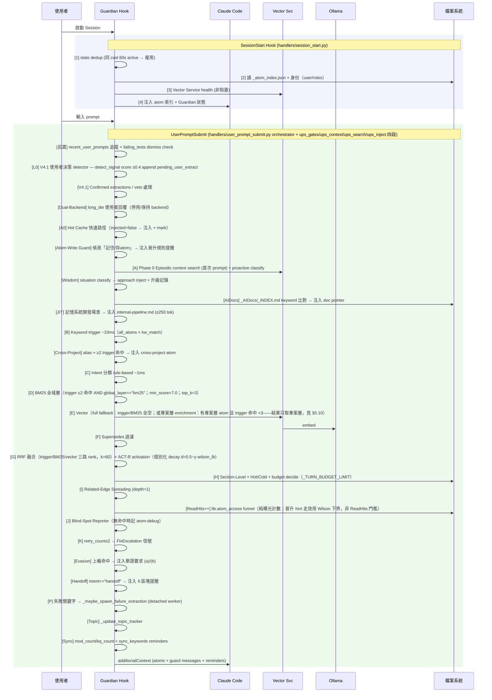
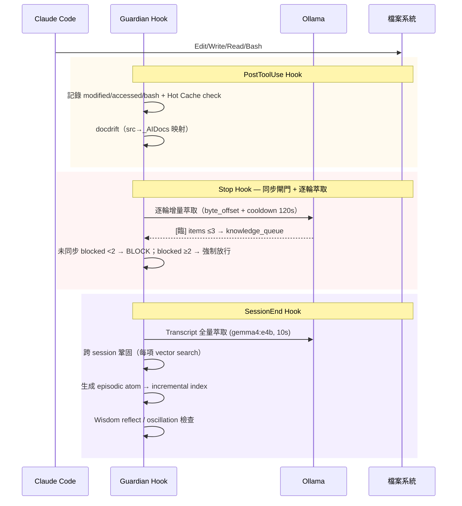
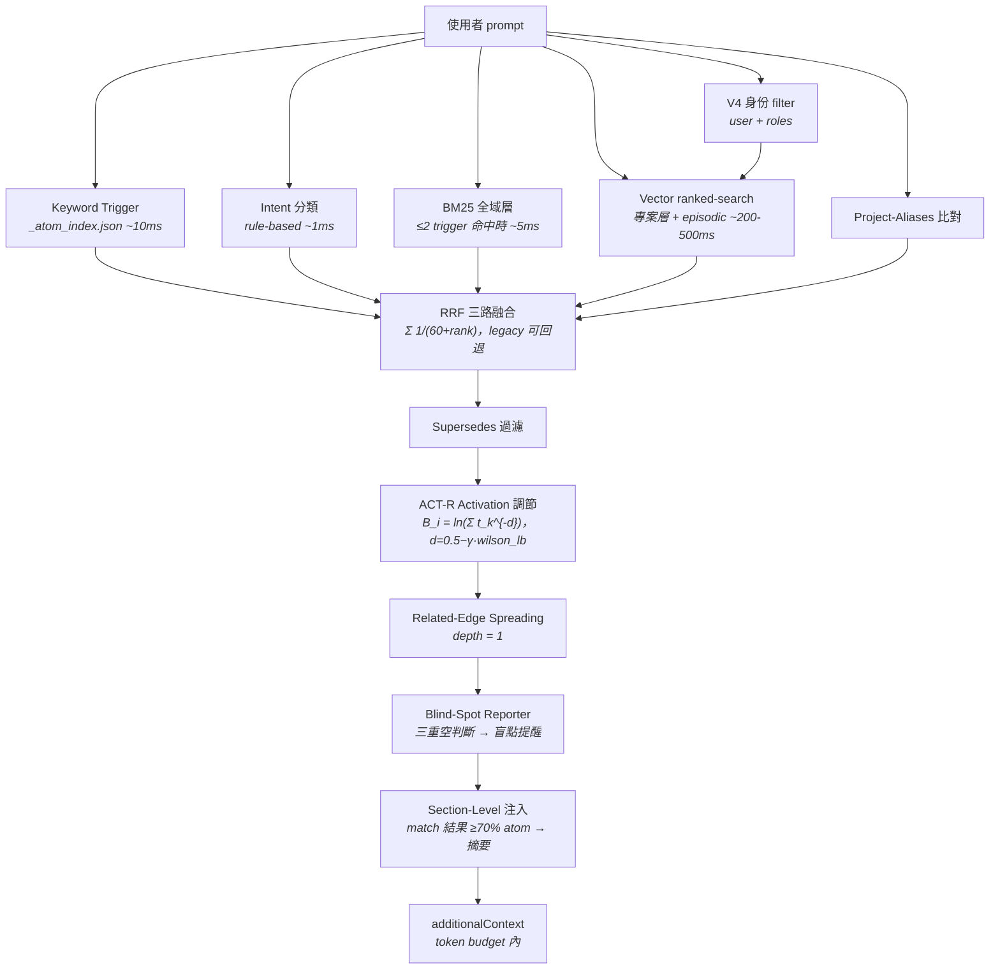
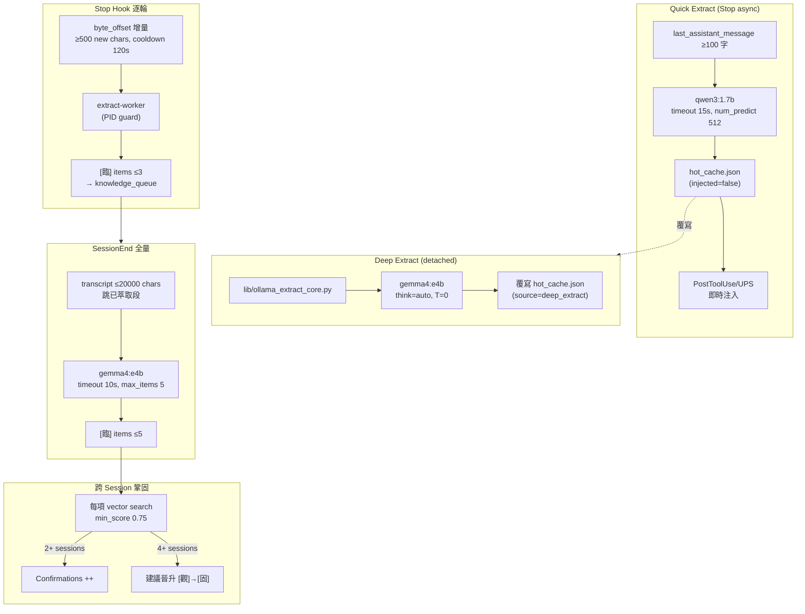

# Atomic Memory V5 — 技術深度文件

> 本文件對應系統**當前代碼實況**（2026-05-28 基準；**post-audit 2026-07-01 逐值校準**：§7 token/延遲、§9 BM25 min_score、§11 三層管線現況、§13 子系統總表皆已對齊審查後實碼。V5 GA + Session α/β feedback-aidocs 遷移 + `lib/atom_locations.py` 抽象）。範例、數字、公式皆從 [hooks/](hooks/)、[tools/](tools/)、[lib/](lib/)、[workflow/config.json](workflow/config.json) 實讀取得。讀者若在代碼中看到與本文件不符的值，以代碼為準並回報修正。
>
> V5 設計規格主檔：[_AIDocs/SPEC_ATOM_V5.md](_AIDocs/SPEC_ATOM_V5.md)（含 V4→V5 delta + 變更紀錄）。本檔重點在「現況代碼與流程」。

深度順序：**淺 → 深**。越進階的機制往後排，依需求檢索即可。

---

## 1. 設計哲學

LLM 的 context window 是**工作記憶**，缺的是**長期記憶**。原子記憶系統補上這塊拼圖：

| # | 原則 | 實際展現 |
|---|------|---------|
| 1 | **精確度 > Token 節省** | 寧多注入確保正確，不因省 token 漏關鍵知識 |
| 2 | **漸進式信任** | 三層分類 `[臨]`→`[觀]`→`[固]`，多次驗證才晉升 |
| 3 | **最小侵入** | 全透過 Claude Code hooks 運作，主程式零修改 |
| 4 | **雙 LLM 分工** | Claude 做決策；Ollama（gemma4:e4b / qwen3:1.7b）做語意處理 |
| 5 | **可審計** | JSONL audit trail 全程記錄，知識不刪除只歸檔 |
| 6 | **對齊原生**（V5 新增） | 採 Anthropic skills / deferred MCP / plugin packaging 原生機制，不重複造輪子 |

---

## 2. 系統架構目錄樹（2026-05-28 V5 GA + Session α/β 現況）

```
~/.claude/
├── CLAUDE.md / IDENTITY.md / USER.md              ← 啟動三件套
├── settings.json                                   ← user-level config + 9 hook events 註冊（SessionStart/UserPromptSubmit/Pre·PostToolUse/Pre·PostCompact/PostToolBatch/Stop/SessionEnd；CC 官方 hook 配置主檔）
├── version.json                                    ← 版本標識（atom_memory 5.1 / guardian 5.1.0）
├── mcp-servers.template.json                       ← MCP server 清單（Install-forAI 用）
├── README.md / TECH.md / Install-forAI.md          ← 使用者文件
├── BOOTSTRAP.md                                    ← 首次啟動引導（IDENTITY/USER 空時觸發）
├── templates/IDENTITY.template.md / USER.template.md ← 實例的 tracked 備份/還原源；IDENTITY.md / USER.md / IDENTITY-{user}.md / USER-{user}.md 為各自實例
│
├── rules/                                          ← 模組化規則
│   └── core.md                                     ← 合併單檔（知識庫+記憶+同步+對話）
│
├── hooks/                                          ← V5 重整：6 主模組 + 2 shim + handlers/
│   ├── workflow-guardian.py                        ← 1 行 shim → dispatcher.main()
│   ├── dispatcher.py                               ← 純路由（~75 行）
│   ├── handlers/                                   ← 10 event handler 各一檔 + UPS 四段子模組
│   │   ├── _shared.py
│   │   ├── session_start.py / session_end.py
│   │   ├── user_prompt_submit.py / pre_compact.py
│   │   ├── ups_gates.py / ups_context.py           ← UPS 拆分（2026-06-12）：detect / context build
│   │   ├── ups_search.py / ups_inject.py           ←   search pipeline / injection assemble 四段
│   │   ├── pre_tool_use.py / post_tool_use.py
│   │   ├── stop.py / notification.py
│   │   ├── post_compact.py / post_tool_batch.py    ← 選配 #4：壓縮後 atom 內文重注入
│   ├── wg_core.py                                  ← 路徑唯一真相 + state IO + log rotation
│   ├── wg_atoms.py                                 ← trigger + BM25 + ACT-R + vector + 晉升
│   ├── wg_extraction.py                            ← per-turn 萃取 + worker + hot cache + user-extract
│   ├── wg_episodic.py                              ← episodic 生成 + 衝突 + 品質回饋
│   ├── wg_evasion.py                               ← Evasion Guard + Test-Fail Gate + 4 套自評整合
│   ├── wg_docdrift.py                              ← src → _AIDocs 映射 drift
│   ├── wg_roles.py                                 ← shim：V4 sub-layer 探勘
│   ├── wg_atom_observation.py                      ← shim：REG-005 觀察採樣（flag-gated）
│   ├── wg_handoff.py                               ← Auto-Handoff 四層自動交接（stub/門檻/token 預警）
│   ├── wg_rescue.py / wg_recall_miss.py            ← 救援日誌（記憶被用上的證據）/ 失念偵測（該想起而未想起）
│   ├── wg_coordination.py                          ← 跨 session 衝突預警（同檔互寫 / git add -A 收尾 / late-collision）
│   ├── wisdom_engine.py                            ← 反思引擎 + Fix Escalation
│   ├── codex_companion.py                          ← V5 P5b 重寫為 subprocess 模型
│   ├── lang_guard.py                               ← P8b 英文回應漂移攔截（standalone Stop hook，仿 codex_companion）
│   ├── version_guard.py                            ← live 檔版本操作脈絡殘留掃描（standalone PostToolUse，warn-only）
│   ├── acceptance_spec.py                          ← 驗收規格工件分級啟動（standalone PostToolUse，→§5.15）
│   ├── extract-worker.py / quick-extract.py〔孤兒·Stop hook 已撤，無 caller〕 / user-extract-worker.py
│   └── ensure-mcp.py / post-git-pull.sh / user-init.sh / webfetch-guard.sh
│
├── lib/
│   ├── ollama_extract_core.py                      ← 共享萃取核心 + SessionBudgetTracker
│   ├── atom_index_json.py                          ← V5 JSON SoT API（load/save/upsert/migrate）
│   ├── atom_io.py                                  ← atom 讀寫統一入口（write funnel）
│   ├── atom_spec.py                                ← atom 合法性規範（slugify / is_atom_file / REQUIRED_METADATA）
│   ├── atom_access.py                              ← .access.json 計數 funnel（ReadHits 純曝光 / Confirmations / 效用 α,β / Wilson 下界，→SPEC §12）
│   └── atom_locations.py                           ← V5+ atom 物理位置 + 路由規則單一來源（FAILURES_DIR / LOCAL_ATOMS_DIR / iter_atom_files_multi / failures_write_target / local_write_target / classify_realm / is_local_realm_path，含 realm 範疇分區）
│
├── tools/                                          ← Python 工具集
│   ├── ollama_client.py                            ← Dual-Backend
│   ├── memory-audit.py / memory-write-gate.py
│   ├── memory-conflict-detector.py                 ← 三時段衝突
│   ├── memory-peek.py / memory-undo.py / memory-session-score.py
│   ├── conflict-review.py / init-roles.py          ← 管理職
│   ├── sync-atom-index.py / sync-memory-index.py   ← V5 P6c 讀 JSON SoT
│   ├── sync_doc_counts.py                          ← 人讀文件 atom 計數 SoT 同步（marker 驅動；sync-memory-index 末尾 piggyback 靜默自動跑）
│   ├── atom-move.py / atom-health-audit.py / atom-health-check.py
│   ├── audit-reconcile.py / cleanup-old-files.py / cleanup-projects-residue.py
│   ├── changelog-roll.py / check-bypass.py / journal-aggregate.py
│   ├── generate-episodic-manual.py / rag-engine.py
│   ├── read-excel.py / sprite_contact_sheet.py
│   ├── auto-continue/                              ← Auto-Handoff Phase 4 watcher（PoC·實驗性）：claude -p /continue 外部編排 + 4 guard
│   ├── codex-companion/                            ← V5：assessor/heuristics/prompts/scorer/state + audit.py(subprocess)
│   ├── gdoc-harvester/                             ← 網頁收割
│   ├── memory-eval/                               ← 檢索回歸評估（223 條合成查詢 + Recall@1/@3/MRR/誤注入 + baseline 比對）
│   ├── memory-vector-service/                     ← HTTP Vector @ :3849（專案層仍用）
│   ├── unity-desktop/
│   └── workflow-guardian-mcp/server.js             ← MCP @ stdio，5 tool（atom_write/move/promote/edit_meta + anti_evasion_report〔收尾檢核 emit→Anti-Evasion HUD〕）；server.js 拆進入點+11 lib，AEC HUD 於 lib/{anti-evasion,aec-hud-html}.js
│
├── skills/                                         ← <!-- skill-count -->23<!-- /skill-count --> 個 skill（19 遷移自 commands/ + skill-creator/heal-review/refile + 外部 karpathy-guidelines）
│   ├── atom-debug / browse-sprites / changelog-debug
│   ├── conflict / consciousness-stream / continue
│   ├── codex-companion / extract / fix-escalation
│   ├── generate-episodic / handoff / harvest
│   ├── journal / memory（合 health/peek/undo/review/session-score 5→1）
│   ├── read-project / upgrade / vector
│   ├── skill-creator（meta-skill：寫/改/審 skill）/ heal-review（管理職裁決自癒佇列）
│   ├── refile（V6 手動歸檔：非 _atoms/ 的 .md → 核心檔護欄 + realm 分類 + 移檔 doc-sync）
│   ├── karpathy-guidelines（外部：LLM coding 行為準則）
│   └── _archived/                                   ← P8a 單人環境降 dormant：init-roles / conflict-review（skill 版；tools/ 版仍在）
│
├── memory/                                         ← 全域記憶層
│   ├── MEMORY.md                                   ← AI 一覽索引（人類可讀）
│   ├── _atom_index.json                            ← V5 JSON SoT（<!-- atom-breakdown -->114 atoms：core 50 + feedback 11 + 失敗模式 2 + local 51〔Tools10/MemDev34/OS4/Continuity2/Vision1〕<!-- /atom-breakdown -->）
│   ├── _ATOM_INDEX.md                              ← deprecated mirror（自動生成）
│   ├── _meta/forbidden-phrases.json                ← V5 禁語單一真相
│   ├── preferences.md / decisions*.md / workflow-*.md / toolchain*.md
│   ├── personal/{user}/                            ← V4 個人層
│   ├── shared/ / role/                             ← V4 分層（/init-roles 後啟用）
│   ├── wisdom/ / episodic/ / _staging/
│   ├── _distant/ / _reference/                     ← 封存與參考
│   ├── _vectordb/                                  ← LanceDB 索引 + audit.log（專案層用）
│   └── _promotion_audit.jsonl                      ← 晉升審計
│                                                   （V5+ Session α 起：feedback-* + cognitive-patterns + memory-pipeline-* 物理在 `_AIDocs/Failures/`，
│                                                    索引仍登記在此 _atom_index.json 單一來源；規則見 `lib/atom_locations.py` 與 SPEC_ATOM_V5 §2.1）
│
├── workflow/                                       ← runtime state（gitignored 多）
│   ├── config.json                                 ← 統一設定（tracked）
│   ├── hot_cache.json                              ← V3 快篩知識
│   ├── _merge_history.log                          ← atom merge 紀錄
│   ├── last_review_marker.json                     ← memory-review 標記
│   ├── extract-worker.log
│   ├── mcp-version-cache.json
│   ├── state-{session-id}.json                    ← session ephemeral
│
├── _AIDocs/                                        ← 長期知識庫（人類可讀）
│   ├── _INDEX.md / _CHANGELOG.md / _CHANGELOG_ARCHIVE.md / Architecture.md
│   ├── SPEC_ATOM_V5.md（V5 GA 規格主檔，§2.1 feedback-* 路由 + §2.2 Realm 範疇分區）/ SPEC_ATOM_V4.md（對照證物）
│   ├── ClaudeCodeInternals/                       ← CC 原生架構研究筆記
│   ├── Tools/                                     ← 工具與領域知識
│   ├── Failures/                                  ← 失敗模式 + feedback-* atoms 物理位置（V5+ Session α 起，仍屬 core realm）
│   ├── _atoms/<domain 多段階層>/                  ← V5+ local realm atom（World/Tools/MemDev/OS/Else，如 OS/Windows/WSL；V6 各層按需 _INDEX.md；scope 仍 global、只在 ~/.claude 注入（CROSS_PROJECT_LOCAL_DOMAINS 如 Continuity 例外、跨專案）、SessionEnd sweep 自動歸檔，§2.2）
│   ├── DevHistory/                                ← 版本演進 + V5 升版完整紀錄（v5-overhaul-2026-05/）
│   ├── DocIndex-System.md / known-regressions.md / Project_File_Tree.md
│
├── hooks/verify/ tools/verify/ lib/verify/         ← 93 個 verify_*.py（H-test-prune 後 verify 化）
│   tools/codex-companion/verify/ auto-continue/verify/ ← 跑 `python run_verify.py`（1349 passed）
├── skills/{name}/verify/                           ← 17 個空結構（候選見 _staging/next-phase-skills-verify.md）
│
└── {project_root}/.claude/                         ← 專案自治層（每專案獨立）
    ├── memory/MEMORY.md / atoms / failures / episodic / _staging
    └── hooks/project_hooks.py                      ← delegate
```

**背景服務**：
- **Vector Service** `http://127.0.0.1:3849`（LanceDB + Ollama embedding）— **僅專案層 + episodic search 用**；全域層 V5 已改 BM25 in-memory
- **Codex Companion** — V5 P5b 從 daemon @ 3850 改 subprocess（port 3850 無人聽）
- **MCP Server** `tools/workflow-guardian-mcp/server.js`（stdio）— 暴露 5 tool（atom_write / atom_move / atom_promote / atom_edit_meta + anti_evasion_report）
- **Ollama** Dual-Backend（rdchat-direct / local，依 `config.json`）

---

## 3. V4 三層 Scope（V5 沿用）

V4 把知識空間從單層拓展為四層，V5 完全沿用：

| 層 | 可見性 | 用途 | 物理目錄 |
|----|--------|------|---------|
| `global` | 跨專案、跨人 | 使用者個人偏好、通用工具決策 | `~/.claude/memory/*.md` |
| `shared` | 同專案全員 | 專案共識、架構決策、踩坑記錄 | `{project}/.claude/memory/shared/` |
| `role:{name}` | 同職務者 | 職務專有規範（programmer / art / planner 預設） | `{project}/.claude/memory/role/{name}/` |
| `personal:{user}` | 只自己 | 個人 scratch、未公開的假設 | `{project}/.claude/memory/personal/{user}/` |

詳細 schema / 衝突偵測 / JIT 注入規則：見 [SPEC_ATOM_V4.md §2–§10](_AIDocs/SPEC_ATOM_V4.md)。

### 雙向認證（管理職）

防止使用者自封管理職：
1. **personal 自我宣告**：`memory/personal/{user}/role.md`
2. **shared 白名單**：`memory/shared/_roles.md` 由管理職維護
3. [hooks/wg_roles.py](hooks/wg_roles.py) 的 `is_management()` 檢查兩者**都**認可才通過

### 三時段衝突偵測

| 時段 | 觸發 | 工具 |
|------|------|------|
| Write-time | atom_write MCP 呼叫 | [tools/memory-conflict-detector.py](tools/memory-conflict-detector.py)（write-check mode）：向量 ≥0.60 送 LLM → CONTRADICT 進 pending |
| Pull-time | git pull 後 | `hooks/post-git-pull.sh --mode=pull-audit`：變動 atom → classify → 衝突標記 |
| Startup-drift | SessionStart | dispatcher 的 `_ensure_state` self-heal：merged state 孤兒復活避免 pending 寫入死水 |

### 敏感原子 auto-pending

`Audience: architecture` / `decision` 的原子寫入 `shared/` 時**不直接生效**，進 `shared/_pending_review/` 等管理職裁決（approve / reject）。`/conflict-review` skill 為裁決入口。

---

## 4. V4.1 使用者決策萃取 Pipeline（V5 沿用）

```
使用者 prompt
      │
      ▼
[L0] 規則 detector — hooks/wg_extraction.py 整併 (≤5ms)
     信號詞 + 句法 pattern，score ≥0.4 → append pending_user_extract[]
      │
  （Stop hook 觸發）
      │
      ▼
[L1] 二元過濾 — qwen3:1.7b  (think=false, T=0, num_predict=30)
     yes/no，排除混合句與情緒承諾
      │
      ▼
[L2] 結構化萃取 — gemma4:e4b  (think=auto, num_predict=200)
     輸出 {conf, scope, trigger, statement}
      │
      ▼
[Hybrid Threshold Router]
     conf ≥ 0.92  → atom 直寫
     0.70 ≤ conf < 0.92 → personal/auto/{user}/_pending.candidates.md
     conf < 0.70 → 丟棄（audit 記錄）
```

### SessionBudgetTracker（240 tok/session）

來源 [lib/ollama_extract_core.py](lib/ollama_extract_core.py)、[workflow/config.json](workflow/config.json) `userExtraction.tokenBudget=240`：

- `_estimate_tokens()` CJK-aware（中文 ~1.5 tok/char、ASCII ~0.25 tok/word）
- **>220 tok** → 切 L1-only，不再跑 L2 deep extract
- **>240 tok** → break，本 session 不再萃取
- 只計 **user-delta** token（靜態 few-shot 不計）

---

## 5. V5 新增子系統

### 5.1 Atom Index — JSON SoT（V5 P3b）

`memory/_atom_index.json` 為唯一機器源（<!-- atom-total -->114<!-- /atom-total --> atoms）。`_ATOM_INDEX.md` 改為自動生成的人類可讀 mirror，僅 fallback parser 使用。

**Atom 物理多根 + Realm 範疇（V5+）**：`global` atom 物理散三根——`memory/`（core 一般）、`_AIDocs/Failures/`（feedback-* + 失敗模式，仍 core）、`_AIDocs/_atoms/<domain>/`（**local realm**，World/Tools/MemDev）。realm 由 index `path` 前綴推導（不存欄位、與 scope 正交，local 仍 `scope=global`）；`memory/` 與 Failures 全專案注入，local **只在 cwd∈~/.claude 注入**（注入閘門 `handlers/session_start.py` + `wg_core._is_under_claude_dir`）。分類器 `classify_realm`（安全預設 core + 核心保護清單硬擋）+ 搬遷工具 `tools/atom-set-realm.py`（`_atoms/` path 唯一寫者、連 sidecar 原子搬）。**V6（2026-06-04）**：domain 升級為**關聯式分級階層多段路徑**（`_atoms/<L1>/…/`，`normalize_domain_path` canon + 增量深度閘 depth=volume、MAX_DEPTH=7）；詞庫 miss 的 unknown-core 於 SessionEnd sweep 喚**本地 LLM**（`tools/realm_llm_classify.py`）判 realm+domain（四態 Fail-safe：error→defer／core→留／local→搬／unsure→`Else`），validated 詞回寫 `_meta/realm-lexicon-learned.json` 自學（下次 deterministic 免 LLM；2026-06-12 起 sink 端雙護欄：泛用詞拒收 + 非 CJK/ASCII 亂碼 domain 拒收/降 Else，見 SPEC §2）；catalog 階層化（`_local_catalog.md` 只 Lv1 根+drill、每層 `_INDEX.md` 按需）。詳見 [SPEC §2.1/§2.2](_AIDocs/SPEC_ATOM_V5.md) + atom `realm-範疇分區機制-v5`。

```json
{
  "version": "1.0",
  "atoms": [
    { "name": "...", "path": "...", "triggers": [...], "scope": "global" }
  ]
}
```

API：[lib/atom_index_json.py](lib/atom_index_json.py)（`load/save/upsert/delete/regenerate_md/migrate/validate`）。
寫入 funnel：`upsert_atom` 後同步 `regenerate_atom_index_md`。
讀取點：[hooks/wg_atoms.py](hooks/wg_atoms.py) `parse_memory_index` 優先讀 JSON。

### 5.2 BM25 全域檢索層（V5 P5a）

全域 ~<!-- atom-total -->114<!-- /atom-total --> atoms 規模用 Vector Service 是殺雞用牛刀。V5 引入 in-memory BM25（~80 行手刻於 `wg_atoms.py`）：

- ASCII word + 中文 char-bigram tokenization
- 參數：k1=1.2, b=0.75
- 注入流程：trigger match → BM25（≤2 trigger 命中時觸發；min_score=7.0，回歸集調參——負例誤注入 21.4%→0%；top_k=3）→ Vector（全空 fallback / 專案層 enrichment）→ **RRF 三路融合**（§5.11）

`config.json`：`vector_search.global_layer: "bm25"` + `bm25_min_score: 7.0` + `fusion: "rrf"`

**Vector Service 保留**：專案層（atom 可上百）、episodic search、cross-session dedup / 衝突偵測。

### 5.3 Codex Companion — Daemon → Subprocess（V5 P5b）

V4 用 HTTP daemon @ port 3850 管 per-session assessment。V5 改 in-process state + spawn `tools/codex-companion/audit.py` 短命子程序：

| 項目 | V4 (daemon) | V5 (subprocess) |
|------|-------------|-----------------|
| port 3850 | 監聽中 | 無人聽 |
| `companion.pid` | service.py 維護 | 不存在 |
| Assessment 延遲 | ~1ms HTTP roundtrip | ~10–50ms subprocess spawn |
| 失敗模式 | daemon crash 影響全 session | 單 turn 失敗只影響該 turn |

state schema 不變、Silent Advisory / Score Gate / Dedup / Max Audits Cap 邏輯不變。

**第四類審計 `handoff_review`（2026-06-24）**：`_detect_checkpoint` 偵測 `_staging/next-phase*.md` / handoff 檔 Write/Edit → 把 `skills/handoff` Step 3.5 的 8 問當對抗 checklist 餵 codex 對交接文件做獨立第二意見複審（把作者「自評」升級為「他評」）；`handle_user_prompt_submit` 對其**降注入門檻至 medium**（不被預設 `max_inject_severity=high` 靜默吞）。`soft_gate.handoff_review`（預設開）可控；不取代 Step 3.5 自審（codex 可能離線），為後盾。`tools/codex-companion/prompts.py` 加 `HANDOFF_REVIEW` 模板、`verify/verify_handoff_review.py` 12 測。

**第五類審計 `acceptance_review`（2026-08-06）**：驗收裁判——codex 拿任務專屬案卷審 Claude 的完成宣稱，屬「AI 審查 AI 產出」四段閉環的裁判段，全貌見 §5.15。

### 5.4 Commands → Skills 遷移（V5 P1）

Anthropic 官方明文「Custom commands have been merged into skills」。V5 把 22 個 `commands/*.md` 全刪，改用 `skills/{name}/SKILL.md` 結構（遷移後 19 個；後續另新增 skill-creator/heal-review/refile；另含 1 外部 skill karpathy-guidelines，V5 期間全域共 23 個 → **post-audit 2026-07-01 active 21**：init-roles / conflict-review 於 P8a 單人環境降 dormant，archive 至 `skills/_archived/`）：

- **直接遷移**（13）：atom-debug, browse-sprites, conflict, conflict-review, consciousness-stream, extract, fix-escalation, generate-episodic, harvest, journal, read-project, upgrade, vector
- **全域保留**（4）：codex-companion, continue, handoff, init-roles（init-roles 於 P8a archived）
- **合 1 個 /memory**（5→1）：memory-{health,peek,undo,review,session-score} 統一用 `$0` 取 subcmd
- **改名為 debug 工具**（1）：changelog-roll → changelog-debug
- **後續新增（非遷移）**（3）：skill-creator（meta-skill，寫/改/審 skill，2026-05-29 經 MR !3 合入）、heal-review（管理職裁決記憶自癒失敗佇列）、refile（V6 手動歸檔 + 核心檔護欄，2026-06-04）
- **刪除**（與內建衝突）：resume / init-project / svn-update / unity-yaml

Skill frontmatter 含 `description` / `when_to_use` / `disable-model-invocation` / `user-invocable` / `allowed-tools` / `context` / `paths` 等欄位。

### 5.5 MCP server.js 砍 4 內部 tool（V5 P2）

V4 7 tool → V5 3 tool。砍掉 4 個內部 IPC（`workflow_signal` / `workflow_status` / `memory_queue_add` / `memory_queue_flush`），改由 Stop gate 自動偵測（hook 內化）。

保留：`atom_write` / `atom_move` / `atom_promote`（多步驗證 + 去重 + 索引，合理走 MCP）。

**現況 5 tool**：後續增 `atom_edit_meta`（2026-06-02，元資料外科編輯）與 `anti_evasion_report`（收尾檢核結構化提交，emit → Anti-Evasion HUD；IDENTITY 反退避契約的程式化出口，Stop ScanReport Gate 強制）。

> `atom_write` 的 `knowledge` 陣列為 block-aware：單一元素以豎線（markdown 表格）或三反引號（程式碼 fence）開頭者整段原樣輸出（不加 bullet、前後補空行）。完整規則與 py↔js byte-parity 為單一來源，見 [SPEC_ATOM_V5 §11](_AIDocs/SPEC_ATOM_V5.md)。

### 5.6 禁語清單 JSON 化（V5 P4b）

`memory/_meta/forbidden-phrases.json` 為 single source。`IDENTITY.md` 與 `hooks/wg_evasion.py` 都讀此 JSON，杜絕 V4 期間 drift 風險。

四類禁語：範圍推諉 / 時間性延後 / 前已存在搪塞 / 能力推諉。

### 5.7 Hook 模組整併（V5 P2）

V4.1 的 16 個 `wg_*.py` + 2651 行 dispatcher → V5：

- **主模組（6）**：wg_core / wg_atoms / wg_extraction / wg_episodic / wg_evasion / wg_docdrift
- **Shim（2）**：wg_roles / wg_atom_observation
- **獨立保留**：wisdom_engine / codex_companion / extract-worker / quick-extract〔孤兒·Stop hook 已撤〕 / user-extract-worker / wg_handoff（2026-06-09 新增，Auto-Handoff 跨 session 交接，被 pre_compact/post_tool_batch/stop/session_end 共用）／ lang_guard（P8b，standalone Stop hook）
- **Dispatcher**：`dispatcher.py`（~75 行純路由）+ `handlers/` 10 個 event handler 各一檔（含選配 #4 的 post_compact / post_tool_batch）
- **`workflow-guardian.py`**：1 行 shim 轉發到 `dispatcher.main()`

四套自評（原 wg_evasion / wg_session_evaluator / wg_iteration / codex_companion soft_gate）整合進 `wg_evasion`。

### 5.8 Log Rotation（V5 P0）

`workflow/guardian-crash.log` 曾爆 114 GB。V5 在 `wg_core.py` 加 rotation：log 達 `LOG_ROTATE_THRESHOLD_BYTES`（預設 100 MB）自動輪轉為 `.1` / `.2` / `.3`，最多保 3 份；同類機制套用於 `extract-worker.log`。

### 5.9 常駐可觀測層（statusLine + 週健檢）

把「給使用者看的資訊」從 chat 注入（每次佔 token）移到常駐可見面（零 token）：

- **statusline**（`tools/statusline.py`，settings.json `statusLine` 指入）：stdin 吃 CC status JSON，純 stdlib 讀三個本地檔——`workflow/state-<sid>.json`（改檔/讀檔/知識佇列數；accessed_files 由 Stop 端每 turn 回收）、`vector_ready.flag`、`aec-report/<sid>-t*.json` 最大 turn severity——輸出一行 ANSI 狀態列（模型名 · ctx% · 改N 讀M · vec✓ · AEC:sev）。事件驅動（每則訊息，300ms debounce）+ `refreshInterval: 10`。fail-open 必告知：state 壞 → 紅字 `WG:?`，最外層兜底任何錯誤仍印一行。伴隨退役：UPS 週期性 `[Guardian] Reminder` 注入（config 鍵 `remind_after_turns`/`max_reminders` 一併移除）；Stop `[Guardian:SyncReminder]` 閘保留 enforcement 但訊息瘦身（不再列檔案清單）。
- **週健檢**（`tools/health-weekly.py`，Task Scheduler `Claude-Memory-WeeklyHealth` 週一 09:00 + StartWhenAvailable）：唯讀聚合 memory-audit / atom-health-check / sync-atom-index --check / skill-index --check / vector / 管線鮮度（近 14 天有 session 但 promotion audit 或 episodic 無新增 → 紅＝管線靜默停擺）→ 報告落 `workflow/health-reports/`（輪替 12 份）+ `health-last-run.json`。SessionStart `_health_advisory` 死人開關：last-run 缺檔/逾 10 天/red>0 → advisory；健康時零輸出。腳本入口防護 pythonw 下 `sys.stdout=None`（否則排程執行秒死，見 atom [[pythonw-下-stdout-為-none-排程腳本秒死陷阱]]）。
- **不採 OTEL**：官方 export 無 per-hook 延遲、api_request 無法歸因注入 token 稅到個別來源，且需常駐 collector——評估結論不實作（atom [[otel-遙測評估結論-不實作-兩目標指標皆測不到]]）。

### 5.10 召回可靠性 + 效果實證（E 組）

回答兩個長期盲點：「vector 服務到底在不在」與「注入的記憶到底有沒有用」。

- **Vector 啟動器自癒**（`tools/memory-vector-service/starter.py`，SessionStart 與 UPS 共用入口）：診斷實證就緒空窗主因非冷啟動時序，而是**服務起不來的整段故障窗**（曾連續 4 小時、多次 SessionStart 啟動全失敗，stderr 進 DEVNULL 零證據）。對症三刀：① service stdout/stderr 落 `Logs/vector-service.log`（>5MB 輪替 .old；embedder 載入計時可視化）；② hang 死自癒——health timeout + port 被占 → kill `service.pid` 舊程序重啟；等待窗 15s→120s（Ollama 不在時 bge-m3 fallback 冷載遠超 15s），spawn lock 防多 session 重複載 embedder；③ **UPS re-kick**——`wg_atoms._ensure_vector_ready`：flag 缺失時 fire-and-forget spawn starter（cooldown 120s marker）+ ≤300ms 短等（「服務活著只是 flag 遺失」類毫秒級恢復），服務中途死改為下一 prompt 自癒而非等下次 SessionStart。E2E 實測 kill 服務後 4s 復活。
- **救援日誌**（`hooks/wg_rescue.py` → `Logs/rescue-log.jsonl`）：注入 atom 時從實注入內容**確定性**抽高特異 token（路徑 / inline-code / ALL_CAPS / snake_case ≥8；泛詞黑名單＋子字串抑制，寧缺勿濫），本 session 後續工具呼叫 tool_input 命中 → 落 {atom, token, evidence, turn_seq}。純字串比對零模型判斷。精度守則：跨 atom 同 token 歸因模糊即整個剔除、Agent/Task prompt 欄不掃（`[WG:SubagentMemory]` 自動注入會自我命中）、寫 memory/_atoms .md 不掃、每 (atom,token) 每 session 一次。
- **效果報表**（`tools/memory-effect-report.py`，唯讀）：彙總 access.json（曝光 timestamps + α/β Wilson 下界）+ rescue-log → 三清單：top 有用 / 高曝光零使用（token 稅，附 trigger 收斂建議）/ 零曝光死重候選，+ 30 天週趨勢。接入 `/memory health` step 4 與週健檢 5b（token 稅 → 黃；30 天零效用證據 → 黃＝效用閉環停擺嫌疑）。
- **專案層 enrichment 放行**（`ups_search.collect_matched_atoms`）：舊行為 trigger/BM25 命中 >0 即整個跳過 vector → 專案層語意近似永不浮出（註解寫了 enrichment 但未實作）。放行為：命中 >0 時，**存在專案層 atom 且 trigger 命中 <3**（keyword 訊號不足）才跑 vector、結果只取專案層命中（全域層仍歸 trigger/BM25）；無專案層或 trigger 訊號已充足照舊跳過（省 200-500ms round-trip）。預算不變式由 assemble 端 `decide_atom_injection` TURN_BUDGET 硬頂結構性保證。
- **原生記憶橋接**（`tools/native-memory-bridge.py`，獨立腳本執行）：核心 atom 索引以指標行鏡像進 CC 原生 memory（`projects/<slug>/memory/atom-index-bridge.md` + MEMORY.md 一行指標，冪等重寫，標明機器生成勿手編）。硬約束：輸出僅 harness 清單格式——絕不放 `_atom_index.json` / `| Atom` 表頭，橋接目錄不得被 atom 掃描誤納（`verify_native_bridge.py` 對 `discover_all_project_memory_dirs` 做組合驗證）。
- **裁決記錄（本批明確不做）**：trigger 同義詞擴充（與 trigger 收斂工程對沖，模糊召回歸 BM25 層）；重複勞動偵測（誤判率高，訊號由 rescue 缺席＋效果報表間接取得）；兩級注入重構（等效果報表數據證明「指標行被跟進」再議）。

### 5.11 檢索品質工程（RRF 融合 + 個別化 decay + 回歸評估）

全域檢索從「序列 fallback + 純 ACT-R 排序」升級為**真融合 + 數據調參**：

- **RRF 三路融合**（`wg_atoms.rrf_fuse` + `ups_search`）：trigger（命中數降冪）/ BM25（分數降冪）/ vector 三路各出 rank，`score = Σ 1/(k+rank)`（k=60），再乘 activation 調節 `final = rrf × exp(0.25·activation_rank)`——相關性為主、記憶強度為輔。各路入場過濾（min_score）不變。config `vector_search.fusion: "rrf"`（預設）｜`"legacy"` 回退純 ACT-R rank 排序。
- **ACT-R 個別化 decay**（FSRS stability 思想）：`d = clamp(0.5 − γ·wilson_lb, 0.3, 0.5)`，γ=`usefulness.stability_gamma`（0.3）——實證有用的 atom 衰減慢、低效用者維持 d=0.5。無 access log 的新 atom activation 回**中性 0.0**（舊 −10.0 使新 atom 永遠墊底、截斷先死）。
- **回歸評估集**（`tools/memory-eval/`）：每 atom 以本地 LLM 離線生成「應命中 prompt」＋負例，共 **223 條**（`queries.jsonl`）；`run.py` 量測 Recall@1/@3、MRR、誤注入率並與 `baseline.json` 比對——調參從盲調變秒級 A/B。實測落地成績：**Recall@1 34→53.6%、MRR 0.584→0.709**（誤注入不變）；`bm25_min_score` 3.5→7.0 由此集調出（負例誤注入 21.4%→0%、R@3 僅 -1.5pt）。
- **效用統計校準**：`wilson_z` 1.96→1.28（舊值下 3 連勝 lb 僅 0.516 過不了 0.6 升門、`min_n=3` 形同虛設；新值 3 連勝 lb=0.6468 可升）；demote 增 `demote_min_n=5`（防小樣本誤降真實高效 atom）；decay λ=0.97 加**每日護欄**（`last_decay_date`，per-atom 每日至多衰減一次——舊行為每 SessionEnd 執行，多 session 日衰 ~0.74、α/β 追不上）。
- **UPS 熱點**：`_kw_match` regex thrash 修復等效率 6 項後，UPS 主路徑 90.1→16.0ms（-82%）。

### 5.12 記憶完備性（失念偵測 + 壞滅緣 + 證據等級）

補齊三個監控/schema 缺口（唯識對照見 [_AIDocs/context-memory-governance.md](_AIDocs/context-memory-governance.md)）：

- **失念偵測（recall-miss，`hooks/wg_recall_miss.py`）**：既有監控抓「不該注入而注入」（token 稅），本模組抓對偶面——本 session 有失敗證據（failing_tests / evasion / failure_kw）、庫中其實有 atom 可防（trigger 命中 ≥2 個非泛用詞）卻未被注入。SessionEnd 純字串比對（<1s、零 LLM），落 `Logs/recall-miss.jsonl`；浮出走效果報表 D 節 + 週健檢黃燈（14 天 ≥3 次）。
- **壞滅緣（atom optional `- Depends:`）**：atom 標「依何條件而為真」——`path:<路徑>` 型機器可驗存在性、自由文字型僅展示。`atom-health-check` `check_stale_deps` 驗 path 型指向消失 → 主動標 stale（decay 是時間函數，這是真值函數）。
- **證據等級（atom optional `- Evidence: 實證|引述|推測`）**：衝突裁決（`memory-conflict-detector`）優先序改為**證據等級（實證3>引述2>推測1>未標0）→ recency**，取代純「新勝舊」；**fast-refute 快速否證通道**：CONTRADICT 且新側 Evidence=實證、舊側 [固]/[觀] → 置頂高優先裁決，不等 Wilson 統計窗。兩欄皆 optional，既有 atom 缺欄靜默通過（向後相容鐵則）。

### 5.13 跨 Session 衝突預警（`hooks/wg_coordination.py`）

多 session 共用同一工作樹（含跨專案）互踩的 advisory 層。背景：CC 原生無跨 session 溝通管道（SendMessage 限本 session subagent／同 agent team；Agent Teams 實驗性限單 team）；官方策略只有 worktree 隔離。本機制以 Guardian 既有 state 檔為資料源補上「衝突可見性」——**純檔案方案，不依賴 3848 daemon**（PreToolUse 熱路徑不打 HTTP；daemon CORS wildcard 未解前不加 mutation API）。

- **同檔互寫預警**（PreToolUse Write/Edit/NotebookEdit）：目標檔出現在其他活 session state（phase=working/syncing、mtime<30min、無 merged_into）的 `modified_files` → warn-only。歸屬以 **entry 級 `session_id`** 判定（merged 工作樹 state 含多 session entry，只看 state owner 會誤報自己）。輸出＝裸 `hookSpecificOutput.additionalContext`（模型可見；probe 實測 2.1.220：**隨工具結果進下一輪、非寫前攔截**——寫前生效僅 deny/ask）+ 頂層 `systemMessage`（使用者可見）；**禁帶 `permissionDecision:"allow"`**（會自動核准繞過權限系統）。deny gate 優先，warn 只留 stderr。同檔 10min 抑制（`coord-warn-cache-<sid>.json`，發警時才記錄——deny 回合不記，修正後合法重試照警；寫入時修剪 >24h entry）。
- **Bash git 收尾預警**：`git add -A|--all|.`／`reset --hard`／`checkout -- .`／`clean -f`（dry-run／`clean -n` 排除；引號**解包**比對——`git add "-A"` 抓得到、`echo "git add -A"` 不誤報；`#` 只在空白後算註解；`command`/`(` 前綴剝除）且**同 cwd** 有其他活 session 留有改動紀錄 → 警告 + 選擇性 staging 提示（state 不追 VCS 狀態，措辭為查證提示非斷言未提交）。對應 pain atom `併發-session-共用工作樹-收尾選擇性-staging-勿-git-add-a` 的實證事故。
- **Late-collision 補償**（PostToolUse）：兩 session 60s 內先後寫同檔（寫前互看不見的 first-write race 盲區）→ **write_state 落盤後**再掃、寫後告警（log 恆記、advisory 受同檔抑制窗防洗版）。
- **失效邊界（如實聲明）**：first-write race 無法消除（advisory 非鎖）；擋不住不走 hook 的寫入（外部編輯器等）；oversize state（>512KB）跳過（`skip_oversize` log 可稽核）；掃描上限 20 檔、溢出落 `scan_overflow` log（截斷盲區不靜默）。
- **可觀測性**：per-session NDJSON `Logs/session-coordination/<sid>.jsonl`（分檔迴避跨行程共檔競寫；記完整 session id；ev=conflict_warn/late_collision/bash_finalize_warn/conflict_suppressed/scan_clear 採樣/skip_oversize/scan_overflow/fail_open + ms 延遲）。GC：warn-cache 7d、log 30d（`handlers/_shared.py`）。實測單次掃描 ~5.5ms。
- **config `coordination.*`**：`enabled` 一鍵關／`warn_suppress_min`(10)／`scan_mtime_window_s`(1800)／`max_scan_files`(20)。**日落條款**：log 連續 4 週 conflict_warn 零命中 → 主動提降級評估。
- **設計裁決（多大師計畫 2026-07-31，七席共議 + 雙稽核 + 紅隊）**：協調資料**絕不寫入 `state-*.json`**（Node `writeState` 無鎖吞錯 + Python/Node 三條 GC 互不相認 → last-writer-wins 必失資料）；Stage 2 session 收件匣（MCP chip → PostToolUse one-writer 蓋章真實 sender → 一訊息一檔 sidecar）與 Phase 3 檔案認領制 **defer 待數據**。全紀錄 → [_AIDocs/DevHistory/session-coordination-bus.md](_AIDocs/DevHistory/session-coordination-bus.md)；verify → [hooks/verify/verify_session_coordination.py](hooks/verify/verify_session_coordination.py)（22 測項）。

### 5.14 PAN 實作前預告閘門（Hermes 技轉，2026-08-05）

IDENTITY「自主行為契約 §2 動手前預告」的程式化保險絲——行為責任（未預告不動手）仍在契約，閘門只補程式化檢核。實作於 [hooks/handlers/pre_tool_use.py](hooks/handlers/pre_tool_use.py)（`_check_pre_action_notice` / `pan_validate_notice` / `pan_is_gated`，可見文字源 `wg_evasion.get_current_turn_visible_text`）。

- **檢核對象**：每使用者回合**首次**「會動手」工具（Write / Edit / NotebookEdit / 非唯讀 Bash / 非唯讀 PowerShell）呼叫前，本 turn transcript 可見文字須含「執行目標」+「預估/概估」+ 實質內容。Bash 與 PowerShell 共用白名單前綴分類器 `pan_is_readonly_bash`（config `bash_readonly_prefixes`：git 唯讀子命令 / ls / rg / pytest / get-* 等唯讀 cmdlet；heredoc、redirect 非 null device、複合段未命中、變數賦值段一律視為動手）。驗證器純函式：剝標點 / 佔位符 `<…>` span / code fence，防「時間冒充目標」。
- **mode 三態**：`observe`（只落 log）/ `warn`（systemMessage 提醒）/ `deny`（攔 + 補救模板，`max_denies_per_turn`=2 超過 force_release；`lenient_first_miss=true` 首 miss 降 warn）。**終局裁決（2026-08-06）：mode 永久 `warn`，deny 已否決**——warn 期滿判讀四門檻中 1/2/3 過、門檻 4 漏偵率 14.3%〜33.3% 遠超 ≤5%：VSCode 環境「文字+工具」訊息的 text block **落盤延遲結構性存在**（合格預告落盤後 4 秒的 gated 呼叫仍讀到 `text_blocks:0`），另有 subagent／非本 cwd session 整段 transcript 不存在的第二類破口——deny 模式在此兩類下不是零防護就是全誤攔。逐筆證據見 [_AIDocs/DevHistory/pan-deny-judgement-2026-08-06.md](_AIDocs/DevHistory/pan-deny-judgement-2026-08-06.md)。
- **通過與豁免**：通過寫 `workflow/pan-pass/{sid}-t{turn}.flag`（armed 快路徑，回合內後續呼叫全放、marker 抗併發）；compaction continuation 回合整回合豁免；`exempt_path_substrings`（plans / _staging / scratchpad / workflow）；sidechain / resume 保底 state 無 `turn_seq` 即 fail-open（同 (sid,turn) 節流 3 筆）；MCP 工具不在 settings.json matcher 天然不管。
- **可觀測性**：全數落 `Logs/guard-pre-action-notice.jsonl`（pass / warn / deny / force_release / fail_open_no_transcript，pass 附 `text_blocks` 佐證欄）。config `guard.pre_action_notice` 一鍵關 + 4 週日落條款（force_release 率 >20% 或預告敷衍化 → 降級重評）。
- **Hermes 三部件不移植**：兩階段狀態機（CC deny→重試迴圈原生等價）、歷史清除（transcript 由 harness 管理）、scaffolding 隔離（tool pairing + code fence 剝除已涵蓋）——重複造只會加狀態面積。後續替代資料源候選（payload `prompt_id` 對齊 / PostToolUse 側錄）待使用者裁決，見 atom `pan-hermes不移植部件與vscode-text-block不落盤實測`。

### 5.15 驗收裁判 — AI 審查 AI 產出（acceptance 四段閉環，2026-08-06 全段上線）

「AI 驗證 AI」的落地形：**先給裁判案卷（任務專屬驗收標準）再談能力**——通用直覺審必然低精度。四段閉環全部上線（enforce=true）：

| 段 | 切入點 | 機制 |
|----|--------|------|
| ① 規格工件 | [hooks/acceptance_spec.py](hooks/acceptance_spec.py)（standalone PostToolUse） | **分級啟動護輕量極簡**：ExitPlanMode（plan 獲同意）→ 注入指示從 plan 落 `<專案根>/.claude/verify/acceptance-<slug>.md`（frontmatter 綁定 + 必須發生/禁止發生/驗證指令三段）；無 plan 但同 session 修改 ≥3 檔（`min_files_trigger`，記憶/暫存路徑不計）→ 一次性建議。小任務零打擾、advisory-only；sidecar `workflow/acceptance-spec/<sid>.json` 抑制重複提醒 |
| ② 影子裁判 | [tools/codex-companion/acceptance.py](tools/codex-companion/acceptance.py)（codex 第五類審計） | Stop 完成宣稱或規格檔 status→done 觸發：解析任務↔規格綁定（**四分流**：本 session 唯一 open 規格＝bound 才審；ambiguous / other_session / none 記 uncertain 不發、不猜最新一份）→ 組案卷（需求原話 + 驗收清單 + diff 頭尾採樣附 in-band 截斷標記 + 測試輸出）發 codex 回 verdict（pass/fail/uncertain）。`assessor.map_acceptance_verdict` 程式化紅線：unbound→uncertain、fail 無證據→uncertain、裁判逾時→uncertain 揭露（INV-CASE-BINDING-OR-UNCERTAIN）。判定落 `workflow/acceptance-audit.jsonl` |
| ③ enforce Stop 閘 | codex_companion standalone Stop hook | config `codex_companion.acceptance_review.enforce=true`：Stop 同步審，**fail 且 severity≥high 才 block** 收尾（附逐條證據）；沿用 `stop_gate_max_blocks=2`，第 3 次強制放行＋誠實揭露；裁判逾時→uncertain 放行＋degraded metric。一鍵退影子＝`enforce:false`（數據照收） |
| ④ 迴歸提示 | [hooks/handlers/stop.py](hooks/handlers/stop.py) `_acceptance_regression_hint` | 本 session 有 fail/high 真命中 → 收尾 block 訊息 piggyback 建議 (a) 補測試案例 (b) 模式類落 atom；非強制、每 session 一次、不建佇列（config `acceptance_regression_hint`） |

- **轉正依據（回測代替影子等待）**：`tools/codex-companion/backtest_acceptance.py` 20 案 × 2 輪真 codex（A 完好回放 10 / B 種缺陷 7 / C 截斷紀律 3，真值由構造保證）：C 紀律 6/6、B 抓取 5/7、**precision 83%、severity=high 級 4/4 全真命中零誤擋** → 據此拍板只擋 high。實彈首 3 筆：1 uncertain（安全出口）+ 2 fail 皆真命中（precision 2/2、零誤擋）。教訓：回測 3 誤報中 2 例是回測 harness 構造錯——**評估裁判前先驗評估工具本身**。
- **殺閘誠實寫死在程式**（`promotion_stats()`）：fail 標註 ≥10 筆且 precision<50% → 收掉不轉正，防「感覺有用」續命；轉正門檻同樣程式化（N≥20 ∧ precision≥60% ∧ uncertain≤30%）。
- **配額分桶**（`audit_quota`，INV-BUDGET-ISOLATION）：acceptance 上限 8 / 保底 6，與其他四類審計互不餓死。
- **裁判後端鏈**（[tools/codex-companion/judge_backend.py](tools/codex-companion/judge_backend.py)，規則唯一來源）：codex（跨廠 → 獨立性滿血，**有** block 權）→ headless `claude -p --model sonnet`（同廠不同模型 → 盲點相關，預設**只有** advisory 權，`fallback.allow_block` 才升硬閘）→ 皆不可用退 heuristics-only 並於 SessionStart 揭露一次。codex binary 解析為「config 路徑 → PATH → 裸 codex」三段，寫死路徑在別台機器不存在不等於關閉功能；授權/額度類失敗（未登入 / 401 / 429）當輪即切備援並落 `workflow/companion-backend.json` 抑制標記，`reprobe_hours` 內不重試、codex 一次成功即清除。備援子 session 帶 env `CLAUDE_COMPANION_JUDGE=1`，五支自家 python hook 見之全數早退（防裁判觸發裁判的遞迴與狀態汙染），工具面只留唯讀。判定來源 `judge_backend`/`model` 寫入 acceptance-audit.jsonl。
- **證據管道優先於裁判加碼**（INV-EVIDENCE-PIPE-HONESTY）：歷次誤報根因幾乎全在輸入端（靜默截斷/範本誤觸發/採樣太瘦）——一切截斷必 in-band 標記；確定性驗證歸程式判，裁判只收語意題（範圍完整性、宣稱-證據一致性）。裁判永不授權副作用（只驗結果），高風險操作照走人工核准。
- 設計知識 atom：`專案工作驗收裁判的分級啟動與殺閘設計`。

---

## 6. 版本歷史

| 版本 | 日期 | 白話 | 核心變更 |
|------|------|------|---------|
| V1.0 | 2026-03-02 | 三層可信度 + 格式健檢 | `[固]/[觀]/[臨]` 分類 + memory-audit |
| V2.0 | 2026-03-03 | 語意搜尋上線 | Hybrid RECALL（keyword + vector + rerank）|
| V2.1 | 2026-03-04 | 品質閘門擋垃圾 | Write Gate + intent classifier + 衝突偵測 + decay |
| V2.4 | 2026-03-05 | AI 回答自動存 + 跨 session 升級 | 回應萃取 + 向量鞏固 + 兩層分類 |
| V2.5-2.10 | 2026-03-06~11 | 萃取 + 反思 + 閱讀軌跡 | JSON 強制 / Wisdom Engine / Read Tracking |
| V2.11-2.18 | 2026-03-13~24 | Dual-Backend + 失敗自動化 + Section-Level 注入 | 三階段退避 + Fix Escalation + Token Diet |
| V2.20-2.21 | 2026-03-27 | 路徑集中化 + 專案自治層 | `wg_paths.py` 唯一真相 + `{project}/.claude/memory/` |
| V3.0-3.4 | 2026-04-02~09 | 三層即時管線 + Gemma 4 萃取 | Hot Cache + DocDrift + gemma4:e4b |
| V4.0 | 2026-04-15 | 多職務團隊知識分層 + 敏感決策送管理職簽核 | 四層 scope + `_roles.md` 雙向認證 + 三時段衝突 + pending review |
| V4.1 | 2026-04-16 | 使用者決策自動寫成記憶 | L0→L1→L2 Pipeline + 240 tok budget + `/memory-*` UX |
| **V5 GA** | **2026-05-27** | 對齊原生 + JSON SoT + Subprocess + BM25 | Wave 1: log rotation + feedback 24→5；Wave 2: hook/MCP 重整；Wave 3: JSON SoT + commands→skills + BM25；Wave 4: Codex daemon→subprocess + GA 收尾；Wave 5: 全面汰舊（workflow 114GB → 329K、commands 全刪、tests 維持 414 baseline） |
| **audit** | **2026-07-01** | 誠實化 + 修剪（非推倒）：好機制解卡、陳年殘留掃除、契約鬆綁 | 22 子系統多鏡審 + Codex 跨模型審。P1 vector 復活（靜默死 26.7d）+ 可觀測性告警 + dispatcher 惰性 import；P2 死碼實證清理（拔 subprocess_timeout 死鍵）；P3 α/β 核心豁免 · BM25 min_score 1.0→3.5 · Realm 停 LLM · FixEscalation 觸發改 error-based；P4 契約鬆綁 · 並行改按需 · USER 單人化；P5 DPM 獨立預算 · episodic TTL purge · atom-heal L2 · World 正名 · 治理原則入 rules；P7 全庫版本殘留掃除；P8 多人層 archive + lang_guard 英文漂移攔截。verify 414→710 |
| **V5.1** | **2026-07-25** | 檢索精準化 + 記憶完備性：真融合取代序列 fallback、調參有回歸集、失念/壞滅緣/證據等級工程化 | RRF 三路融合（k=60）× ACT-R 個別化 decay（d=0.5−γ·wilson_lb）；`tools/memory-eval/` 回歸集 223 條（Recall@1 34→53.6%、MRR 0.584→0.709；bm25_min_score 3.5→7.0 誤注入 21.4%→0%）；效用校準 wilson_z 1.28 + demote n≥5 + decay 每日護欄；recall-miss 失念偵測；atom optional Depends/Evidence + fast-refute；向量服務修復（/reindex 404 → /index/incremental、indexer 改讀 access sidecar、local realm atoms 入索引〔304 atoms/3749 chunks〕、ThreadingHTTPServer + PID 驗證）；token 口徑統一（CJK 假 budget 根治）+ 新 atom activation 0.0 + fallback state 重建告警 + UPS 熱點 90→16ms 等修復。verify 924→1092 |

---

## 7. Token 消耗與延遲

### Token Budget（`compute_token_budget`，[hooks/wg_core.py](hooks/wg_core.py)；wg_atoms re-export）

| prompt 長度 | budget | 模式 |
|-------------|--------|------|
| <50 字 | 1,000 tokens | 輕量 |
| 50–200 字 | 2,000 tokens | 轉場 |
| ≥200 字 | 3,000 tokens | 深度 |

> 另有 `TURN_BUDGET_LIMIT = 500`（[wg_core.py](hooks/wg_core.py)）為 atom 注入段 per-turn 硬頂，控每輪 token 稅（與上表 additionalContext 總額互不推導）。

### Vanilla Claude Code vs V5 GA

| 指標 | Vanilla | V5 GA |
|------|---------|------|
| Session 啟動延遲 | ~0 ms | +50-200 ms |
| 每次 prompt 額外延遲 | ~0 ms | +200-500 ms（含 BM25 + 向量搜尋） |
| 首次 prompt 額外延遲 | ~0 ms | +500-1,500 ms（episodic search） |
| PostToolUse 延遲 | ~0 ms | +50-250 ms（含 hot cache read） |
| always-load token | 0 | @import 鏈 IDENTITY 1,398 + USER 749 + MEMORY 1,625 + rules/core.md 1,781 ≈ **5,553 字元**（2026-07-01 逐檔實測）。token 依 tokenizer 差距大：系統 flat 估 `len//4`=**1,387**、系統 CJK-aware 估（~1.5tok/字，刻意保守供 budget）=**3,739**；Anthropic 真 tokenizer（中文 ~1tok/字）居中，**實務 ~2,000-2,500**。〔舊值 3,200-5,400 取自 CJK-aware 保守上界，非真實開銷〕**核心環境(~/.claude)** 另注入 `_local_catalog.md`（546 字元，flat 136 / cjk 211，實務 ~180 tok；realm 拆分後不漏進外部專案）|
| 典型 session overhead | 0 | 實務 ~2,200-3,000 tok（always-load ~2-2.5k + 每輪 atom 注入 ≤500 硬頂／additionalContext ≤3k budget；turn 2 起 always-load 進 prompt cache，邊際成本約 10%）|
| 磁碟空間 | 0 | ~5-20 MB（atoms + LanceDB + state） |
| 背景 RAM | 0 | ~100-200 MB（LanceDB + Ollama 常駐模型） |

> V5 全域層改 BM25 後省一次 Ollama embed 呼叫；專案層仍走 vector。跨 session 保留率、踩坑率是定性陳述，無精確量測。
>
> **注入管線 token 估算單一口徑**：`_estimate_tokens`（CJK-aware，中文 ~1.5 tok/字）——`wg_atoms` / `ups_inject` / `ups_context` 的 budget 判定與 `[Context budget]` 尾行皆同口徑（`len//4` flat 估已自注入路徑除役，中文低估 ~6 倍的假 budget 根治）。
>
> **2026-07-01 P1 dispatcher 惰性 import**：`dispatcher.py` + `handlers/__init__.py` 改延遲載入各 handler，每次 hook 的 Python import 從 ~639ms 降至 ~120ms；上表 per-prompt / PostToolUse 延遲已含此改善。

---

## 8. 運行流程圖

### 8.1 SessionStart + UserPromptSubmit


```mermaid
sequenceDiagram
    participant U as 使用者
    participant G as Guardian Hook
    participant C as Claude Code
    participant V as Vector Svc
    participant O as Ollama
    participant F as 檔案系統

    U->>G: 啟動 Session
    rect rgba(100,150,255,0.1)
        note over G,F: SessionStart Hook (handlers/session_start.py)
        G->>G: [1] state dedup (同 cwd 60s active → 複用)
        G->>F: [2] 讀 _atom_index.json + 身份（user/roles）
        G->>V: [3] Vector Service health (非阻塞)
        G->>C: [4] 注入 atom 索引 + Guardian 狀態
    end

    U->>G: 輸入 prompt
    rect rgba(100,200,100,0.1)
        note over G,F: UserPromptSubmit (handlers/user_prompt_submit.py orchestrator + ups_gates/ups_context/ups_search/ups_inject 四段)
        G->>G: [前置] recent_user_prompts 追蹤 + failing_tests dismiss check
        G->>G: [L0] V4.1 使用者決策 detector — detect_signal score ≥0.4 append pending_user_extract
        G->>G: [V4.1] Confirmed extractions / veto 處理
        G->>G: [Dual-Backend] long_die 使用者回覆（停用/保持 backend）
        G->>G: [A0] Hot Cache 快速路徑（injected=false → 注入 + mark）
        G->>G: [Atom-Write Guard] 偵測「記住/存atom」→ 注入晉升規則提醒
        G->>V: [A] Phase 0 Episodic context search (首次 prompt) + proactive classify
        G->>G: [Wisdom] situation classify → approach inject + 升級記錄
        G->>F: [AIDocs] _AIDocs/_INDEX.md keyword 比對 → 注入 doc pointer
        G->>G: [JIT] 記憶系統開發場景 → 注入 internal-pipeline.md (≤250 tok)
        G->>G: [B] Keyword trigger ~10ms（all_atoms × kw_match）
        G->>G: [Cross-Project] alias + ≥2 trigger 命中 → 注入 cross-project atom
        G->>G: [C] Intent 分類 rule-based ~1ms
        G->>G: [D] BM25 全域層（trigger ≤2 命中 AND global_layer=="bm25"；min_score=7.0；top_k=3）
        G->>V: [E] Vector（full fallback：trigger/BM25 全空；或專案層 enrichment：有專案層 atom 且 trigger 命中 <3——結果只取專案層，見 §5.10）
        V->>O: embed
        G->>G: [F] Supersedes 過濾
        G->>G: [G] RRF 融合（trigger/BM25/vector 三路 rank，k=60）× ACT-R activation（個別化 decay d=0.5−γ·wilson_lb）
        G->>F: [H] Section-Level + Hot/Cold + budget decide（_TURN_BUDGET_LIMIT）
        G->>G: [I] Related-Edge Spreading (depth=1)
        G->>F: [ReadHits++] lib.atom_access funnel（純曝光計數；晉升 hint 走效用 Wilson 下界，非 ReadHits 門檻）
        G->>G: [J] Blind-Spot Reporter（無命中時記 atom-debug）
        G->>G: [K] retry_count≥2 → FixEscalation 信號
        G->>G: [Evasion] 上輪命中 → 注入舉證要求 (a)/(b)
        G->>G: [Handoff] intent=="handoff" → 注入 6 區塊提醒
        G->>G: [P] 失敗關鍵字 → _maybe_spawn_failure_extraction (detached worker)
        G->>G: [Topic] _update_topic_tracker
        G->>G: [Sync] mod_count/kq_count + sync_keywords reminders
        G->>C: additionalContext (atoms + guard messages + reminders)
    end
```

> Mermaid 流程序對應 [`hooks/handlers/user_prompt_submit.py`](hooks/handlers/user_prompt_submit.py) 實際呼叫順序。2026-06-12 熱點重構：790 行 handler 拆為 orchestrator（~195 行）+ 四段子模組（[前置]~[Atom-Write Guard]→`ups_gates`、[A]~[JIT]→`ups_context`、[B]~[G]→`ups_search`、[H]~[ReadHits++]→`ups_inject`，其餘收尾留 orchestrator），流程語意不變。V4 寫法把 [L0] 排在最後是早期文件殘留；V5 把 V4.1 detector 提至 handler 開頭以最小延遲攔截使用者決策語句。

### 8.1.1 實際運作範例

本 session 「上GIT」prompt 觸發的 UserPromptSubmit 注入（系統實際輸出，節錄；**2026-07-01 前快照**——quick-extract 停用後 `[QuickExtract]` 行不再出現，`[HotCache:deep_extract]` 覆寫路徑仍在）：

```
[QuickExtract] 5 items cached            ← Hot Cache 快速路徑（quick-extract.py 寫入）
[HotCache:deep_extract ⚠AUTO-DRAFT·[臨]] ...    ← deep extract 覆寫的 hot cache（source=deep_extract）
[Atom:preferences]                        ← Trigger 命中「上GIT」關鍵字
- Confidence: [固]
- Trigger: 偏好, 風格, 習慣, 語言, 回應, 執P, 執驗上P, 上GIT
...
[Guardian:Evasion] 你上輪用了退避語『pre-existing』。     ← Evasion 上輪命中舉證要求
```

對應 code path（2026-06-12 拆分後按段落歸屬）：
- `[QuickExtract] ... cached`：來自 hot_cache.json `source=quick_extract`（`ups_gates.run_pre_gates` 內 `read_hot_cache` → `format_injection_line` → `mark_injected`）
- `[HotCache:deep_extract ⚠AUTO-DRAFT]`：來自 hot_cache.json `source=deep_extract`（同樣 fast-path，但 source 標籤不同）
- `[Atom:preferences]`：Trigger 命中「上GIT」（preferences.md frontmatter `Trigger: ..., 上GIT`），走 `wg_atoms.any_trigger_hit`（`ups_search`）→ 進 matched_with_dir → ACT-R 排序 → Section-Level + budget decide 注入（`ups_inject`）
- `[Guardian:Evasion]`：state["evasion_flag"] 由 PostToolUse 偵測本輪 assistant 輸出含禁語時設置，下一輪 UserPromptSubmit（orchestrator 收尾段）注入 → 清 flag
- 週期性 `[Guardian] Reminder`（N files modified）已退役：改由 statusline（§5.9）常駐顯示，零 token；sync 關鍵字觸發的 `[Guardian] Sync context` 注入仍在


### 8.2 Tool 執行 + Stop + SessionEnd


```mermaid
sequenceDiagram
    participant C as Claude Code
    participant G as Guardian Hook
    participant O as Ollama
    participant F as 檔案系統

    C->>F: Edit/Write/Read/Bash
    rect rgba(255,200,100,0.1)
        note over G,F: PostToolUse Hook
        G->>G: 記錄 modified/accessed/bash + Hot Cache check
        G->>G: docdrift（src→_AIDocs 映射）
    end

    rect rgba(255,150,150,0.1)
        note over G,F: Stop Hook — 同步閘門 + 逐輪萃取
        G->>O: 逐輪增量萃取（byte_offset + cooldown 120s）
        O-->>G: [臨] items ≤3 → knowledge_queue
        G->>G: 未同步 blocked <2 → BLOCK；blocked ≥2 → 強制放行
    end

    rect rgba(150,100,255,0.1)
        note over G,F: SessionEnd Hook
        G->>O: Transcript 全量萃取 (gemma4:e4b, 10s)
        G->>G: 跨 session 鞏固（每項 vector search）
        G->>G: 生成 episodic atom → incremental index
        G->>G: Wisdom reflect / oscillation 檢查
    end
```

> **2026-07-01 audit 現況（上圖為設計原貌，標記實際 runtime）**：
> - Stop Hook「逐輪增量萃取」已停產（`response_capture.per_turn.enabled=false`，write-only 死路）；Stop 現存職責為同步閘門。
> - SessionEnd 草稿 flush 亦停（`session_end_flush.enabled=false`）；SessionEnd 全量萃取、episodic 生成、Wisdom reflect 仍在跑。
> - 「跨 session 鞏固」的 Confirmations 軌已除役（資料源停產、全庫 confirmation_events=0）——自動晉升唯一路徑為效用 Wilson 軌（§13 Self-Iteration）。

---

## 9. Hybrid RECALL 記憶檢索（V5 含 BM25）


```mermaid
flowchart TD
    P["使用者 prompt"] --> KW["Keyword Trigger<br/><i>_atom_index.json ~10ms</i>"]
    P --> INT["Intent 分類<br/><i>rule-based ~1ms</i>"]
    P --> BM["BM25 全域層<br/><i>≤2 trigger 命中時 ~5ms</i>"]
    P --> VS["Vector ranked-search<br/><i>專案層 + episodic ~200-500ms</i>"]
    P --> PA["Project-Aliases 比對"]
    P --> UF["V4 身份 filter<br/><i>user + roles</i>"]

    KW --> MG["RRF 三路融合<br/><i>Σ 1/(60+rank)，legacy 可回退</i>"]
    INT --> MG
    BM --> MG
    VS --> MG
    PA --> MG
    UF --> VS

    MG --> SF["Supersedes 過濾"]
    SF --> AR["ACT-R Activation 調節<br/><i>B_i = ln(Σ t_k^{-d})，d=0.5−γ·wilson_lb</i>"]
    AR --> RL["Related-Edge Spreading<br/><i>depth = 1</i>"]
    RL --> BS["Blind-Spot Reporter<br/><i>三重空判斷 → 盲點提醒</i>"]
    BS --> SEC["Section-Level 注入<br/><i>match 結果 ≥70% atom → 摘要</i>"]
    SEC --> CTX["additionalContext<br/><i>token budget 內</i>"]
```

### 關鍵常數（[hooks/wg_atoms.py](hooks/wg_atoms.py) + [config.json](workflow/config.json)）

- **RRF 融合**：k=60（`RRF_K_DEFAULT`）；activation 乘性調節 gain=0.25（`RRF_ACTIVATION_GAIN`，±2 activation ≈ ×0.61…×1.65）；config `vector_search.fusion: "rrf"`｜`"legacy"` 回退
- **ACT-R 衰減**：個別化 `d = clamp(0.5 − γ·wilson_lb, 0.3, 0.5)`，γ=`usefulness.stability_gamma`(0.3)；無 access log → 回傳中性 `0.0`（新 atom 不墊底）
- **分心懲罰豁免**（P3 校準）：核心保護清單 atom（decisions / preferences / workflow…）免受「高曝光低效用」降注入序（distraction penalty），止 α/β 反噬
- **BM25**：k1=1.2, b=0.75；min_score=7.0（回歸集調參：3.5 時負例誤注入 21.4%，7.0 歸零、R@3 僅 -1.5pt）；top_k=3
- **Vector top_k** = 5、**min_score** = 0.65
- **Related-edge max_depth** = 1
- **Section-level 觸發**：match 結果涵蓋 ≥70% atom 內容時降級為摘要

### 降級策略

| 情境 | 行為 |
|------|------|
| Ollama 不可用 | 純 keyword trigger + BM25 |
| Vector Service 掛 | keyword + BM25 + fallback（sentence-transformers BAAI/bge-m3）|
| 全部掛 | 僅讀 MEMORY.md |

---

## 10. Write Gate 寫入品質閘門

來源 [tools/memory-write-gate.py](tools/memory-write-gate.py) + [workflow/config.json](workflow/config.json)。

### 規則與權重

| 規則 | 權重 | 條件 |
|------|------|------|
| `length_20` | +0.15 | content ≥ 20 chars |
| `length_50` | +0.10 | content ≥ 50 chars（可疊 length_20，最多 +0.25） |
| `tech_terms` | +0.15 | ≥ 2 項技術術語（API / Git / vector / schema...，含 CJK「架構 / 設定」） |
| `explicit_user` | +0.35 | 使用者明確觸發（「記住」「這是固定規則」）|
| `concrete_value` | +0.15 | 含版本、路徑、config 值（如 `v5.0` / `~/.claude/...`）|
| `non_transient` | +0.10 | 不含 timeout/retry/暫時 等瞬時語意 |
| `actionable` | +0.15 | 行動式（「需要 X」「如果 Y 就 Z」）|

### 決策門檻

| 總分 | 行為 |
|------|------|
| ≥ 0.5 | Auto Add |
| 0.3 - 0.5 | Ask User |
| < 0.3 | Skip（audit trail 記錄） |

### Dedup

| 向量相似度 | 行為 |
|-----------|------|
| > 0.95 | 跳過（完全重複）|
| 0.80 - 0.95 | 建議 Update 既有 atom |
| < 0.80 | 進入 quality 評分 |

### 快速路徑

「陷阱 / 坑 / pitfall」關鍵詞命中 → 自動 [觀]（繞過低分 skip，失敗模式優先保留）。

---

## 11. 回應知識捕獲 + 三層即時管線


```mermaid
flowchart TD
    subgraph QE ["Quick Extract (Stop async)"]
        Q1["last_assistant_message ≥100 字"] --> Q2["qwen3:1.7b<br/>timeout 15s, num_predict 512"]
        Q2 --> Q3["hot_cache.json<br/>(injected=false)"]
        Q3 --> Q4["PostToolUse/UPS<br/>即時注入"]
    end

    subgraph PT ["Stop Hook 逐輪"]
        A1["byte_offset 增量<br/>≥500 new chars, cooldown 120s"] --> A2["extract-worker<br/>(PID guard)"]
        A2 --> A3["[臨] items ≤3<br/>→ knowledge_queue"]
    end

    subgraph DE ["Deep Extract (detached)"]
        D1["lib/ollama_extract_core.py"] --> D2["gemma4:e4b<br/>think=auto, T=0"]
        D2 --> D3["覆寫 hot_cache.json<br/>(source=deep_extract)"]
    end

    subgraph SE ["SessionEnd 全量"]
        B1["transcript ≤20000 chars<br/>跳已萃取段"] --> B2["gemma4:e4b<br/>timeout 10s, max_items 5"]
        B2 --> B3["[臨] items ≤5"]
    end

    subgraph CS ["跨 Session 鞏固"]
        C1["每項 vector search<br/>min_score 0.75"]
        C1 -- "2+ sessions" --> C2["Confirmations ++"]
        C1 -- "4+ sessions" --> C3["建議晉升 [觀]→[固]"]
    end

    Q3 -.覆寫.-> DE
    A3 --> SE
    B3 --> C1
```

> **2026-07-01 audit 現況（上圖為設計原貌，標記實際 runtime）**：
> - `response_capture.per_turn.enabled=false` — auto-capture 草稿為 **write-only 死路**（0 下游消費、DedupStage 實跑 0/16）→ 停產。
> - `response_capture.session_end_flush.enabled=false` — 停 session_end 草稿 flush。
> - `quick-extract.py` 為**孤兒**（Stop hook 已撤、無 caller），QE 分支（Q1~Q4）不再運行；hot_cache 仍由 deep_extract 覆寫路徑餵。
> - 實際在跑：**failure_extraction**（失敗關鍵字）+ **episodic 生成** + **SessionEnd 全量萃取**。回滾：對應 config `enabled` 改回 `true`。
> - CS 子圖 Confirmations 軌**已除役**（資料源停產、全庫 confirmation_events=0）——Confirm++/「4+ 建議晉升」不再發生，自動晉升唯一路徑為效用 Wilson 軌（§13 Self-Iteration）。

### 知識類型（[lib/ollama_extract_core.py](lib/ollama_extract_core.py) `VALID_TYPES`）

`factual` / `procedural` / `architectural` / `pitfall` / `decision` — 五類。content 上限 150 chars。

### 配置（[config.json](workflow/config.json) `response_capture` + `hot_cache`）

- Quick extract timeout: **15 s**（quick-extract.py 現孤兒，值保留供回滾）
- Deep extract (SessionEnd) timeout: **10 s**
- Per-turn（**現停產** `per_turn.enabled=false`）最小新增 chars: **500**、max_items: **3**、cooldown: **120 s**
- Failure extraction（**在跑**）冷卻: **180 s**、max_items: **2**
- Cross-session（**已除役**，值保留供回滾）: `promote_threshold=2`、`suggest_threshold=4`、`min_score=0.75`

---

## 12. Dual-Backend Ollama

[tools/ollama_client.py](tools/ollama_client.py) + [config.json](workflow/config.json) `ollama_backends`：

| Backend | priority | LLM | Embedding | 說明 |
|---------|----------|-----|-----------|------|
| `rdchat-direct` | 1 | gemma4:e4b | qwen3-embedding:latest | 遠端 GPU 直連 |
| `local` | 3 | qwen3:1.7b | qwen3-embedding | 本地 CPU/GPU |

### 三階段退避

```
正常 → [連續 2 次失敗] → Short DIE (60s，用 fallback)
     → [10 分鐘內 2 次 Short DIE] → Long DIE (等到下個 6h 邊界: 0/6/12/18)
```

- **Short DIE**: `SHORT_DIE_COOLDOWN = 60`（[ollama_client.py:31](tools/ollama_client.py#L31)）
- **Long DIE window**: `LONG_DIE_WINDOW = 600`（10 分鐘，[ollama_client.py:34](tools/ollama_client.py#L34)）
- **時間段邊界**: `TIME_BOUNDARIES = [0, 6, 12, 18]`（[ollama_client.py:37](tools/ollama_client.py#L37)）
- **Short DIE 觸發**：`consecutive_failures >= 2 and status == "normal"`（[ollama_client.py:394](tools/ollama_client.py#L394)）
- **Long DIE 觸發**：`short_die_count >= 2` 且在 `LONG_DIE_WINDOW` 內 → `_next_time_boundary()`（[ollama_client.py:403-406](tools/ollama_client.py#L403-L406)）
- **靜態停用**：`ollama_backends.<name>.enabled=false`
- **長 DIE 使用者確認**：SessionStart 詢問「停用 / 保持」（透過 `LONG_DIE_MARKER` 寫入 `workflow/.backend_long_die.json` + UserPromptSubmit 偵測使用者回覆 "停用"/"保持"）

---

## 13. 核心子系統總表

| 子系統 | 切入點 | 說明 |
|--------|--------|------|
| Workflow Guardian | [hooks/workflow-guardian.py](hooks/workflow-guardian.py) → [hooks/dispatcher.py](hooks/dispatcher.py) | Stop 閘門 — 有未同步修改阻止結束，最多 2 次強制放行 |
| Event Handlers | [hooks/handlers/](hooks/handlers/) | 10 個 event 各一檔（session_start/end、UPS、pre/post_tool_use、stop、pre_compact、post_compact、post_tool_batch、notification） |
| Atom Index SoT (V5) | [lib/atom_index_json.py](lib/atom_index_json.py) + `memory/_atom_index.json` | JSON 唯一機器源；MD 自動生成 mirror |
| Realm 範疇分區 (V5+/V6) | [lib/atom_locations.py](lib/atom_locations.py) `classify_realm`/`normalize_domain_path` + [tools/atom-set-realm.py](tools/atom-set-realm.py) + [tools/realm_llm_classify.py](tools/realm_llm_classify.py) + server.js mirror | core（`memory/`+`Failures/`，全專案注入）vs local（`_AIDocs/_atoms/<階層路徑>/`，只在 ~/.claude 注入）；realm 由 path 推導、scope 仍 global。V6：階層多段 domain + SessionEnd LLM recall（unknown-core；**P3 起 `realm.llm_fallback.enabled=false` 預設關 — 只跑 deterministic 詞庫含 learned，保確定性**）+ 詞庫自學 + 增量深度閘。→SPEC §2.2 |
| Hybrid RECALL | [hooks/wg_atoms.py](hooks/wg_atoms.py) | trigger + **BM25**（V5）+ Vector → **RRF 三路融合**（k=60，`fusion` config 可回退 legacy）× ACT-R（個別化 decay）+ Related-Edge + Section-Level |
| 檢索回歸評估 | [tools/memory-eval/](tools/memory-eval/) | 223 條合成查詢回歸集（Recall@1/@3、MRR、誤注入率 + baseline 比對）——RRF/BM25 參數/embedding 改動的秒級 A/B 依據，終結盲調參 |
| 失念偵測（recall-miss） | [hooks/wg_recall_miss.py](hooks/wg_recall_miss.py) | SessionEnd 比對「本 session 失敗證據 × 庫中未注入 atom trigger」（≥2 非泛用詞命中）→ `Logs/recall-miss.jsonl`；浮出走效果報表 D 節 + 週健檢黃燈 |
| 壞滅緣 + 證據等級 | [lib/atom_spec.py](lib/atom_spec.py) + [tools/atom-health-check.py](tools/atom-health-check.py) + [tools/memory-conflict-detector.py](tools/memory-conflict-detector.py) | atom optional `Depends`（path 型機器可驗 → `check_stale_deps` 標 stale）/ `Evidence`（實證>引述>推測>未標，衝突裁決優先序 + fast-refute 快速否證通道） |
| 記憶治理 (Memory Governance) | [hooks/handlers/ups_inject.py](hooks/handlers/ups_inject.py) + [hooks/wg_atoms.py](hooks/wg_atoms.py) `compute_injection_rank`/`apply_selective_forget` | 注入·萃取·遺忘自檢層（context governance 落地 2026-06-24）：**A** 分心懲罰（高曝光低效用降注入序）/ **C** related-spread relevance gate（最小高訊號集裁切）/ **D** selective forgetting（隔離 `memory/_distant/`，可逆，**預設 dry-run**）。config `usefulness.distraction_*`／`injection.related_gate`／`self_iteration.forget`。憲法→ [_AIDocs/context-memory-governance.md](_AIDocs/context-memory-governance.md) |
| Hot Cache | [hooks/wg_extraction.py](hooks/wg_extraction.py) + `workflow/hot_cache.json` | quick-extract〔**孤兒·Stop hook 已撤**〕→ PostToolUse/UPS 注入 → deep extract 覆寫（現僅 deep_extract 覆寫路徑餵）|
| Response Capture | [hooks/extract-worker.py](hooks/extract-worker.py) + quick-extract.py〔孤兒〕 | SessionEnd 全量 **在跑** + Stop 逐輪；auto-capture per-turn 草稿 **2026-07-01 停產**（`per_turn.enabled=false`·write-only 死路 DedupStage 0/16）；`session_end_flush.enabled=false` 亦停 |
| Episodic Memory | [hooks/wg_episodic.py](hooks/wg_episodic.py) | Session 結束生成摘要（TTL 24d） |
| Cross-Session | `handle_session_end` | Confirmations 軌**已除役**（資料源停產、confirmation_events=0）；設計原貌 2+ sessions Confirm++、4+ 建議晉升，現由效用 Wilson 軌接管晉升 |
| Self-Iteration | （V5 已整合進 wg_evasion）| 3 條核心 + 自動晉升 [臨]→[觀]：效用 Wilson 下界≥0.6（n≥3，z=1.28——3 連勝 lb=0.6468 可升）；降級候選需 n≥`demote_min_n`(5)；decay λ=0.97 每日護欄（`last_decay_date`）；ReadHits **退純曝光**（不再助晉升）；**α/β 核心 atom 豁免 distraction penalty（P3 止反噬）**（Phase 2，→SPEC §12）|
| Wisdom Engine | [hooks/wisdom_engine.py](hooks/wisdom_engine.py) + `memory/wisdom/` | 情境分類 + 反思（3 指標 Bayesian 校準）|
| Fix Escalation | [skills/fix-escalation/](skills/fix-escalation/) + wisdom_engine | **同錯誤重複失敗（P3 觸發信號改 error-based：`track_retry` gate on `failing_tests`，非 edit-count / `same_file_3x` proxy）** → 6 Agent 精確修正會議（會議協定不變）|
| Failures 自動化 | wg_extraction `_check_failure_patterns` | 失敗關鍵字 → detached worker → 三維路由 |
| Deep Post-Mortem（P5） | [hooks/wisdom_engine.py](hooks/wisdom_engine.py) | **獨立預算 one-shot**（`deep_postmortem_done`，不與 Sync/ScanReport 共用 `stop_gate_max_blocks` → 止餓死）；判定 (effort AND real_failure) 不變；done 旗標另存**檔案側 marker**（`stop.py` `_dpm_marker`，7 天自清）——state 全量覆寫競態不再造成二連發 |
| atom-heal L2（P5） | server.js `apiHealAll` | L2 背景 sweep **只掃 `broken_refs`**（`missing_reverse_refs` 已由 SessionEnd `--fix-refs` 補）＝與 world 無關；SessionEnd / `/memory health` 事件接線待後續 |
| **lang_guard（P8b）** | [hooks/lang_guard.py](hooks/lang_guard.py) | standalone Stop hook（仿 codex_companion）：量測終版訊息英文佔比 > 0.5（≥40 語言字元）→ `systemMessage` 注入繁中提醒（規則化·stateless 每輪自校正·無 flag）；觸發落 `Logs/guard-lang.jsonl` |
| **程式化收尾強化（Q3-A）** | [hooks/wg_evasion.py](hooks/wg_evasion.py) `crosscheck_aec_severity`/`flush_outcome_stats` + [hooks/handlers/post_tool_use.py](hooks/handlers/post_tool_use.py) `_collect_aec_evidence` + [hooks/handlers/user_prompt_submit.py](hooks/handlers/user_prompt_submit.py) 哨兵/後驗 | ① AEC (b) 欄 cross-check：hook 實測退避（`evasion_events` 證據暫存）而模型自評「無」→ Python one-writer 升 real-evasion + report 附 `hook_evidence`（不信自評；Node chip 純內容判定，以 report 檔/Stop fallback 為準）② 護欄觸發 JSONL（`Logs/guard-{evasion,docdrift,lang}.jsonl`，誤攔率可量測）③ outcome unknown 比率遙測（`workflow/outcome_stats.jsonl`，連續 3 session >70% → SessionStart advisory，防完成語 regex 失配 → α/β 晉升軌靜默停滯）④ HUD 刪除決策後驗（下輪 UPS `exists()` 實查 → 重注入一次 / 告警結案）⑤ UPS 被 kill 哨兵（`workflow/ups-sentinel/`，殘留＝上輪注入被 timeout 砍 → 告警）。config：`usefulness.unknown_watch` |
| **性能與結構修復（Q3-B）** | [hooks/handlers/stop.py](hooks/handlers/stop.py) + [hooks/wg_evasion.py](hooks/wg_evasion.py) `read_transcript_tail` + [hooks/wg_core.py](hooks/wg_core.py) `sanitize_harness_noise` | ① Stop transcript 消費者（last_text / token 預警 / turn 文字 / accessed_files）合併**單次 2MB tail-read**（原 3 次全檔讀）→ settings.json Stop timeout 20→10 ② `_detect_uncommitted_files` 按 VCS root 分組（`_find_vcs_root` 純 walk-up）**batch status**（原 ~2N 次 git/svn 子行程 → 每根 1 次）③ PostToolUse matcher 移除 Read——accessed_files 改 Stop 端從共用尾段回收（省 per-Read hook 行程；極早期讀取超出尾窗會漏＝已接受邊界）④ episodic 品質：`sanitize_harness_noise` 剔 `<ide_opened_file>`/`<system-reminder>` 等標籤與 `[Guardian:*]` 殘渣行（topic tracker 記錄端 + episodic 摘要防禦端雙保險）、知識段只收 LLM 萃取項 + 覆轍信號（「修改 N 檔」類統計歸摘要工作範圍行/閱讀軌跡）、刪死碼 `_llm_extract_knowledge` ⑤ :3848 交棒假說（「只在啟動搶埠、無 runtime 重試」）經隔離埠 E2E **實證推翻**——heartbeat 重綁自 2026-03 存在且 15s 內收斂，不動碼；跨專案 alias 掃描實測 ~11ms/prompt，快取化**實證不成立**跳過 |
| **PAN 實作前預告閘門** | [hooks/handlers/pre_tool_use.py](hooks/handlers/pre_tool_use.py) `_check_pre_action_notice` | 每回合首次動手工具（Write/Edit/非唯讀 Bash/PowerShell）前檢查可見預告（「執行目標」+「預估」）；mode **終局 warn**（deny 否決——text block 落盤延遲 + subagent 無 transcript，漏偵率 14.3〜33.3% ≫ 5% 門檻）；armed 快路徑 + continuation 豁免 + fail-open；log `Logs/guard-pre-action-notice.jsonl`；config `guard.pre_action_notice`。→§5.14 |
| **驗收裁判（AI 審查 AI）** | [hooks/acceptance_spec.py](hooks/acceptance_spec.py) + [tools/codex-companion/acceptance.py](tools/codex-companion/acceptance.py) + stop.py RegressionHint | 四段閉環：規格工件分級啟動（ExitPlanMode/≥3 檔）→ codex 影子裁判（案卷 + 四分流綁定，unbound 永不 block）→ enforce Stop 閘（fail∧high 才 block，`stop_gate_max_blocks=2` 第 3 次放行）→ 迴歸提示；回測 precision 83%、high 4/4 零誤擋轉正；殺閘 `promotion_stats()` 程式化。→§5.15 |
| **跨 Session 衝突預警** | [hooks/wg_coordination.py](hooks/wg_coordination.py) | 多 session 共用工作樹互踩 advisory：PreToolUse 同檔互寫 warn（entry 級 session_id 歸屬、裸 additionalContext+systemMessage、禁 permissionDecision）+ Bash `git add -A`/`reset --hard` 同 cwd 預警（引號解包、dry-run 排除）+ PostToolUse 60s late-collision。純檔案方案不依賴 daemon；log `Logs/session-coordination/`；config `coordination.*` + 4 週日落條款；Stage 2 收件匣/認領制 defer。→§5.13 |
| 治理原則（P5） | [rules/core.md](rules/core.md) | **Native-first**（原生機制優先，自製只做結構化·跨-session 高價值）+ **可觀測性鐵律**（fail-open 必告知；vector 靜默死 27d 反例）|
| Token Diet | wg_atoms `_strip_atom_for_injection` | 注入前 strip metadata + Section-Level |
| Write Gate | [tools/memory-write-gate.py](tools/memory-write-gate.py) | 規則 + dedup 0.8 + CJK patterns |
| Decay & Archival | [tools/memory-audit.py](tools/memory-audit.py) `--enforce` | 超期 atom 移 `_distant/{year}_{month}/` |
| Audit Trail | `_vectordb/audit.log` + `_promotion_audit.jsonl` | JSONL 記錄 add/delete/conflict/decay/promotion |
| DocDrift | [hooks/wg_docdrift.py](hooks/wg_docdrift.py) | src Edit/Write 偵測對應 `_AIDocs/` 需更新 |
| **V5 BM25** | [hooks/wg_atoms.py](hooks/wg_atoms.py) `bm25_match` | 全域層替代 Vector（~80 行手刻） |
| **V5 JSON SoT** | [lib/atom_index_json.py](lib/atom_index_json.py) | 取代 `_ATOM_INDEX.md` table parser |
| **V5 Codex Subprocess** | [hooks/codex_companion.py](hooks/codex_companion.py) + `tools/codex-companion/audit.py` | daemon → subprocess（無 port 3850；P2 拔 `subprocess_timeout` 死 config 鍵）|
| **V5 Skill 體系** | [skills/](skills/) <!-- skill-count -->23<!-- /skill-count --> 個 + frontmatter | 19 遷移自 legacy commands/ + skill-creator/heal-review/refile + 外部 karpathy-guidelines |
| **V5 MCP（5 tool）** | [tools/workflow-guardian-mcp/server.js](tools/workflow-guardian-mcp/server.js) | atom_write / atom_move / atom_promote / atom_edit_meta + anti_evasion_report（砍 4 內部 IPC；AEC HUD 於 lib/{anti-evasion,aec-hud-html}.js）|
| **V5 禁語 JSON** | `memory/_meta/forbidden-phrases.json` | IDENTITY.md + wg_evasion.py single source |
| **V5 Log Rotation** | [hooks/wg_core.py](hooks/wg_core.py) | guardian-crash.log / extract-worker.log 自動輪轉 |
| Staging Area | `memory/_staging/` | 續接 prompt、暫存草稿（gitignored）|
| V4 Scope Layering | [hooks/wg_atoms.py](hooks/wg_atoms.py) | 四層目錄發現 |
| V4 Role Whitelist | [hooks/wg_roles.py](hooks/wg_roles.py) | 雙向認證（personal role.md + shared `_roles.md`）|
| V4 Pending Review | [tools/memory-conflict-detector.py](tools/memory-conflict-detector.py) + `/conflict-review` | 敏感類自動進 `shared/_pending_review/` |
| V4 Conflict 三時段 | write-check / pull-audit / startup-drift | 向量 ≥0.60 送 LLM → CONTRADICT |
| V4.1 User Extract Pipeline | wg_extraction L0 + user-extract-worker.py L1/L2 | qwen3 yes/no + gemma4:e4b 結構化；240 tok budget |
| V4.1 Session Score | （V5 整合進 wg_evasion）| 5 維評分 → `reflection_metrics.json` |
| V4.1 Memory Undo | [tools/memory-undo.py](tools/memory-undo.py) | 撤銷自動萃取 atom + reason 分類 |

---

## 14. 團隊協作：USER.md / IDENTITY.md 分離

[CLAUDE.md](CLAUDE.md) 透過 `@import` 載入：

```
@IDENTITY.md       ← AI 角色定義（團隊共用）
@USER.md           ← 操作者個人資料（每人一份）
@memory/MEMORY.md  ← 記憶索引（自動）
```

**多人 onboard**：共用 `CLAUDE.md` + `IDENTITY.md`，每人一份 `USER.md`。`USER.md` 內宣告 `CLAUDE_USER` 環境變數可在同機切換帳號測試。

> **現況（2026-07-01）**：實際部署為**單人**（見 `USER.md`），多人 onboard 為保留能力、非啟用中；「伺服器級多使用者總決策」列為未來提醒（`USER.md`），當前非此狀態，勿腦補團隊審批佇列。

---

## 15. 大型專案使用法

### 15.1 專案自治層

每個專案在 `{project}/.claude/memory/` 有獨立的 atom 空間：架構決策、踩坑、coding convention。

全域層 `~/.claude/memory/` 只放跨專案共通知識。

### 15.2 V4 多職務分層（啟用條件）

執行 `/init-roles` 建立 `shared/` + `role/{name}/` + `personal/{user}/` 後，JIT 注入自動按角色 filter。未啟用時視同單層 `shared`。

> **現況（2026-07-01 P8a）**：單人環境下 `/init-roles` skill 已 archive→dormant（`is_management` 假閘一併誠實化）；`tools/init-roles.py` 保留，需要時 archive 復原。此段描述保留能力，非啟用中。

### 15.3 V5 全域 vs 專案層檢索

| 層 | atom 規模 | 檢索 |
|---|----------|------|
| 全域 `~/.claude/memory/` | 數十 core（+ local 僅 ~/.claude 注入；實際計數見 §2 atom-breakdown marker）| **BM25**（in-memory）+ RRF 融合 |
| 專案 `{proj}/.claude/memory/` | 可上百 | Vector Service @ 3849 |
| Episodic / Cross-session | 跨 session | Vector |

### 15.4 Episodic Memory 跨 Session 延續

每個 session 結束自動生成 episodic atom（不列 MEMORY.md），含閱讀軌跡 / 版控查詢 / 關聯 semantic atoms / 覆轍信號。下次首次 prompt 用 vector search 找回並注入。

### 15.5 Token 管理策略

- **Trigger 匹配**：只有命中才載入
- **BM25 排序**：全域層 top_k=3
- **Vector ranked-search**：專案層 top_k=5
- **Token Budget**：依 prompt 長度調節（1,000-3,000；per-turn atom 注入另受 `TURN_BUDGET_LIMIT=500` 硬頂）
- **Supersedes**：被取代的舊 atom 自動過濾
- **硬限制**：MEMORY.md ≤30 行、atom ≤200 行

---

## 16. 深度參考

- [_AIDocs/SPEC_ATOM_V5.md](_AIDocs/SPEC_ATOM_V5.md) — **V5 GA 規格主檔（規範定稿）**
- [_AIDocs/SPEC_ATOM_V4.md](_AIDocs/SPEC_ATOM_V4.md) — V4 scope 與管理職雙向認證（V5 依賴的對照證物）
- [_AIDocs/DevHistory/v5-overhaul-2026-05/](_AIDocs/DevHistory/v5-overhaul-2026-05/) — V5 全 5 Wave 開發歷程
- [_AIDocs/DevHistory/v41-journey.md](_AIDocs/DevHistory/v41-journey.md) — V4.1 開發歷程與 GA 後 bug 修補
- [_AIDocs/Architecture.md](_AIDocs/Architecture.md) — 系統架構總覽
- [_AIDocs/DevHistory/ab-test-gemma4.md](_AIDocs/DevHistory/ab-test-gemma4.md) — V3.4 萃取引擎 A/B 測試報告

---

## License

GNU General Public License v3.0 — 見 [LICENSE](LICENSE)
