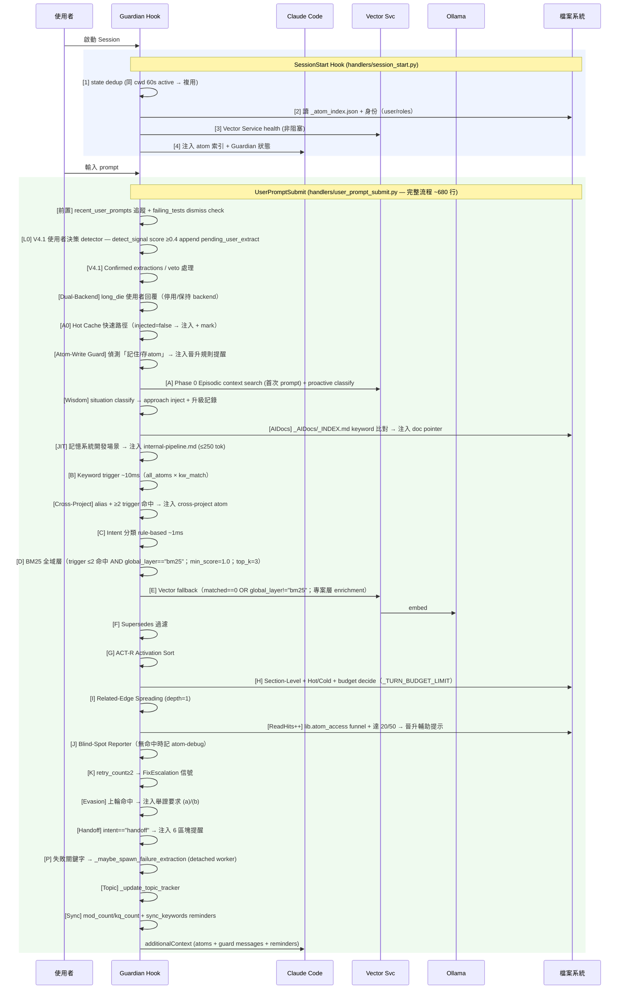
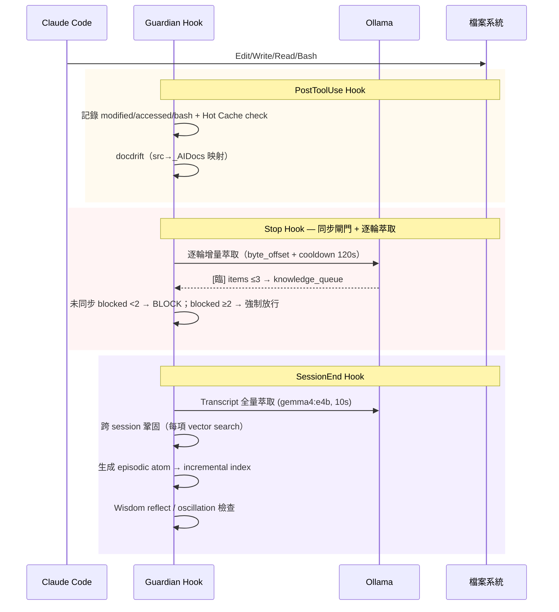
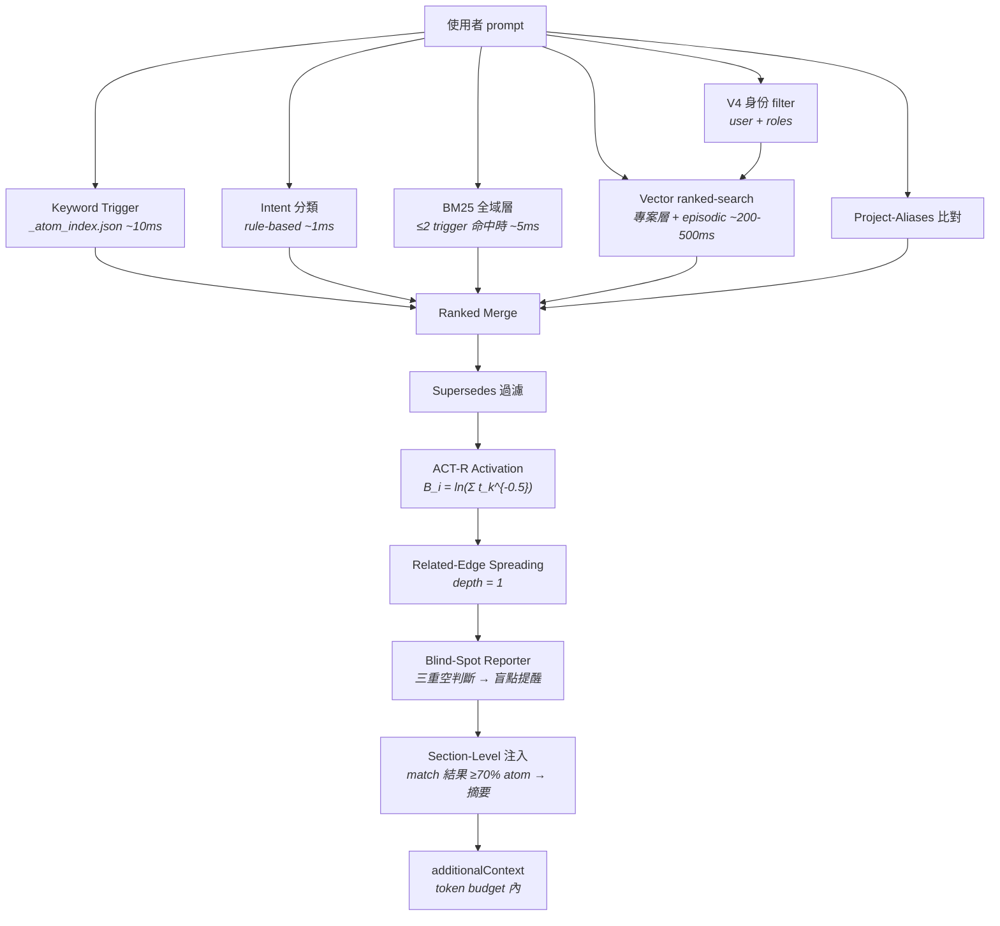
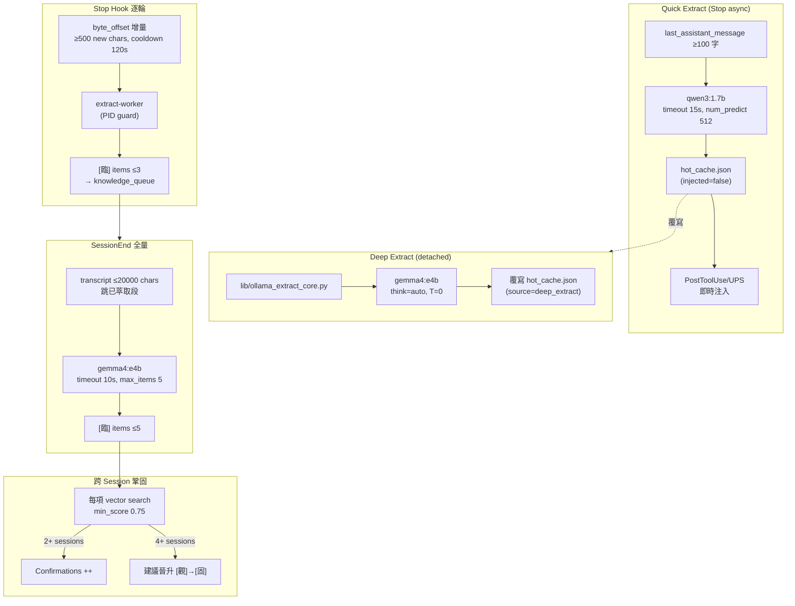

# Atomic Memory V5 — 技術深度文件

> 本文件對應系統**當前代碼實況**（2026-05-28，V5 GA + Session α/β feedback-aidocs 遷移 + `lib/atom_locations.py` 抽象）。範例、數字、公式皆從 [hooks/](hooks/)、[tools/](tools/)、[lib/](lib/)、[workflow/config.json](workflow/config.json) 實讀取得。讀者若在代碼中看到與本文件不符的值，以代碼為準並回報修正。
>
> V5 設計規格主檔：[_AIDocs/SPEC_ATOM_V5.md](_AIDocs/SPEC_ATOM_V5.md)（含 V4→V5 delta + 變更紀錄）。本檔重點在「現況代碼與流程」。

深度順序：**淺 → 深**。越進階的機制往後排，依需求檢索即可。

---

## 1. 設計哲學

LLM 的 context window 是**工作記憶**，缺的是**長期記憶**。原子記憶系統補上這塊拼圖：

| # | 原則 | 實際展現 |
|---|------|---------|
| 1 | **精確度 > Token 節省** | 寧多注入確保正確，不因省 token 漏關鍵知識 |
| 2 | **漸進式信任** | 三層分類 `[臨]`→`[觀]`→`[固]`，多次驗證才晉升 |
| 3 | **最小侵入** | 全透過 Claude Code hooks 運作，主程式零修改 |
| 4 | **雙 LLM 分工** | Claude 做決策；Ollama（gemma4:e4b / qwen3:1.7b）做語意處理 |
| 5 | **可審計** | JSONL audit trail 全程記錄，知識不刪除只歸檔 |
| 6 | **對齊原生**（V5 新增） | 採 Anthropic skills / deferred MCP / plugin packaging 原生機制，不重複造輪子 |

---

## 2. 系統架構目錄樹（2026-05-28 V5 GA + Session α/β 現況）

```
~/.claude/
├── CLAUDE.md / IDENTITY.md / USER.md              ← 啟動三件套
├── settings.json                                   ← user-level config + 8 hook events 註冊（CC 官方 hook 配置主檔；前 session 為推 V5 暫時關閉 hooks，Wave 5 Session 5 重建對齊 V5 結構）
├── version.json                                    ← V5 GA 版本標識（atom_memory 5.0 / guardian 5.0.0）
├── mcp-servers.template.json                       ← MCP server 清單（Install-forAI 用）
├── README.md / TECH.md / Install-forAI.md          ← 使用者文件
├── BOOTSTRAP.md                                    ← 首次啟動引導（IDENTITY/USER 空時觸發）
├── IDENTITY.template.md / USER.template.md         ← 個人實例的 template；IDENTITY.md / USER.md / IDENTITY-{user}.md / USER-{user}.md 為各自實例
│
├── rules/                                          ← 模組化規則
│   └── core.md                                     ← 合併單檔（知識庫+記憶+同步+對話）
│
├── hooks/                                          ← V5 重整：6 主模組 + 2 shim + handlers/
│   ├── workflow-guardian.py                        ← 1 行 shim → dispatcher.main()
│   ├── dispatcher.py                               ← 純路由（~75 行）
│   ├── handlers/                                   ← 8 event handler 各一檔
│   │   ├── _shared.py
│   │   ├── session_start.py / session_end.py
│   │   ├── user_prompt_submit.py / pre_compact.py
│   │   ├── pre_tool_use.py / post_tool_use.py
│   │   ├── stop.py / notification.py
│   ├── wg_core.py                                  ← 路徑唯一真相 + state IO + log rotation
│   ├── wg_atoms.py                                 ← trigger + BM25 + ACT-R + vector + 晉升
│   ├── wg_extraction.py                            ← per-turn 萃取 + worker + hot cache + user-extract
│   ├── wg_episodic.py                              ← episodic 生成 + 衝突 + 品質回饋
│   ├── wg_evasion.py                               ← Evasion Guard + Test-Fail Gate + 4 套自評整合
│   ├── wg_docdrift.py                              ← src → _AIDocs 映射 drift
│   ├── wg_roles.py                                 ← shim：V4 sub-layer 探勘
│   ├── wg_atom_observation.py                      ← shim：REG-005 觀察採樣（flag-gated）
│   ├── wisdom_engine.py                            ← 反思引擎 + Fix Escalation
│   ├── codex_companion.py                          ← V5 P5b 重寫為 subprocess 模型
│   ├── extract-worker.py / quick-extract.py / user-extract-worker.py
│   └── ensure-mcp.py / post-git-pull.sh / user-init.sh / webfetch-guard.sh
│
├── lib/
│   ├── ollama_extract_core.py                      ← 共享萃取核心 + SessionBudgetTracker
│   ├── atom_index_json.py                          ← V5 JSON SoT API（load/save/upsert/migrate）
│   ├── atom_io.py                                  ← atom 讀寫統一入口（write funnel）
│   ├── atom_spec.py                                ← atom 合法性規範（slugify / is_atom_file / REQUIRED_METADATA）
│   ├── atom_access.py                              ← .access.json 計數 funnel（ReadHits / Confirmations / last_used）
│   └── atom_locations.py                           ← V5+ atom 物理位置 + 路由規則單一來源（FAILURES_DIR / iter_atom_files_multi / failures_write_target，commit 89ccb2d）
│
├── tools/                                          ← Python 工具集
│   ├── ollama_client.py                            ← Dual-Backend
│   ├── memory-audit.py / memory-write-gate.py
│   ├── memory-conflict-detector.py                 ← 三時段衝突
│   ├── memory-peek.py / memory-undo.py / memory-session-score.py
│   ├── conflict-review.py / init-roles.py          ← 管理職
│   ├── sync-atom-index.py / sync-memory-index.py   ← V5 P6c 讀 JSON SoT
│   ├── atom-move.py / atom-health-audit.py / atom-health-check.py
│   ├── audit-reconcile.py / cleanup-old-files.py / cleanup-projects-residue.py
│   ├── changelog-roll.py / check-bypass.py / journal-aggregate.py
│   ├── generate-episodic-manual.py / rag-engine.py / unity-yaml-tool.py
│   ├── read-excel.py / sprite_contact_sheet.py
│   ├── codex-companion/                            ← V5：assessor/heuristics/prompts/scorer/state + audit.py(subprocess)
│   ├── gdoc-harvester/                             ← 網頁收割
│   ├── memory-vector-service/                     ← HTTP Vector @ :3849（專案層仍用）
│   ├── unity-desktop/
│   └── workflow-guardian-mcp/server.js             ← MCP @ stdio，3 tool（atom_write/move/promote）
│
├── skills/                                         ← V5：19 個 skill 取代 22 commands/
│   ├── atom-debug / browse-sprites / changelog-debug
│   ├── conflict / conflict-review / consciousness-stream
│   ├── continue / handoff / init-roles
│   ├── codex-companion / extract / fix-escalation
│   ├── generate-episodic / harvest / journal
│   ├── memory（合 health/peek/undo/review/session-score 5→1）
│   ├── read-project / upgrade / vector
│
├── memory/                                         ← 全域記憶層
│   ├── MEMORY.md                                   ← AI 一覽索引（人類可讀）
│   ├── _atom_index.json                            ← V5 JSON SoT（17 atoms：10 一般 + 5 feedback + cognitive-patterns + memory-pipeline-silent-failure-2026-05）
│   ├── _ATOM_INDEX.md                              ← deprecated mirror（自動生成）
│   ├── _meta/forbidden-phrases.json                ← V5 禁語單一真相
│   ├── preferences.md / decisions*.md / workflow-*.md / toolchain*.md
│   ├── personal/{user}/                            ← V4 個人層
│   ├── shared/ / role/                             ← V4 分層（/init-roles 後啟用）
│   ├── wisdom/ / episodic/ / _staging/
│   ├── _distant/ / _reference/                     ← 封存與參考
│   ├── _vectordb/                                  ← LanceDB 索引 + audit.log（專案層用）
│   └── _promotion_audit.jsonl                      ← 晉升審計
│                                                   （V5+ Session α 起：feedback-* + cognitive-patterns + memory-pipeline-* 物理在 `_AIDocs/Failures/`，
│                                                    索引仍登記在此 _atom_index.json 單一來源；規則見 `lib/atom_locations.py` 與 SPEC_ATOM_V5 §2.1）
│
├── workflow/                                       ← runtime state（gitignored 多）
│   ├── config.json                                 ← 統一設定（tracked）
│   ├── hot_cache.json                              ← V3 快篩知識
│   ├── _merge_history.log                          ← atom merge 紀錄
│   ├── last_review_marker.json                     ← memory-review 標記
│   ├── extract-worker.log
│   ├── mcp-version-cache.json
│   ├── state-{session-id}.json                    ← session ephemeral
│
├── _AIDocs/                                        ← 長期知識庫（人類可讀）
│   ├── _INDEX.md / _CHANGELOG.md / _CHANGELOG_ARCHIVE.md / Architecture.md
│   ├── SPEC_ATOM_V5.md（V5 GA 規格主檔，§2.1 含 feedback-* 路由）/ SPEC_ATOM_V4.md（對照證物）
│   ├── ClaudeCodeInternals/                       ← CC 原生架構研究筆記
│   ├── Tools/                                     ← 工具與領域知識
│   ├── Failures/                                  ← 失敗模式 + feedback-* atoms 物理位置（V5+ Session α 起）
│   ├── DevHistory/                                ← 版本演進 + V5 升版完整紀錄（v5-overhaul-2026-05/）
│   ├── DocIndex-System.md / known-regressions.md / Project_File_Tree.md
│
├── hooks/verify/ tools/verify/ lib/verify/         ← 14 個 verify_*.py（H-test-prune 後 verify 化）
│   tools/codex-companion/verify/                   ← 跑 `python run_verify.py`（283 passed baseline）
├── skills/{name}/verify/                           ← 17 個空結構（候選見 _staging/next-phase-skills-verify.md）
│
└── {project_root}/.claude/                         ← 專案自治層（每專案獨立）
    ├── memory/MEMORY.md / atoms / failures / episodic / _staging
    └── hooks/project_hooks.py                      ← delegate
```

**背景服務**：
- **Vector Service** `http://127.0.0.1:3849`（LanceDB + Ollama embedding）— **僅專案層 + episodic search 用**；全域層 V5 已改 BM25 in-memory
- **Codex Companion** — V5 P5b 從 daemon @ 3850 改 subprocess（port 3850 無人聽）
- **MCP Server** `tools/workflow-guardian-mcp/server.js`（stdio）— 暴露 3 tool（atom_write / atom_move / atom_promote）
- **Ollama** Dual-Backend（rdchat-direct / local，依 `config.json`）

---

## 3. V4 三層 Scope（V5 沿用）

V4 把知識空間從單層拓展為四層，V5 完全沿用：

| 層 | 可見性 | 用途 | 物理目錄 |
|----|--------|------|---------|
| `global` | 跨專案、跨人 | 使用者個人偏好、通用工具決策 | `~/.claude/memory/*.md` |
| `shared` | 同專案全員 | 專案共識、架構決策、踩坑記錄 | `{project}/.claude/memory/shared/` |
| `role:{name}` | 同職務者 | 職務專有規範（programmer / art / planner 預設） | `{project}/.claude/memory/role/{name}/` |
| `personal:{user}` | 只自己 | 個人 scratch、未公開的假設 | `{project}/.claude/memory/personal/{user}/` |

詳細 schema / 衝突偵測 / JIT 注入規則：見 [SPEC_ATOM_V4.md §2–§10](_AIDocs/SPEC_ATOM_V4.md)。

### 雙向認證（管理職）

防止使用者自封管理職：
1. **personal 自我宣告**：`memory/personal/{user}/role.md`
2. **shared 白名單**：`memory/shared/_roles.md` 由管理職維護
3. [hooks/wg_roles.py](hooks/wg_roles.py) 的 `is_management()` 檢查兩者**都**認可才通過

### 三時段衝突偵測

| 時段 | 觸發 | 工具 |
|------|------|------|
| Write-time | atom_write MCP 呼叫 | [tools/memory-conflict-detector.py](tools/memory-conflict-detector.py)（write-check mode）：向量 ≥0.60 送 LLM → CONTRADICT 進 pending |
| Pull-time | git pull 後 | `hooks/post-git-pull.sh --mode=pull-audit`：變動 atom → classify → 衝突標記 |
| Startup-drift | SessionStart | dispatcher 的 `_ensure_state` self-heal：merged state 孤兒復活避免 pending 寫入死水 |

### 敏感原子 auto-pending

`Audience: architecture` / `decision` 的原子寫入 `shared/` 時**不直接生效**，進 `shared/_pending_review/` 等管理職裁決（approve / reject）。`/conflict-review` skill 為裁決入口。

---

## 4. V4.1 使用者決策萃取 Pipeline（V5 沿用）

```
使用者 prompt
      │
      ▼
[L0] 規則 detector — hooks/wg_extraction.py 整併 (≤5ms)
     信號詞 + 句法 pattern，score ≥0.4 → append pending_user_extract[]
      │
  （Stop hook 觸發）
      │
      ▼
[L1] 二元過濾 — qwen3:1.7b  (think=false, T=0, num_predict=30)
     yes/no，排除混合句與情緒承諾
      │
      ▼
[L2] 結構化萃取 — gemma4:e4b  (think=auto, num_predict=200)
     輸出 {conf, scope, trigger, statement}
      │
      ▼
[Hybrid Threshold Router]
     conf ≥ 0.92  → atom 直寫
     0.70 ≤ conf < 0.92 → personal/auto/{user}/_pending.candidates.md
     conf < 0.70 → 丟棄（audit 記錄）
```

### SessionBudgetTracker（240 tok/session）

來源 [lib/ollama_extract_core.py](lib/ollama_extract_core.py)、[workflow/config.json](workflow/config.json) `userExtraction.tokenBudget=240`：

- `_estimate_tokens()` CJK-aware（中文 ~1.5 tok/char、ASCII ~0.25 tok/word）
- **>220 tok** → 切 L1-only，不再跑 L2 deep extract
- **>240 tok** → break，本 session 不再萃取
- 只計 **user-delta** token（靜態 few-shot 不計）

---

## 5. V5 新增子系統

### 5.1 Atom Index — JSON SoT（V5 P3b）

`memory/_atom_index.json` 為唯一機器源（17 atoms）。`_ATOM_INDEX.md` 改為自動生成的人類可讀 mirror，僅 fallback parser 使用。

```json
{
  "version": "1.0",
  "atoms": [
    { "name": "...", "path": "...", "triggers": [...], "scope": "global" }
  ]
}
```

API：[lib/atom_index_json.py](lib/atom_index_json.py)（`load/save/upsert/delete/regenerate_md/migrate/validate`）。
寫入 funnel：`upsert_atom` 後同步 `regenerate_atom_index_md`。
讀取點：[hooks/wg_atoms.py](hooks/wg_atoms.py) `parse_memory_index` 優先讀 JSON。

### 5.2 BM25 全域檢索層（V5 P5a）

全域 ~17 atoms 規模用 Vector Service 是殺雞用牛刀。V5 引入 in-memory BM25（~80 行手刻於 `wg_atoms.py`）：

- ASCII word + 中文 char-bigram tokenization
- 參數：k1=1.2, b=0.75
- 注入流程：trigger match → BM25（≤2 trigger 命中時觸發；min_score=1.0；top_k=3）→ Vector fallback（雙 0 命中時）

`config.json`：`vector_search.global_layer: "bm25"`

**Vector Service 保留**：專案層（atom 可上百）、episodic search、cross-session dedup / 衝突偵測。

### 5.3 Codex Companion — Daemon → Subprocess（V5 P5b）

V4 用 HTTP daemon @ port 3850 管 per-session assessment。V5 改 in-process state + spawn `tools/codex-companion/audit.py` 短命子程序：

| 項目 | V4 (daemon) | V5 (subprocess) |
|------|-------------|-----------------|
| port 3850 | 監聽中 | 無人聽 |
| `companion.pid` | service.py 維護 | 不存在 |
| Assessment 延遲 | ~1ms HTTP roundtrip | ~10–50ms subprocess spawn |
| 失敗模式 | daemon crash 影響全 session | 單 turn 失敗只影響該 turn |

state schema 不變、Silent Advisory / Score Gate / Dedup / Max Audits Cap 邏輯不變。

### 5.4 Commands → Skills 遷移（V5 P1）

Anthropic 官方明文「Custom commands have been merged into skills」。V5 把 22 個 `commands/*.md` 全刪，改用 `skills/{name}/SKILL.md` 結構（19 個）：

- **直接遷移**（13）：atom-debug, browse-sprites, conflict, conflict-review, consciousness-stream, extract, fix-escalation, generate-episodic, harvest, journal, read-project, upgrade, vector
- **全域保留**（4）：codex-companion, continue, handoff, init-roles
- **合 1 個 /memory**（5→1）：memory-{health,peek,undo,review,session-score} 統一用 `$0` 取 subcmd
- **改名為 debug 工具**（1）：changelog-roll → changelog-debug
- **刪除**（與內建衝突）：resume / init-project / svn-update / unity-yaml

Skill frontmatter 含 `description` / `when_to_use` / `disable-model-invocation` / `user-invocable` / `allowed-tools` / `context` / `paths` 等欄位。

### 5.5 MCP server.js 砍 4 內部 tool（V5 P2）

V4 7 tool → V5 3 tool。砍掉 4 個內部 IPC（`workflow_signal` / `workflow_status` / `memory_queue_add` / `memory_queue_flush`），改由 Stop gate 自動偵測（hook 內化）。

保留：`atom_write` / `atom_move` / `atom_promote`（多步驗證 + 去重 + 索引，合理走 MCP）。

### 5.6 禁語清單 JSON 化（V5 P4b）

`memory/_meta/forbidden-phrases.json` 為 single source。`IDENTITY.md` 與 `hooks/wg_evasion.py` 都讀此 JSON，杜絕 V4 期間 drift 風險。

四類禁語：範圍推諉 / 時間性延後 / 前已存在搪塞 / 能力推諉。

### 5.7 Hook 模組整併（V5 P2）

V4.1 的 16 個 `wg_*.py` + 2651 行 dispatcher → V5：

- **主模組（6）**：wg_core / wg_atoms / wg_extraction / wg_episodic / wg_evasion / wg_docdrift
- **Shim（2）**：wg_roles / wg_atom_observation
- **獨立保留**：wisdom_engine / codex_companion / extract-worker / quick-extract / user-extract-worker
- **Dispatcher**：`dispatcher.py`（~75 行純路由）+ `handlers/` 8 個 event handler 各一檔
- **`workflow-guardian.py`**：1 行 shim 轉發到 `dispatcher.main()`

四套自評（原 wg_evasion / wg_session_evaluator / wg_iteration / codex_companion soft_gate）整合進 `wg_evasion`。

### 5.8 Log Rotation（V5 P0）

`workflow/guardian-crash.log` 曾爆 114 GB。V5 在 `wg_core.py` 加 rotation：log 達 `LOG_ROTATE_THRESHOLD_BYTES`（預設 100 MB）自動輪轉為 `.1` / `.2` / `.3`，最多保 3 份；同類機制套用於 `extract-worker.log`。

---

## 6. 版本歷史

| 版本 | 日期 | 白話 | 核心變更 |
|------|------|------|---------|
| V1.0 | 2026-03-02 | 三層可信度 + 格式健檢 | `[固]/[觀]/[臨]` 分類 + memory-audit |
| V2.0 | 2026-03-03 | 語意搜尋上線 | Hybrid RECALL（keyword + vector + rerank）|
| V2.1 | 2026-03-04 | 品質閘門擋垃圾 | Write Gate + intent classifier + 衝突偵測 + decay |
| V2.4 | 2026-03-05 | AI 回答自動存 + 跨 session 升級 | 回應萃取 + 向量鞏固 + 兩層分類 |
| V2.5-2.10 | 2026-03-06~11 | 萃取 + 反思 + 閱讀軌跡 | JSON 強制 / Wisdom Engine / Read Tracking |
| V2.11-2.18 | 2026-03-13~24 | Dual-Backend + 失敗自動化 + Section-Level 注入 | 三階段退避 + Fix Escalation + Token Diet |
| V2.20-2.21 | 2026-03-27 | 路徑集中化 + 專案自治層 | `wg_paths.py` 唯一真相 + `{project}/.claude/memory/` |
| V3.0-3.4 | 2026-04-02~09 | 三層即時管線 + Gemma 4 萃取 | Hot Cache + DocDrift + gemma4:e4b |
| V4.0 | 2026-04-15 | 多職務團隊知識分層 + 敏感決策送管理職簽核 | 四層 scope + `_roles.md` 雙向認證 + 三時段衝突 + pending review |
| V4.1 | 2026-04-16 | 使用者決策自動寫成記憶 | L0→L1→L2 Pipeline + 240 tok budget + `/memory-*` UX |
| **V5 GA** | **2026-05-27** | 對齊原生 + JSON SoT + Subprocess + BM25 | Wave 1: log rotation + feedback 24→5；Wave 2: hook/MCP 重整；Wave 3: JSON SoT + commands→skills + BM25；Wave 4: Codex daemon→subprocess + GA 收尾；Wave 5: 全面汰舊（workflow 114GB → 329K、commands 全刪、tests 維持 414 baseline） |

---

## 7. Token 消耗與延遲

### Token Budget（[hooks/wg_atoms.py](hooks/wg_atoms.py)）

| prompt 長度 | budget | 模式 |
|-------------|--------|------|
| <50 字 | 1,500 tokens | 輕量 |
| 50–200 字 | 3,000 tokens | 轉場 |
| ≥200 字 | 5,000 tokens | 深度 |

### Vanilla Claude Code vs V5 GA

| 指標 | Vanilla | V5 GA |
|------|---------|------|
| Session 啟動延遲 | ~0 ms | +50-200 ms |
| 每次 prompt 額外延遲 | ~0 ms | +200-500 ms（含 BM25 + 向量搜尋） |
| 首次 prompt 額外延遲 | ~0 ms | +500-1,500 ms（episodic search） |
| PostToolUse 延遲 | ~0 ms | +50-250 ms（含 hot cache read） |
| CLAUDE.md token | 0 | ~1,500-2,500（含 @import IDENTITY/USER/MEMORY） |
| 典型 session overhead | 0 | ~2,000-5,500 tok |
| 磁碟空間 | 0 | ~5-20 MB（atoms + LanceDB + state） |
| 背景 RAM | 0 | ~100-200 MB（LanceDB + Ollama 常駐模型） |

> V5 全域層改 BM25 後省一次 Ollama embed 呼叫；專案層仍走 vector。跨 session 保留率、踩坑率是定性陳述，無精確量測。

---

## 8. 運行流程圖

### 8.1 SessionStart + UserPromptSubmit


```mermaid
sequenceDiagram
    participant U as 使用者
    participant G as Guardian Hook
    participant C as Claude Code
    participant V as Vector Svc
    participant O as Ollama
    participant F as 檔案系統

    U->>G: 啟動 Session
    rect rgba(100,150,255,0.1)
        note over G,F: SessionStart Hook (handlers/session_start.py)
        G->>G: [1] state dedup (同 cwd 60s active → 複用)
        G->>F: [2] 讀 _atom_index.json + 身份（user/roles）
        G->>V: [3] Vector Service health (非阻塞)
        G->>C: [4] 注入 atom 索引 + Guardian 狀態
    end

    U->>G: 輸入 prompt
    rect rgba(100,200,100,0.1)
        note over G,F: UserPromptSubmit (handlers/user_prompt_submit.py — 完整流程 ~680 行)
        G->>G: [前置] recent_user_prompts 追蹤 + failing_tests dismiss check
        G->>G: [L0] V4.1 使用者決策 detector — detect_signal score ≥0.4 append pending_user_extract
        G->>G: [V4.1] Confirmed extractions / veto 處理
        G->>G: [Dual-Backend] long_die 使用者回覆（停用/保持 backend）
        G->>G: [A0] Hot Cache 快速路徑（injected=false → 注入 + mark）
        G->>G: [Atom-Write Guard] 偵測「記住/存atom」→ 注入晉升規則提醒
        G->>V: [A] Phase 0 Episodic context search (首次 prompt) + proactive classify
        G->>G: [Wisdom] situation classify → approach inject + 升級記錄
        G->>F: [AIDocs] _AIDocs/_INDEX.md keyword 比對 → 注入 doc pointer
        G->>G: [JIT] 記憶系統開發場景 → 注入 internal-pipeline.md (≤250 tok)
        G->>G: [B] Keyword trigger ~10ms（all_atoms × kw_match）
        G->>G: [Cross-Project] alias + ≥2 trigger 命中 → 注入 cross-project atom
        G->>G: [C] Intent 分類 rule-based ~1ms
        G->>G: [D] BM25 全域層（trigger ≤2 命中 AND global_layer=="bm25"；min_score=1.0；top_k=3）
        G->>V: [E] Vector fallback（matched==0 OR global_layer!="bm25"；專案層 enrichment）
        V->>O: embed
        G->>G: [F] Supersedes 過濾
        G->>G: [G] ACT-R Activation Sort
        G->>F: [H] Section-Level + Hot/Cold + budget decide（_TURN_BUDGET_LIMIT）
        G->>G: [I] Related-Edge Spreading (depth=1)
        G->>F: [ReadHits++] lib.atom_access funnel + 達 20/50 → 晉升輔助提示
        G->>G: [J] Blind-Spot Reporter（無命中時記 atom-debug）
        G->>G: [K] retry_count≥2 → FixEscalation 信號
        G->>G: [Evasion] 上輪命中 → 注入舉證要求 (a)/(b)
        G->>G: [Handoff] intent=="handoff" → 注入 6 區塊提醒
        G->>G: [P] 失敗關鍵字 → _maybe_spawn_failure_extraction (detached worker)
        G->>G: [Topic] _update_topic_tracker
        G->>G: [Sync] mod_count/kq_count + sync_keywords reminders
        G->>C: additionalContext (atoms + guard messages + reminders)
    end
```

> Mermaid 流程序對應 [`hooks/handlers/user_prompt_submit.py`](hooks/handlers/user_prompt_submit.py) 實際呼叫順序（680 行 handler）。V4 寫法把 [L0] 排在最後是早期文件殘留；V5 把 V4.1 detector 提至 handler 開頭以最小延遲攔截使用者決策語句。

### 8.1.1 實際運作範例

本 session 「上GIT」prompt 觸發的 UserPromptSubmit 注入（系統實際輸出，節錄）：

```
[QuickExtract] 5 items cached            ← Hot Cache 快速路徑（quick-extract.py 寫入）
[HotCache:deep_extract ⚠AUTO-DRAFT·[臨]] ...    ← deep extract 覆寫的 hot cache（source=deep_extract）
[Atom:preferences]                        ← Trigger 命中「上GIT」關鍵字
- Confidence: [固]
- Trigger: 偏好, 風格, 習慣, 語言, 回應, 執P, 執驗上P, 上GIT
...
[Guardian:Evasion] 你上輪用了退避語『pre-existing』。     ← Evasion 上輪命中舉證要求
[Guardian] Reminder: 9 files modified, 11 knowledge items pending. ← Sync reminders
```

對應 [`user_prompt_submit.py`](hooks/handlers/user_prompt_submit.py) code path：
- `[QuickExtract] ... cached`：來自 hot_cache.json `source=quick_extract`（L178-187 `read_hot_cache` → `format_injection_line` → `mark_injected`）
- `[HotCache:deep_extract ⚠AUTO-DRAFT]`：來自 hot_cache.json `source=deep_extract`（同樣 fast-path，但 source 標籤不同）
- `[Atom:preferences]`：Trigger 命中「上GIT」（preferences.md frontmatter `Trigger: ..., 上GIT`），走 `_kw_match` (L343) → 進 matched_with_dir → ACT-R 排序 → Section-Level + budget decide → 注入完整 atom
- `[Guardian:Evasion]`：state["evasion_flag"] 由 PostToolUse 偵測本輪 assistant 輸出含禁語時設置，下一輪 UserPromptSubmit (L644-654) 注入 → 清 flag
- `[Guardian] Reminder`：mod_count/kq_count > 0 且 remind_count >= remind_after（預設 3） → 注入提醒（L686-700）


### 8.2 Tool 執行 + Stop + SessionEnd


```mermaid
sequenceDiagram
    participant C as Claude Code
    participant G as Guardian Hook
    participant O as Ollama
    participant F as 檔案系統

    C->>F: Edit/Write/Read/Bash
    rect rgba(255,200,100,0.1)
        note over G,F: PostToolUse Hook
        G->>G: 記錄 modified/accessed/bash + Hot Cache check
        G->>G: docdrift（src→_AIDocs 映射）
    end

    rect rgba(255,150,150,0.1)
        note over G,F: Stop Hook — 同步閘門 + 逐輪萃取
        G->>O: 逐輪增量萃取（byte_offset + cooldown 120s）
        O-->>G: [臨] items ≤3 → knowledge_queue
        G->>G: 未同步 blocked <2 → BLOCK；blocked ≥2 → 強制放行
    end

    rect rgba(150,100,255,0.1)
        note over G,F: SessionEnd Hook
        G->>O: Transcript 全量萃取 (gemma4:e4b, 10s)
        G->>G: 跨 session 鞏固（每項 vector search）
        G->>G: 生成 episodic atom → incremental index
        G->>G: Wisdom reflect / oscillation 檢查
    end
```

---

## 9. Hybrid RECALL 記憶檢索（V5 含 BM25）


```mermaid
flowchart TD
    P["使用者 prompt"] --> KW["Keyword Trigger<br/><i>_atom_index.json ~10ms</i>"]
    P --> INT["Intent 分類<br/><i>rule-based ~1ms</i>"]
    P --> BM["BM25 全域層<br/><i>≤2 trigger 命中時 ~5ms</i>"]
    P --> VS["Vector ranked-search<br/><i>專案層 + episodic ~200-500ms</i>"]
    P --> PA["Project-Aliases 比對"]
    P --> UF["V4 身份 filter<br/><i>user + roles</i>"]

    KW --> MG["Ranked Merge"]
    INT --> MG
    BM --> MG
    VS --> MG
    PA --> MG
    UF --> VS

    MG --> SF["Supersedes 過濾"]
    SF --> AR["ACT-R Activation<br/><i>B_i = ln(Σ t_k^{-0.5})</i>"]
    AR --> RL["Related-Edge Spreading<br/><i>depth = 1</i>"]
    RL --> BS["Blind-Spot Reporter<br/><i>三重空判斷 → 盲點提醒</i>"]
    BS --> SEC["Section-Level 注入<br/><i>match 結果 ≥70% atom → 摘要</i>"]
    SEC --> CTX["additionalContext<br/><i>token budget 內</i>"]
```

### 關鍵常數（[hooks/wg_atoms.py](hooks/wg_atoms.py) + [config.json](workflow/config.json)）

- **ACT-R 衰減** `d = 0.5`；無 access log → 回傳 `-10.0`（冷啟動）
- **BM25**：k1=1.2, b=0.75；min_score=1.0；top_k=3
- **Vector top_k** = 5、**min_score** = 0.65
- **Related-edge max_depth** = 1
- **Section-level 觸發**：match 結果涵蓋 ≥70% atom 內容時降級為摘要

### 降級策略

| 情境 | 行為 |
|------|------|
| Ollama 不可用 | 純 keyword trigger + BM25 |
| Vector Service 掛 | keyword + BM25 + fallback（sentence-transformers BAAI/bge-m3）|
| 全部掛 | 僅讀 MEMORY.md |

---

## 10. Write Gate 寫入品質閘門

來源 [tools/memory-write-gate.py](tools/memory-write-gate.py) + [workflow/config.json](workflow/config.json)。

### 規則與權重

| 規則 | 權重 | 條件 |
|------|------|------|
| `length_20` | +0.15 | content ≥ 20 chars |
| `length_50` | +0.10 | content ≥ 50 chars（可疊 length_20，最多 +0.25） |
| `tech_terms` | +0.15 | ≥ 2 項技術術語（API / Git / vector / schema...，含 CJK「架構 / 設定」） |
| `explicit_user` | +0.35 | 使用者明確觸發（「記住」「這是固定規則」）|
| `concrete_value` | +0.15 | 含版本、路徑、config 值（如 `v5.0` / `~/.claude/...`）|
| `non_transient` | +0.10 | 不含 timeout/retry/暫時 等瞬時語意 |
| `actionable` | +0.15 | 行動式（「需要 X」「如果 Y 就 Z」）|

### 決策門檻

| 總分 | 行為 |
|------|------|
| ≥ 0.5 | Auto Add |
| 0.3 - 0.5 | Ask User |
| < 0.3 | Skip（audit trail 記錄） |

### Dedup

| 向量相似度 | 行為 |
|-----------|------|
| > 0.95 | 跳過（完全重複）|
| 0.80 - 0.95 | 建議 Update 既有 atom |
| < 0.80 | 進入 quality 評分 |

### 快速路徑

「陷阱 / 坑 / pitfall」關鍵詞命中 → 自動 [觀]（繞過低分 skip，失敗模式優先保留）。

---

## 11. 回應知識捕獲 + 三層即時管線


```mermaid
flowchart TD
    subgraph QE ["Quick Extract (Stop async)"]
        Q1["last_assistant_message ≥100 字"] --> Q2["qwen3:1.7b<br/>timeout 15s, num_predict 512"]
        Q2 --> Q3["hot_cache.json<br/>(injected=false)"]
        Q3 --> Q4["PostToolUse/UPS<br/>即時注入"]
    end

    subgraph PT ["Stop Hook 逐輪"]
        A1["byte_offset 增量<br/>≥500 new chars, cooldown 120s"] --> A2["extract-worker<br/>(PID guard)"]
        A2 --> A3["[臨] items ≤3<br/>→ knowledge_queue"]
    end

    subgraph DE ["Deep Extract (detached)"]
        D1["lib/ollama_extract_core.py"] --> D2["gemma4:e4b<br/>think=auto, T=0"]
        D2 --> D3["覆寫 hot_cache.json<br/>(source=deep_extract)"]
    end

    subgraph SE ["SessionEnd 全量"]
        B1["transcript ≤20000 chars<br/>跳已萃取段"] --> B2["gemma4:e4b<br/>timeout 10s, max_items 5"]
        B2 --> B3["[臨] items ≤5"]
    end

    subgraph CS ["跨 Session 鞏固"]
        C1["每項 vector search<br/>min_score 0.75"]
        C1 -- "2+ sessions" --> C2["Confirmations ++"]
        C1 -- "4+ sessions" --> C3["建議晉升 [觀]→[固]"]
    end

    Q3 -.覆寫.-> DE
    A3 --> SE
    B3 --> C1
```

### 知識類型（[lib/ollama_extract_core.py](lib/ollama_extract_core.py) `VALID_TYPES`）

`factual` / `procedural` / `architectural` / `pitfall` / `decision` — 五類。content 上限 150 chars。

### 配置（[config.json](workflow/config.json) `response_capture` + `hot_cache`）

- Quick extract timeout: **15 s**
- Deep extract (SessionEnd) timeout: **10 s**
- Per-turn 最小新增 chars: **500**、max_items: **3**、cooldown: **120 s**
- Failure extraction 冷卻: **180 s**、max_items: **2**
- Cross-session: `promote_threshold=2`、`suggest_threshold=4`、`min_score=0.75`

---

## 12. Dual-Backend Ollama

[tools/ollama_client.py](tools/ollama_client.py) + [config.json](workflow/config.json) `ollama_backends`：

| Backend | priority | LLM | Embedding | 說明 |
|---------|----------|-----|-----------|------|
| `rdchat-direct` | 1 | gemma4:e4b | qwen3-embedding:latest | 遠端 GPU 直連 |
| `local` | 3 | qwen3:1.7b | qwen3-embedding | 本地 CPU/GPU |

### 三階段退避

```
正常 → [連續 2 次失敗] → Short DIE (60s，用 fallback)
     → [10 分鐘內 2 次 Short DIE] → Long DIE (等到下個 6h 邊界: 0/6/12/18)
```

- **Short DIE**: `SHORT_DIE_COOLDOWN = 60`（[ollama_client.py:31](tools/ollama_client.py#L31)）
- **Long DIE window**: `LONG_DIE_WINDOW = 600`（10 分鐘，[ollama_client.py:34](tools/ollama_client.py#L34)）
- **時間段邊界**: `TIME_BOUNDARIES = [0, 6, 12, 18]`（[ollama_client.py:37](tools/ollama_client.py#L37)）
- **Short DIE 觸發**：`consecutive_failures >= 2 and status == "normal"`（[ollama_client.py:394](tools/ollama_client.py#L394)）
- **Long DIE 觸發**：`short_die_count >= 2` 且在 `LONG_DIE_WINDOW` 內 → `_next_time_boundary()`（[ollama_client.py:403-406](tools/ollama_client.py#L403-L406)）
- **靜態停用**：`ollama_backends.<name>.enabled=false`
- **長 DIE 使用者確認**：SessionStart 詢問「停用 / 保持」（透過 `LONG_DIE_MARKER` 寫入 `workflow/.backend_long_die.json` + UserPromptSubmit 偵測使用者回覆 "停用"/"保持"）

---

## 13. 核心子系統總表

| 子系統 | 切入點 | 說明 |
|--------|--------|------|
| Workflow Guardian | [hooks/workflow-guardian.py](hooks/workflow-guardian.py) → [hooks/dispatcher.py](hooks/dispatcher.py) | Stop 閘門 — 有未同步修改阻止結束，最多 2 次強制放行 |
| Event Handlers | [hooks/handlers/](hooks/handlers/) | 8 個 event 各一檔（session_start/end、UPS、pre/post_tool_use、stop、pre_compact、notification） |
| Atom Index SoT (V5) | [lib/atom_index_json.py](lib/atom_index_json.py) + `memory/_atom_index.json` | JSON 唯一機器源；MD 自動生成 mirror |
| Hybrid RECALL | [hooks/wg_atoms.py](hooks/wg_atoms.py) | trigger + **BM25**（V5）+ Vector + ACT-R + Related-Edge + Section-Level |
| Hot Cache | [hooks/wg_extraction.py](hooks/wg_extraction.py) + `workflow/hot_cache.json` | quick-extract 寫 → PostToolUse/UPS 注入 → deep extract 覆寫 |
| Response Capture | [hooks/extract-worker.py](hooks/extract-worker.py) + [hooks/quick-extract.py](hooks/quick-extract.py) | SessionEnd 全量 + Stop 逐輪 |
| Episodic Memory | [hooks/wg_episodic.py](hooks/wg_episodic.py) | Session 結束生成摘要（TTL 24d） |
| Cross-Session | `handle_session_end` | 2+ sessions Confirm++、4+ 建議晉升 |
| Self-Iteration | （V5 已整合進 wg_evasion）| 3 條核心 + 自動晉升 [臨]→[觀] ≥20 |
| Wisdom Engine | [hooks/wisdom_engine.py](hooks/wisdom_engine.py) + `memory/wisdom/` | 情境分類 + 反思（3 指標 Bayesian 校準）|
| Fix Escalation | [skills/fix-escalation/](skills/fix-escalation/) + wisdom_engine | retry≥2 → 6 Agent 精確修正會議 |
| Failures 自動化 | wg_extraction `_check_failure_patterns` | 失敗關鍵字 → detached worker → 三維路由 |
| Token Diet | wg_atoms `_strip_atom_for_injection` | 注入前 strip metadata + Section-Level |
| Write Gate | [tools/memory-write-gate.py](tools/memory-write-gate.py) | 規則 + dedup 0.8 + CJK patterns |
| Decay & Archival | [tools/memory-audit.py](tools/memory-audit.py) `--enforce` | 超期 atom 移 `_distant/{year}_{month}/` |
| Audit Trail | `_vectordb/audit.log` + `_promotion_audit.jsonl` | JSONL 記錄 add/delete/conflict/decay/promotion |
| DocDrift | [hooks/wg_docdrift.py](hooks/wg_docdrift.py) | src Edit/Write 偵測對應 `_AIDocs/` 需更新 |
| **V5 BM25** | [hooks/wg_atoms.py](hooks/wg_atoms.py) `bm25_match` | 全域層替代 Vector（~80 行手刻） |
| **V5 JSON SoT** | [lib/atom_index_json.py](lib/atom_index_json.py) | 取代 `_ATOM_INDEX.md` table parser |
| **V5 Codex Subprocess** | [hooks/codex_companion.py](hooks/codex_companion.py) + `tools/codex-companion/audit.py` | daemon → subprocess（無 port 3850）|
| **V5 Skill 體系** | [skills/](skills/) 19 個 + frontmatter | 取代 22 個 legacy commands/ |
| **V5 MCP（3 tool）** | [tools/workflow-guardian-mcp/server.js](tools/workflow-guardian-mcp/server.js) | atom_write / atom_move / atom_promote（砍 4 內部 IPC）|
| **V5 禁語 JSON** | `memory/_meta/forbidden-phrases.json` | IDENTITY.md + wg_evasion.py single source |
| **V5 Log Rotation** | [hooks/wg_core.py](hooks/wg_core.py) | guardian-crash.log / extract-worker.log 自動輪轉 |
| Staging Area | `memory/_staging/` | 續接 prompt、暫存草稿（gitignored）|
| V4 Scope Layering | [hooks/wg_atoms.py](hooks/wg_atoms.py) | 四層目錄發現 |
| V4 Role Whitelist | [hooks/wg_roles.py](hooks/wg_roles.py) | 雙向認證（personal role.md + shared `_roles.md`）|
| V4 Pending Review | [tools/memory-conflict-detector.py](tools/memory-conflict-detector.py) + `/conflict-review` | 敏感類自動進 `shared/_pending_review/` |
| V4 Conflict 三時段 | write-check / pull-audit / startup-drift | 向量 ≥0.60 送 LLM → CONTRADICT |
| V4.1 User Extract Pipeline | wg_extraction L0 + user-extract-worker.py L1/L2 | qwen3 yes/no + gemma4:e4b 結構化；240 tok budget |
| V4.1 Session Score | （V5 整合進 wg_evasion）| 5 維評分 → `reflection_metrics.json` |
| V4.1 Memory Undo | [tools/memory-undo.py](tools/memory-undo.py) | 撤銷自動萃取 atom + reason 分類 |

---

## 14. 團隊協作：USER.md / IDENTITY.md 分離

[CLAUDE.md](CLAUDE.md) 透過 `@import` 載入：

```
@IDENTITY.md       ← AI 角色定義（團隊共用）
@USER.md           ← 操作者個人資料（每人一份）
@memory/MEMORY.md  ← 記憶索引（自動）
```

**多人 onboard**：共用 `CLAUDE.md` + `IDENTITY.md`，每人一份 `USER.md`。`USER.md` 內宣告 `CLAUDE_USER` 環境變數可在同機切換帳號測試。

---

## 15. 大型專案使用法

### 15.1 專案自治層

每個專案在 `{project}/.claude/memory/` 有獨立的 atom 空間：架構決策、踩坑、coding convention。

全域層 `~/.claude/memory/` 只放跨專案共通知識。

### 15.2 V4 多職務分層（啟用條件）

執行 `/init-roles` 建立 `shared/` + `role/{name}/` + `personal/{user}/` 後，JIT 注入自動按角色 filter。未啟用時視同單層 `shared`。

### 15.3 V5 全域 vs 專案層檢索

| 層 | atom 規模 | 檢索 |
|---|----------|------|
| 全域 `~/.claude/memory/` | ~17 | **BM25**（in-memory）|
| 專案 `{proj}/.claude/memory/` | 可上百 | Vector Service @ 3849 |
| Episodic / Cross-session | 跨 session | Vector |

### 15.4 Episodic Memory 跨 Session 延續

每個 session 結束自動生成 episodic atom（不列 MEMORY.md），含閱讀軌跡 / 版控查詢 / 關聯 semantic atoms / 覆轍信號。下次首次 prompt 用 vector search 找回並注入。

### 15.5 Token 管理策略

- **Trigger 匹配**：只有命中才載入
- **BM25 排序**：全域層 top_k=3
- **Vector ranked-search**：專案層 top_k=5
- **Token Budget**：依 prompt 長度調節（1,500-5,000）
- **Supersedes**：被取代的舊 atom 自動過濾
- **硬限制**：MEMORY.md ≤30 行、atom ≤200 行

---

## 16. 深度參考

- [_AIDocs/SPEC_ATOM_V5.md](_AIDocs/SPEC_ATOM_V5.md) — **V5 GA 規格主檔（規範定稿）**
- [_AIDocs/SPEC_ATOM_V4.md](_AIDocs/SPEC_ATOM_V4.md) — V4 scope 與管理職雙向認證（V5 依賴的對照證物）
- [_AIDocs/DevHistory/v5-overhaul-2026-05/](_AIDocs/DevHistory/v5-overhaul-2026-05/) — V5 全 5 Wave 開發歷程
- [_AIDocs/DevHistory/v41-journey.md](_AIDocs/DevHistory/v41-journey.md) — V4.1 開發歷程與 GA 後 bug 修補
- [_AIDocs/Architecture.md](_AIDocs/Architecture.md) — 系統架構總覽
- [_AIDocs/DevHistory/ab-test-gemma4.md](_AIDocs/DevHistory/ab-test-gemma4.md) — V3.4 萃取引擎 A/B 測試報告

---

## License

GNU General Public License v3.0 — 見 [LICENSE](LICENSE)
