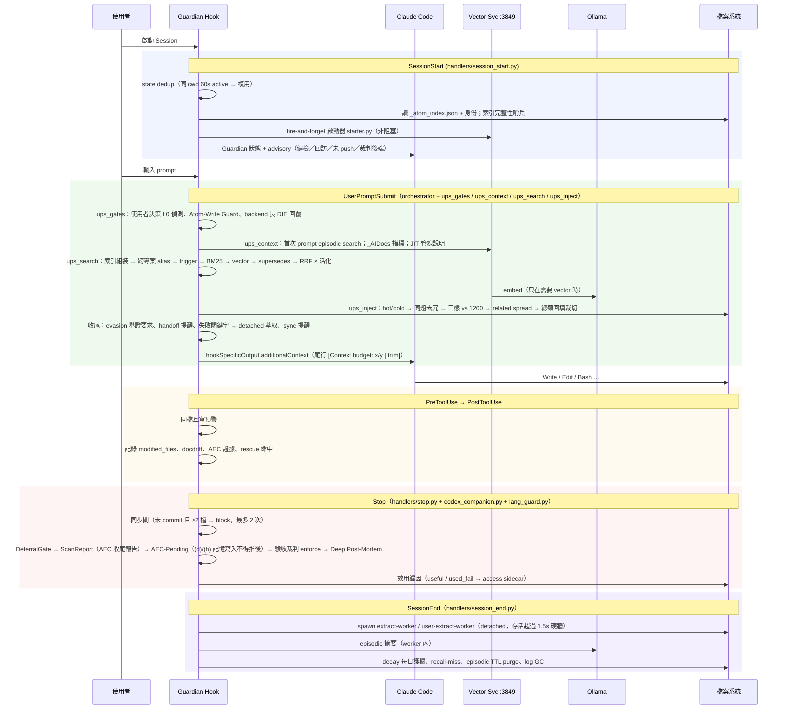

# 原子記憶系統 — 技術深度文件

> 本文件對應系統**當前代碼實況**；與代碼不符以代碼為準並回報修正。版本標識見 `version.json`。
> 讀者定位：**人讀為主**（想弄懂這套東西怎麼跑、為什麼這樣設計），**Claude Code 讀來建立自我認知為輔**。
> 章節按「現況」邏輯排：理念 → 差異 → 一個回合 → 資料層 → 檢索注入 → 寫入積累 → 守門收尾 → 可觀測 → 服務 → 目錄 → 成本 → 設定 → 協作 → 版本歷史 → 深度參考。
> 閱讀鐵則：每個機制在它所屬章節講完要點；要深入只指到**單一**檔案或**單一** DevHistory 檔，不做「A 見 B、B 見 C」。

---

## 1. 設計理念

### 1.1 使用者最高原則

LLM 的 context window 是**工作記憶**，天生沒有**長期記憶**。這套系統要做到的是：

| 原則 | 白話 | 落地在哪 |
|------|------|---------|
| 全積累 | 值得記的知識一顆都不漏，且不刪只歸檔 | atom 卡片 + `_distant/` 封存 + JSONL 審計 |
| 分門別類 | 每顆知識有明確範疇，分不出就不准寫 | Lv1 閉合清單 `memory/_meta/taxonomy.json` + 寫入閘 `domain` 必填 |
| 高精準零浪費 | 只注入這一句真正需要的知識，不塞、不重複、不截成廢紙 | trigger/BM25/vector 三路 RRF + 預算三閘 + 同題去冗 |
| 跨 session | 上個 session 學到的，下個 session 自動帶著 | 每 prompt hook 注入 + episodic 摘要 + 回訪機制 |
| 自動分層 | 用過有效就升、久沒用就淡出，人不用手動整理 | [臨]→[觀]→[固] 效用 Wilson 晉升 + ACT-R 活化衰減 |
| 分使用者 | 我的偏好是我的，專案共識是專案的 | 四層 scope（global / shared / role / personal） |

### 1.2 六原則

| # | 原則 | 實際展現 |
|---|------|---------|
| 1 | **精確度 > Token 節省** | 寧多注入確保正確；預算閘裁切時「回填」而非整塊丟 |
| 2 | **漸進式信任** | `[臨]`→`[觀]`→`[固]`，靠效用統計晉升，不靠人工拍腦袋 |
| 3 | **最小侵入** | 全走 Claude Code hooks（9 事件）+ MCP tool，主程式零修改 |
| 4 | **雙 LLM 分工** | Claude 做決策；本地 Ollama（gemma4:e4b / qwen3:1.7b）做萃取、分類、embedding |
| 5 | **可審計** | JSONL audit trail 全程記錄；知識只歸檔不刪 |
| 6 | **對齊原生** | 採 skills / MCP / hooks / auto-memory 原生機制，自製只做原生做不到的部分 |

### 1.3 治理鐵律（`rules/core.md`）

- **Native-first**：原生機制優先；自製只做「結構化 · 可稽核 · 跨 session 高價值」的事。過度工程的正解是誠實化＋修剪，不是推倒重來。
- **可觀測性鐵律**：所有 fail-open「不阻斷但要告知」——降級／靜默失敗必浮出訊號（stderr / advisory / 收尾報告 / statusline），不得無聲吞掉。反例是向量服務曾靜默死 27 天沒人知道。

---

## 2. 與 Claude Code 原生／與業界的差異

### 2.1 與 Claude Code 原生記憶

| 面向 | Claude Code 原生 | 原子記憶系統 | 差異的意義 |
|------|------|------|------|
| 真源 | `projects/<slug>/memory/MEMORY.md` + 自由 md，模型自己決定寫什麼 | Markdown atom 卡片 + `memory/_atom_index.json` 機器索引；每顆有 Trigger / Confidence / Scope | 有索引才能程式化檢索；有欄位才能程式化晉升 |
| 跨專案 | **無**——記憶綁 project slug | `memory/<範疇>/` 全專案注入；他專案只在提到其別名時帶入 MEMORY.md 目錄（上限 20 專案） | 個人偏好、通用踩坑不必每個專案重學；專案層知識不外洩 |
| 載入方式 | 啟動只載 MEMORY.md 前 200 行／25KB，其餘靠模型按需 Read | 每個 prompt 由 hook 主動挑選注入 | 「有存無用」是業界通病；主動注入直接對治 |
| 檢索 | 無 | trigger → BM25 → vector → RRF 融合 × 活化 | 模型不必自己想起要去讀哪個檔 |
| 品質分級 | 無 | [臨]/[觀]/[固] + Wilson 效用晉升 | 未驗證的猜測不會和已驗證的事實平起平坐 |
| 回饋迴路 | 無 | access sidecar、rescue-log、recall-miss、效果報表、回訪 | 知道「哪顆記憶真的被用到」 |
| 接點 | — | `tools/native-memory-bridge.py` 把核心 atom 索引鏡像成 `projects/<slug>/memory/atom-index-bridge.md`（只有指標） | 原生路徑也找得到 atom，且不違反 200 行硬牆 |
| Hook 硬牆 | UserPromptSubmit 預設 30s；SessionEnd 全部 hook 預設共 1.5s（settings 設較長 per-hook timeout 可把預算提高到最多 60s——官方規格，本機未實跑） | UPS 實設 8s；SessionEnd 的 LLM 萃取（~60s）仍走 detached worker | 60s 上限貼著本地 LLM 耗時，detached 才不受預算左右 |

原生規格查證版：`_AIDocs/ClaudeCodeInternals/cc-native-memory-hooks-mcp.md`。

### 2.2 與業界主流（Zep / Mem0 / Mastra / claude-mem 等）

| 面向 | 業界主流 | 原子記憶系統 | 評語 |
|------|------|------|------|
| 檢索 | hybrid BM25+vector+RRF 為共識；cross-encoder rerank 再進一步 | 同款三路 RRF；無 rerank | 方向一致；rerank 是可補強項 |
| 新鮮度 | 決定性規則（timestamp）勝 LLM 判斷（82% vs 18%） | `supersedes` 規則式過濾；衝突裁決先看證據等級再看 recency | 符合 |
| 注入 | 每 prompt ≤6 條、SessionStart ~1,200 tok；單一干擾項即傷精度 | per-turn 硬頂 1200 tok、同題去冗、總額分級 | 符合 |
| 積累 | 原文勝萃取物；入場閘以內容型別先驗最有效 | 顯式策展 `atom_write` 為主，自動萃取為輔；atom 尚無 provenance 指標 | 弱點：萃取物指不回原文 |
| 信任 | 多數產品無分級 | 三級 + Wilson | 領先 |
| 回饋 | 多數只有「存了多少」 | 有「用了多少」（rescue-log / useful / used_fail） | 領先 |
| 部署 | 多數雲端 API | 全本地：Ollama + LanceDB | 無 OAuth／連線故障類問題 |
| prompt cache | Mastra 固定前綴達 SOTA | 每輪注入段變動不進 cache，但前綴仍命中 | 影響限於注入段本身 |

業界調查全文：`_AIDocs/Research/agent-memory-industry-survey.md`；三方比對與優缺點判讀：`_AIDocs/DevHistory/memory-system-review-2026-08.md`。

---

## 3. 一個回合發生什麼

### 3.1 settings.json 九事件

指令型式一律 `"$LOCALAPPDATA/Python/bin/pythonw.exe" -c "import runpy...run_path(~/.claude/hooks/xxx.py)"`——Claude Code 在 Windows 用 Git Bash 跑 hook 與 statusLine 指令，`$VAR`／`~` 展開、`%VAR%` 不展開（實測），settings.json 因此不帶機器專屬路徑；Python 不在該位置的機器跑 `python tools/fix-hook-python.py --write`（仍以 `$LOCALAPPDATA/…`／`$HOME/…` 形式寫入）。

| 事件 | matcher | 掛的 hook（timeout 秒） | 職責 |
|------|---------|------|------|
| SessionStart | — | `user-init.sh`(12，經 `run-bash-hidden.py`) → `workflow-guardian.py`(20) → `ensure-mcp.py`(5) → `codex_companion.py`(5) | 還原 USER/IDENTITY、state 建立、讀索引前 spawn vcs-sync worker 拉取（`_spawn_pull_sync`，`reason=pull`，detached 不等；§6.3）、索引完整性哨兵、vector 啟動器、advisory（健檢／回訪／未 push〔`_unpushed_advisory` 查 `workflow/vcs-sync/roots.json` 全部 root：領先 upstream 或有 `.unpushed` 標記〕／拉取〔`_pull_advisory_lines`：上次拉入 N 筆、候選池以本次載入快照為準；`.behind` 標記或 `pull_error` → 理由〕／裁判後端） |
| UserPromptSubmit | — | guardian(8)、codex(3) | **記憶注入主路徑**（§5）+ 各種 guard 提醒 |
| PreToolUse | `WebFetch` | `webfetch-guard.sh`(20) | 抓網頁前置護欄 |
| PreToolUse | `Bash` | `plan_bash_guard.py`(5) | Plan Mode 彈窗攔截：必彈窗寫法 deny＋改寫提示（§7.5） |
| PreToolUse | `Write\|Edit\|NotebookEdit\|Bash\|PowerShell\|Agent\|Task` | guardian(5) | 跨 session 同檔互寫預警、git commit 隱私硬閘、git commit 口令閘、`svn add` 中文路徑 SvnEncoding advisory（§7.5）、subagent 記憶注入 |
| PostToolUse | `Edit\|Write\|MultiEdit\|NotebookEdit\|ExitPlanMode\|Bash\|Agent\|Task\|mcp__workflow-guardian__{anti_evasion_report,atom_write,atom_retire,knowledge_harvest_report}` | guardian(5) | 記錄改檔、docdrift、AEC 證據蒐集（讀 Stop 留下的 evasion_flag 做 cross-check）、late-collision、rescue 命中；atom 工具 receipt 入帳 `state.atom_ops[sid]`、收割回報 items ↔ receipt 核對（§6.3 階段收割；one-writer：MCP 只回 chip，state／ledger 由此寫）；write_state 後同程序呼叫 `version_guard.run()`／`acceptance_spec.run()`（原兩支獨立 hook，併入省每事件兩個 Python 啟動 ≈161ms） |
| PostToolUse | `Edit\|Write\|Bash\|ExitPlanMode\|EnterPlanMode` | codex(3) | Codex Companion 審計觸發 |
| PreCompact / PostCompact / PostToolBatch | — | guardian(5) | 壓縮前存 handoff stub；壓縮後 stash、由下一個 PostToolBatch 一次性重注入 atom |
| Stop | — | guardian(10)、codex(150)、`lang_guard.py`(5) | TestFail、Deferral、KnowledgeHarvest／Harvest-Pending、ScanReport、AEC-Pending、同步閘、效用歸因、驗收裁判 enforce、英文漂移（閘序 §7.1） |
| SessionEnd | — | guardian(30)、codex(5) | spawn 萃取 worker、episodic 生成、decay、晉升 sweep、recall-miss、log GC；最後 spawn 一次 vcs-sync worker（`reason=promotion|session_end`，§6.3 階段收割） |

本表的真源是 `settings.json` 的 `hooks` 區塊；`workflow-guardian.py` 是 1 行 shim → `hooks/dispatcher.py` → `hooks/handlers/{event}.py`，bash 類 hook 經 `hooks/run-bash-hidden.py` 包一層。安裝時由 `tools/install.py` 把這段合併進使用者的 `settings.json`（§9.5）。

### 3.2 序列圖


```mermaid
sequenceDiagram
    participant U as 使用者
    participant G as Guardian Hook
    participant C as Claude Code
    participant V as Vector Svc :3849
    participant O as Ollama
    participant F as 檔案系統

    U->>G: 啟動 Session
    rect rgba(100,150,255,0.1)
        note over G,F: SessionStart (handlers/session_start.py)
        G->>G: state dedup（同 cwd 60s active → 複用）
        G->>F: 讀 _atom_index.json + 身份；索引完整性哨兵
        G->>V: fire-and-forget 啟動器 starter.py（非阻塞）
        G->>C: Guardian 狀態 + advisory（健檢／回訪／未 push／裁判後端）
    end

    U->>G: 輸入 prompt
    rect rgba(100,200,100,0.1)
        note over G,F: UserPromptSubmit（orchestrator + ups_gates / ups_context / ups_search / ups_inject）
        G->>G: ups_gates：使用者決策 L0 偵測、Atom-Write Guard、backend 長 DIE 回覆
        G->>V: ups_context：首次 prompt episodic search；_AIDocs 指標；JIT 管線說明
        G->>G: ups_search：索引組裝 → 跨專案 alias → trigger → BM25 → vector → supersedes → RRF × 活化
        V->>O: embed（只在需要 vector 時）
        G->>F: ups_inject：hot/cold → 同題去冗 → 三態 vs 1200 → related spread → 總額回填裁切
        G->>G: 收尾：evasion 舉證要求、handoff 提醒、失敗關鍵字 → detached 萃取、sync 提醒
        G->>C: hookSpecificOutput.additionalContext（尾行 [Context budget: x/y | trim]）
    end

    C->>F: Write / Edit / Bash …
    rect rgba(255,200,100,0.1)
        note over G,F: PreToolUse → PostToolUse
        G->>G: 同檔互寫預警
        G->>G: 記錄 modified_files、docdrift、AEC 證據、rescue 命中
    end

    rect rgba(255,150,150,0.1)
        note over G,F: Stop（handlers/stop.py + codex_companion.py + lang_guard.py）
        G->>G: 同步閘（未 commit 且 ≥2 檔 → block，最多 2 次）
        G->>G: DeferralGate → ScanReport（AEC 收尾報告）→ AEC-Pending（(d)/(h) 記憶寫入不得推後）→ 驗收裁判 enforce → Deep Post-Mortem
        G->>F: 效用歸因（useful / used_fail → access sidecar）
    end

    rect rgba(150,100,255,0.1)
        note over G,F: SessionEnd（handlers/session_end.py）
        G->>F: spawn extract-worker / user-extract-worker（detached，存活超過 1.5s 硬牆）
        G->>O: episodic 摘要（worker 內）
        G->>F: decay 每日護欄、recall-miss、episodic TTL purge、log GC
    end
```

---

## 4. 記憶資料層

### 4.1 atom 卡片格式

一顆 atom = 一個 `.md` 檔，檔名即 slug（`lib/atom_spec.py slugify`）。頭部是 metadata 條列，正文是 `## 知識` / `## 行動`（可有 `## 印象`）。

| 欄位 | 必填 | 值 | 用途 |
|------|------|-----|------|
| `Scope` | 是 | `global` / `shared` / `role:{name}` / `personal:{user}` | 可見範圍（§4.4） |
| `Confidence` | 是 | `[固]` / `[觀]` / `[臨]` | 信任等級；注入時 [固]/[觀] 優先保留 |
| `Trigger` | 是 | 逗號分隔關鍵字 | 檢索主路（§5.1）；ASCII 整詞邊界、CJK 子字串 |
| `Author` | 否 | 提出者帳號 | `wg_roles.get_current_user()`（AD 帳號；§13.1） |
| `Source` | 否 | 來源路徑／URL／commit／session id | 來源可追溯；`atom_write(provenance=)`，渲染在 Author 後 |
| `Related` | 否 | 其他 atom 名 | related spread（depth 1）與 broken_refs 健檢 |
| `Supersedes` | 否 | 被取代的 atom 名 | 規則式過濾舊版，不交 LLM 判 |
| `Depends` | 否 | `path:<路徑>` 或自由文字 | **壞滅緣**：path 型可機器驗存在性，指向消失 → 標 stale；`atom_write(depends=)`，渲染在 Created-at 後、Related 前 |
| `Evidence` | 否 | `實證` / `引述` / `推測` | 衝突裁決權重 3/2/1（未標 0） |
| `Expires-at` / `Tags` / `Quality` | 否 | — | 輔助 |
| access sidecar | 自動 | `<atom>.access.json` | read_hits（純曝光）、useful/used_fail（α/β）、Wilson 下界、decay、last_decay_date |

**Source／Depends 的 replace 三態**（與 Supersedes 同）：未給＝保留原行、`""`／`[]`＝清除、非空＝替換；append 不動檔頭。渲染順序與 py↔js byte parity 的單一來源：`lib/atom_spec.build_atom_content` ↔ `atom-render.js buildAtomContent`（`verify_atom_io_equivalence.py` test_31–33）。

**為什麼 Depends 與 Evidence 都是 optional**：向後相容鐵則——既有 atom 缺欄靜默通過。**為什麼 access 是 sidecar 不是 frontmatter**：計數每回合都在變，寫回 atom 本體會讓 git diff 全是噪音、也會和人手編輯互撞。

### 4.2 分類階層（core realm）

- 核心 atom 只住 `memory/<Lv1>/[<Lv2>/]`，根下**不容平鋪**（`sync-memory-index --check` 直接 exit 1）。
- Lv1 是**閉合清單**（`memory/_meta/taxonomy.json` `core` 節）：版控 / 工作流 / 思考與決策 / 驗證與實證 / dotnet / OS-Windows / 文字與格式 / 設計通則 / 行為契約 / CC與原子記憶契約；別名（如 `vcs/git`）自動 snap 回正名。
- 失敗家族 `memory/Failures/<主題>/`：feedback-* 與失敗模式 atom；主題沿用同一套 Lv1 名。
- 每層有自動生成的 `_INDEX.md`；`memory/MEMORY.md` 只列 Lv1 目錄。

**為什麼 MEMORY.md 只列 Lv1 目錄**：它經 `CLAUDE.md @memory/MEMORY.md` 每 session always-load，行數上限 40（`atom_spec.INDEX_MAX_LINES`；專案層 150 `PROJECT_INDEX_MAX_LINES`——專案層不生成各範疇 _INDEX.md，逐顆列表住在 MEMORY.md 本身）。列到 atom 明細，always-load 會隨 atom 數線性膨脹（百顆 atom ≈ 數千 tok 每輪白付）；列到 Lv1 只有 19 行、約 300 tok，且 atom 再多也不長胖——真正的檢索靠 trigger/BM25，不靠模型讀目錄。

**為什麼分不出範疇就拒寫**：沒有「其他／未分類」桶。一旦有 Else，所有懶得分的東西都會掉進去，範疇就形同虛設；拒寫逼寫手當下決定它屬於哪裡。

### 4.3 realm：core vs local

| | core | local |
|--|------|-------|
| 物理位置 | `memory/<範疇>/`、`memory/Failures/<主題>/` | `_AIDocs/_atoms/<domain 多段路徑>/`（MemDev / Tools / OS / Vision） |
| 注入範圍 | 全專案 | **只在 cwd ∈ ~/.claude** 時注入（`wg_core._is_under_claude_dir`） |
| Scope 欄 | global | 仍是 global（realm 由索引 path 前綴推導，不存欄位） |
| 該放什麼 | 任何專案的 AI 都用得到（使用面） | 只在 ~/.claude 有用：記憶系統開發、本機特定 |
| 索引 | 同一份 `_atom_index.json` | 同一份 |
| 目錄 | `memory/MEMORY.md` | `memory/_local_catalog.md` |
| 分類器 | — | `lib/atom_locations.classify_realm`（決定性詞庫；LLM fallback 預設關） |

判定三問：別的專案會碰到嗎？→ core。只有在改記憶系統本身時才用到？→ local。分不出？→ 先 `dry_run`。

### 4.4 四層 scope

| 層 | 可見性 | 用途 | 物理目錄 |
|----|--------|------|---------|
| `global` | 跨專案、跨人 | 個人偏好、通用工具決策 | `~/.claude/memory/<範疇>/`（+ local realm） |
| `shared` | 同專案全員 | 專案共識、架構決策、踩坑 | `{project}/.claude/memory/shared/<Lv1>/`；feedback-* 落 `failures/<主題>/` |
| `org` | 公司全員、所有專案 | 公司級工具卡、跨專案共識 | `<org_root>/.claude/memory/shared/<Lv1>/`——`org_root`＝本機狀態檔 `workflow/org-memory.local.json`（不進版控）的 `roots[0].root`（只認一根，>1 停用並 stderr）：共用 `workflow/config.json` `org_memory` 只放全公司相同的 `repo_url`／`default_root`，「這台接上沒、根在哪」各機自己記，本機檔同名鍵蓋過共用區段（py `wg_core.org_memory_root`／js `realm.orgMemoryRoot` 同規則）；沒接上且使用者沒回答過的機器，SessionStart 每次都給模型一行 `❓ [Org]` 指示，要它用 AskUserQuestion 問使用者放哪裡（預設路徑／指定路徑／先不接），照答案跑 `--join [路徑]` 或 `--decline`，答案記在本機檔（`declined`＝不再問）。`org` 是 MCP／CLI **語法糖**＝「指定根的 shared」：js 改寫成 `scope=shared + project_cwd=org_root`，檔內仍 `Scope: shared`、不進 `VALID_SCOPES`、py 落點零改；使用者入口 `/org` skill（join／status／scan，或直接用講的）；新機器 `python tools/org-memory.py --join [<root>]`（省略路徑用 `org_memory.default_root`；根不存在就從 `org_memory.repo_url` clone，再 `--init`）、對帳 `--status`；工具卡 `--scan-tools`（skills／MCP → `shared/工具/skill-<name>`／`mcp-<name>`，Author＝負責人、Source＝進入點、Depends: path:進入點，進入點消失自動 `Status: deprecated`；觸發詞只放卡名與「名稱＋種類」片語，不放裸名與種類單字——工具名多是 memory／handoff 這類日常字，放了每句話都會把整批工具卡注入）；vcs-sync 目標集含此根 |
| `role:{name}` | 同職務者 | 職務專有規範 | `{project}/.claude/memory/roles/<role>/`（職能由 AD 群組自動解析，§13.1） |
| `personal:{user}` | 只自己 | 個人 scratch、未公開假設 | `{project}/.claude/memory/personal/<user>/`（**進專案版控**，多機才同步；注入過濾只決定模型搜不搜得到、不是保密——repo 任何讀者都能開檔，敏感內容不放；SessionStart `_personal_sync_advisory` 見被 ignore／未 commit 會提示） |
| `personal:{user}`（跨專案） | 只自己，但每個專案都看得到 | 本人跨專案偏好 | `~/.claude/memory/personal/<user>/`（gitignore；`atom_write(scope=personal, cross_project=true)` 或從 ~/.claude 寫入即落此） |

**公司層的日常操作**：已自行 checkout 公司記憶 repo 的機器跑一次 `python tools/org-memory.py --init <repo 根>`（佈 `<root>/.claude/memory` 含一張工具卡、寫本機狀態檔與 registry，冪等）；`--scan-tools --project <專案根>` 另掃該專案 `.claude/tools/*.py`；查工具卡 `python tools/memory-search.py "<工具名>"`。SessionStart 的三種訊息：已接上 → `[Org] 公司層 N 顆（<root>）`；沒接上且共用 config 有 `repo_url` → 整台只出現一次 `[Org] 公司有一層所有專案共用的記憶，這台機器還沒接上 → 對我說「接上公司記憶」或 /org join`；接過但本機 checkout 不見 → 每次 `[Org] 公司層記憶尚未接上…`。對帳看 `--status` 的 `ready`。

**personal 與 shared 的分界**：內容是「針對專案的規則」（專名／此專案／上傳／發布／必須／禁止…）就落 shared，`Author:` 記提出者（自動萃取亦同）；有異議找 Author；待審草稿（`shared/_pending_review/`）由裁決者核准／退回（config `review.deciders`，空＝全員）。personal 只留真正的個人偏好。

**讀取端候選池**（`wg_atoms.build_candidate_pool(cwd, user, roles, org_root=)` 純函式；SessionStart 建一次存 state、`lib/memory_search` 同用；UPS 的 trigger / BM25 / vector / related / AtomAudit 共用）：global + 本人跨專案 personal + 公司層 org（config 啟用且 cwd 的專案根不是 org 根時）+ 本專案 shared（含 failures）+ 本人 roles + 本人 personal。他專案任何層都不進池；他人 personal / role 不進池；`user=unknown` 不進任何 personal。scope 由索引 path 推導（`personal/<u>/`、`roles/<r>/`；org 組由分組推導回 `org`），不信 index 的 scope 欄。同名跨層 project > org > global 先到先贏（`memory_search` 把被遮蔽者列進 `warnings`）。向量路帶同一套 layers 白名單（org 以 `visible_vector_layers(extra_layers=["shared:<org slug>"])` 附加），裁決者不豁免。

現況：global / shared / personal 三層已在多人專案實戰（SGI git 庫 2 人以上、TSLG svn 庫 4～5 人各自寫 shared 與 personal atom，Author 記提出者）；roles 層靠 AD 群組自動解析（§13.1），尚無專案放 `roles/<r>/` atom；`_roles.md` 純登記、程式不讀。**身份契約**：`Author`＝`wg_roles.get_current_user()`（`CLAUDE_USER` → OS／AD 帳號；取不到＝`unknown`，不讀任何 personal）；裁決資格＝config `review.deciders`，空即全員。

### 4.5 索引：JSON 單一真相

- `memory/_atom_index.json` 是唯一機器源（API：`lib/atom_index_json.py` load/save/upsert/delete/validate）；`_ATOM_INDEX.md` 是自動生成 mirror，只給 fallback parser。
- 每筆：`name` / `path` / `triggers` / `scope`（+ realm 由 path 推導）。
- 多機合併：索引三檔（`MEMORY.md`／`_ATOM_INDEX.md`／`_atom_index.json`）是「一列一 atom」的集合，兩機各自新增後 git 逐行三方必衝突 → 三層防線：全 repo LF、`tools/merge-atom-index.py` 當 git merge driver 做語意三方（PreToolUse 在合併類 git 指令前自動 `--install`）、git 仍停住時 `--resolve` 在 `rebase --continue` 等指令前自動套在三檔 stage 上；SVN 工作副本同一支 `--resolve` 在 `svn commit / resolve` 前自動解（拿 svn 留下的 `.mine`／`.r舊`／`.r新` 當三方輸入，`svn resolve --accept working`；`svn update` 本身不自動）。
  細節（stage 方向矩陣、CLI 契約、失敗模式 SOP、不在保證範圍）→ `_AIDocs/MultiMachineMemorySync.md`。
- 行尾政策：整個 `~/.claude` repo 一律 LF——`.gitattributes`（`* text=auto eol=lf` + 各文字副檔名明釘 `text eol=lf`）與 `.editorconfig`（`end_of_line = lf`）進版控，不需任何機器安裝；工具層所有寫檔走 `lib.atom_io.write_text_lf()`／`normalize_lf()` 或 `newline="\n"`，只吐 LF、不沿用原檔行尾；守衛 = `hooks/verify/verify_lf_writes.py`（AST 掃無 newline 控制的寫檔即 fail，`# lf-exempt: <原因>` 標三個合法例外）+ `python tools/normalize-eol.py --root --check`（index 與工作樹殘留 CRLF 即 exit 1）。專案記憶樹由 `sync-memory-index.py` 專案模式 `--write` 後自動轉 LF＋VCS 屬性（git `.gitattributes` 區塊／svn `svn:eol-style=LF`；`normalize-eol.auto_project_eol`），不靠人貼 prompt。
- 寫入 funnel：`lib/atom_io.py write_atom` → upsert index → `tools/sync-memory-index.py --write` 重生各層 `_INDEX.md` + `MEMORY.md` + `_local_catalog.md` → 尾端自動重產原生橋接檔 + `tools/sync_doc_counts.py` 同步文件計數 marker。
- 現況計數：<!-- atom-breakdown -->295 atoms：core 168 + feedback 31 + 失敗模式 3 + local 93〔Tools12/MemDev75/OS2/CC與原子記憶契約1/Vision1/工作流2〕<!-- /atom-breakdown -->（marker 自動同步，勿手改）。

### 4.6 專案層

- `{project}/.claude/memory/`：`shared/<Lv1>/`、`failures/<主題>/`、`personal/<user>/`、`roles/<role>/`、`episodic/`、`_staging/`；專案 `MEMORY.md` 只 upsert `<!-- atom-catalog -->` 區塊，區塊外逐 byte 不動。
- 專案層判定**單一來源** `wg_core.discover_all_project_memory_dirs`（`memory/project-registry.json` 優先）；memory-audit / conflict-detector / 向量索引都問它，不自掃 `projects/*/memory`——那是 CC 原生 auto-memory 目錄，不是記憶層。
- 專案自訂 Lv1：`shared/_taxonomy.json`（唯一擴充入口）。
- **子專案 cwd 歸根層**：Claude 開在 `C:\TSLG\Server\scripts` 這種子專案時，記憶要歸 `C:\TSLG\.claude\memory`，靠各層 `.claude/project-tree.json` 宣告——根層列 `subs`、子層指 `root`（任一方宣告即成立；`root_abs` 本機覆寫、`standalone` 表獨立）。尋根單一來源 `lib/project_root.py`（`wg_core.find_project_root` 與 `atom_io._find_project_root` 都委派）：沿字面路徑往上讀宣告，優先序 standalone → 本層 root → 本層即根 → 祖先 subs；**沒有任何宣告時退回舊規則「最近四標記、最多 4 層」，行為不變**；家目錄、`~/.claude`、磁碟根永不當專案根。宣告認領的根 `get_project_memory_dir` 直接回 `root/.claude/memory`（可尚未存在，寫入時才建）。SessionStart 印 `📍 [Guardian:ProjectRoot]` 宣告行；上層有記憶層但沒宣告 → `❓` 引導 AI 用 AskUserQuestion 問使用者（認領／獨立／瀏覽選資料夾／先不決定）；hook 只讀宣告檔，增刪改一律 `tools/project-tree.py`（show / explain / set-root / add-sub / standalone / claim / pick）。resume 時專案根指紋不符 → atom index 重建。宣告檔寫法與狀況總表見下方「多子專案佈局」。

**多子專案佈局（選配）**：專案根（放 `.claude/memory/` 的那層，例 `C:\TSLG`）底下有多個可單獨開啟的子專案（`Client/`、`Server/`、`Tools/`…）時，各層放一份 `.claude/project-tree.json`（進版控），任一方宣告即成立：

```jsonc
// C:\TSLG\.claude\project-tree.json（根層列子專案）
{ "subs": ["Server", "Client", "Tools"] }
// C:\TSLG\Server\.claude\project-tree.json（子層指回根層；可再列自己的子層）
{ "root": "..", "subs": ["scripts"], "root_abs": "C:\\TSLG" }
```

| 欄位 | 意思 |
|---|---|
| `root` | 相對本層的根層路徑，**只准指祖先** |
| `root_abs` | 選填、本機用的絕對路徑；目錄存在時優先，不存在就忽略（多機磁碟代號不同也不報錯） |
| `subs` | 相對本層的子專案前綴；`"*"` 表底下全部 |
| `standalone` | `true` ＝ 本層獨立，不認任何上層、也不再提問 |

- **怎麼設**：在子專案目錄執行 `python ~/.claude/tools/project-tree.py claim --root C:\TSLG`，一次寫好根層 `subs` 與子層 `root`（子層沒有 `.claude/` 就只寫根層，不散落新目錄；`--both` 強制）。其他子指令：`show`（看生效結果）、`explain <cwd>`、`set-root`／`unset-root`、`add-sub`／`remove-sub`、`standalone on|off`、`pick`（彈資料夾視窗選根層）；都支援 `--dry-run`。hook 只讀這些檔，永不自動寫。
- **開 session 會看到什麼**：
  - 認到根層 → `📍 [Guardian:ProjectRoot] <cwd> 屬 <根層> 的子專案（宣告：…）→ 記憶歸 <根層>\.claude\memory`。
  - 上層有記憶層但沒宣告關係 → `❓ [Guardian:ProjectRoot] …`，AI 用選單問一次：認領（推薦）／本層獨立／瀏覽選別的資料夾／這次先不決定。選定後由 AI 跑上面的指令，**重開 session 生效**。
  - 只 checkout 了子專案（上層沒有 `.claude/`）→ `📍 … 上層未 checkout，記憶留本層`，不是錯誤。
  - 宣告檔壞掉／指錯 → `⚠️ …`，退回沒宣告的行為（最近的 `.claude/memory`／`_AIDocs`／`.git`／`.svn`，最多往上 4 層）。
  - 子專案底下已經長出自己的 `.claude/memory`（分叉）→ `⚠️ … N 顆分叉 atom`，用 MCP `atom_move` 併回根層。
  - 沒有宣告、上層也沒有記憶層 → 一個字都不印。
- **注意**：宣告檔要跟著專案版控走（git 專案若 `.gitignore` 排除了 `.claude/`，要放行 `.claude/project-tree.json`；SVN 專案 `svn add`）。專案根的 `_taxonomy.json`、`_roles.md`、`project_hooks.py` 對子專案 session 一併生效；personal 記憶落根層的 `personal/<user>/`。子專案 session 的 `.claude/settings.json` 仍只讀 git root 那份（Claude Code 原生規則），本系統不橋接。

**存量專案的 scope 整理**：記憶可見性是「personal 只給本人、針對專案的規則進 shared 並以 Author 記提出者、他專案的 atom 不注入」（`_AIDocs/SPEC_ATOM_V5.md` §2），但既有專案的存量（過去自動萃取全落 personal、索引 scope 欄錯標）不會自己歸位。打開尚未整理的專案，SessionStart 出 `[Guardian:ScopeLayout]` 提示；使用者說「整理記憶分類」，AI 走 `/memory classify`（`tools/classify-project-scope.py plan → 使用者確認 personal 去向 → apply`），完成後打上 `_atom_index.json.layout="scope-v2"` 標記，並把 `.claude/memory/` 變動上該專案版控。「已整理」判定＝上述標記，或專案已有 `shared/_taxonomy.json`。只想先修程式能判的部分（索引 scope、懸空條目），可從 `~/.claude` 一次掃全部登記專案：`python tools/sync-atom-index.py --all-projects --fix-scope-from-path`。

### 4.7 原生記憶橋接

`tools/native-memory-bridge.py` 把核心 atom 索引鏡像成 `projects/<slug>/memory/atom-index-bridge.md`（CC 原生 auto-memory 目錄；每行「名稱 → Read 路徑 + trigger」，**只有指標無知識本體**）；原生 `MEMORY.md` 只放一行指向它。slug 規則對拍 harness（每個非英數字元各轉一個 `-`）。橋接目錄不得被 atom 掃描誤納（`verify_native_bridge.py` 守門）。

---

## 5. 檢索與注入（每 prompt）

主檔：`hooks/handlers/ups_search.py`（找）、`hooks/handlers/ups_inject.py`（裝）、`hooks/wg_atoms.py`（演算法）、`hooks/wg_core.py`（預算常數）。

### 5.1 管線逐段

| # | 段 | 做什麼 | 關鍵條件／常數 |
|---|-----|--------|------|
| 1 | 索引組裝 | 候選池＝SessionStart 經 `wg_atoms.build_candidate_pool` 建好的 global + org（公司層，§4.4）+ 當前專案索引，已依 scope 可見性收窄（personal 只本人、role 只持有者；scope 由 path 推導，不信 index 欄）；local realm 只在 ~/.claude 才納入 | 六條檢索路共用此池，不各自過濾 |
| 2 | 跨專案 alias | prompt 命中其他已登記專案的別名 → 只帶入該專案 MEMORY.md 目錄（去表格列、去 personal/roles 行）；**他專案 atom 不進候選池** | 上限 20 專案；`workflow/cross-project-index-cache.json` 只快取 alias |
| 3 | trigger | 逐 atom 比 Trigger 欄：ASCII 整詞邊界、CJK 子字串 | ~10ms |
| 4 | BM25 | **每輪都跑**（`bm25_gate_max_trigger_hits` 999；設 2 回到「只在 trigger ≤2 命中時補位」），當獨立排序證據進 RRF | `bm25_min_score` 7.0、top 3；k1=1.2、b=0.75；ASCII word + CJK char-bigram，**剔除請求框架 bigram**（幫我／我想／請你／一下…`_BM25_CJK_STOP`） |
| 5 | vector | 兩種情況才打 :3849：(a) trigger+BM25 全空 → 全域 fallback；(b) 有專案層 atom 且 trigger 命中 <3 → 只補專案層；一律帶 `layers` 白名單（候選池同一套可見性；org 另以 `extra_layers` 帶 `shared:<org slug>`），池外名字合併時直接丟 | top_k 5、min_score 0.65、timeout 3500ms |
| 6 | supersedes | **候選池層**先剔除被 `Supersedes` 指到的舊 atom（集合每 session 在 SessionStart 算一次存 `atom_index.superseded`，trigger／BM25／vector／Related／子代理注入共用同一池）；候選層再掃一次補中途新增的取代聲明；prompt 含「以前／舊版／被取代」等歷史查詢語放行 | `wg_atoms.collect_superseded_names`、`superseded_names_cached`；`ups_search._HISTORY_QUERY_RE` |
| 7 | RRF 融合 | 三路各自排名 → `Σ 1/(60+rank)` | `RRF_K_DEFAULT` 60；`fusion:"legacy"` 可回退 |
| 8 | 活化調節 | `final = rrf × exp(gain × activation_rank)`，**gain 現為 0**（activation 只在 hot/cold 與最終裁切起作用，不再左右相關性排序）；再減分心懲罰 | ACT-R `ln(Σ t^-d)`；`vector_search.rrf_activation_gain` 0（程式預設常數 0.25 保留為回滾值） |
| 9 | hot/cold | trigger 命中恆 hot；其餘看 access 近期性；cold → 一行摘要 | `hot_recent_threshold` 3 |
| 10 | 同題去冗 | 與本 turn 已全文注入者 trigger **精確**重疊 ≥3 → 只送節錄 | `injection.redundancy_gate.min_shared_triggers` 3 |
| 11 | per-turn 三態 | 累計 vs 硬頂：ok（全文）／fallback（節錄）／skip（一行指標） | `wg_core.TURN_BUDGET_LIMIT` 1200 |
| 12 | related spread | 沿 `Related` 走 1 層；relevance gate 只留最小高訊號集 | `max_related` 6、`skip_demoted` |
| 13 | Section-Level | 長 atom（內容 >`SECTION_INJECT_THRESHOLD` 200 tok）且 vector 回傳章節提示 → 只注入命中章節 | `wg_atoms._extract_sections` |
| 14 | 總額裁切 | 整包 additionalContext vs 總額；超支由 activation 高→低**回填**，犧牲者留 ≤3 行指標 | `compute_token_budget`：<15 tok→1000、<80→2000、其餘 3000；`truncated_pointer_max` 3 |
| 15 | 輸出 | `hookSpecificOutput.additionalContext`，尾行 `[Context budget: x/y \| trim: …]`；每回合追加 `Logs/injection-turns.jsonl` | — |

主路徑 ~16ms（BM25 in-memory）；vector round-trip 另加 200–500ms，只在第 5 段條件成立時付。

### 5.2 深度解說：每個設計的意義

**為什麼全域層用 BM25 不用向量**：全域索引共 <!-- atom-total -->295<!-- /atom-total --> 顆（含 local realm），向量檢索是殺雞用牛刀——每次 prompt 多一次 embedding round-trip（200–500ms）與一個常駐服務依賴，換來的語意召回在這個規模下用 trigger + BM25 就夠。BM25 純 Python stdlib、~80 行手刻、無外部依賴，向量服務掛了全域檢索照常。專案層 atom 可上百且措辭多樣，才值得付向量的成本。

**為什麼 BM25 改成每輪跑**：以前只在 trigger 命中 ≤2 時補位，理由是「命中 ≥3 代表訊號充足、再加 BM25 只引噪音」。對齊評估器（§5.6）在同一凍結時鐘下量：每輪跑讓 R@1 再 +1.2pp、MRR +0.005、R@3 不變、負例不變——BM25 提供的是**獨立排序證據**（三顆 trigger 命中不代表三顆都相關，BM25 幫忙分高下），不是漏召回補位；耗時中位 8ms。負例真正的來源是請求框架 bigram（「幫我」「我想」「請你」在 atom 文本罕見 → IDF 高，兩個就越過 7.0），剔除後負例誤注入從 31.8% 降到 4.5%（22 條負例，含 8 條「幫我／我想」類）。`min_score` 7.0 不放寬。

**為什麼 RRF 而不是序列 fallback**：舊做法「trigger 有就不跑 BM25、BM25 有就不跑 vector」讓後段路永遠沒機會補前段漏掉的；三路都出排名再融合，一顆 atom 在兩路都靠前就自然浮上來。RRF 只看名次不看分數，三路分數量綱不同也不用正規化。實測 Recall@1 34→53.6%、MRR 0.584→0.709。

**為什麼活化增益歸零**：原設計「相關性為主、記憶強度為輔」的前提是 `exp(0.25×rank)` 只做小幅調整；但 RRF 的 k=60 讓相鄰名次差只有 1.016 倍（第 1／3 名 1.033），activation 差 0.065 就能翻轉名次——實際上是 activation 在主宰排序（快照裡 rank 落在 −7.6～0，乘數差 6.7 倍）。對齊評估器同凍結時鐘：gain 0.25→0 讓 R@1 45.1%→81.1%、MRR 0.639→0.870、期望 atom 全文送達 78.9%→88.0%，負例不變。activation 仍在 hot/cold 分級與最終裁切（誰先被犧牲）起作用，只是不再左右「跟這題相不相關」的排序。config 一鍵回滾，觀察一週 usefulness 切點資料。

**為什麼 activation 負值不等於負相關**：`ln(Σ t^-d)` 是對數，久沒用的 atom 自然落到負值，那只是「久沒用」，不是「這顆有害」。曾有誤判把負值當黑名單。無 access 紀錄的新 atom 回**中性 0.0**——舊行為給 −10 讓新 atom 永遠墊底、截斷先死，等於新知識永遠沒機會被驗證。

**為什麼 decay 指數要個別化**：`d = clamp(0.5 − 0.3 × wilson_lb, 0.3, 0.5)`——實證有用的 atom（Wilson 下界高）衰減慢，沒證據的維持 0.5。這是 FSRS「stability」思想：記憶強度該由「用了有沒有效」決定，不是單純看時間。

**為什麼 per-turn 硬頂 1200**：atom 全文中位數 ~360 tok。硬頂曾是 500，結果每輪只裝得下 1 顆全文、其餘全被降成標題——近 14 天 87 顆命中只有 19 顆全文（22%），總額 2800 只用了 1070，記憶注入實質失效。1200 ≈ 3 顆全文，是「精確度 > token 節省」的具體數字。

**為什麼裁切要回填**：舊裁切邏輯超支時只留 3 顆指標、其餘整塊丟，省得比估算多——預算 359/1000 卻丟了 5 顆。改成由 activation 高到低回填（塞得下全文→全文，否則指標，再否則丟），實測 998/1000、1786/1800 用滿。截到只剩標題等於零效用。

**為什麼總額分級看 token 不看字元**：中文 37 字（≈33 tok）是一句實質問句，卻被字元數分級壓到 1000；英文 76 字（19 tok）反而拿 2000。`_estimate_tokens` CJK-aware（中文 ~1.5 tok/字），全管線同一口徑。

**為什麼同題去冗**：一句「git 收尾」曾同時命中 3 顆同題 atom 全文（~1,000 tok 講同一件事）。trigger 精確重疊 ≥3 的 atom 對，全庫 8,515 對只有 4 對、且皆真同題——門檻是校準過的；子字串重疊不採計（泛 trigger 噪音）。被判冗餘者不是丟，是降成「表頭 + 知識前兩句」並標 `same-topic → 代表者`。

**為什麼 fallback 是節錄不是標題**：降級版保留知識段前 2 條（[固]/[觀] 優先、每條 160 字），最肥 atom 537→349 tok。只剩標題的降級版，模型看了也不會去 Read。

### 5.3 關鍵常數總表

| 常數 | 值 | 位置 |
|------|-----|------|
| `TURN_BUDGET_LIMIT` | 1200 | `hooks/wg_core.py` |
| `TOKEN_BUDGET_TIERS` | ((15,1000),(80,2000))，其餘 3000 | `hooks/wg_core.py` |
| `BM25_MIN_SCORE_DEFAULT` / `bm25_top_k` | 7.0 / 3 | `hooks/wg_atoms.py` / config |
| BM25 k1 / b | 1.2 / 0.75 | `hooks/wg_atoms.py` |
| `RRF_K_DEFAULT` / `RRF_ACTIVATION_GAIN` | 60 / 0.25（程式預設；config `vector_search.rrf_activation_gain` 覆寫為 **0**） | `hooks/wg_atoms.py`、`workflow/config.json` |
| `vector_search.bm25_gate_max_trigger_hits` | 999（每輪跑；2＝舊行為只補位） | `workflow/config.json`、`handlers/ups_search.py` |
| `injection.related_depth` | 1（0＝關閉 Related 擴散） | `handlers/ups_inject.py` |
| ACT-R d | clamp(0.5 − γ·wilson_lb, 0.3, 0.5)，γ=`stability_gamma` 0.3 | `wg_atoms.compute_activation` / config `usefulness` |
| 分心懲罰 | `distraction_weight` 0.5 × log10(read_hits+1) × (1−lb)；核心策展 atom 豁免 | `wg_atoms.compute_injection_rank` |
| vector top_k / min_score / timeout | 5 / 0.65 / 3500ms | config `vector_search` |
| `min_shared_triggers` | 3 | config `injection.redundancy_gate` |
| `max_related` | 6 | config `injection.related_gate` |
| `truncated_pointer_max` | 3 | config `injection` |
| `SECTION_INJECT_THRESHOLD` | 200 tok | `hooks/wg_atoms.py` |
| 跨專案 alias | 只帶 MEMORY.md 目錄、上限 20 專案 | `hooks/handlers/ups_search.py` |

### 5.4 各檢索路並排比較

| 路 | 訊號 | 精度 | 召回 | 成本 | 觸發條件 |
|----|------|------|------|------|---------|
| trigger | 人寫關鍵字 | 高 | 低（措辭不同就漏） | ~10ms | 恆跑 |
| BM25 | 詞頻統計 | 中 | 中 | ~5ms | trigger 命中 ≤2 |
| vector | 語意 embedding | 中（min_score 0.65 過濾） | 高 | 200–500ms + 服務依賴 | 全空 fallback 或專案層補充 |

### 5.5 降級策略

| 情境 | 檢索行為 | 訊號 |
|------|---------|------|
| Ollama 不在 | 全域 trigger+BM25 照常；向量服務改 `sentence-transformers` BAAI/bge-m3 本地 embedder；萃取類跳過 | audit/log；`tools/ollama_client.py` 三階段退避 |
| Vector Service 掛 | trigger+BM25 照常；專案層只剩 trigger/BM25；UPS re-kick 自癒（flag 缺失 → spawn starter，cooldown 120s，≤300ms 短等） | statusline `vec✗`、`Logs/vector-service.log`、SessionStart advisory |
| lancedb 裝不起來（無 AVX2） | 同上 | 同上 |
| 索引檔壞／空 | log + 顯著 advisory，不自動重建 | SessionStart |
| UPS 被 timeout 砍 | 下輪偵測哨兵殘留 → 告警 | `workflow/ups-sentinel/` |
| 全部掛 | 只剩 always-load 的 MEMORY.md 目錄 | statusline `WG:?` |

### 5.6 回歸評估集

`tools/memory-eval/`：每顆 atom 由本地 LLM 離線生成「應命中 prompt」＋負例，共 231 條（`queries.jsonl`；34 條的 expect 已被 selective forget 封存，跑時自動跳過並標 archived）。**主用 `run.py --online`**：`online_replay.Replayer` 呼叫線上同一條管線（collect_matched_atoms → assemble_injection → 最終裁切 → 送達結算），凍結時鐘、vector 替身、零副作用，量三層——候選 R@1/@3/MRR、期望 atom 送達形式（full／pointer／missing）、正例額外送出顆數；負例量「有候選」與「有送出內容」；`--set key=value` 覆寫 config 做排序實驗，`--baseline baseline_online.json` 退步回 exit 2。不帶 `--online` 的舊路徑只驗 trigger／BM25 層，保留為診斷欄（`baseline.json`）。現行線上基線（2026-09-21，gain 0＋BM25 每輪＋停用詞）：R@1 81.1%、R@3 93.1%、MRR 0.870、全文送達 88.0%、負例 4.5%。

### 5.7 其他注入來源（同一 additionalContext）

- **episodic**：首次 prompt 打 `/search/episodic` 找回上個 session 摘要（TTL 24d，不列目錄）。
- **_AIDocs 指標**：prompt 命中 `_AIDocs/_INDEX.md` 關鍵字 → 注入文件路徑。
- **JIT 管線說明**：偵測到在改記憶系統本身 → 注入 `memory/_reference/internal-pipeline.md`（≤250 tok）。
- **subagent 記憶**：PreToolUse `Agent|Task` 時把相關 atom 緊湊版塞進子 agent prompt（`[WG:SubagentMemory]`）。
- **guard 訊息**：上輪退避舉證要求、handoff 六區塊提醒、sync 關鍵字提醒、HUD 刪除決策後驗。

### 5.8 讀取端 `memory_search`（給其他 AI 與腳本）

同一條管線（§5.1 第 1–7 段：候選池 → trigger / BM25 / vector → RRF）包成可呼叫函式 `lib/memory_search.search(prompt, cwd, *, user=None, roles=None, top_k=8, use_vector=True)`，三個入口共用、只讀不寫：

| 入口 | 用法 | 備註 |
|------|------|------|
| MCP `memory_search` | `query`、`cwd?`、`top_k?`、`format: table\|json` | 任何註冊 workflow-guardian server 的 MCP 客戶端（Codex／Cursor…）都拿得到；不寫 state、無 receipt；新 tool 要重啟 Claude Code 才看得到 |
| `python tools/memory-search.py "問題" [--cwd --json --no-vector --top-k --user]` | 非 Claude Code 人員：裝好 `~/.claude`（Python 即可）直接跑 | 與 `rag-engine.py search`（純向量、不看可見性、不融合）分工 |
| `lib/atom_io_cli.py` action `search` | stdin `{query, cwd?, user?, roles?, top_k?, use_vector?}` | MCP 走這條；user／roles 缺省以現用身份補 |

回傳契約 `schema_version=1`：`{mode, warnings, results[{name, path, rel_path, scope, source, score, excerpt, author, audience, tags, status}]}`；`scope` ∈ global／shared／org／personal:<u>／role:<r>（由池分組推導，不讀檔欄）；`source`＝命中的檢索路；四個 frontmatter 欄與摘要從命中檔同一次讀取。與 hook 注入的差異：BM25 對整池跑（不受 hook 預算）、`use_vector=False` 零觸碰向量服務（不 rekick）。身份：`user=None`／`unknown` 不讀任何 personal、`roles=None` 不讀 role 層；入口預設以現用身份查（`default_identity`）。守門 `lib/verify/verify_memory_search.py`。

**其他 AI 客戶端輕量安裝（Codex／Gemini CLI，只接 MCP、不裝 hooks）**：給不用 Claude Code 的人（企劃／美術）。需要 git、Node.js、Python。把下面這段貼給自己的 AI 工具，它會代跑：

```
請幫我接上公司記憶：
1. 如果 ~/.claude 不存在，執行 git clone <原子記憶 repo 網址> ~/.claude
2. 執行 python ~/.claude/tools/ai-client-setup.py
3. 把輸出的「結果」原樣告訴我；有「失敗」就停下來，不要自己想辦法繞過
```

`tools/ai-client-setup.py` 做四件事、可重跑：檢查 Node → 更新 `~/.claude`（`git pull --ff-only`）→ 接上公司層（`org-memory.py --join`）→ 把 workflow-guardian 寫進偵測到的客戶端設定（Codex `~/.codex/config.toml`、Gemini CLI `~/.gemini/settings.json`；已註冊不動，既有設定不改）。偵測不到客戶端就印出 TOML／JSON 片段供其他支援 MCP 的客戶端（Cursor…）手貼；`--dry-run` 只說會做什麼。裝完重開 AI 工具，用講的：「查公司記憶：〈問題〉」（`memory_search`）、「把這條記到公司層：〈內容〉」（`atom_write scope=org`）。

- 沒有 hooks 就沒有「每句話自動帶入記憶」，要主動說「查記憶」。
- 身份＝登入 Windows 的 AD 帳號；查不到身份（`unknown`）時不讀任何人的 personal。
- 公司層目前只有「工具」一個範疇；企劃／美術的知識不屬於它時，AI 會在寫入時開新範疇（`allow_new_category`）並回報開了什麼。
- 網頁版 AI（例如瀏覽器裡的 Gemini）碰不到本機工具，這條路接不上。
- 連 MCP 客戶端都沒有的人：`~/.claude` 有了、有 Python 即可（不需 Node），直接跑上表的 `tools/memory-search.py`；這是現階段非 CC 人員的門，不是對外 HTTP 服務。

---

## 6. 寫入與積累

### 6.1 顯式寫入：`atom_write`（MCP）

寫入 funnel 單一入口 `lib/atom_io.py write_atom`；MCP `atom_write` 經 `atom_io_cli` 走同一條。閘門依序：

| 閘 | 規則 | 為什麼 |
|----|------|--------|
| domain 必填 | `mode=create` 對 global／feedback-*／shared 一律給 `<Lv1>[/<Lv2>]`；缺或未知 Lv1 → 拒並列全部 Lv1；`allow_new_category` 才准開新類；`dry_run` 預覽落點 | 沒有未分類桶（§4.2） |
| realm 閘 | `lib/realm_gate.py`：scope=global 時掃 title/triggers/knowledge/actions，命中從 cwd 專案 root 機械化推導的專名（頂層資料夾、Workspace_Map 成員、repo-paths 代號、專案絕對路徑、「此專案」字面）→ 拒並附 `scope=shared, project_cwd` 修正；`skip_gate` 跳不過 | 專案專屬內容落 global 會汙染所有專案 |
| cwd-scope | 專案 cwd 禁寫 global；~/.claude 子樹禁寫 shared/roles/personal | 防跨層誤寫 |
| 落點裁決 | `atom_io.locate_atom` 回完整路由（target_dir / index_dir / scope_label / slug / routed_to_failures\|pending\|local / realm / domain） | 見下 |
| supersedes 檢查 | create／replace 給 `supersedes` 時 `atom_io.check_supersedes`：目標可解析、非自指、無循環、非核心保護名；replace 未給＝保留原行、`[]`＝清除（SPEC §3.5） | 取代鏈不能互滅、不能指到不存在的顆 |
| Source／Depends | 選填 `provenance`（來源路徑／URL／commit）→ `- Source:`；`depends`（`["path:<絕對路徑>", …]`）→ `- Depends:`；replace 三態同 Supersedes（§4.1） | 工具卡與壞滅緣的地基；不強制、workers 不寫 |
| write gate | `tools/memory-write-gate.py` 品質評分 + 去重 | 見 6.2 |
| 敏感 pending | `Audience: architecture/decision` 寫 shared → 進 `shared/_pending_review/`，不直接生效 | 架構決策需人裁決（`review.deciders`，空＝全員可裁決） |
| 索引同步 | upsert JSON → sync-memory-index → 向量增量 → 橋接檔重產 | 單一真相 |
| receipt | 成功時結果最後一行 `receipt: {op, atom, path, index_ok, supersedes}`；PostToolUse 入帳 `state.atom_ops[sid]` 供階段收割核對（§6.3） | 寫沒寫成、索引有沒有進，用收據對帳而不是 `exists()` |

**為什麼 atom 落點只在 py 一份**：曾經 js（MCP server）與 py 各自算路由，js 90 行鏡像了 py 的規則，兩邊漂移就出現「MCP 寫到 A、hook 讀 B」。現在 js 對 create/append/replace/promote/edit_meta 一律 `spawnAtomCli("locate")` 取回路由照用，`realm.js` 只剩 `getCurrentUser` / `dedupLayersFor` / `orgMemoryRoot`（鏡像 `wg_core.org_memory_root`）；守門測試 `verify_locate_single_authority.py` 確保 js 不再長出鏡像。改 js 需重啟 MCP。

`knowledge` 陣列 block-aware：元素以 `|`（表格）或三反引號（code fence）開頭者整段原樣輸出，不加 bullet。

**scope=org**：js 把它改寫成 `scope=shared + project_cwd=<org_root>`（`atom_write`／`atom_retire`／harvest items 的 scope enum 同加 `org`），去重層 `dedupLayersFor("org")`＝global + `shared:<org slug>`；config 未啟用即拒並附初始化指令。

### 6.2 write gate 評分與去重

| 規則 | 權重 | 條件 |
|------|------|------|
| `length_20` / `length_50` | +0.15 / +0.10 | 長度 ≥20 / ≥50 字（可疊） |
| `tech_terms` | +0.15 | ≥2 項技術術語（含 CJK「架構／設定」） |
| `explicit_user` | +0.35 | 使用者明確要求（「記住」「固定規則」） |
| `concrete_value` | +0.15 | 含版本、路徑、config 值 |
| `non_transient` | +0.10 | 不含 timeout/retry/暫時 等瞬時語意 |
| `actionable` | +0.15 | 行動式句型 |

總分 ≥0.5 自動寫；0.3–0.5 問使用者；<0.3 skip（audit 記錄）。「陷阱／坑／pitfall」命中 → 直接 [觀]（失敗模式優先保留）。

去重：向量相似度 ≥`dedup_score` 0.8 → 拒並附相似 atom（>0.95 標 duplicate、0.80–0.95 標 similar，皆建議 append 到既有 atom）；**限層**比對——global 只比 `global`+`extra:local-atoms`，shared/roles/personal 再加**當前專案自己**的層，不跨專案比。為什麼限層：曾被別專案某人的 personal atom 以 0.807 擋下，既不能 append 過去也不該被它擋。

### 6.3 自動萃取：在跑 vs 已停產

| 管線 | 狀態 | 觸發 | 執行者 | 結果 |
|------|------|------|--------|------|
| 階段收割（KnowledgeHarvest） | **在跑** | Stop：宣告完成 ∧ 有實質活動（`turn_seq≥harvest.min_turns` ∨ 本 session 有改檔 ∨ accessed_files≥`min_accessed`）∧ 距上次 validated 收割 ≥`min_turns_between`（判定 `hooks/wg_harvest.harvest_gate_reason`） | **模型本人**盤點六來源（指正／機制坑／外查事實／取捨契約／舊 atom 補正或 Supersedes／無用 atom 退役）→ `atom_write`／`atom_retire` → MCP `knowledge_harvest_report(items)`；PostToolUse 逐 item 核對 receipt（`validate_items`），不符落 `pending` 由 Harvest-Pending 閘擋 | atom 落各自 scope；帳本 `workflow/harvest-ledger/<sid>.jsonl`；validated → spawn vcs-sync worker 背景 commit／push（§8） |
| 記憶庫拉取（vcs-sync 拉段） | **在跑** | SessionStart `_spawn_pull_sync`（讀索引前，`reason=pull`）；worker 每輪 git 順序 commit → **拉** → push（`vcs_sync.pull.enabled`，與 `push` 開關獨立） | `hooks/wg_vcs_sync._git_pull`：fetch 後一次固定 H／U，incoming 逐 commit 分類（全部路徑在記憶 pathspec 內且不被 exclude＝純記憶；merge commit 一律非純）→ ahead=0 ∧ 純記憶：記憶路徑乾淨才 `update-ref`（CAS）＋ `restore --source=U --staged --worktree -- <pathspecs>`（主工作樹只動記憶路徑）；ahead=0 ∧ 含程式碼：整樹乾淨才 `merge --ff-only`（關 autoStash）；ahead>0：本地 ahead 純記憶 ∧ incoming 純記憶 ∧ 記憶路徑乾淨才 `_git_isolated_rebase`（隔離暫時 worktree，衝突只接受 `merge=atomindex` 索引檔交 `merge-atom-index.py --resolve`，否則 abort 丟棄）；svn `svn_update_targets`（先 schedule-delete 已驗證退役的 missing、其他 missing 不 update；只有索引檔 text 衝突交 resolver） | 拉成功：向量增量索引＋`sync-atom-index --check`、roots.json `last_pull/pulled_commits`、清 `.behind`；不能自動併入：`<hash>.behind` + `pull_error`（§8），人手 pull --rebase；**拉入的 atom 下一個 session 才進候選池**；流程細節 `_AIDocs/MultiMachineMemorySync.md` 自動拉取節 |
| 失敗關鍵字萃取 | **在跑** | UPS 偵測 strong/weak 失敗詞（cooldown 180s、max 2 items） | `wg_extraction._check_failure_patterns` → detached worker | `Failures/<主題>/`，永不拒寫（`failure_type_fallback`） |
| SessionEnd 全量萃取 | **未啟動**（`response_capture.session_end_flush.enabled=false`，`session_end.py` 不 spawn；連帶 `cross_session` 觀察也是死路） | SessionEnd | 啟用時：`hooks/run-hidden.py` spawn `extract-worker.py`（gemma4:e4b；transcript ≤20000 chars、max 5 items、[臨]） | 停產原因見 §14.2 |
| episodic 摘要 | **在跑** | SessionEnd（≥1 改檔、≥120s） | worker 內 `wg_episodic` | `memory/episodic/`，TTL 24d |
| 使用者決策萃取 | **在跑** | UPS L0 規則偵測 score ≥0.4 → SessionEnd spawn | `user-extract-worker.py`：L1 qwen3 yes/no → L2 gemma4 結構化；budget 240 tok/session（>220 切 L1-only） | conf ≥0.92 直寫／0.70–0.92 `_pending.candidates.md`／<0.70 丟 |
| per-turn 逐輪萃取 | 已停產 | — | `response_capture.per_turn.enabled=false` | — |
| SessionEnd 草稿 flush | 已停產 | — | `session_end_flush.enabled=false` | — |
| quick-extract 快篩 | 已除役 | — | 腳本已刪 | — |
| 跨 session Confirmations | 已除役 | — | 資料源停產 | — |

停產原因與回滾見 §14.2。

**階段收割 vs 停產的全量萃取**：全量萃取是機器讀 transcript 猜知識（每日 34 份草稿、下游消費 0、81% 近重複，故停產不重啟）；階段收割是**模型在階段完工時自己盤點**，只寫「從程式碼／文件讀不出來、之後會重查或重犯」的，一次性事實不寫、沒東西也要回報 `items=[]`。核對不靠 `exists()`／全域 resolver（驗不出 append 與專案層 atom），靠 atom 工具回的 receipt（`op/path/index_ok/supersedes/old_path`）。不增 `stop_blocked_count`、每 turn 擋一次、冷卻只認 validated；觸發沿用 `claims_completion` 詞表，「待補做」類中途訊息也會命中（已知特性）。config `harvest.*`（§12）；守門 `hooks/verify/verify_knowledge_harvest_gate.py`。

**為什麼萃取走 detached worker**：CC 官方 SessionEnd 全部 hook 預設共 1.5 秒預算，settings 的 per-hook timeout 最多只能拉到 60 秒；本地 LLM 萃取要 ~60 秒，貼著上限。`run-hidden.py` 以獨立子程序 spawn worker，存活超過 hook 生命週期，hook 本身秒回。

**為什麼萃取物只落 [臨]**：機器萃取沒有人驗證，不能和人寫的 [固] 平起平坐；要升要靠效用證據（6.4）。

### 6.4 晉升／降級／decay

| 動作 | 條件 | 常數 |
|------|------|------|
| 效用歸因 | Stop 時把「本輪有幫助／反而誤導」記進**實際送出**的 atom sidecar。判用政策 v2（`usefulness.attribution_policy`，`v1` 可回滾）：否定線索緊鄰 atom 錨點 → rejected；rescue 特異 token 命中 → used；引用線索 → cited；只送路標／cold 且未 Read → 不算；去路徑噪音後共享 token ≥6（Read 過 ≥2）。同 atom 多來源（主回合／子代理）先收齊再寫一筆，結果衝突 → unknown 不動 α/β；子代理紀錄只結算本 turn。標註集 57 筆：P 0.35→0.67、R 1.00→0.84 | `hooks/handlers/stop.py _attribute_usefulness`、`wg_atoms.detect_atom_use_v2`、`wg_rescue.rescue_hits_for_turn`；`tools/memory-eval/eval_usage_v2.py` |
| 自動晉升 [臨]→[觀] | Wilson 下界 ≥0.6 且 n ≥3 | `wilson_z` 1.28、`promote_lb` 0.6、`min_n` 3 |
| 降級候選 | Wilson 下界 ≤0.35 且 n ≥5 | `demote_lb` 0.35、`demote_min_n` 5 |
| decay | λ=0.97，**每日至多一次**（`last_decay_date`） | `decay_lambda` |
| 晉升審計 | `memory/_promotion_audit.jsonl`；SessionEnd 晉升 sweep 後 spawn vcs-sync worker（`reason=promotion`）背景 commit＋push 守門（§8） | `vcs_sync.enabled` / `push`（舊鍵 `auto_commit_promotions` 已接管） |
| 取代（Supersedes） | 舊 atom 被證錯但仍有歷史價值 → 新顆 `atom_write(supersedes=[舊])` 或 replace 帶 `supersedes`；被取代者不再注入（SessionStart 算 `atom_index.superseded` 集合）、檔案保留。三態：未給＝replace 保留原行、`[]`＝清除、非空＝替換；寫前 `lib/atom_io.check_supersedes`（目標可解析／非自指／沿鏈無循環／非核心保護名）；內容 `- Supersedes:` 列 Related 之後，缺省 byte 不變（py `atom_spec.build_atom_content` ↔ js `atom-render.js` parity） | SPEC §3.5 |
| 退役（atom_retire） | 本場證實無用／錯誤且無人引用 → MCP `atom_retire(atom_name, scope, reason)`；護欄全在異動前（[固] 拒→改用 Supersedes、核心保護名拒、被 Related/Supersedes 引用拒、不存在算失敗）；步驟①護欄②向量③Related④索引⑤搬 `_distant/<yyyy_mm>/`，①–④ 冪等、任一步失敗 `ok=false` 不搬檔；可還原 `memory-audit --restore` | `lib/atom_io_cli` action=retire → `tools/memory-audit.delete_atom(project_dir=)`；SPEC §3.5 |
| 封存 | 只有一套 selective forget（score = 0.5·recency + 0.5·usage < `archive_score_threshold`，核心保護清單除外）：SessionEnd 自我迭代預設 dry-run 只寫 `_staging/forget-candidates.md`；`tools/memory-audit.py --enforce`（`enforce_decay`）呼叫同一機制實際隔離到「原範疇資料夾」下的 `_distant/`（可逆，`--restore` 回原範疇）；`apply_selective_forget` 回逐檔 `moved[{atom,src_path,dst_path,ok,index}]`，搬成功者由 `_forget_drop_index_entries` 按 `src_path` 刪該 `atoms_dir` 的 `_atom_index.json` 條目（跨層同名不誤刪）再 `_trigger_sync_memory_index(atoms_dir)` 重產該根 catalog；刪不掉的落 `index_errors` 留下次重建索引收斂 | `self_iteration.forget`, `self_iteration.archive_score_threshold` |

**為什麼晉升只走 Wilson 軌**：舊有兩條路——Confirmations（跨 session 重複萃取到就 +1）和效用統計。Confirmations 的資料源（per-turn 萃取）停產後全庫 confirmation_events=0，留著只是假的第二條路；效用軌看的是「注入後真的有幫助」，證據品質高得多。z 從 1.96 改 1.28 是因為舊值下 3 連勝 lb 只有 0.516 過不了 0.6，`min_n=3` 形同虛設；降級 n≥5 比晉升嚴，因為誤殺真實高效 atom 成本高。decay 每日護欄：舊行為每 SessionEnd 衰減一次，多 session 日子日衰 ~0.74、α/β 追不上。ReadHits 退為純曝光計數，不助晉升——被注入不等於有用。

### 6.5 壞滅緣、證據等級、衝突裁決

- **Depends** path 型：`tools/atom-health-check.py check_stale_deps` 驗指向存在性，消失 → 標 stale。decay 是時間函數，這是真值函數。
- **Evidence** 權重：實證 3 > 引述 2 > 推測 1 > 未標 0。
- **衝突裁決**（`tools/memory-conflict-detector.py`）：write-time 向量 ≥0.60 送 LLM 判 CONTRADICT → pending；裁決優先序 **證據等級 → recency**，取代純「新勝舊」；**fast-refute**：新側實證、舊側 [固]/[觀] → 置頂裁決，不等 Wilson 統計窗。
- 三時段：write-time（atom_write）、pull-time（`hooks/post-git-pull.sh --mode=pull-audit`）、startup-drift（dispatcher `_ensure_state` self-heal）。

---

## 7. 守門與收尾

### 7.1 Stop 閘序

`hooks/handlers/stop.py handle_stop`，依序（前者優先；共用 `stop_gate_max_blocks` 2，第 3 次強制放行並誠實揭露）：

| 閘 | 條件 | 動作 |
|----|------|------|
| TestFailGate | 本 session 有未轉綠的失敗測試（子代理內的紅測不記主 session） | block 要求修到綠或明說跳過 |
| Evasion 偵測／DeferralGate | 退避詞命中（軟糾正）；主任務已完工（完成宣告 ∨ 本 turn 已 commit）且 context 用量 ≤0.75（讀 transcript 真實 usage），收尾把帶受詞的可做之事推給「下個 session／獨立議題／非我造成」 | 擋回三選一：做掉／一句話不能做的理由／使用者明示延後；使用者命令式延後語為逃生門 |
| KnowledgeHarvest | 宣告完成 ∧ 有實質活動 ∧ 冷卻已過（§6.3 階段收割；`wg_harvest.harvest_gate_reason`） | 要求先 `atom_write`／`atom_retire` 再呼叫 MCP `knowledge_harvest_report`（沒東西也要 `items=[]`）；**不增 `stop_blocked_count`**、每 turn 一次（`harvest_gate_turn[sid]`） |
| Harvest-Pending | 本 session 收割回報有 item 對不上 receipt（`knowledge_harvest[sid].pending` 非空） | 每 turn 擋一次：真做完或改 `action=skip` 附 reason 再重報 |
| ScanReport | 宣告完成且動 core 檔或多檔 | 要求以 MCP `anti_evasion_report` 提交九欄收尾檢核 (a)–(i) |
| AEC-Pending | 本回合 emit 的報告 (d) 有「尚未寫／見下一動」或 (h)「下一動＝寫 atom」；本 turn 已 validated 收割時 (d) 不再判 | 每 turn 擋一次：先 atom_write 再重新 emit（記憶寫入不得留給下一回合） |
| HUD fallback | HUD 不可達且本回合 emit 為 notable/real-evasion | 不 block；收尾檢核改回 chat 呈現（可觀測性鐵律） |
| 同步閘（SyncReminder） | 有未 commit 修改且 ≥`min_files_to_block` 2；或已 commit 但 repo 領先 upstream 未 push。root 有 vcs-sync worker 活鎖（`wg_harvest.vcs_sync_lock_active`）時跳過該 root 的 unpushed 判定 | block，訊息瘦身不列檔案清單；上GIT＝commit+push 一氣，local commit 不算同步；git/svn clean 且 push 後自動標 `sync_completed`（`sync_reminder.unpushed` 可關） |
| AtomAudit | 本 session 有 trigger 命中但只以路標注入、且未 Read | 要求讀取（取用端閉環稽核） |
| 驗收裁判 enforce | 獨立 hook `codex_companion.py`（150s）：fail 且 severity ≥high | block 附逐條證據；裁判逾時 → uncertain 放行 |
| Deep Post-Mortem | effort AND real_failure（使用者糾正 ≥2 次單獨即同時滿足兩者，見 §7.5 使用者糾正訊號） | one-shot，**獨立預算**不與上列共用（防餓死）；done 旗標檔案側 marker 7 天自清 |
| 迴歸提示 | 本 session 有驗收 fail/high 真命中 | piggyback 建議補測試／落 atom，每 session 一次 |

### 7.2 反退避（Anti-Evasion）

| 部件 | 位置 | 做什麼 |
|------|------|--------|
| 禁語清單 | `memory/_meta/forbidden-phrases.json`（single source；IDENTITY.md 與 `wg_evasion.py` 都讀它） | 六類：scope-evasion / time-deferral / precedent-drift / capability-evasion / scope-impact-dismiss / deferral-attribution |
| 偵測 | Stop `wg_evasion.detect_evasion`（對本輪最後一段 assistant 文字）；引號「」『』與反引號 span 先換等長空白（引用 hook 判定原文不誤觸） | 命中 → `evasion_flag`，下輪 UPS 注入舉證要求 (a)/(b)；PostToolUse 只讀旗標做 AEC cross-check |
| 收尾報告 | MCP `anti_evasion_report` 九欄 (a)–(i)：a 缺失修補 / b 逃避通報 / c Token警示 / d 記憶收錄帳 / e 未告知決策＋假設 / f 靜默狀態改變 / g 版控收尾 / h 收尾判定 / i 衍生暫存清單；severity 仍只看 a/b，其餘資訊性；Node chip 純內容判定 | Python one-writer cross-check：hook 實測退避而模型自評「無」→ 升 real-evasion 並把證據寫進 (b) |
| HUD | `http://127.0.0.1:3848/aec/hud` | 顯示報告、殘檔帳本、刪除決策 |
| 殘檔帳本 | `workflow/aec-tempfiles/<sid>.jsonl`（`handlers/aec_ledger.py`） | 以檔案系統為權威；受保護路徑（memory/_AIDocs/_INDEX/_CHANGELOG/CLAUDE/…/vcs tracked）拒收 |
| 刪除後驗 | 下輪 UPS `exists()` 實查 | 沒刪 → 重注入一次／告警結案 |
| 遙測 | `Logs/guard-evasion.jsonl`、`workflow/outcome_stats.jsonl`（unknown 比率連續 3 session >0.7 → advisory） | 誤攔率可量測；完成語 regex 失配不會靜默拖垮晉升軌 |

### 7.3 PAN 動手前預告閘門（已拆除）

2026-10-01 整個拆掉（程式、config 段、verify、`workflow/pan-pass|pan-deny`）。動手前預告仍是 IDENTITY.md 的行為契約，但不再有程式閘：預告文字與回合首個 tool call 結構上必在同一則 assistant 訊息，閘門讀 transcript 時 text block 多半未落盤，`Logs/guard-pre-action-notice.jsonl` 2336 筆中 warn 1088＋force_release 291、pass 861（miss 62%），且 warn 模式工具照跑、提醒文案「已暫擋」與事實不符——純噪音。歷史見 §14 日落表與 `_AIDocs/DevHistory/pan-deny-judgement-2026-08-06.md`。

### 7.4 驗收裁判：AI 審查 AI 產出（四段閉環）

先給裁判**案卷**（任務專屬驗收標準）再談能力——通用直覺審必然低精度。

| 段 | 切入點 | 機制 |
|----|--------|------|
| ① 規格工件 | `hooks/acceptance_spec.py`（由 guardian PostToolUse 同程序呼叫 `run()`） | ExitPlanMode → 從 plan 落 `<專案根>/.claude/verify/acceptance-<slug>.md`（必須發生／禁止發生／驗證指令）；無 plan 但改 ≥3 檔 → 一次性建議。advisory-only |
| ② 影子裁判 | `tools/codex-companion/acceptance.py` | Stop 完成宣稱觸發：任務↔規格**四分流**（bound 才審；ambiguous / other_session / none → uncertain 不發）→ 案卷（需求原話 + 清單 + diff 頭尾採樣 + 測試輸出，截斷必 in-band 標記）→ verdict pass/fail/uncertain → `workflow/acceptance-audit.jsonl` |
| ③ enforce | `codex_companion.py` Stop | fail ∧ high 才 block；配額分桶 acceptance 上限 8／保底 6 |
| ④ 迴歸提示 | `stop.py _acceptance_regression_hint` | 見 7.1 |

**裁判後端鏈**（`tools/codex-companion/judge_backend.py`）：codex（跨廠、**有** block 權）→ headless `claude -p --model sonnet`（同廠不同模型、預設**只有** advisory 權，`fallback.allow_block` 才升硬閘）→ 皆無退 heuristics-only 並 SessionStart 揭露一次。授權類失敗（未登入/401/429）當輪切備援並落 `workflow/companion-backend.json` 抑制，`reprobe_hours` 24 內不重試。備援子 session 帶 `CLAUDE_COMPANION_JUDGE=1`，自家 hook 見之早退（防裁判觸發裁判）。**殺閘寫死在程式**（`promotion_stats()`）：fail ≥10 筆且 precision <50% → 收掉。

### 7.5 其他守門

| 機制 | 位置 | 要點 |
|------|------|------|
| lang_guard | `hooks/lang_guard.py`（Stop） | 終版訊息英文佔比 >0.5（≥40 語言字元）→ systemMessage 繁中提醒；stateless；`Logs/guard-lang.jsonl` |
| plan_bash_guard | `hooks/plan_bash_guard.py`（PreToolUse Bash） | 只在 `permission_mode=plan` 動作。CC 原生只把 `sed -n 'N,Mp'` 當唯讀，正則位址一律當寫入；路徑含 `.claude` 片段屬敏感檔 → safety check，allow 規則與 hook allow 都壓不過（debug：`Hook returned 'allow' … safety check requires full permission pipeline`）；`cd /c/...` 同屬 safety check。故對 cd／sed 非列印腳本觸及 `.claude`／rm-mv-cp-touch-mkdir-chmod／未引號 `>` 回 deny＋改用 Read/Grep 的提示；其餘不表態。stateless |
| SvnEncoding | `hooks/handlers/pre_tool_use.py check_svn_encoding`（PreToolUse Bash／PowerShell） | `svn add` 帶非 ASCII 路徑 → `[Guardian:SvnEncoding]` 一行提醒改交 vcs-sync 背景提交（advisory，零子行程、不 deny）。背景：svn.exe 以 ANSI code page 收 argv，code page 外字元被 best-fit 成別字，`add --parents` 會在磁碟建出亂碼目錄（TSLG `shared/UIºt¥X`＝`UI演出`）；cp950 內中文走 worker 安全、`--targets` 無效。worker 端 `wg_vcs_sync._Svn.run` 對編不進 ACP（`GetACP`）的 argv 直接 `_Stop`、不呼叫 svn（落 last_error／.unpushed），`_Svn.err` 解碼 utf-8 失敗退 ACP；偵測端見 §8 亂碼名稱；守門 `hooks/verify/verify_svn_unicode_paths.py`、`lib/verify/verify_encoding_guard.py` |
| version_guard | `hooks/version_guard.py`（由 guardian PostToolUse 同程序呼叫 `run()`；`__main__` 仍可獨跑） | live 檔埋版本／日期／階段敘事 → warn-only |
| 跨 session 衝突預警 | `hooks/wg_coordination.py` | PreToolUse 同檔互寫 warn（entry 級 session_id 歸屬、mtime <30min、同檔 10min 抑制）；Bash `git add -A`/`reset --hard`/`clean -f` 同 cwd 預警（引號解包、dry-run 排除）；PostToolUse 60s late-collision。純檔案不依賴 daemon；first-write race 無法消除（advisory 非鎖）；`Logs/session-coordination/<sid>.jsonl`；4 週零命中 → 提降級 |
| Codex Companion | `hooks/codex_companion.py` + `tools/codex-companion/` | in-process state + spawn `audit.py` 短命子程序；Silent Advisory / Score Gate（7）/ Dedup / 每 session 上限 30；審計類（`assessor.py`）：plan_review（ExitPlanMode 計畫審）/ turn_audit（回合完成證據）/ architecture_review（預設關）/ handoff_review（交接文件第二意見）/ acceptance_review（驗收裁判，§7.4） |
| Wisdom Engine | `hooks/wisdom_engine.py` + `memory/wisdom/` | 情境分類 → approach 注入；3 指標 Bayesian 校準反思 |
| Fix Escalation | `skills/fix-escalation/` + wisdom_engine | 同錯誤重複失敗（`track_retry` gate on `failing_tests`，error-based）→ 6 Agent 精確修正會議 |
| DocDrift | `hooks/wg_docdrift.py` | src Edit/Write → 對應 `_AIDocs/` 需更新提醒（`docdrift.path_mappings`） |
| Auto-Handoff | `hooks/wg_handoff.py` | PreCompact 存 stub、Stop 的 token 預警（0.85，`token_warn_payload`）、SessionEnd fallback；`_staging/next-phase-auto.md` |
| webfetch-guard | `hooks/webfetch-guard.sh` | WebFetch 前置護欄 |

---

## 8. 可觀測與自我維護

原則：給人看的資訊放**常駐可見面**（零 token），不放 chat 注入。

| 機制 | 位置 | 做什麼 | 訊號出口 |
|------|------|--------|---------|
| statusline | `tools/statusline.py`（settings `statusLine`，refreshInterval 10） | 讀 `workflow/state-<sid>.json`、`vector_ready.flag`、`aec-report/` → 一行：模型 · ctx% · 改N 讀M · vec✓/✗ · AEC:sev | state 壞 → 紅字 `WG:?`；兜底任何錯誤仍印一行 |
| 週健檢 | `tools/health-weekly.py`（Task Scheduler `Claude-Memory-WeeklyHealth` 週一 09:00） | memory-audit / atom-health-check / index --check / skill-index / vector / 管線鮮度（14 天有 session 但無 promotion/episodic → 紅；SessionEnd 掃描無事件時落 `heartbeat` 一筆／日，避免「無事件」被當「停擺」）/ 效果報表 | `workflow/health-reports/`（輪替 12）+ `health-last-run.json`；SessionStart 死人開關：缺檔／逾 10 天／red>0 → advisory |
| 亂碼名稱偵測 | `tools/atom-health-check.py mojibake_names`、`tools/sync-memory-index.py drop_mojibake_rows` | 名稱含 U+0080–U+00FF（Big5 位元組被當 cp1252 解碼的典型）的檔／夾與索引列 → stderr `⚠ 疑似亂碼名稱:` 一行並跳過（不計 issues、不嘗試修；寫入端 `slugify`／`_clean_segment` 本就拒收這段字元，樹上出現必是外部工具帶進來的） | health-check 報告 `mojibake_names` 項；守門 `tools/verify/verify_mojibake_detect.py` |
| 週用量截圖 | `tools/usage-snapshot/usage_snapshot.py`（Task Scheduler `Claude-Usage-WeeklySnapshot` 週二 03:30，喚醒電腦、錯過補跑） | 專屬 Chrome profile（`--login` 一次登入，headless 會被 Cloudflare 擋）開 claude.ai/settings/usage，等 `% used` 出現截全頁 | 截圖 → 公司記憶庫（`org_memory` repo）`usage-snapshots/usage-YYYYMMDD-<帳號>.png`，隨即走 `wg_vcs_sync` commit／push（帳號＝這台 Claude Code 登入信箱 @ 前段，讀不到報錯不截；沒接上公司記憶庫退本機 `workflow/usage-snapshots/`、推不上去留在 clone，皆在 last-run 標 repo_error）；本機 `usage-log.jsonl` + `usage-last-run.json`；失敗在本機留 `*-FAILED.png` 不靜默 |
| 效果報表 | `tools/memory-effect-report.py` | access sidecar + rescue-log → top 有用／高曝光零使用（token 稅）／零曝光死重；週趨勢含「有注入回合／全文/回合／熱 atom 全文率」 | `/memory health`、週健檢黃燈 |
| 救援日誌 | `hooks/wg_rescue.py` | 注入 atom 時抽高特異 token（路徑／inline-code／ALL_CAPS／snake_case），後續 tool_input 命中 → 記「記憶真的被用上」 | `Logs/rescue-log.jsonl` |
| 失念偵測 | `hooks/wg_recall_miss.py`（SessionEnd） | 本 session 有失敗證據、庫中有 atom 可防（trigger ≥2 非泛用詞命中）卻未注入 | `Logs/recall-miss.jsonl`；14 天 ≥3 次 → 週健檢黃 |
| 工具結果體積 | `hooks/wg_friction.py`（PostToolUse → SessionEnd） | 每筆工具結果量「模型看得到」的字元數（Bash 取 stdout+stderr、Read 取檔內容、Edit/Write 只看到 ack 不算）append 到 `workflow/tool-results/<sid>.jsonl`（不進 state）；單筆 ≥ `oversized_chars`（20K）→ `[Guardian:ToolResultSize]` 一行建議改 offset/limit／grep／Explore（每 session ≤3 次）；SessionEnd 聚合 per-tool 次數／總量／最大值成一筆後刪暫存 | `Logs/guard-tool-result-size.jsonl`（單筆）+ `Logs/guard-tool-result-stats.jsonl`（每 session 一筆） |
| 使用者糾正訊號 | `hooks/wg_friction.py`（UserPromptSubmit → Stop） | 比對「你做錯方向」類詞（不對／我說過／重來／改回來…，「對不對？」提問先剔除；bug／測試詞另屬失敗萃取）→ `user_correction_count` 跨 turn 累計；≥ `friction.min_hits`（2）→ Deep Post-Mortem 視為 effort＋真失敗同時成立——補上「測試全綠、已宣告完成、但人一路在糾正」這種原本三個訊號都抓不到的失敗 | `Logs/guard-friction.jsonl`；DPM 指令句寫出糾正次數與關鍵字 |
| 記憶庫上版控（vcs-sync） | `hooks/wg_vcs_sync.py`（目標集／鎖／標記／拉段／spawn）+ `hooks/vcs-sync-worker.py`（detached；pythonw、`GIT_TERMINAL_PROMPT=0`）；觸發：SessionStart（`reason=pull`）、收割 validated、SessionEnd | 目標集＝根層 `vcs_sync.root_pathspecs` + 專案 `project_pathspecs`，各以記憶目錄找最近 VCS root，寫 `workflow/vcs-sync/roots.json`；同 root 以 `<hash>.lock`（OS 互斥）+`.req/<uuid>.json` 請求檔合併（持鎖者消費）；git 真 index pathspec add＋commit（會把同 repo 其他 session 對記憶路徑的未提交改動一起帶上，記憶目錄由系統擁有屬可接受）、**push 守門**：待推歷史任一 commit 觸及記憶 pathspec 以外路徑 → 不 push 留 `.unpushed`（程式碼等使用者上GIT）；svn `--xml` 逐檔 add 套 `exclude`、retire old_path 才 delete、`commit --encoding UTF-8`；拒跑：merge/rebase/cherry-pick 中、detached HEAD、unborn；首版不支援 sparse checkout／submodule 內記憶目錄；`vcs_sync.exclude` 含 `memory/_meta/**`（設定檔隨程式碼上GIT）；atom 寫入連帶更新的 `_AIDocs/_INDEX.md`／`DocIndex-System.md` 計數標記在 pathspec 外，留到下次上GIT；git 每輪 commit → **拉** → push（拉段 §6.3：`_git_pull`／`_git_isolated_rebase`／svn `svn_update_targets`），roots.json 拉側欄位 `last_pull`／`pulled_commits`／`pull_error` 與推側 `last_sync`／`last_error` 分欄互不清除 | `Logs/vcs-sync.log`（stderr）、`Logs/guard-worker-runs.jsonl` 起訖帳、`<hash>.unpushed` 標記 → 下個 SessionStart `_unpushed_advisory`；`<hash>.behind` 標記（JSON：reason/at，`write_behind`／`clear_behind`／`read_behind_record`）+ `pull_error` → `_pull_advisory_lines`；守門 `hooks/verify/verify_vcs_sync_worker.py` |
| 收割帳本 | `workflow/harvest-ledger/<sid>.jsonl`（gitignore；PostToolUse 唯一寫者） | 每次 `knowledge_harvest_report` 核對結果一筆（items／pending／validated）；worker 讀其中 `action=retired` 的 path 決定 svn delete 清單 | `Logs/guard-knowledge_harvest.jsonl`／`guard-harvest_pending.jsonl`（閘觸發） |
| 回訪機制 | `tools/followup-check.py` + `workflow/followups.json` | 「改了東西、一週後看數據」程式化：到期日、檢查名、通過線、**零記憶交接**；SessionStart 到期自動跑，INSUFFICIENT 只說明、FAIL 每日一次附交接、PASS 自動結案 | SessionStart advisory；CLI `--list/--run/--done/--add` |
| 注入回合日誌 | `hooks/handlers/ups_inject.py` | 每回合 ok/fallback/skip/cold/redundant 計數與 token | `Logs/injection-turns.jsonl` |
| atom-debug | `Logs/atom-debug-*.log` | 檢索過程、盲點（無命中）、錯誤 | config `atom_debug` |
| guard JSONL | `Logs/guard-{evasion,docdrift,lang,pre-action-notice,friction,tool-result-size,tool-result-stats,knowledge_harvest,harvest_pending,worker-runs}.jsonl` | 每個護欄觸發一筆 | 誤攔率可量測 |
| log rotation | `wg_core.rotate_log_if_oversized`（預設 10MB 保 3 份；extract-worker.log 5MB 保 2） | guardian-crash.log 曾爆 114GB | — |
| vector 啟動器 | `tools/memory-vector-service/starter.py` | stdout/stderr 落 `Logs/vector-service.log`；health timeout + port 被占 → kill 舊 pid 重啟；等待窗 120s；spawn lock 防多 session 重複載 | log + statusline |
| 索引完整性哨兵 | `handlers/session_start.py` | 索引空／截斷、skill 數與 `_skill_index.json` 不符、IDENTITY 被截 | advisory |
| GC | `handlers/_shared.py` | coord warn-cache 7d、coordination log 30d、pan-pass flag、dpm marker 7d、episodic TTL 24d、`workflow/tool-results/` 孤兒 7d（wg_friction） | — |

**不採 OTEL**：官方 export 無 per-hook 延遲、api_request 無法把注入 token 稅歸因到個別來源，且需常駐 collector——兩個想量的指標都測不到，不實作。

---

## 9. 背景服務與介面

| 服務 | 位址／入口 | 職責 | 不在時 |
|------|-----------|------|--------|
| MCP server | `tools/workflow-guardian-mcp/server.js`（stdio；Node 18+，零 npm deps） | 8 tool：`atom_write` / `atom_promote` / `atom_move` / `atom_edit_meta` / `atom_retire` / `anti_evasion_report` / `knowledge_harvest_report`（這兩者只回 chip，state 由 Python PostToolUse 寫）/ `memory_search`（唯讀，§5.8） | hooks 照常；atom 可經 `python lib/atom_io_cli.py` 寫 |
| Dashboard | `http://127.0.0.1:3848/`（同一 server.js；port 取 `WG_DASHBOARD_PORT` → config `dashboard_port` → 3848） | session 狀態、記憶自癒（`tools/atom-heal.py`）、API | — |
| AEC HUD | `http://127.0.0.1:3848/aec/hud` | 反退避收尾報告、殘檔帳本、刪除決策 | — |
| 腦內世界 | `tools/workflow-guardian-mcp/world.html`——**靜態檔，用瀏覽器直接開檔**；頁面自己輪詢 `http://127.0.0.1:3848/api/*` | 記憶可視化 | — |
| Vector Service | `http://127.0.0.1:3849`（`tools/memory-vector-service/service.py`；LanceDB `memory/_vectordb/`） | 專案層 ranked-search、episodic search、去重／衝突偵測、`/index/incremental` | §5.5 降級 |
| Ollama | 本地 `http://127.0.0.1:11434`；遠端 `rdchat-direct`（config `vector_search.ollama_backends`） | embedding、萃取、分類 | 萃取類跳過 |

### 9.1 Ollama Dual-Backend 三階段退避（`tools/ollama_client.py`）

| Backend | priority | LLM | Embedding |
|---------|----------|-----|-----------|
| `rdchat-direct` | 1 | gemma4:e4b | qwen3-embedding:latest |
| `local` | 3 | qwen3:1.7b | qwen3-embedding |

```
正常 → [連續 2 次失敗] → Short DIE（60s，用 fallback）
     → [10 分鐘內 2 次 Short DIE] → Long DIE（等到下個 6h 邊界 0/6/12/18）
```

Long DIE 時 SessionStart 詢問「停用／保持」，UPS 偵測回覆。靜態停用：`ollama_backends.<name>.enabled=false`。

加遠端 backend：編輯 `workflow/config.json` → `vector_search.ollama_backends`（不是頂層），priority 小者優先：

```jsonc
"vector_search": {
  "ollama_backends": {
    "rdchat-direct": { "base_url": "http://<gpu-server>:11434", "llm_model": "gemma4:e4b",
                       "embedding_model": "qwen3-embedding:latest", "priority": 1, "enabled": true },
    "local":         { "base_url": "http://127.0.0.1:11434", "llm_model": "qwen3:1.7b",
                       "embedding_model": "qwen3-embedding", "priority": 3 }
  }
}
```

連通自檢 `curl -s <base_url>/api/tags`。認證型 backend（OAuth / LDAP / bearer）的 `auth` 區塊私下取得範本，憑證走 gitignored 路徑。沒 GPU 也能跑本地 Ollama（CPU 下 embedding 約 200–500 ms、qwen3:1.7b 約 1–3 s），有遠端 GPU backend 較佳。

### 9.2 外部依賴：用途、替代、缺了會怎樣

總則：所有 hook **fail-open**（自身出錯、逾時、依賴缺席 → 放行工具呼叫並浮出訊號，不阻斷 Claude Code）；Claude Code 本體零修改，系統只靠 `settings.json` 的 `hooks`／`statusLine` 與 `~/.claude.json` 的 `mcpServers` 掛進去，拔掉就回到原生。最壞情況（只有 Claude Code + Python）＝原生 Claude Code 多一行 `[Workflow Guardian] Active` 與 trigger/BM25 純文字記憶注入；沒有向量搜尋、MCP 寫入工具、Dashboard、LLM 萃取與 AI 裁判。降級的可見訊號：statusline（`WG:?` 紅字＝Guardian state 壞、`vec✗`＝向量服務未就緒）、SessionStart 的 `[Guardian:*]`／`[Codex Companion]`／`[MCP]` advisory、`Logs/vector-service.log`。逐項現況由 `python tools/install.py --check`（安裝前）／`--verify`（安裝後）當場列出。

| 依賴 | 系統哪部分靠它 | 替代 | 完全沒有時 |
|------|----------------|------|-----------|
| Claude Code | 宿主；hooks / MCP / skills 全掛在它身上 | 無（讀取端另有 §5.8 給其他 AI 客戶端） | 不適用 |
| Python 3.10+（hook 純標準函式庫） | 全部 hook、`lib/`、`tools/`、statusline | 無，唯一硬依賴。`tools/fix-hook-python.py` 實跑候選直譯器驗版本，下限 3.9（`MIN_VERSION`）；安裝門檻以 3.10 為準 | hook 指令執行失敗 → Claude Code 視為 hook 錯誤放行，原生功能不受影響；記憶系統整個不啟動 |
| Node.js ≥ 18（零 npm 依賴） | 只有 MCP server 與同進程的 Dashboard / HUD（§9 表） | atom 仍可經 Python 寫入：在 `~/.claude` 下跑 `python -m lib.atom_io_cli`，stdin 餵 `{"action": "...", ...}`（stdin JSON 橋接，不是 argparse）；action 有 `locate`（算落點）/ `build`（只組內容驗證）/ `create_atom`（`dry_run: true` 只預覽）/ `append` / `write_raw` / `check_supersedes` / `retire` / `search`（§5.8） | `hooks/ensure-mcp.py` 找不到 node → 寫 `workflow/mcp-needs-node.flag` 並結束，不註冊 MCP；`anti_evasion_report`／`knowledge_harvest_report` 無法提交（Stop 閘 fail-open 放行）；網頁介面皆不可用。hooks、注入、萃取照常 |
| Git | Stop 同步閘、未 push advisory、記憶庫背景上版控（§8 vcs-sync）；`hooks/post-git-pull.sh` 是 pull 後稽核的 post-merge 樣板，手動裝到**專案** repo，根層不裝（worker 已負責拉） | SVN 工作區同樣被同步閘辨識（`.svn`），vcs-sync 對 svn 走 `--xml` 逐檔 | `stop.py _detect_uncommitted_files` 對非 git/svn 目錄回 `None`＝整個同步閘跳過（不提醒也不阻斷）；git 執行檔不存在時 `FileNotFoundError` → 同樣跳過。其餘閘門不受影響 |
| Ollama（本地 daemon） | 向量嵌入與所有 LLM 萃取；**全域層檢索不用它** | ① 遠端 backend（§9.1）② 嵌入改走本地 `sentence-transformers` + `BAAI/bge-m3`（config 已預設 `fallback_backend`；冷啟動可到分鐘級） | `indexer.create_embedder` 拋 `RuntimeError`，向量服務起不來（連續 3 session 未就緒 SessionStart 出 `[Guardian:Vector⚠]`）；專案層檢索只剩 trigger/BM25；萃取器跳過並落 atom-debug log / audit。顯式 `atom_write` 不受影響（§5.5） |
| 模型 `qwen3-embedding` | 向量嵌入 | bge-m3 fallback | 向量層跳過 |
| 模型 `qwen3:1.7b` | 本地快篩 LLM（使用者決策萃取 L1、失敗分類） | 該 backend 進退避、改試其他 backend | 該類萃取跳過 |
| 模型 `gemma4:e4b` | 主萃取 LLM（決策萃取 L2、SessionEnd 全量萃取） | 同上 | 只剩 Claude 顯式寫入與失敗關鍵字偵測 |
| `lancedb`（需 CPU AVX2） | 向量 DB `memory/_vectordb/` | 無（`fallback_backend` 只管 embedder） | `service.py` 起不來 → `Logs/vector-service.log`、statusline `vec✗`、SessionStart advisory；trigger/BM25 照常 |
| `sentence-transformers` | 無 Ollama 時的本地嵌入 | Ollama | 同 Ollama 列 |
| Codex CLI 與其授權 | 驗收裁判、計畫審查、handoff 自檢（§7.4） | 自動退 headless `claude -p`（預設只有 advisory 權）；授權失敗抑制 24h | heuristics-only，SessionStart 揭露一次 `[Codex Companion] 已停用：…`（每台機器一次）；整個不要：`codex_companion.enabled=false` |
| Hook 直譯器路徑 | `settings.json` 每條 hook 指令開頭指名直譯器（§3.1） | `python tools/fix-hook-python.py`（只檢查）／`--write`（用跑這行的這支 python 改寫全部 hook 與 statusLine 指令，備份 `settings.json.bak`）／`--use <path>`；`pythonw` 維持 w 版，已全部存在則零改動，Windows 以外沒有 `pythonw` 就改成同一支 `python` | 全部 hook 起不來 → 回到原生，不會壞。**不要改成裸 `python`**：PATH 首位未必是預期那支 |

pip 套件一次裝：`pip install -r tools/memory-vector-service/requirements.txt`；沒 admin 權限用 `--user`（Python / Node.js / Ollama 也都有 user-local 安裝）。

### 9.3 MCP 註冊（`hooks/ensure-mcp.py`）

每次 SessionStart 自動：找 node → 讀 `mcp-servers.template.json` → JS 入口存在的 server 合併進 `~/.claude.json` 的 `mcpServers`（缺整塊才補；已存在且 template `_version` 沒升則不動）→ npm 套件不在磁碟的 server 背景 `npm i -g`（下次 session 才寫入 config）→ 每 7 天背景 `npm outdated/update`。正常情況開兩次 session 就齊。它**不會建立** `~/.claude.json`（Claude Code 首次啟動自己建），檔案不存在時直接結束。

| 名稱 | 來源 | 入口 |
|------|------|------|
| `workflow-guardian` | repo 內建（`npm_package: null`） | `{claude_dir}/tools/workflow-guardian-mcp/server.js` |
| `MCPControl` | npm `computer-use-mcp` | `<npm 全域>/node_modules/computer-use-mcp/dist/main.js` |
| `playwright` | npm `@playwright/mcp` | `<npm 全域>/node_modules/@playwright/mcp/cli.js` |

- 手動合併（要立刻可用、不等下個 session）：entry 形式 `{"type":"stdio","command":"<node 絕對路徑>","args":["<入口絕對路徑>"]}`，**全域安裝 + 絕對路徑**，不要 `cmd /c npx`；npm 全域位置 Windows `%APPDATA%\npm\node_modules\{pkg}`、Unix `$(npm root -g)/{pkg}`；已有同名 server 不覆蓋。
- MCP server 變更（含新增 tool）要 VS Code **Reload Window** 或重啟 `claude` 才生效。
- **MCP 再 spawn Python**：`lib/paths.js resolvePythonExe()` 依序找 `WG_PYTHON` 環境變數 → 常見安裝路徑 → 裸 `python`（並在 stderr 留 WARN）。症狀「`atom_write` 回 `cli parse fail: Unexpected end of JSON input`、stderr 空白」＝裸 `python` 被 Windows 的 Microsoft Store 佔位 `python.exe`（`%LOCALAPPDATA%\Microsoft\WindowsApps\python.exe`，零輸出 exit 9009）攔走；在 `~/.claude.json` 的 `mcpServers.workflow-guardian.env` 加 `"WG_PYTHON": "<與 hooks 相同的 python.exe 絕對路徑>"` 後 Reload Window。

### 9.4 Vector Service 的啟動與手動操作

不需手動常駐：每次 SessionStart 由 `hooks/handlers/session_start.py` 背景 spawn `tools/memory-vector-service/starter.py --phase sessionstart`（職責見 §8「vector 啟動器」），就緒後寫 `workflow/vector_ready.flag`，結果一行 JSON 落 `Logs/vector-observation-probe.log`。手動：

```bash
curl -s http://127.0.0.1:3849/health        # 預期 {"status":"ok", ...}
curl -s http://127.0.0.1:3849/index/full    # 全量重建，預期 {"indexed":N, "chunks":M}
```

或在 Claude Code 內用 `/vector`。

### 9.5 安裝與升級（`tools/install.py`）

單檔、純標準函式庫；目標固定是 `~/.claude`，來源是腳本所在的 git clone（不是 git clone 就報錯）。操作步驟寫在 `Install-forAI.md`，此處只記它對系統做了什麼。

| 子指令 | 做什麼 | exit code |
|--------|--------|-----------|
| `--check` | 安裝前自檢（唯讀）：上表各依賴逐項 `OK` 或「缺：少什麼功能＋補裝指令」 | 0；Python < 3.10 或缺 git 回 2 |
| `--apply` | 安裝，冪等可重跑、可從中斷處續跑 | 0；3＝`~/.claude` 是別的 repo（零改動）；1＝其他失敗 |
| `--upgrade` | 已安裝機器升級 | 0／1 |
| `--verify` | 安裝後驗證（唯讀）：每項 `PASS`／`DEGRADED`／`FAIL`，末尾印三層記憶現況 | 0＝無 FAIL |

- **原地接上版控（接管）**：既有、非 git 的 `~/.claude`（不存在就先建立空的）不搬不覆蓋，直接在原地 `git init` → 從真正的遠端 fetch → `reset --mixed`（工作目錄零改動）→ 備份 → `git checkout -- .`。個人檔與 ignored 檔原樣保留；進度記在 `.git/atom-install-state.json`。
- **備份**：`~/.claude/backups/install-<時間戳>/`。與版控檔同名但內容不同的檔複製進去；型別衝突（同名的目錄、擋路的檔）整個移進去，指向檔案的 symlink 存其實際內容；`USER.md`、`IDENTITY.md` 與兩個覆蓋檔無條件備份。使用者的覆蓋檔若不是合法 JSON，在任何改動之前就中止。
- **覆蓋檔合併**（`settings.json`、`workflow/config.json`）：`settings.json` 的 `hooks` 取系統整段、使用者原有且不屬於本系統的 hook 保留（屬於本系統＝指向家目錄 `.claude/hooks|tools/` 下的版控追蹤檔，或已不存在的舊檔；別的專案的 hook 與使用者自己放的腳本都保留，被丟掉的逐條印出），`statusLine` 使用者有就用使用者的，其餘頂層鍵只用使用者的——使用者原本沒有 `settings.json` 時只帶入 `hooks` 與 `statusLine`，不帶入 repo 內的 `permissions`／`model`／預設權限模式。`workflow/config.json` 深度合併，使用者值優先、新鍵補系統預設。
- **skip-worktree**：接管的機器對兩個覆蓋檔下 `git update-index --skip-worktree`，本機合併結果不算「已修改」，背景記憶同步（§8 vcs-sync）才不會因整樹不乾淨而卡住。已是本系統 clone 的 `~/.claude`（開發機、已安裝機器）走就地模式：不碰覆蓋檔、不下標記。
- **`--upgrade`**：帶標記的覆蓋檔先存進 `backups/upgrade-<時間戳>/` → 取消標記、還原成版控版 → `git pull --rebase` → 重新合併（`workflow/config.json` 走三方合併：只有使用者改過的鍵壓過新預設）→ 重新下標記；失敗時把存檔寫回，被強制中斷的升級在下次 `--upgrade` 開頭先還原。有未提交的版控檔修改時不動任何東西直接中止。沒有標記的機器等同 `git pull --rebase` 後校正直譯器。
- 不自動 `pip install`／`npm i`／`ollama pull`，不呼叫 `ensure-mcp.py`（MCP 註冊留給下次 SessionStart，§9.3）。守門 `tools/verify/verify_install.py`。

### 9.6 疑難排解與手動抽查

| 症狀 | 看哪裡 |
|------|--------|
| 沒看到 `[Workflow Guardian] Active` | `python tools/fix-hook-python.py` 看直譯器路徑；再確認 `settings.json` 有 `hooks` 區塊。手動驗 hook：`echo '{"hook_event_name":"SessionStart","session_id":"install-test","cwd":"'"$HOME"'"}' \| python ~/.claude/hooks/workflow-guardian.py`，預期輸出 JSON 含 `hookSpecificOutput.additionalContext` |
| Vector Service 起不來 | `Logs/vector-service.log`。常見：`lancedb` 未裝或無 AVX2；Ollama 與 sentence-transformers 都不可用（`No embedding backend available`）；port 3849 被佔（改 `vector_search.service_port`）。全域層不依賴它 |
| Ollama embedding timeout | 模型首次載入 5–10 秒。確認 `ollama list` 有模型；daemon 沒回應查 `systemctl status ollama` 或 Windows 工作管理員。遠端 backend 連續失敗會進 Long DIE（§9.1） |
| hook 有跑但 atom 沒注入 | 確認 `memory/_atom_index.json` 的 triggers 含 prompt 關鍵字（ASCII 整詞、CJK 子字串）；開 `/atom-debug` 看注入 log；每次注入尾行 `[Context budget: x/y \| trim: …]` 顯示預算裁切 |
| MCP `atom_write` 回 `cli parse fail` | §9.3 `WG_PYTHON` |
| 啟動或每句變慢 | 預期值見 §11.1 |

`install.py --verify` 之外可手動抽查的項目：`python tools/memory-audit.py --global-only` 無 ERROR；Claude Code 內按 `/` 看得到 `/memory` `/handoff` `/continue` `/vector`；問 Claude「列出 workflow-guardian MCP 工具」對得上 §9 表；開新 session statusline 無 `WG:?`；Dashboard 開得起來；`python tools/merge-atom-index.py --status` 末行「已安裝」；`python tools/memory-search.py "git commit" --no-vector --json` 輸出含 `"schema_version": 1` 且 `results` 非空。

---

## 10. 架構目錄樹

```
~/.claude/
├── CLAUDE.md                                ← 只 @IDENTITY.md @USER.md @memory/MEMORY.md
├── IDENTITY.md / USER.md                    ← 行為契約（單一真相）/ 操作者；templates/ 為 tracked 還原源
├── IDENTITY-{user}.md / USER-{user}.md      ← 個人擴充槽（gitignore）/ USER 編輯點（SessionStart 拷成 USER.md）
├── BOOTSTRAP.md                             ← 不被 @import；IDENTITY/USER 為空時的問答引導
├── settings.json                            ← 9 hook 事件 + statusLine
├── version.json                             ← 版本標識
├── rules/core.md                            ← 治理原則、知識庫、記憶、對話規則（hook 已強制者不重述）
│
├── hooks/
│   ├── workflow-guardian.py                 ← 1 行 shim → dispatcher.main()
│   ├── dispatcher.py                        ← 純路由（惰性 import handler）
│   ├── handlers/                            ← 9 事件 handler 各一檔
│   │   ├── session_start.py / session_end.py / user_prompt_submit.py
│   │   ├── pre_tool_use.py / post_tool_use.py / stop.py
│   │   ├── pre_compact.py / post_compact.py / post_tool_batch.py
│   │   ├── ups_gates.py / ups_context.py / ups_search.py / ups_inject.py   ← UPS 四段
│   │   └── _shared.py / aec_ledger.py
│   ├── wg_core.py                           ← 路徑唯一真相 + state IO + 預算常數 + log rotation
│   ├── wg_atoms.py                          ← trigger / BM25 / RRF / ACT-R / vector client / 晉升
│   ├── wg_extraction.py                     ← 失敗萃取 + worker spawn + user-extract L0
│   ├── wg_episodic.py                       ← episodic 生成 + TTL purge
│   ├── wg_evasion.py                        ← 退避偵測 + DeferralGate 判定 + AEC cross-check
│   ├── wg_docdrift.py / wg_handoff.py / wg_rescue.py / wg_recall_miss.py
│   ├── wg_friction.py                       ← 工具結果體積（浪費）+ 使用者糾正訊號 → DPM
│   ├── wg_harvest.py                        ← 階段收割：閘判定 / receipt 入帳 / items 核對 / ledger（純函式，不落盤）
│   ├── wg_vcs_sync.py                       ← 記憶庫上版控：目標集 / OS 互斥鎖 / .req 請求檔 / .unpushed・.behind 標記 / 拉段（ref+pathspec restore、ff-only、隔離 worktree rebase、svn update）/ roots.json / spawn
│   ├── wg_coordination.py / wg_parallel.py / wg_research.py
│   ├── wg_roles.py                          ← 身份（AD 帳號）/ 職能三層解析（role.md → AD 群組 → 空）/ 裁決資格 review.deciders
│   ├── wisdom_engine.py / codex_companion.py / lang_guard.py / version_guard.py / acceptance_spec.py
│   ├── extract-worker.py / user-extract-worker.py / vcs-sync-worker.py   ← detached workers（後者：git pathspec add+commit → 拉 → push 守門；svn --xml add/delete/update/commit）
│   ├── run-hidden.py / run-bash-hidden.py / ensure-mcp.py
│   ├── user-init.sh / post-git-pull.sh / webfetch-guard.sh
│   └── verify/                              ← verify_*.py
│
├── lib/
│   ├── atom_io.py / atom_io_cli.py          ← 寫入 funnel + locate_atom 落點單一裁決（cli 另有唯讀 action search）
│   ├── memory_search.py                     ← 讀取端 search()：MCP memory_search / cli search / tools/memory-search.py 共用
│   ├── atom_locations.py                    ← 物理位置 + 路由規則（core/failures/local/project）
│   ├── atom_spec.py / atom_taxonomy.py      ← 合法性規範 / Lv1 閉合清單 + classify_category
│   ├── atom_index_json.py / atom_access.py  ← JSON SoT API / access sidecar + Wilson
│   ├── realm_gate.py                        ← 專案專屬內容不得落 global
│   ├── ollama_extract_core.py               ← 共享萃取核心 + SessionBudgetTracker
│   └── verify/
│
├── tools/
│   ├── ollama_client.py / statusline.py / health-weekly.py / followup-check.py
│   ├── memory-audit.py / memory-write-gate.py / memory-conflict-detector.py / memory-effect-report.py
│   ├── memory-peek.py / memory-undo.py / memory-session-score.py
│   ├── sync-atom-index.py / sync-memory-index.py / sync_doc_counts.py / native-memory-bridge.py / merge-atom-index.py
│   ├── atom-move.py / atom-categorize.py / atom-set-realm.py / atom-heal.py / atom-health-check.py
│   ├── memory-search.py / org-memory.py     ← 命令列查記憶 / 公司層 org：接上（--join）、對帳（--status）、初始化（--init）、工具卡掃描（--scan-tools）；使用者入口 /org skill
│   ├── conflict-review.py / init-roles.py / heal-review.py   ← 待審裁決 / 職能覆寫與對帳（--me / --status）/ 自癒退件
│   ├── realm_llm_classify.py / skill-index.py / changelog-roll.py / journal-aggregate.py
│   ├── install.py                           ← 安裝器：--check / --apply / --upgrade / --verify（§9.5；操作步驟 Install-forAI.md）
│   ├── fix-hook-python.py                   ← 校正 hook 直譯器路徑（install.py 會呼叫）
│   ├── ai-client-setup.py                   ← 其他 AI 客戶端輕量安裝：只註冊 MCP、不裝 hooks（§5.8）
│   ├── memory-eval/                         ← 223 條回歸集
│   ├── memory-vector-service/               ← service.py / starter.py / indexer.py
│   ├── codex-companion/                     ← assessor / acceptance / judge_backend / audit.py / backtest
│   ├── workflow-guardian-mcp/               ← server.js + lib/（mcp.js / atom-tools.js / harvest.js / funnel.js / anti-evasion.js …）+ verify/smoke_mcp_stdio.js + world.html
│   ├── auto-continue/ / gdoc-harvester/ / unity-desktop/ / usage-snapshot/
│   └── verify/
│
├── skills/                                  ← <!-- skill-count -->24<!-- /skill-count --> 個 active
│   ├── atom-debug / browse-sprites / changelog-debug / codex-companion / conflict
│   ├── consciousness-stream / continue / extract / fix-escalation / generate-episodic
│   ├── handoff / harvest / heal-review / journal / karpathy-guidelines / memory
│   ├── read-project / refile / skill-creator / upgrade / vector
│   └── _archived/ init-roles / conflict-review（單人環境 dormant）
│
├── memory/                                  ← 全域記憶層（core realm）
│   ├── MEMORY.md                            ← Lv1 目錄（生成，不手編）
│   ├── _atom_index.json / _ATOM_INDEX.md    ← JSON SoT / mirror
│   ├── _local_catalog.md                    ← local realm 目錄
│   ├── _meta/ taxonomy.json / forbidden-phrases.json / realm-lexicon*.json / taxonomy-lexicon-learned.json / atom_io_audit.jsonl
│   ├── <Lv1>/[<Lv2>/]                       ← 核心 atom（版控 / 工作流 / … / CC與原子記憶契約）
│   ├── Failures/<主題>/                     ← feedback-* 與失敗模式 atom；_reference/ 參考文件
│   ├── episodic/ / wisdom/ / _staging/ / _drafts/ / _distant/ / _reference/ / personal/ / templates/
│   ├── _vectordb/                           ← LanceDB + audit.log
│   ├── _promotion_audit.jsonl / project-registry.json
│
├── _AIDocs/                                 ← 長期知識庫
│   ├── _INDEX.md / _CHANGELOG.md / Architecture.md / SPEC_ATOM_V5.md / context-memory-governance.md
│   ├── _atoms/<domain>/                     ← local realm atom（MemDev / Tools / OS / Vision）
│   ├── ClaudeCodeInternals/ / Research/ / Tools/ / DevHistory/
│
├── workflow/                                ← runtime state（多數 gitignored）
│   ├── config.json                          ← 統一設定（tracked）
│   ├── state-{sid}.json / followups.json / cross-project-index-cache.json / vector_ready.flag
│   ├── acceptance-audit.jsonl / companion-backend.json / outcome_stats.jsonl
│   ├── aec-report/ / aec-tempfiles/ / pan-pass/ / ups-sentinel/ / health-reports/
│   ├── harvest-ledger/<sid>.jsonl           ← 收割核對帳本（gitignore）
│   ├── vcs-sync/                            ← roots.json + <root-hash>.{lock,unpushed,behind} + <root-hash>.req/（gitignore）
│
├── Logs/                                    ← injection-turns / rescue-log / recall-miss / guard-* / vector-service / vcs-sync.log / session-coordination/ / atom-debug-*
├── projects/<slug>/memory/                  ← CC 原生 auto-memory；atom-index-bridge.md 橋接（不是記憶層）
└── {project_root}/.claude/                  ← 專案自治層
    ├── memory/ shared/<Lv1>/ failures/<主題>/ personal/<user>/ roles/<role>/ episodic/ _staging/
    ├── project-tree.json                    ← 根層列 subs／子層指 root（子專案 cwd 歸根層；tools/project-tree.py 增刪改）
    ├── verify/acceptance-<slug>.md
    └── hooks/project_hooks.py               ← delegate
```

驗證：`python run_verify.py`（hooks/lib/tools/codex-companion/auto-continue 各 `verify/`）；基線 2195 案起（2193 passed、1 skipped）；git／svn e2e 族（`verify_vcs_sync_worker`、`verify_merge_driver_gate`、`verify_merge_atom_index` 內各一案）在全量或有其他 git 活動並行時偶發單案紅、單跑穩定，根因待追。MCP js 層另有 `node tools/workflow-guardian-mcp/verify/smoke_mcp_stdio.js`（不在 run_verify 掃描範圍）。

---

## 11. Token 消耗與延遲

### 11.1 Vanilla Claude Code vs 本系統

| 指標 | Vanilla | 本系統 |
|------|---------|------|
| Session 啟動延遲 | ~0 | +50–200ms |
| 每次 prompt 額外延遲 | ~0 | +~16ms 主路徑；需 vector 時 +200–500ms |
| 首次 prompt 額外延遲 | ~0 | +500–1,500ms（episodic search） |
| PostToolUse 延遲 | ~0 | +50–250ms |
| hook Python import | — | ~120ms（dispatcher 惰性 import） |
| always-load token | 0 | IDENTITY + USER + rules/core.md + rules/coding-style.md + `memory/MEMORY.md`；本機估算器（CJK 1.5 tok/字）五檔合計約 5,459 tok（IDENTITY 1,919 / coding-style 1,542 / core 1,206 / USER 803 / MEMORY 322）；真 tokenizer 約 1–1.3 tok/字 → 實務約 4,000–4,500 tok（估算，未以供應商 tokenizer 實測）；~/.claude 內另 `_local_catalog.md` ~180 tok |
| 每輪注入 | 0 | atom 段 ≤1200 硬頂；整包 additionalContext ≤1000/2000/3000 依 prompt 分級 |
| 典型 session overhead | 0 | ~2,500–3,500 tok（turn 2 起 always-load 進 prompt cache，邊際 ~10%；注入段每輪全額計費） |
| 磁碟 | 0 | ~5–20MB（atoms + LanceDB + state） |
| 背景 RAM | 0 | ~100–200MB（LanceDB + Ollama 常駐模型） |

### 11.2 Token Budget（`wg_core.compute_token_budget`）

| prompt 估算 token（CJK-aware） | 總額 | 模式 |
|-------------|--------|------|
| <15 tok（「上GIT」、短英文指令） | 1,000 | 輕量 |
| 15–80 tok（中文一句實質問句 ≈30 字起） | 2,000 | 轉場 |
| ≥80 tok | 3,000 | 深度 |

`TURN_BUDGET_LIMIT` 1200 是 atom 段硬頂，與總額互不推導；短 prompt 總額 1000 時由總額先夾住。全管線 token 估算單一口徑 `_estimate_tokens`（中文 ~1.5 tok/字）。

---

## 12. 設定總表（`workflow/config.json`）

| 鍵 | 預設 | 意義 |
|----|------|------|
| `stop_gate_max_blocks` / `min_files_to_block` | 2 / 2 | Stop 閘最多擋幾次／幾檔以上才擋 |
| `dashboard_port` | 3848 | Dashboard + HUD |
| `review.deciders` | `[]` | 待審草稿裁決名單（AD 帳號）；空＝人人可裁決；config 壞 → fail-open True + stderr |
| `roles.ad_group_map` | 核心程式／伺服器程式／程式→programmer、美術→art、企劃→planner、QA→qa、PM→pm | AD 群組名 `<網域>\<專案代碼>_<序號>_<職能名>` 的職能名子字串對映（先比長鍵）；專案 MEMORY.md `> Project-Code: XXX` 可限定只取該專案群組 |
| `org_memory.repo_url` / `default_root` | — / — | 公司層記憶 repo（§4.4）全公司相同的值：`repo_url` 供 `--join` 在本機沒 checkout 時 clone，`default_root` 是 `--join` 沒給路徑時的落點 |
| `org_memory.enabled` / `roots` | false / `[]` | 共用 config 內保持預設；實際值在本機 `workflow/org-memory.local.json`（不進版控，同名鍵蓋過，`tools/org-memory.py --join`／`--init <root>` 填寫）。只讀 `roots[0].root`，>1 停用並 stderr；本機檔另有 `declined`（使用者答過先不接，啟動不再問；舊鍵 `advised` 已不讀） |
| `taxonomy.gate_enabled` | true | create 缺 domain 拒寫 |
| `taxonomy.llm_fallback.enabled` / `realm.llm_fallback.enabled` | false / false | 分類只跑決定性詞庫 |
| `vector_search.enabled` / `service_port` | true / 3849 | 向量服務 |
| `vector_search.global_layer` / `fusion` | bm25 / rrf | 全域層演算法／融合策略（legacy 回退） |
| `vector_search.bm25_min_score` / `bm25_top_k` | 7.0 / 3 | BM25 入場 |
| `vector_search.search_top_k` / `search_min_score` / `search_timeout_ms` | 5 / 0.65 / 3500 | vector 入場 |
| `vector_search.fallback_backend` / `fallback_model` | sentence-transformers / BAAI/bge-m3 | 無 Ollama 時的 embedder |
| `vector_search.ollama_backends.*` | rdchat-direct(1) / local(3) | Dual-Backend |
| `write_gate.auto_threshold` / `ask_threshold` / `dedup_score` | 0.5 / 0.3 / 0.8 | 寫入品質閘 |
| `usefulness.wilson_z` / `promote_lb` / `min_n` / `demote_lb` / `demote_min_n` / `decay_lambda` / `stability_gamma` | 1.28 / 0.6 / 3 / 0.35 / 5 / 0.97 / 0.3 | 效用晉升軌 |
| `usefulness.distraction_enabled` / `distraction_weight` | true / 0.5 | 分心懲罰 |
| `injection.redundancy_gate.min_shared_triggers` | 3 | 同題去冗 |
| `injection.related_gate.max_related` / `skip_demoted` | 6 / true | related spread |
| `injection.truncated_pointer_max` | 3 | 總額裁切犧牲者指標行數 |
| `response_capture.session_end_max_chars` / `session_end_max_items` / `session_end_timeout_seconds` | 20000 / 5 / 10 | SessionEnd 全量萃取 |
| `response_capture.failure_extraction.cooldown_seconds` / `max_items` | 180 / 2 | 失敗萃取 |
| `response_capture.per_turn.enabled` / `session_end_flush.enabled` | false / false | 已停產（改 true 回滾） |
| `userExtraction.tokenBudget` | 240 | 使用者決策萃取每 session 預算 |
| `episodic.auto_generate` / `min_files` / `min_duration_seconds` | true / 1 / 120 | episodic 生成 |
| `harvest.enabled` / `min_turns` / `min_accessed` / `min_turns_between` | true / 3 / 5 / 3 | 階段收割 Stop 閘（§6.3）：活動門檻與冷卻；缺整段＝機制關 |
| `vcs_sync.enabled` / `push` / `root_pathspecs` / `project_pathspecs` / `org_extra_pathspecs` / `exclude` / `timeout_s` | true / true / [memory, _AIDocs/_atoms] / [.claude/memory] / [usage-snapshots] / [**/*.access.json, memory/_meta/**] / 60 | 記憶庫背景上版控 worker（§8）：根層 pathspec 相對 ~/.claude、專案相對專案根；`org_extra_pathspecs` 相對公司層 repo 根（非記憶但一起自動推拉的路徑，如週用量截圖）；每步 git/svn 指令逾時 |
| `vcs_sync.pull.enabled` / `fetch_timeout_s` / `cooldown_s` | true / 20 / 600 | 記憶層自動拉取（§6.3 拉段）：worker 每輪 commit 之後、push 之前 fetch 並併入純記憶 incoming；與 `push` 開關獨立；fetch 逾時只落 `.behind`、不影響 push 段 |
| `self_iteration.auto_commit_promotions` / `auto_push_promotions` | true / true | **舊鍵，已由 `vcs_sync.enabled` / `push` 接管**（晉升 sweep 後改 spawn vcs-sync worker）；鍵保留供相容讀取，實際開關以 vcs_sync 為準 |
| `self_iteration.forget.enabled` / `dry_run` | false / true | selective forgetting |
| `codex_companion.enabled` / `score_threshold` / `max_audits_per_session` | true / 7 / 30 | Codex Companion |
| `codex_companion.fallback.model` / `allow_block` / `reprobe_hours` | sonnet / false / 24 | 裁判備援 |
| `codex_companion.acceptance_review.enforce` / `enforce_severity_threshold` | true / high | 驗收裁判硬閘 |
| `codex_companion.audit_quota.acceptance_review_min/max` | 6 / 8 | 配額分桶 |
| `acceptance_spec.min_files_trigger` | 3 | 規格工件建議門檻 |
| `deferral_gate.max_context_ratio` / `min_object_chars` | 0.75 / 6 | DeferralGate |
| `lang_guard.english_ratio_threshold` / `min_lang_chars` | 0.5 / 40 | 英文漂移 |
| `version_guard.mode` | warn | 版本脈絡殘留 |
| `coordination.enabled` / `warn_suppress_min` / `scan_mtime_window_s` / `max_scan_files` | true / 10 / 1800 / 20 | 跨 session 預警 |
| `auto_handoff.token_warn_ratio` / `context_window_tokens` | 0.85 / 1000000 | token 預警 |
| `deep_postmortem.enabled` / `aec.hud_autospawn` | true / true | DPM / HUD 自動開 |
| `friction.enabled` / `min_hits` / `keywords` | true / 2 / 省略＝模組內建表 | 使用者糾正訊號 → DPM |
| `tool_result_waste.enabled` / `oversized_chars` / `max_advisories_per_session` | true / 20000 / 3 | 工具結果體積量測與提醒 |
| `privacy.enabled` / `deny_globs` | true / []（追加） | git commit 隱私硬閘 |
| `guard.commit_order.{enabled,keywords}` | true / 上GIT、上乾淨、全上、執P、commit… | git commit 口令閘：本回合使用者原話（`state.turn_prompts`，含 mid-turn 排隊訊息；Stop 關回合）無任一口令 → deny；背景通知（task-notification）開的回合視為上一回合的延續——使用者原話沿用、通知內文不算口令、口令之後已 commit 過就不沿用（USER.md 縮寫指令契約的程式化版本；state 缺失 fail-open） |
| `sync_reminder.{enabled,max_reminders,unpushed}` | true / 1 / true | Stop 同步閘；unpushed=true 時已 commit 未 push 也擋 |
| `parallel_agents.*` / `research_fanout.*` | enabled | 多 agent 拆分／研究 fan-out 判準注入 |
| `docdrift.path_mappings` | hooks→Architecture.md、skills/rules/tools→DocIndex-System.md | 文件漂移提醒 |
| `atom_debug` | false | 檢索除錯 log |

### 12.1 功能開關（不想要某個功能時逐鍵關）

除另註明外，值設 `false` 即關。

| 鍵 | 關了少什麼 |
|----|-----------|
| `enabled` | 整個 Guardian（所有 hook 直接放行） |
| `vector_search.enabled` | 語意搜尋（保留 trigger + BM25） |
| `vector_search.global_layer` | 值 `"bm25"`（預設）或 `"vector"`；全域層改走向量 |
| `vector_search.auto_start_service` | SessionStart 不再自動起向量服務 |
| `response_capture.enabled` | 全部自動萃取（SessionEnd 全量、失敗萃取） |
| `response_capture.failure_extraction.enabled` | 只關失敗關鍵字萃取 |
| `response_capture.per_turn.enabled` / `response_capture.session_end_flush.enabled` | 預設 false，已停產，值保留供回滾（§14.2） |
| `userExtraction.enabled` | 使用者決策萃取（L0→L1→L2）；只想降負擔改 `userExtraction.tokenBudget` |
| `deep_postmortem.enabled` | 高 effort 失敗時要求 Claude 深寫 post-mortem 的 Stop 閘 |
| `cross_session.enabled` | 跨 session 去重／衝突偵測 |
| `docdrift.enabled` | 改碼後提醒對應文件的漂移偵測 |
| `codex_companion.enabled` | AI 裁判（驗收審查／計畫審查／handoff 自檢） |
| `codex_companion.fallback.enabled` | 無 codex 時不退 `claude -p`，直接 heuristics-only |
| `coordination.enabled` | 多 session 同檔改動預警 |
| `guard.cross_realm_write.enabled` | 外部專案 session 不得寫入 `~/.claude` 核心層（hooks/lib/tools/skills/rules 與根層設定檔）的 deny 閘；「專案專屬內容不得落 global」的 realm 閘在 `lib/realm_gate.py`，無開關 |
| `injection.redundancy_gate.enabled` | 同題去冗 |
| `injection.related_gate.enabled` | related atom 擴散注入 |
| `taxonomy.gate_enabled` | atom 必須帶範疇才能寫入的閘 |
| `realm.llm_fallback.enabled` | 預設 false；開了會用本地 LLM 判定 unknown atom 的 realm |
| `lang_guard.enabled` | 回應英文比例過高時的繁中提醒 |
| `version_guard.enabled` | 檔內版本操作脈絡殘留的 warn（`mode` warn / off） |
| `acceptance_spec.enabled` | 多檔改動要求驗收規格 |
| `deferral_gate.enabled` | Stop 閘攔「推給下個 session」的退縮歸屬 |
| `auto_handoff.enabled` | 壓縮前／token 逼近時自動產 handoff 交接稿 |
| `parallel_agents.enabled` / `research_fanout.enabled` | 多 agent 拆分／研究 fan-out 建議 |
| `aec.hud_autospawn` | 收尾檢核時自動開 HUD |
| `privacy.enabled` | git commit 前隱私檔硬閘（staged 比對 `deny_globs`） |
| `merge_driver.auto_install` / `merge_driver.auto_resolve` | 索引三檔合併驅動的自動安裝／自動解衝突（`_AIDocs/MultiMachineMemorySync.md`） |
| `eol.auto_normalize_project` | 專案記憶樹自動轉 LF 與寫 VCS 屬性 |
| `heal.enabled` | `/heal-review` 自動修復 |
| `episodic.auto_generate` | session 結束自動生成 episodic 摘要 |

---

## 13. 團隊協作與大型專案

### 13.1 USER / IDENTITY 分離

`CLAUDE.md` 只 `@IDENTITY.md`（AI 行為契約，直接維護的單一真相；`templates/IDENTITY.template.md` 為 tracked 還原源，需手動同步）、`@USER.md`（每 SessionStart 由 `USER-{user}.md` 拷出；不存在時從 template 建）、`@memory/MEMORY.md`。多人 onboard = 共用 CLAUDE.md + IDENTITY.md，每人一份 USER-{user}.md；`CLAUDE_USER` 環境變數可切帳號。

**現況**：shared / personal 分層已在 SGI（git）與 TSLG（svn）兩個多人專案實戰運轉。

- **身份＝AD 帳號**：`wg_roles.get_current_user()`（`CLAUDE_USER` → OS 登入帳號＝AD 帳號去網域；取不到＝`unknown`，不讀任何 personal、不得冒名）。零新建、零成員表、不做 SSO／簽章。
- **職能＝AD 群組**（`load_user_role` 三層解析，任一層失敗 fail-open 走下一層並 stderr）：① `personal/<u>/role.md` 人工覆寫（專案層 → `~/.claude` 全域；只看 `- Role: a, b`；`python tools/init-roles.py --project-cwd <根> --me art` 寫入）→ ② `whoami /groups`（Windows 且有 USERDOMAIN 才跑、行程內查一次；OEM 碼頁解碼；群組名 `<網域>\<專案代碼>_<序號>_<職能名>` 依 config `roles.ad_group_map` 子字串對映；專案 `MEMORY.md` `> Project-Code: XXX` 限定只取該專案群組）→ ③ `[]`（**不預設 programmer**——查不到職能只看 shared／org／global，不擴大 role 層可見範圍）。`--status` 印三層各自解析到什麼。
- **裁決資格＝config `review.deciders`**：空即全員可裁決。管理職概念已拿掉——`_roles.md` 純登記、程式不讀；`[Pending Review] N 件` 對所有人顯示；`conflict-review.py` 拒絕時指向 config。`/init-roles`、`/conflict-review` skill 仍在 `skills/_archived/`，`tools/` 版可直接跑。

「伺服器級多使用者總決策」列為未來提醒，當前勿腦補審批佇列。

### 13.2 專案自治層

每專案 `{project}/.claude/memory/` 獨立 atom 空間（架構決策、踩坑、convention）；全域層只放跨專案共通。專案層檢索走 vector（atom 可上百），全域層走 BM25。專案 `hooks/project_hooks.py` 為 delegate；專案自訂 Lv1 只經 `shared/_taxonomy.json`。

### 13.3 大型計畫

分階段 session：每階段完成 + 驗證 + 上版控後，`/handoff` 產下一階段 prompt（六區塊 self-sufficient）；等待外部交件的回合寫現況揭露、不硬擊 Stop 閘；驗收規格檔只綁當前 phase。

---

## 14. 版本歷史

### 14.1 版本表

| 版本 | 日期 | 白話 | 核心變更 |
|------|------|------|---------|
| V1.0 | 2026-03-02 | 三層可信度 + 格式健檢 | `[固]/[觀]/[臨]` + memory-audit |
| V2.0 | 2026-03-03 | 語意搜尋上線 | Hybrid RECALL（keyword + vector + rerank） |
| V2.1 | 2026-03-04 | 品質閘門擋垃圾 | Write Gate + intent classifier + 衝突偵測 + decay |
| V2.4 | 2026-03-05 | AI 回答自動存 + 跨 session 升級 | 回應萃取 + 向量鞏固 + 兩層分類 |
| V2.5–2.10 | 2026-03-06~11 | 萃取 + 反思 + 閱讀軌跡 | JSON 強制 / Wisdom Engine / Read Tracking |
| V2.11–2.18 | 2026-03-13~24 | Dual-Backend + 失敗自動化 + Section-Level | 三階段退避 + Fix Escalation + Token Diet |
| V2.20–2.21 | 2026-03-27 | 路徑集中化 + 專案自治層 | `wg_paths.py` + `{project}/.claude/memory/` |
| V3.0–3.4 | 2026-04-02~09 | 三層即時管線 + Gemma 4 萃取 | Hot Cache + DocDrift + gemma4:e4b |
| V4.0 | 2026-04-15 | 多職務團隊知識分層 | 四層 scope + `_roles.md` 雙向認證 + 三時段衝突 + pending review |
| V4.1 | 2026-04-16 | 使用者決策自動寫成記憶 | L0→L1→L2 + 240 tok budget + `/memory-*` |
| V5 GA | 2026-05-27 | 對齊原生 + JSON SoT + Subprocess + BM25 | log rotation；hook 16 模組→6+shim；MCP 7→3 tool；commands→skills；JSON SoT；BM25 全域層；Codex daemon→subprocess；workflow 114GB→329K |
| audit | 2026-07-01 | 誠實化 + 修剪 | vector 復活（靜默死 26.7d）+ 可觀測告警；dispatcher 惰性 import；死碼清理；BM25 min_score 1.0→3.5；Realm 停 LLM；per-turn／session_end flush 停產；FixEscalation 改 error-based；USER 單人化；多人層 archive；lang_guard；治理原則入 rules |
| V5.1 | 2026-07-25 | 檢索精準化 + 記憶完備性 | RRF 三路融合 × 個別化 decay；memory-eval 223 條（R@1 34→53.6%、MRR 0.584→0.709；bm25_min_score 3.5→7.0）；wilson_z 1.28 + demote n≥5 + decay 每日護欄；recall-miss；Depends/Evidence + fast-refute；向量服務修復；token 口徑統一；新 atom activation 0.0；UPS 90→16ms |
| 5.1 後續 | 2026-07-31~08-06 | 協作與驗收 | 跨 session 衝突預警（純檔案）；PAN 預告閘門（終局 warn）；驗收裁判四段閉環 + 裁判後端鏈 |
| 5.1 後續 | 2026-08-25~31 | 分類階層化 + 注入根治 + 落點單源 | 核心 atom 進 `memory/<範疇>/`、MEMORY.md 目錄化、寫入閘 domain 必填；AEC 殘檔帳本；DeferralGate；per-turn 硬頂 500→1200、裁切回填、分級依 token、同題去冗；write-gate 去重限層；realm 閘；橋接檔重產；回訪機制；跨專案索引快取；專案層判定單源；atom 落點單一裁決（js 鏡像全拔）；退避偵測引號內不觸發 |

編年細節：`_AIDocs/_CHANGELOG.md`；V5 升版全紀錄 `_AIDocs/DevHistory/v5-overhaul-2026-05/`。

### 14.2 已停產／除役機制

| 機制 | 停產原因 | 回滾開關 | 細節 |
|------|---------|---------|------|
| per-turn 逐輪萃取（Stop） | auto-capture 草稿 write-only 死路：0 下游消費、DedupStage 實跑 0/16 | `response_capture.per_turn.enabled=true` | `_AIDocs/DevHistory/auto-memory-writeback.md` |
| SessionEnd 草稿 flush | 同上 | `response_capture.session_end_flush.enabled=true` | 同上 |
| quick-extract.py 快篩 + Hot Cache | Stop hook 撤除後成孤兒，腳本已刪；hooks 已無 hot cache 讀寫路徑（只剩關鍵字清單殘留），`workflow/hot_cache.json` 不再產生 | 無（需從 git 歷史還原） | `_AIDocs/DevHistory/memory-pipeline.md` |
| 跨 session Confirmations 晉升軌 | 資料源（per-turn 萃取）停產，全庫 confirmation_events=0 | `cross_session.*` 值保留（唯一消費端在未啟動的全量 worker 內，開關無行為差異） | §6.4 |
| Codex daemon @ 3850 | daemon crash 影響全 session；改 subprocess 單 turn 隔離 | 無 | `_AIDocs/DevHistory/v5-overhaul-2026-05/` |
| `/init-roles`、`/conflict-review` skill | 單人環境 dormant | `skills/_archived/` 復原；`tools/` 版仍在 | §13.1 |
| 管理職雙向認證（personal `role.md` management + shared `_roles.md` 白名單） | 現場 `is_management` 恆真、多人專案成員早已自行裁決；改 config `review.deciders`（空＝全員），職能改 AD 群組自動解析 | 無 | §13.1 |
| UPS 週期 `[Guardian] Reminder` 注入 | 每次佔 token；改 statusline 零 token 常駐 | 無（config 鍵已移除） | §8 |
| MCP 內部 IPC 4 tool（workflow_signal/status、memory_queue_add/flush） | Stop gate 內化偵測 | 無 | `_AIDocs/DevHistory/v5-overhaul-2026-05/` |
| commands/*.md | 官方併入 skills | 無 | 同上 |
| PAN 預告閘門（整個） | deny 已因漏偵率 14–33% 否決；warn 模式 2336 筆 miss 62%、工具照跑、文案「已暫擋」失實，預告與首個 tool call 同一則訊息閘門結構上測不到 → 2026-10-01 拆除，預告只留 IDENTITY 行為契約 | 無（§7.3） | `_AIDocs/DevHistory/pan-deny-judgement-2026-08-06.md` |
| Realm LLM fallback 分類 | 保確定性，只跑詞庫 | `realm.llm_fallback.enabled=true` | `_AIDocs/DevHistory/核心記憶分類階層化-2026-08.md` |
| ReadHits 助晉升 | 曝光≠有用；退為純計數 | 無 | §6.4 |
| `wg_atom_observation.py` shim | 觀察採樣已移除，檔案已刪 | 無 | — |
| `_ATOM_INDEX.md` 作為機器源 | 改 JSON SoT；MD 只是 mirror | 無 | §4.5 |
| `session_end._auto_commit_promotions`（晉升後直接 git commit+push） | 只做根層、寫死 `origin main`、不 add 新檔（untracked 新 atom 不納入）、與收割 commit 兩套不協調 → 整段移除，併入 vcs-sync worker（pathspec add、push 守門、專案層一併） | 無（`vcs_sync.enabled=false` 即全停） | §8、`hooks/wg_vcs_sync.py` |

---

## 15. 深度參考

1. `_AIDocs/SPEC_ATOM_V5.md` — atom 規格主檔（格式、路由、block-aware knowledge、py↔js parity）。
2. `_AIDocs/Architecture.md` — 子系統索引（以本檔與實碼為準）。
3. `_AIDocs/DevHistory/memory-system-review-2026-08.md` — 三方比對與優缺點判讀、as-built 管線核對。
4. `_AIDocs/DevHistory/injection-budget-investigation-2026-08.md` — 注入變弱調查編年：根因鏈、五次修正、數據。
5. `_AIDocs/DevHistory/核心記憶分類階層化-2026-08.md` — 範疇資料夾與寫入閘的決策脈絡。
6. `_AIDocs/DevHistory/session-coordination-bus.md` — 跨 session 衝突預警設計裁決（七席共議）。
7. `_AIDocs/context-memory-governance.md` — 注入·萃取·遺忘治理憲法（唯識對照）。
8. `_AIDocs/Tools/hook-injection-probe.md` — 真 hook 進程探針操作法（驗證注入時用）。

---

## License

GNU General Public License v3.0 — 見 `LICENSE`
